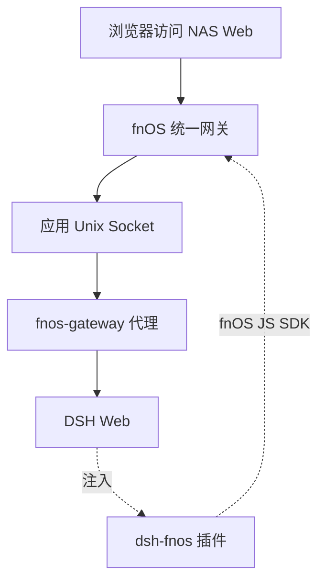

# 应用适配说明

本仓库的核心工作是两件事：把 DeepSeek Harness（下称 DSH）打包成飞牛 fnOS 应用，以及让官方 DSH 在 fnOS 环境里正常可用。本页说明第二件事——**为了让官方 DSH 跑在 fnOS 上，做了哪些适配，以及这些适配的边界在哪里**。

上游 DSH 本身是通用工具，不感知 fnOS。适配层全部放在本仓库，通过 FPK 生命周期、统一网关和 fnOS 插件三个位置实现，**不修改官方 DSH 源码**。



上图是请求路径：浏览器经 fnOS 统一网关与应用 Socket 进入 `fnos-gateway`，由它转发给只监听本机的 DSH Web。`dsh-fnos` 插件挂在 DSH 内，通过 fnOS JS SDK 反向访问系统能力。

## 适配层次

| 层次 | 位置 | 解决的问题 |
| --- | --- | --- |
| 平台接入 | `apps/fn-deepseek-harness/cmd/`、`manifest`、`config/` | 让 DSH 以 fnOS 应用形态安装、启动、升级和卸载 |
| 网络接入 | `packages/fnos-gateway/` | 让 DSH Web 在统一网关和 iframe 下正常工作 |
| 系统集成 | `plugins/dsh-fnos-plugin/` | 补齐 DSH 缺失的 fnOS 主题、文件授权和会话日志能力 |
| 运行时准备 | 安装回调 + 发布清单 | 准备固定版本的 DSH、pnpm 和插件，保证可复现 |

## 平台接入

DSH 以 **Native 应用**形态打包，通过 fnOS 的生命周期脚本管理，不依赖 Docker。

| 方面 | 做法 |
| --- | --- |
| 应用身份 | `manifest` 声明 `appname`、版本、`x86` 平台和 `nodejs_v24` 依赖 |
| 运行身份 | `config/privilege` 使用 `run-as: package`，以应用包用户运行，不用 root |
| 数据目录 | 全部落在 `${TRIM_PKGHOME}`，卸载时可选择保留或清空 |
| 入口声明 | `app/ui/config` 以 `type: "iframe"` + `gatewayPrefix` 接入网关 |
| 生命周期 | `cmd/` 下的 install / upgrade / uninstall / config 回调负责环境准备与清理 |

应用**不注册公开的 `dsh` 系统命令**，避免污染系统 PATH；需要调用 CLI 时使用应用私有路径。完整目录约定见[应用结构](/development/app-structure)。

## 网络接入

fnOS 通过统一网关把应用暴露在 NAS Web 中，因此 DSH Web 不能直接对浏览器提供页面。`packages/fnos-gateway` 承担中间层：

| 处理 | 目的 |
| --- | --- |
| 路径前缀剥离 | 去掉 `/app/fn-deepseek-harness` 前缀再转发给上游，让 DSH 收到原始路径 |
| 请求头注入 | 补充 loopback 相关头，让 DSH 认可来自网关的请求 |
| 响应头剥离 | 移除 hop-by-hop 头，避免代理链路出错 |
| SSE 心跳保活 | 定期发送注释行，防止长连接被中间层断开 |
| HTML/CSS/JS 改写 | 让 DSH 页面在非根路径下正确加载静态资源 |

网关监听应用目录下的 Unix Socket（`app.sock`），只对 fnOS 开放，不额外占用网络端口。`cmd/main` 启动网关，由网关拉起 DSH Web：

```bash
dsh web --no-open --host <host> --port <port> --trusted-host <authority...>
```

DSH Web 自身监听 `127.0.0.1:3080`，**不对外暴露**。网关还提供 Web 进程状态与重启接口，DSH Web 意外退出时返回可操作的恢复页，而不只是一个错误码。

## 系统集成

官方 DSH 不知道 fnOS 的存在，`dsh-fnos` 插件把两边接起来。它与 DSH 的关系是标准的插件挂载，官方 DSH 代码保持原样。

| 能力 | 说明 |
| --- | --- |
| 主题同步 | 读取 fnOS 当前主题并跟随切换；DSH 明确选择浅色/深色时以 DSH 设置为准 |
| 授权目录 | 调用 fnOS 授权窗口管理应用可访问的 NAS 目录，浏览器不接触 `TRIM_API_TOKEN` |
| NAS 文件访问 | 提供 `/fn` 指令浏览授权目录、插入文件引用、在 fnOS 文件应用中打开 |
| 会话日志导出 | 导出当前会话日志到 NAS |
| 窗口标题 | 把 DSH 页面标题同步到 fnOS 应用窗口 |

插件只在 fnOS iframe 中具备完整能力；普通浏览器打开时可用的部分不依赖系统 SDK。能力细节见 [fnOS 插件](/plugins/dsh-fnos)。

## 运行时准备

适配不止代码，还包括让每次安装得到**可复现的运行环境**：

- 安装回调检查应用私有 npm 全局目录中的 DSH CLI 与 pnpm，版本已满足且可执行时直接复用，否则安装固定版本。
- 内置插件通过发布清单 [`published-dsh-plugins.json`](https://github.com/FNOSP/fnos-dsh/blob/main/apps/fn-deepseek-harness/app/published-dsh-plugins.json) 按**精确版本**安装；Codex Auth 必须随 FPK 内置，否则会因上游 API 变更导致 DSH Web 启动失败。
- `dshmarket` 等三方插件不进入 FPK，由 DSH CLI 单独安装，已安装时**不覆盖用户版本**。
- 升级时复用已有 Web profile，保留用户配置、凭据、工作区和未列入新清单的旧插件。

这些细节的取舍与原因记录在需求与计划文档中，见[需求清单](/requirements/)与[详细计划](/plans/)。

## 适配边界

明确不做的事，避免误解：

- **不修改官方 DSH 源码**：所有适配通过插件、网关和生命周期脚本完成；官方源码只用于查阅和调试。
- **不绕过 fnOS 平台机制**：不依赖 setuid、不受控的 sudo 或自行切换用户；应用以包用户运行。
- **不提供 Docker 形态**：当前只有 Native 应用一种打包方式。
- **不承诺跨平台通用**：适配层针对 fnOS，其他 NAS 或自建环境需要另行适配。

## 相关页面

- [DeepSeek Harness 应用](./fn-deepseek-harness)
- [fnOS 插件](/plugins/dsh-fnos)
- [应用结构](/development/app-structure)
- [生命周期脚本](/development/lifecycle)
