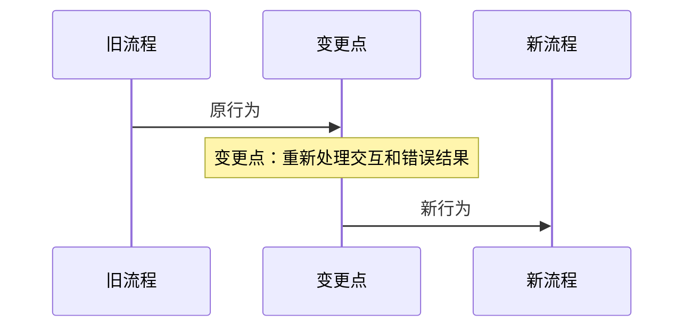

# 计划文档规范

计划文档回答：**怎么实现、影响什么、如何迁移、如何验证和如何回滚**。

计划文档必须以需求文档为输入，但不能复制需求正文。它是实施阶段的技术设计和执行依据。

## 与需求文档的边界

计划必须通过需求编号、功能编号和验收条件引用需求：

```text
PLAN-FNOS-007-T02-01
对应需求：FNOS-007-03
对应验收：FNOS-007-03-AC-01、FNOS-007-03-AC-02
```

计划可以解释需求中的功能如何实现，但不能重新定义需求范围。发现需求范围变化时，先更新当前开发中的需求，再同步调整计划。

## 计划文档必须回答的问题

每个计划至少明确：

1. 当前实现是什么，目标实现是什么。
2. 哪些应用、插件、包、配置、文档和外部依赖会受到影响。
3. 旧行为如何迁移到新行为。
4. 哪些功能保持不变，哪些功能发生变化。
5. 任务按什么顺序实施，前置条件是什么。
6. 如何进行插件、应用、文档和真实 NAS 验证。
7. 升级失败、验证失败或上游变化时如何回滚或降级。

## 必须包含的深度分析

### 当前与目标设计

对于重要变更，使用“当前 → 目标”的形式描述：

| 领域 | 当前实现 | 目标实现 | 迁移影响 |
| --- | --- | --- | --- |
| 设置接缝 | 旧设置服务 | 新设置服务 | Host 读写、Client 表单和旧值兼容 |
| 依赖基线 | 旧版本 | 新版本 | lockfile、peer、构建和运行时门禁 |

不能只写“升级依赖”“迁移 API”，必须说明旧功能如何保持以及哪些模块需要同步调整。

### 影响范围

必须使用影响矩阵列出：

| 需求功能 | 代码模块 | 配置/数据 | 测试 | 文档 | 目标环境 |
| --- | --- | --- | --- | --- | --- |
| FNOS-###-01 | 受影响的包或插件 | 受影响配置或用户数据 | 对应测试范围 | 需要更新的文档 | 本地/NAS/发布环境 |

源码路径、配置字段、依赖包和生成产物边界都应该写在计划中，而不是写入需求文档。

### 设计决策

对存在多个实现方案的内容，记录选择方案、被否决方案、选择原因、依赖的上游事实，以及事实不成立时的备用方案。

### 图示规范

计划中的架构、数据流、依赖、时序和状态图统一使用 `mermaid` fenced code block，由 VitePress 的 `vitepress-mermaid-renderer` 渲染；不得用 `text` 代码块或 ASCII 字符拼接替代图示。图前后应保留等价文字说明，目录树和命令示例除外。

### 状态、时序和变更点要求

以下情况必须同时提供对应图示，而不是只用段落描述：

| 情况 | 必须提供 |
| --- | --- |
| 既有功能状态发生变化 | `stateDiagram-v2`，展示当前状态、目标状态、触发条件和回退路径 |
| 既有功能的用户交互、Host/Client、网关或异步处理重新编排 | `sequenceDiagram`，展示旧交互、变更点、新交互和返回结果 |
| 同时改变状态和交互 | `stateDiagram-v2` + `sequenceDiagram` |
| 影响多个模块或发布边界 | `flowchart` 影响范围图 |

计划中的“当前与目标设计”不能只写“旧 API 替换为新 API”。必须用图和影响矩阵表达变更前后关系，并在图中的节点、边或 `Note` 中使用统一前缀 `变更点：`。

推荐的变更点表示：



当计划涉及已完成需求时，计划必须链接原需求/功能/验收编号，并在当前开发中的计划中说明：原约定、变更原因、新约定、影响模块和验证方式。不得修改已完成需求或计划正文。

## 禁止写入计划文档的内容

- 与需求无关的额外功能。
- 尚未进入当前计划的 P2 或“后续计划”功能。
- 没有来源依据的 SDK、API 或上游行为推断。
- 已完成需求或已完成计划的正文回改。
- 与任务无关的完整需求背景和用户功能列表复制。

计划可以引用需求中的功能和验收条件，但使用编号引用，不复制整段需求。

## 文件位置和命名

计划文档统一放在 `docs/plans/`，文件名使用：

```text
PLAN-FNOS-###-需求主题.md
```

其中 `PLAN-FNOS-###` 必须与对应需求 `FNOS-###` 一一对应。

## 固定元数据

文档必须包含 `title` 和 `description`，一级标题与 `title` 保持一致：

```yaml
---
title: PLAN-FNOS-007 DSH 0.1.7-rc.2 适配
description: DSH 0.1.7-rc.2 运行时和插件接缝迁移实施计划。
---
```

一级标题后的元信息表至少包含：

| 字段 | 要求 |
| --- | --- |
| 计划编号 | `PLAN-FNOS-###` |
| 计划日期 | `YYYY-MM-DD` |
| 对应需求 | 链接到对应 `FNOS-###` |
| 计划状态 | 当前实施阶段状态 |

## 固定章节

每篇计划按以下顺序组织：

1. **计划目标**：引用需求功能，说明本计划负责实现的结果和技术边界。
2. **当前实现与目标设计**：记录旧实现、新实现和迁移原因。
3. **影响范围分析**：列出模块、配置、数据、测试、文档和目标环境影响。
4. **架构与数据流**：描述模块边界、调用关系和关键数据流。
5. **分阶段任务**：按依赖和实施顺序拆分原子任务。
6. **交互和行为设计**：只写为实现和验证所需的详细交互设计。
7. **数据、权限和错误处理**：说明持久化、敏感数据、权限、错误和恢复策略。
8. **依赖、风险和决策**：记录上游事实、风险、备用方案和已决定事项。
9. **测试、打包、发布和回滚**：区分本地、包级、应用级和真实 NAS 验证。
10. **参考资料**：列出实际使用的 SDK、API、上游版本和工具来源。
11. **完成状态**：只汇总本计划已列出的任务和阶段。
12. **变更记录**：追加实施方案、任务、风险和验证变化。

## 任务规范

每个任务必须包含：

- 唯一任务编号，例如 `PLAN-FNOS-007-T02-01`。
- 对应需求功能和验收条件。
- 修改目标和涉及的源码/配置入口。
- 前置条件和依赖任务。
- 验证方式和预期结果。
- 失败时的回滚、降级或停止条件。

推荐格式：

| 任务 ID | 对应需求/验收 | 修改内容 | 前置条件 | 验证方式 |
| --- | --- | --- | --- | --- |
| PLAN-FNOS-###-T##-## | FNOS-###-## / AC-## | 当前到目标的具体迁移 | 依赖任务或外部事实 | 命令、测试或环境证据 |

任务描述应当足够具体，使执行者能够判断修改哪些模块，但不要把完整代码直接写入计划。

## 交互设计规范

只有当功能包含用户界面、宿主交互或可观察错误行为时，计划才展开详细交互。至少说明入口、状态、字段、按钮、提交时机、返回路径、宿主差异、升级前后行为和破坏性操作保护。

交互章节不能成为需求功能列表的副本，必须服务于实现和验证。

## 测试、发布和回滚规范

计划必须分别说明：

- workspace 包和插件的 typecheck、单元测试、构建。
- FPK 构建、安装、启动、网关、权限和资源验证。
- 真实 NAS 的安装、升级、主题、授权目录、SSE、宿主事件等验收。
- 文档构建和内部链接检查。
- 用户配置、凭据、会话和授权数据的升级兼容性。
- 失败时允许回滚的内容，以及明确禁止删除的数据。

本地浏览器、开发机或单元测试通过，不能替代涉及 fnOS 的真实环境验收。

## 状态规则

| 状态 | 使用条件 |
| --- | --- |
| 规划中 | 已进入计划，尚未完成实现 |
| 待验证 | 依赖 SDK、宿主、权限或外部事实确认 |
| 待完成 | 实现或本地验证完成，但目标环境未完成 |
| 已完成 | 任务、必要构建和目标环境验证均完成 |

计划状态只表示实施进度；功能是否完成以需求文档中的目标环境验收为准。

已完成计划作为历史记录，不回改正文。后续变更建立或调整当前开发中的计划，并链接回原计划。

## 计划文档检查清单

- [ ] 每个任务都有需求功能和验收条件引用。
- [ ] 已写明当前实现、目标实现和迁移影响。
- [ ] 已列出代码、配置、数据、测试、文档和目标环境影响。
- [ ] 状态变化使用 `stateDiagram-v2` 表达。
- [ ] 交互重处理使用 `sequenceDiagram` 表达。
- [ ] 既有功能变更在图中明确标注 `变更点：`，并链接原需求/功能/验收编号。
- [ ] 没有复制完整需求正文或引入未排期功能。
- [ ] 未确认的上游事实被标记为待验证。
- [ ] 每个高风险变更都有验证、回滚或降级方案。
- [ ] 区分本地验证、包级验证、FPK 验证和真实 NAS 验收。
- [ ] 计划状态与需求功能状态没有混用。
