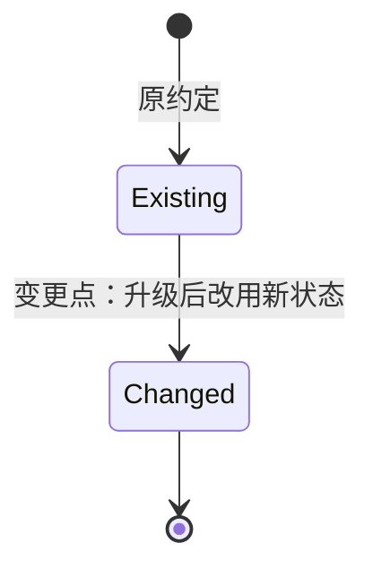
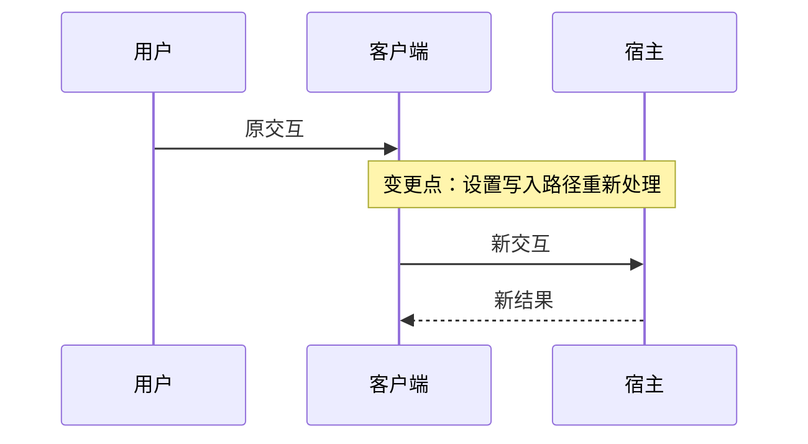

# 需求文档规范

需求文档回答：**为什么做、做什么、什么结果算完成**。

需求文档面向产品范围和用户结果，不描述具体代码、文件、API 或实施步骤。实现方案统一写入对应的计划文档。

## 与计划文档的边界

| 内容 | 需求文档 | 计划文档 |
| --- | --- | --- |
| 用户问题和目标 | 必须 | 只引用，不重复展开 |
| 功能范围 | 必须 | 按功能拆解实施 |
| 用户可观察行为 | 必须 | 作为设计和验证依据 |
| 验收条件 | 必须 | 通过任务引用并落实验证 |
| 技术方案 | 不写 | 必须 |
| 代码路径和配置字段 | 不写 | 必须 |
| 影响模块和迁移方式 | 只写产品边界 | 必须深度分析 |
| 任务、依赖和执行顺序 | 不写 | 必须 |
| 测试、打包、发布和回滚 | 只写完成要求 | 必须写具体方案 |

需求和计划之间只能通过需求编号、功能编号和验收条件建立关系，不能复制大段正文。

## 需求文档必须回答的问题

每个需求至少明确：

1. 当前用户或宿主遇到了什么问题。
2. 本次要新增、修改或保证什么功能。
3. 用户能够观察到什么结果。
4. 哪些行为、数据或兼容性必须保持。
5. 哪些内容明确不在本次范围内。
6. 如何判断功能已经完成。

## 禁止写入需求文档的内容

以下内容属于计划文档，不能在需求中展开：

- 具体源文件路径、目录路径和代码入口。
- API、类型、函数或 SDK 的替换方案。
- 旧实现到新实现的逐步迁移方式。
- 具体任务编号、执行顺序和依赖关系。
- 具体构建命令、脚本参数和产物生成方式。
- 具体错误分类、日志内容和重试实现。
- 具体测试文件、测试夹具和 CI 配置。
- 尚未确认的技术事实或上游源码推断。

可以在需求中写“设置升级后仍可读取”，但不要写“将 `ctx.settings.get()` 替换为 `SettingsForms.describe()`”。

## 文件位置和命名

需求文档统一放在 `docs/requirements/`，文件名使用：

```text
FNOS-###-需求主题.md
```

规则：

- 需求编号在仓库内唯一、连续，不因实现方案变化而重新编号。
- 主题描述功能目标，不使用“修改”“临时”“test”等无法表达范围的名称。
- 文件名使用小写短横线；编号和主题之间使用短横线连接。
- 已完成需求作为历史验收记录，不回改正文；后续变更登记到当前开发中的需求。

## 固定元数据

文档必须包含 `title` 和 `description`，一级标题与 `title` 保持一致：

```yaml
---
title: FNOS-007 DSH 0.1.7-rc.2 适配
description: DSH 0.1.7-rc.2 运行时、插件功能和用户数据兼容需求。
---
```

一级标题后的元信息表至少包含：

| 字段 | 要求 |
| --- | --- |
| 需求编号 | `FNOS-###` |
| 提出日期 | `YYYY-MM-DD` |
| 需求状态 | 需求整体状态 |
| 关联计划 | 对应 `PLAN-FNOS-###`，未排期时写“暂未进入计划” |

## 固定章节

每篇需求按以下顺序组织：

1. **需求背景**：现状、用户问题和变更原因。
2. **需求目标**：用功能结果描述目标，不写技术实现。
3. **功能列表**：列出用户可感知或可验收的功能。
4. **行为约束**：记录必须保持的用户行为、数据行为和兼容要求。
5. **不在本次范围内**：明确不修改、不承诺或留待后续的内容。
6. **验收条件与完成状态**：按功能编号列出可观察结果和状态。
7. **变更记录**：只记录范围、优先级、状态和验收规则变化。

需求可以记录产品级影响范围，例如“影响应用升级和已有设置”，但不要列出具体源码模块；源码影响分析属于计划文档。

## 图示规范

需求中的需求流转、功能关系或验收链路使用 `mermaid` fenced code block；不得使用 `text` 代码块、ASCII 箭头或纯字符串拼接表达关系图。关键语义必须同时有文字说明。

### 图示选择规则

| 场景 | 必须使用的图 | 必须表达的内容 |
| --- | --- | --- |
| 功能存在多个状态或状态转换 | `stateDiagram-v2` | 初始状态、可达状态、触发条件和终态 |
| 功能涉及用户、Client、Host、网关或外部服务交互 | `sequenceDiagram` | 参与者、调用顺序、返回结果和失败路径 |
| 功能改变既有需求的状态、验收条件或交互 | `stateDiagram-v2` + `sequenceDiagram` | 旧状态、新状态、交互差异和明确变更点 |
| 单纯表达模块或功能之间的关系 | `flowchart` | 节点职责、依赖方向和边界 |

### 既有需求变更的标注

当新需求改变之前需求的状态、验收条件或用户交互时，需求文档必须：

- 链接被影响的需求编号、功能编号和验收条件。
- 在当前开发中的需求中说明“原约定 → 新约定”，不回改已完成需求正文。
- 使用状态图标出被替换的状态或转换，使用时序图标出被重新处理的交互。
- 在图中的节点、边或 `Note` 中使用统一前缀 `变更点：`；仅写 Mermaid 注释 `%%` 不算完成标注。
- 图后补充简短文字，说明变更原因和用户可观察结果。

示例：





## 功能列表规范

功能列表使用固定字段：

| 编号 | 优先级 | 功能 | 用户可观察结果 | 状态 |
| --- | --- | --- | --- | --- |
| FNOS-###-01 | P0/P1/P2 | 功能名称 | 用户完成操作后的结果 | 状态 |

功能名称应表达用户价值，例如“插件升级后仍可正常加载”“用户升级后可以继续使用已有设置”“旧会话可以继续打开”。

不要使用“迁移 SettingsForms”“修改 package.json”“更新 install_callback”作为功能名称；这些是实现任务。

## 验收条件规范

验收条件必须描述可观察结果，不使用“代码已提交”“测试已通过”作为唯一条件。

```text
FNOS-007-03-AC-01：升级后，用户之前保存的主题偏好仍然生效。
FNOS-007-03-AC-02：用户可以读取、修改并保存授权目录设置。
FNOS-007-03-AC-03：设置写入失败时，原有设置不会被清空或覆盖。
```

技术验证可以作为计划任务，但不能替代需求验收条件。每项功能还必须按实际宿主依赖写明目标验证环境，不得仅因项目整体部署在 fnOS，就把 NAS 设为所有插件功能的统一完成门槛。

### 目标环境验收

| 功能/模块类型 | 必须覆盖的目标环境 | 说明 |
| --- | --- | --- |
| `dsh-fnos` 插件及使用 fnOS 专属 API、授权目录或宿主能力的功能 | DSH Web 与真实 fnOS NAS | NAS 用于验证 fnOS 宿主桥接、权限、目录授权及设备生命周期；不相关的其他插件不因此附加 NAS 验收 |
| 网关、FPK、应用安装/升级/卸载及依赖 fnOS 生命周期的行为 | 真实 fnOS NAS；另按客户端功能需要覆盖 DSH Web/Desktop | 构建通过不能替代 NAS 上的真实安装与运行验证 |
| 其他 DSH 插件（如 CodeBuddy、Codex Auth、Semi UI） | DSH Web 与 DSH Desktop | 插件不依赖 fnOS 专属能力时，不要求 NAS 验收；涉及外部登录或服务时另验证真实网络/账号条件 |
| 文档站及构建工具 | 对应的文档站/构建环境 | 不要求 NAS，除非变更同时影响上述 fnOS 专属行为 |

当一个功能列表或验收条件混合上述多种模块时，必须拆分验收条件或在计划的验证矩阵中按模块列出环境。状态应分别记录（例如“待 Web/Desktop 验收”和“fnOS 部分待 NAS 验收”），不能把一项插件的 NAS 状态扩散成所有插件的阻塞状态。

## 优先级和状态

### 优先级

| 优先级 | 含义 |
| --- | --- |
| P0 | 核心运行基线，未完成会影响应用或插件可用性 |
| P1 | 当前需求确定要实现的主要功能 |
| P2 | 已记录但尚未进入当前实施阶段的扩展功能 |

### 状态

| 状态 | 使用条件 |
| --- | --- |
| 规划中 | 已确认范围，尚未完成实现 |
| 待验证 | 依赖宿主、SDK、权限或真实环境确认 |
| 待完成 | 已有代码或本地验证，但目标环境尚未完成验收 |
| 已完成 | 代码、必要构建和目标环境验收全部完成 |
| 后续计划 | 已登记但未进入当前计划 |
| 待确认 | 需求边界或用户行为尚未确认 |

状态变化必须写入变更记录，不能只修改状态徽章。已完成需求作为历史记录，不回改正文。

## 需求文档检查清单

- [ ] 每个功能都有唯一功能编号和优先级。
- [ ] 功能描述使用用户或产品语言，而不是代码语言。
- [ ] 每个 P0/P1 功能都有可观察的验收条件。
- [ ] 涉及状态转换的功能包含 `stateDiagram-v2`。
- [ ] 涉及多方交互或交互重处理的功能包含 `sequenceDiagram`。
- [ ] 影响既有需求时，图中明确标注 `变更点：`，并链接原需求/功能/验收编号。
- [ ] 没有出现具体 API、源码路径、任务编号或迁移步骤。
- [ ] 不在范围内的内容已经明确列出。
- [ ] 已进入实施的功能关联对应计划。
- [ ] 每项功能按宿主依赖列出目标环境；只有 fnOS 插件、网关、FPK/生命周期等确实依赖 NAS 的部分要求真实 NAS 验收，其他插件要求 DSH Web 与 Desktop 验收。
- [ ] 状态变化和范围变化已经追加到变更记录。
