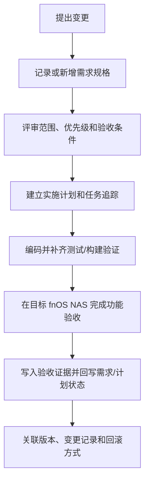

# SDD 规格驱动维护规范

本仓库采用轻量 Specification-Driven Development（SDD）维护模式。需求规格是“做什么以及什么结果算完成”，实施计划是“怎么做以及如何验证”，代码和测试不能替代规格，目标环境验收不能被本地构建结果替代。

## 规范入口

| 内容 | 唯一维护入口 |
| --- | --- |
| 目录结构规范 | `docs/charter/directory-structure.md` |
| 需求文档规范 | `docs/charter/requirements-spec.md` |
| 计划文档规范 | `docs/charter/plans-spec.md` |
| 需求规格 | `docs/requirements/` |
| 实施计划 | `docs/plans/` |
| 真实环境验收证据 | `docs/validation/` |
| 应用和插件面向用户说明 | `docs/` 下的应用/插件文档 |
| 跨需求架构决策 | `docs/decisions/`，仅在计划中的决策章节不足以表达时使用 |

不新建与 `requirements/`、`plans/` 重复的 `specs/` 或 `stories/` 目录。`apps/*/README.md` 和 `plugins/*/README.md` 保留作历史或兼容参考，不作为现行需求和面向用户文档的权威入口。

开发类文档（`docs/development/`）按主题分组维护：环境与工具、应用开发、插件开发、任务与构建、协作与规范。单页承担三个以上互不相关主题、或篇幅超过约 300 行时，按主题拆分并在侧边栏归入对应分组；不要把一个主题的内容分散到多页，也不要让单页变成混合罗列的长清单。拆分或改名后必须更新全部交叉引用和侧边栏配置，并用 `pnpm run build -- --docs` 确认链接与图表正常。

## 变更分类

| 变更类型 | 必需产物 | 最低验证 |
| --- | --- | --- |
| 新功能、用户行为、权限、数据、网关或插件契约变化 | 需求规格 + 实施计划 + 验收条件 | 代码/测试 + 文档构建；涉及 fnOS 时必须真实 NAS 验收 |
| 现有功能行为修复 | 原需求变更记录 + 计划调整；影响较大时新增需求 | 回归测试和对应环境验证 |
| 安全、依赖、构建或发布变化 | 变更说明 + 风险/回滚 + 校验结果 | 受影响的构建、安装、升级或安全检查 |
| 仅文档、格式或内部重命名 | 变更说明 | `git diff --check` 和 `pnpm run build -- --docs` |

## 标准流程



未进入计划的 P2、后续计划和未确认能力不得出现在当前计划的阶段任务、详细交互、完成状态或测试清单中。

## 文档图示规范

需求、计划和章程文档中的流程图、关系图、时序图、状态图和依赖图统一使用 `mermaid` fenced code block，由 `vitepress-mermaid-renderer` 在文档站中渲染。


规范要求：

- 不使用 `text` 代码块、ASCII 箭头或手工拼接字符串表达流程和关系。
- Mermaid 图前后应保留等价的文字说明，不能只依赖渲染后的 SVG 传达关键语义。
- Mermaid 代码块统一使用语言标记 `mermaid`，由当前 VitePress 主题和 `vitepress-mermaid-renderer` 处理。
- 状态变化必须使用 `stateDiagram-v2`，多方或异步交互必须使用 `sequenceDiagram`；两者同时发生时必须同时提供两种图。
- 既有功能发生变化时，在图中的节点、边或 `Note` 使用可见前缀 `变更点：`，并链接原需求、功能和验收编号。
- 目录树、命令示例、配置片段和原始数据不是关系图，可以继续使用 `text` 或对应语言代码块。
- Mermaid 配置保持默认 `securityLevel: 'strict'`；不为了渲染不可信内容而放宽安全级别。

## 追踪 ID

新增 P0/P1 功能建议形成以下链路：

| 对象 | 格式 | 示例 |
| --- | --- | --- |
| 需求功能 | `FNOS-###-##` | `FNOS-001-10` |
| 验收条件 | `<功能 ID>-AC-##` | `FNOS-001-10-AC-01` |
| 计划任务 | `PLAN-FNOS-###-T##-##` | `PLAN-FNOS-001-T10-01` |
| 测试场景 | `<功能 ID>-TEST-##` | `FNOS-001-10-TEST-01` |
| 环境证据 | `<功能 ID>-ENV-##` | `FNOS-001-10-ENV-01` |

每个 P0/P1 功能至少要能从需求追踪到验收条件、计划任务、测试和目标环境结论。计划文档可以维护追踪矩阵，不复制需求正文。被后续变更取代的已完成功能，其追踪链路从**当前开发中的需求**重新建立，不需要回改已完成的原文。

## 状态规则

- `已完成`：代码、必要构建和目标环境验收全部完成。
- `待完成`：代码或本地验证完成，但目标环境尚未验收。
- `规划中`：已进入计划，尚未完成实现。
- `待验证`：依赖 SDK、宿主、权限或 DSH seam 的事实确认。
- `待确认`：需求边界尚未确认，未进入计划。
- `后续计划`：已登记但未进入当前计划。

状态变化必须追加到需求或计划的变更记录，不能只修改徽章。

### 已完成的需求和计划不再变更

状态为 `已完成` 的需求和计划是历史验收记录，**不得再修改其正文**——包括功能列表、交互约束、验收条件、状态看板和变更记录。它们记录的是「当时按那个范围、那个版本完成了验收」这一事实；事后改写会让验收证据与被改写的条件对不上，也无法再从文档判断当初到底验了什么。

后续变更一律写入**当前正在开发的需求和计划**：

- 需要改动的行为、版本或契约，在 `规划中` / `待完成` 的那个需求文档中登记新功能或新验收条件，并在其变更记录中说明它覆盖了此前哪一条已完成的约定。
- 已完成文档里被取代的约定保持在原位不动；新文档用链接指回它，说明取代关系与差异，而不是回去编辑原文。
- 若确实需要修正已完成文档中的事实错误（例如笔误导致的错误命令），只做最小的事实更正，并在该文档变更记录中写明是更正而非范围变更。

例外：`docs/validation/` 下的验收证据永不修改，只在需要时追加新记录。

## 编码边界

以下是仓库级的硬性约束，适用于所有受版本管理的文件。违反这些约束的改动不应提交，Agent 和协作者都必须遵守。

### 禁止绝对路径

**不得在受版本管理的文件中写入开发者本机绝对路径**，包括 `/Users/<name>/...`、`/home/<name>/...`、Windows 盘符路径，以及指向其他检出的路径。

这类路径只在写入它的机器和检出目录下成立：换机器、换目录或仓库改名后立即失效；若指向其他检出，本仓库的检查结果还会随那个仓库的状态变化，表现为「时好时坏」而看不出原因。

按场景选择替代方式：

| 场景 | 做法 | 示例 |
| --- | --- | --- |
| 同包或相邻模块 | 相对导入 | `import { x } from '../src/foo.ts'` |
| 跨 workspace 引用 | 包名别名，由 `workspace:*` 解析 | `import { y } from '@tnnevol/dsh-semi-ui'` |
| 需要绝对路径定位文件 | 基于当前模块位置运行时解析 | 见下 |
| fnOS 应用脚本 | 平台提供的环境变量 | `${TRIM_PKGVAR}`、`${TRIM_APPDEST}` |

测试中读取源码做结构断言时，用运行时解析而不是写死路径：

```ts
import { dirname, join } from 'node:path'
import { fileURLToPath } from 'node:url'

const here = dirname(fileURLToPath(import.meta.url))
const srcPath = (...segments: string[]) => join(here, '..', 'src', ...segments)
```

配置文件可直接用 `import.meta.dirname`（Node 20.11+，本项目 Node 24 满足）。

例外与边界：

- 被忽略的目录（`node_modules/`、`.turbo/`、`docs/.vitepress/dist`）不在约束范围内。
- 描述该规则本身时不可避免要写出被禁形态；判据以真实用户名为准，占位写法（`/Users/<name>/...`）属说明性文本，不算违规。
- 文档中作为外部示例的绝对路径不受限，但不要使用真实个人主目录。

## PR 检查清单

- [ ] 已填写变更类型、需求编号和计划编号；纯文档/格式变更已说明豁免原因。
- [ ] 新增或修改的用户行为有可观察的验收条件。
- [ ] 计划只包含已进入实施阶段的功能。
- [ ] 已运行与改动相关的插件测试、构建、`pnpm run check -- --sdd` 和 `pnpm run build -- --docs`。
- [ ] 涉及 fnOS 权限、宿主、FPK 安装或升级的功能已记录真实 NAS 验收状态。
- [ ] 已说明数据影响、敏感信息、升级兼容和回滚方式。
- [ ] 需求、计划和验证记录中的链接与追踪 ID有效。
- [ ] 没有引入本机绝对路径；路径定位使用相对路径、包名别名或运行时解析（见[编码边界](#禁止绝对路径)）。
- [ ] 没有修改状态为 `已完成` 的需求或计划；后续变更已写入当前开发中的需求与计划（见[已完成的需求和计划不再变更](#已完成的需求和计划不再变更)）。

## 例外规则

依赖升级、构建修复和紧急安全修复可以不新增完整用户需求，但必须在 PR 和变更记录中说明原因、影响、验证和回滚方式。紧急修复完成后，应在下一个维护周期补齐受到影响的需求或决策记录——即把影响登记到当前开发中的需求，而不是回改已完成的文档。
