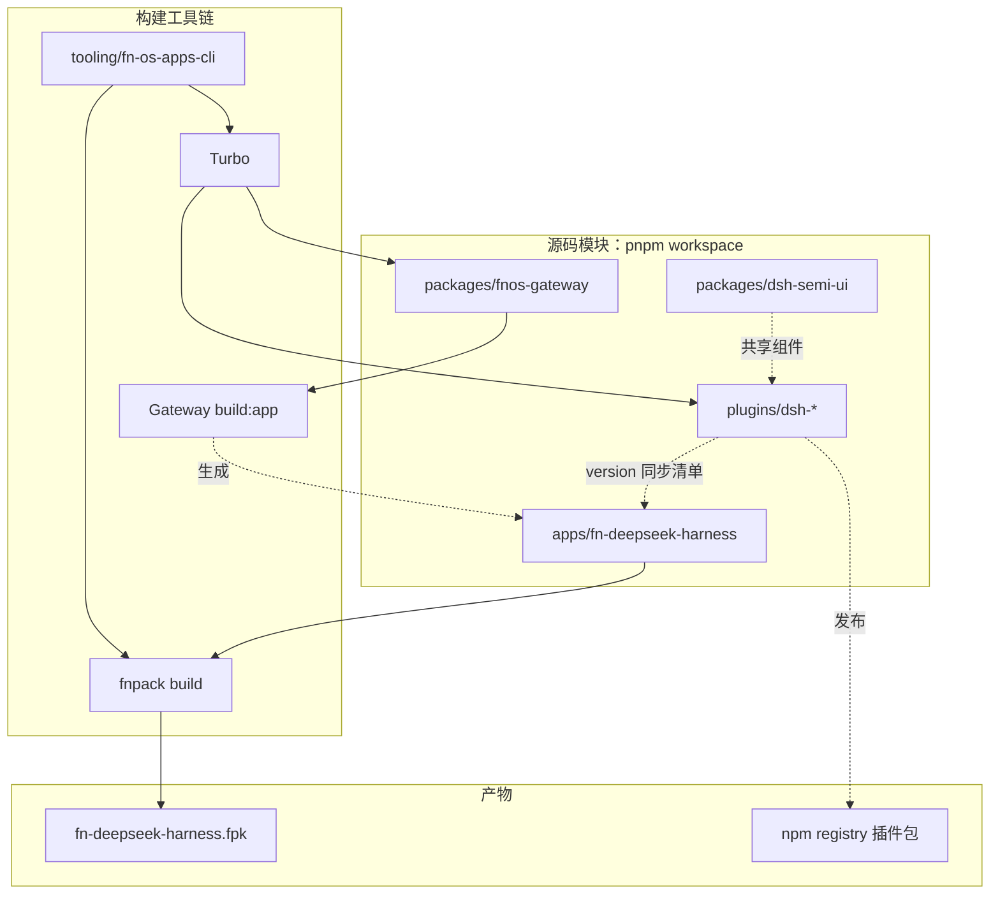
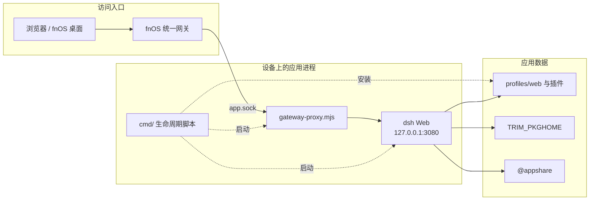

# 应用结构

`apps/*` 目录是 fnOS 应用的打包输入，由 `manifest` 和生命周期脚本定义。普通开发机负责构建，真实行为必须在 fnOS 设备上验证。

仓库当前只有 `apps/fn-deepseek-harness` 一个 Native 应用，**没有 Docker 应用**。下文标注 Docker 的位置仅在新增该形态应用时适用。

## 项目架构

仓库是 pnpm workspace + Turbo 的 monorepo：`apps/` 是 fnOS 应用的打包输入，`packages/`、`plugins/` 提供随应用运行的文件，`tooling/` 提供构建与发布入口，`docs/` 是唯一的文档站。整体分两段——**构建期**把源码收敛成一个 FPK，**运行期**由 fnOS 生命周期脚本在设备上组织目录和进程。

### 构建期



- `apps/fn-deepseek-harness` 是唯一的打包输入，`manifest`、`cmd`、`config`、`wizard` 和 `app/` 都直接来自源码目录。
- `packages/fnos-gateway` 的 `build:app` 把网关代理打成单个 ESM，产物写回应用目录，所以 FPK 里的 `app/gateway-proxy.mjs` 和 `app/scripts/install-callback-helper.mjs` 是生成物。
- `plugins/dsh-*` 的源码**不打进 FPK**：CLI 在 `version` 时把名称与版本同步到 `app/published-dsh-plugins.json`，装机时再按这份清单从 registry 拉取。`packages/dsh-semi-ui` 作为共享组件被插件依赖。
- 触发方式见[构建应用](#构建应用)和 [CLI 命令参考](./cli-commands)。

### 运行期



- 访问路径只有一条：统一网关按 `gatewayPrefix` 把请求转发到 `TRIM_APPDEST/app.sock`，由 `gateway-proxy.mjs` 校验前缀后代理给只监听回环地址的 `dsh` Web 进程。
- `cmd/` 脚本负责安装阶段准备 Node.js 运行时、DSH、pnpm 与插件，启动阶段拉起 `dsh` 和 `gateway-proxy.mjs` 两个进程；安装期按 `published-dsh-plugins.json` 拉取 `dsh-fnos`、`dsh-codex-auth`、`dsh-codebuddy`。
- 会话、配置和工作区落在 `TRIM_PKGHOME` 与 `@appshare`；这些 `TRIM_*` 路径只在 fnOS 生命周期中可靠存在，所以运行期行为必须在设备上验证（见下文「在 fnOS 上验证」）。

适配层的完整链路（权限、主题、文件访问等）见[应用适配说明](../apps/adaptation)，脚本与回调的调用顺序见[生命周期脚本](./lifecycle)。

## 创建应用

:::warning 创建或重建应用前

先查阅 [`fnnas-docs` Skill](https://github.com/tnnevol/skills/tree/main/skills/fnnas-docs)，再用官方模板创建：

```bash
cd apps
fnpack create <app-name>
# 仅 Docker 应用使用：
fnpack create <app-name> --template docker
```

不得删除模板文件或目录；在模板基础上修改 `manifest`、`app/`、`cmd/`、`config/` 和 `wizard/`。

创建后按形态编辑：Native 应用改 `app/`、`cmd/main`、`config/privilege`；Docker 应用还需编辑 `app/docker/docker-compose.yaml`（镜像、端口映射、数据卷）。图标为 `ICON.PNG`（64×64）与 `ICON_256.PNG`（256×256）。

:::

## 目录约定

```text
apps/<appname>/
├── manifest       应用身份、版本、平台、桌面入口和运行约束
├── app/           运行文件、UI 资源和 Docker 配置
├── cmd/           安装、启动、停止、升级和卸载脚本
├── config/        权限、资源和入口配置
├── wizard/        安装、升级、配置和卸载向导
├── ICON.PNG       64×64 图标
└── ICON_256.PNG   256×256 图标
```

各目录职责：

| 路径 | 用途 | 对应文档 |
| --- | --- | --- |
| `manifest` | 应用标识、版本、平台、依赖和入口声明 | [Manifest 清单配置](./manifest) |
| `cmd/` | 生命周期脚本，含 `main`、`config_callback` 等 | [生命周期脚本](./lifecycle) |
| `config/` | 运行权限、资源声明、桌面入口 | [权限与入口](./permissions) |
| `wizard/` | 用户向导，收集安装与运行参数 | [用户向导](./wizard) |
| `app/` | 应用运行文件和 UI | 视应用形态而定 |

## 构建应用

直接构建单个应用：

```bash
cd apps/<app-name>
fnpack build
```

也可以从根目录通过 CLI 选择：

```bash
pnpm run build -- --fpk --app <app-name>
```

交互式构建执行 `pnpm run build`，选择 **FPK** 后可以多选应用。选择 `fn-deepseek-harness` 时，CLI 会先通过 `build:gateway` 构建 Gateway，再询问是否将 node-pty native 文件内置到 FPK（默认是），选择内置时会在 Linux 构建机上执行 native 准备脚本，最后执行该应用的 `fnpack build`。非交互构建可显式使用 `--bundle-dsh-native` 或 `--skip-bundle-dsh-native`。

FPK 产物生成在应用目录中，**不要提交** `.fpk` 或临时构建目录。

应用依赖的 Node.js、Python、镜像和中间件必须通过 Manifest、资源配置或 fnOS 安装流程声明，不能依赖开发机环境。

## 在 fnOS 上验证

```bash
cd /path/to/apps/<app-name>
appcenter-cli install-local
appcenter-cli start <app-name>
appcenter-cli stop <app-name>
appcenter-cli list

# 验证正式 FPK
appcenter-cli install-fpk <app-name>.fpk
```

`TRIM_*` 目录和安装向导环境变量只在 fnOS 生命周期中可靠存在。直接在开发机执行 `cmd/main` 或 `cmd/install_callback`，**不能替代真实安装验证**。

## 相关页面

- [Manifest 清单配置](./manifest)
- [生命周期脚本](./lifecycle)
- [权限与入口](./permissions)
- [用户向导](./wizard)
- [fnpack 打包](../build/fnpack)
- [应用适配说明](../apps/adaptation)
