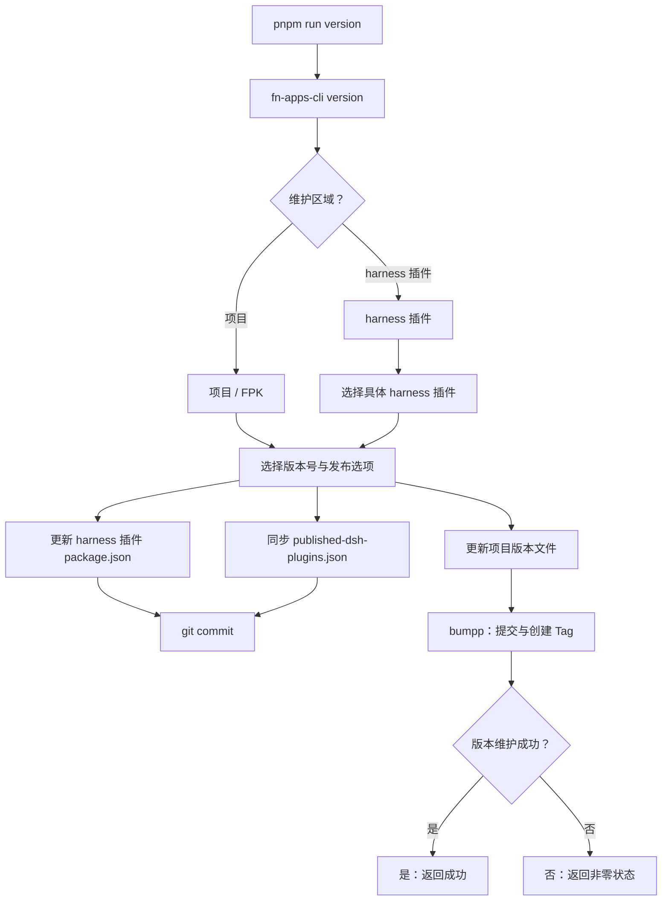
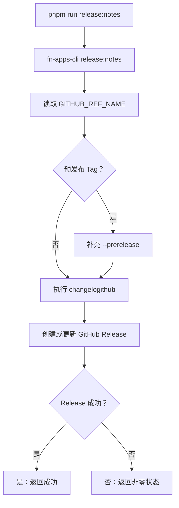
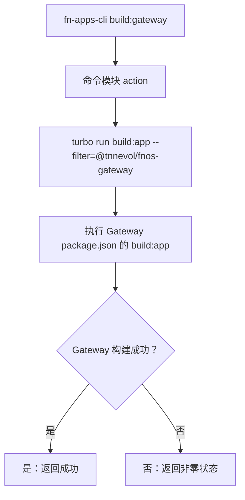

# CLI 命令参考

非 Turbo 任务沿用相同的表达方式：根命令进入 `fn-apps-cli`，命令模块负责交互和参数分支，最后执行实际工具并汇总状态。

各命令的调度图见下。Turbo 相关任务的完整说明见 [Turbo 任务](./turbo-tasks)。

## `version`

版本维护分两个区域，交互选择后再进入具体分支。项目版本走 `bumpp`，插件版本直接更新 `package.json`。

项目/FPK 版本更新根 `package.json`、`docs/package.json`、`packages/**/package.json`、应用 `manifest` 和文档中的版本示例，默认创建提交和 `v<版本号>` Tag。插件版本只更新指定插件的 `package.json`，若插件在发布清单中则同步清单版本，默认只创建提交、不创建 Tag。

两者都不会自动 push。完整流程见[版本管理](../build/versioning)。

## `release:notes`

读取当前 Tag，判断是否为预发布，再交给 `changelogithub` 生成 Release 说明。

## `build:gateway`

仅供 CI 或网关构建使用，不经过交互层。

构建 `fn-deepseek-harness` 的 FPK 时，CLI 会先调用这个入口产出网关 bundle，再执行 `fnpack build`。

## 相关页面

- [Turbo 任务](./turbo-tasks)
- [命令与脚本](./commands-and-scripts)
- [版本管理](../build/versioning)
- [发布流程](../build/release)
