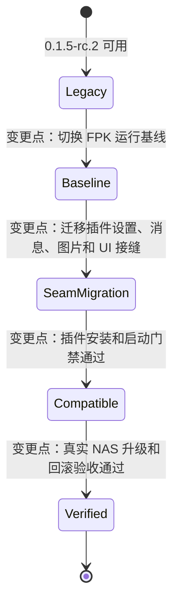
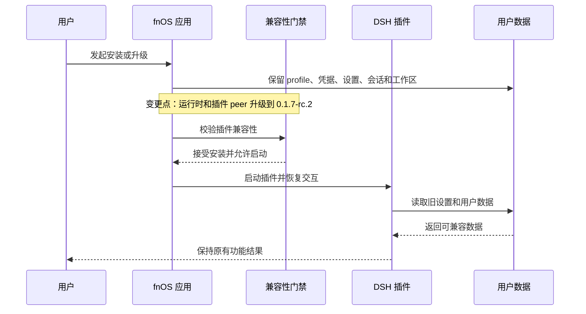
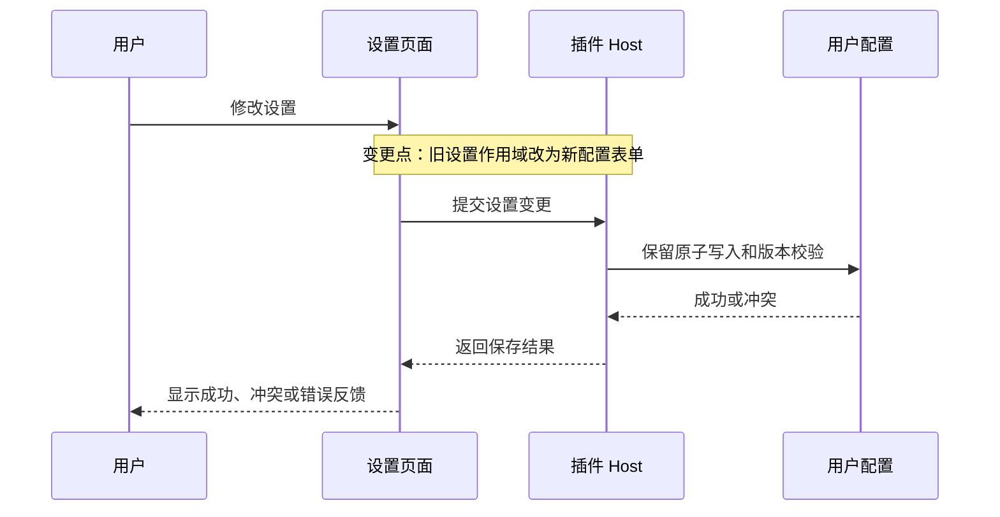
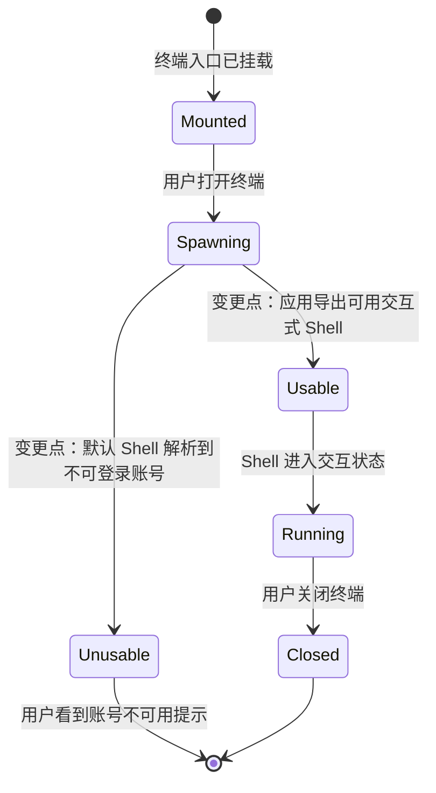
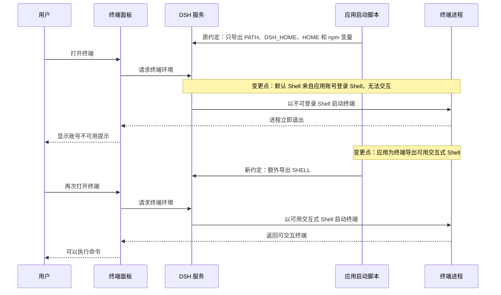

# PLAN-FNOS-007 DSH 0.1.7-rc.2 适配与插件错误修复

| 字段 | 内容 |
| --- | --- |
| 计划编号 | PLAN-FNOS-007 |
| 计划日期 | 2026-09-24 |
| 对应需求 | [FNOS-007 DSH 0.1.7-rc.2 适配与插件错误修复](/requirements/FNOS-007-dsh-017-rc2-adaptation) |
| 本轮功能 | FNOS-007-01 至 FNOS-007-15；FNOS-007-11、FNOS-007-14 已完成，其余进入后续实施阶段 |
| 上游依据 | 本地 Harness checkout 的 `dsh-v0.1.7-rc.2`，以目标 tag 的源码、类型和构建结果为准 |
| 计划状态 | <Badge type="warning" text="本地实现与自动化验证完成，待 Linux/native 和真实 NAS" /> |

## 计划目标

本计划把应用和四个 DSH 插件从 `0.1.5-rc.2` 兼容基线迁移到 `0.1.7-rc.2`，并保证 FNOS-007 中定义的用户功能、用户数据和真实环境验收条件成立。

计划只负责实现和验证需求中的功能，不重新定义 FNOS-007 的功能范围。用户结果和验收条件以[需求文档](/requirements/FNOS-007-dsh-017-rc2-adaptation)为准。

## 实施分期

| 阶段 | 对应功能 | 内容 | 状态 |
| --- | --- | --- | --- |
| 第一期 | FNOS-007-11 | 文档站 Mermaid 渲染器替换和图表交互验收 | <Badge type="tip" text="已完成" /> |
| 第二期 | FNOS-007-01 至 10、12、13、14 | 依赖基线、插件接缝、FPK、会话、升级、attachment-local、dshmarket 和 workflow 验收 | <Badge type="warning" text="本地完成，待 Linux/native 与真实 NAS" /> |
| 第三期 | FNOS-007-15 | 应用专用账号下的终端可用性适配 | <Badge type="warning" text="待实施" /> |

分期原因：插件源码接缝、FPK 运行时和本地开发宿主需要统一到同一目标基线，先完成差异分析，再同步切换运行时与开发工具链。

## 当前实现与目标设计

| 领域 | 当前实现 | 目标实现 | 影响 |
| --- | --- | --- | --- |
| DSH 运行时 | `0.1.5-rc.2` | `0.1.7-rc.2` | catalog、lockfile、安装回调、构建常量和 FPK 运行时 |
| FPK native | `node-pty@1.2.0-beta.15`、Node.js 24、`node-gyp@11.0.0` | node-pty 版本保持不变，按目标 DSH 基线重新生成并验证 native 产物 | native 配置、锁文件、`pty.node`、`spawn-helper`、版本清单和安装回调必须一致 |
| 插件门禁 | 旧版本 peer 可被接受 | 新版本 peer 通过安装和启动门禁 | 四个插件的 peer 和兼容性声明 |
| Host 设置 | 旧设置服务读写 | 新设置描述、更新和版本校验 | `dsh-fnos` Host、配置迁移和失败回滚 |
| Client 设置 | 旧设置作用域 | 新配置表单 | 主题、授权目录卡片和输入引用 |
| LLM 消息 | 工具结果作为旧内容块处理 | 按角色处理工具结果 | CodeBuddy 多轮工具调用和图片输入 |
| 图片请求 | 旧图片策略和字段 | 新图片目标和尺寸字段 | CodeBuddy、Codex Auth 图片能力 |
| 会话 | 旧格式假设 | 兼容新格式读取 | 旧会话打开和导出，不实现自有迁移器 |
| 网关挂载 | 旧版根路径资源和认证转发 | 文档目录相对路径、入口跳转和挂载 Cookie 隔离 | fnOS iframe 下的静态资源、API、WebSocket 与认证边界 |
| 文档图表 | 构建期 Mermaid 插件 | 客户端 `vitepress-mermaid-renderer` | 依赖链、主题、工具栏和可访问性 |
| 终端 Shell | 默认 Shell 取宿主账号登录 Shell；应用专用账号的登录 Shell 为 `/usr/sbin/nologin`，终端启动即退出 | 应用为终端进程提供可用的交互式 Shell 默认值 | 应用启动脚本的环境导出；不影响终端运行身份和 fnOS 权限模型 |

### 既有功能状态变更



状态图中的变更点对应 FNOS-007-01、02、03、04、05、07 和 10；不修改已完成需求的历史状态，所有新结论回写当前 FNOS-007。

### 升级和交互时序



## 影响范围分析

| 需求功能 | 源码和配置 | 用户数据/运行时 | 测试和证据 | 目标环境 |
| --- | --- | --- | --- | --- |
| FNOS-007-01、02 | `pnpm-workspace.yaml`、lockfile、插件 package/compatibility 配置、构建 CLI | DSH 运行时、插件安装门禁 | peer 兼容性断言、干净 profile 安装 | 本地 DSH、真实 NAS |
| FNOS-007-03、09 | `dsh-fnos` Host/Client、设置卡片、图标和输入契约 | 主题、授权目录、代理路径、设置 profile | 设置读写、升级前后 profile 对照 | DSH 客户端、真实 NAS |
| FNOS-007-04、05 | CodeBuddy/Codex Auth serializer、图片请求和凭据模块 | 工具结果、图片内容、凭据、模型目录 | 工具调用、图片、登录、用量和配置回归 | DSH 客户端 |
| FNOS-007-06 | Semi UI 共享包和总览插件 | 组件、主题和卸载状态 | 构建、渲染、主题和卸载测试 | DSH 客户端 |
| FNOS-007-07、08 | FPK manifest、生命周期、网关、native、会话读取边界 | FPK 运行时、旧会话、网关和插件归档 | FPK 构建、安装、旧会话导出 | 真实 NAS |
| FNOS-007-10、12、13 | 安装/升级流程、发布清单、attachment-local 和 dshmarket 校验 | 用户配置、已安装插件版本、附件持久化目录 | 幂等、回滚、精确版本、补丁和 NAS 证据 | 真实 NAS |
| FNOS-007-11 | `docs/package.json`、VitePress config/theme | 文档图表渲染方式 | 全部 Mermaid 图表和文档构建 | 浏览器、文档构建 |
| FNOS-007-15 | `apps/fn-deepseek-harness/cmd/main` 的环境导出段 | 终端进程默认 Shell、终端继承环境 | 启动脚本环境断言、终端打开和命令执行回归 | 真实 NAS |

## 源文件与生成产物边界

`apps/fn-deepseek-harness/app/` 下的网关 bundle、native 依赖、插件归档和版本文件属于生成产物，不能直接编辑。它们由以下源码和流程生成：

| 生成产物 | 唯一来源 |
| --- | --- |
| `app/gateway-proxy.mjs`、`app/rolldown-runtime-*.mjs` | `packages/fnos-gateway/src/` 与 `tsdown.app.config.ts` |
| `app/scripts/install-callback-helper.mjs` | `packages/fnos-gateway/src/install-callback-helper/` |
| `app/bundled-dsh-plugins/*.tgz` | 构建 CLI 对 `plugins/*` 执行打包 |
| `app/native/`、`app/dsh-version`、`app/node-pty-version*` | native 准备脚本和 FPK 构建流程 |

手写源文件包括 `manifest`、`cmd/*`、`config/*`、`wizard/*`、`app/ui/config` 和 `app/published-dsh-plugins.json`。

## 技术迁移设计

### T02：fnOS 设置和交互接缝

| 变更点 | 原实现 | 目标实现 | 保持的用户行为 |
| --- | --- | --- | --- |
| Host 设置读写 | 旧设置注册、读取和监听 | 新设置描述、更新和版本校验 | 主题、授权目录、代理路径继续读写 |
| Client 设置 | 旧设置作用域 | 新配置表单 | 设置卡片、主题优先级和保存反馈不变 |
| 设置卡片 | 旧设置插槽 | 新插件设置插槽 | 卡片仍可见，`/fn` 和引用插入不变 |
| 图标 | 数字后缀图标 | `Regular`/`Medium` 图标 | 视觉尺寸和位置不变 |



### T03：LLM、附件和凭据接缝

- CodeBuddy 工具结果从旧内容块处理迁移为按消息角色处理，保留调用 ID、错误标记、推理和文本序列化。
- 图片请求使用新目标字段，模型不支持图片时返回明确的原有错误语义。
- Codex Auth 保留凭据、模型目录、用量窗口和图片能力判定，不覆盖已有配置。

### T05/T08：FPK、网关和会话

- FPK 运行时、开发宿主顶层 DSH CLI 和本地 `.dsh` profile 统一对齐到 `0.1.7-rc.2`；不再保留开发宿主与 FPK 的版本分叉。
- `attachment-patch` 只修改 `packages/fnos-gateway/src/` 的源码，锚点必须匹配一次，补丁必须幂等，路径必须位于应用私有目录。
- 旧会话只做读取和导出验证，不实现本仓库自己的格式迁移器，不改写用户会话文件。

### T07：文档站 Mermaid 渲染器

- 在客户端主题 `Layout` 中初始化 renderer，保持 SSR 空操作。
- 使用 `securityLevel: 'strict'`，监听明暗主题并重新渲染已挂载图表。
- 桌面、移动和全屏工具栏统一配置中文文案、缩放、重置、复制、下载和 dialog 全屏。
- 所有流程、关系、状态和时序图使用 `mermaid` fenced code block，不使用 ASCII 图。

### T09：dshmarket

- 发布清单、构建校验常量和用户文档当前值统一到 `1.65.1`。
- `plugins` 与 `bundled/dshmarket` 的 registry 安装统一使用 `wizard_npm_registry` 写入的 `.npmrc`；未配置时使用 npm 官方源。缺失时安装清单版本，版本不一致时升级或降级，同版本时跳过并保留配置。

### T11：应用专用账号下的终端可用性

对应需求 FNOS-007-15。

#### 当前实现与目标实现

| 领域 | 当前实现 | 目标实现 | 迁移影响 |
| --- | --- | --- | --- |
| 终端默认 Shell | DSH 侧默认 Shell 解析顺序为进程环境变量 `SHELL`，其次宿主账号登录 Shell。应用启动脚本未导出 `SHELL`，于是取到应用专用账号的登录 Shell `/usr/sbin/nologin`，终端进程启动后立即退出并打印账号不可用提示 | 应用启动脚本为 DSH 服务进程导出可用的交互式 Shell，使终端默认 Shell 解析到 `/bin/bash` | `cmd/main` 的环境导出段；不改变终端运行身份，不涉及 `config/privilege`、`config/resource`、`manifest` 或 `config` 入口字段 |
| 终端环境变量 | 侧边栏终端以 DSH 服务进程环境为底，其中 `HOME` 被应用启动脚本覆盖为应用共享目录；`DSH_*` 命名空间在向子进程传递时统一剥离，因此终端内没有 `DSH_HOME` | 保持 `HOME` 语义不变；是否向终端补充 `DSH_HOME` 由本任务一并决定并在用户文档中说明 | 只在明确需要用户终端直接调用 `dsh` CLI 时补充；模型侧工具不依赖该变量 |
| 终端面板可见性 | 侧边栏终端随 Web 应用无条件挂载，入口存在但打开即失败 | 入口存在且打开即可用 | 不引入开关，不改变入口形态 |

#### 变更原因与用户可观察结果

DSH `0.1.7-rc.2` 新增了面向用户的侧边栏终端。该终端按“进程环境变量 `SHELL` → 宿主账号登录 Shell”的顺序解析默认 Shell。fnOS 应用以专用应用账号运行，该账号在系统中不可登录（登录 Shell 为 `/usr/sbin/nologin`），且应用启动脚本只导出了 `PATH`、`DSH_HOME`、`HOME` 和 npm 相关变量，从未导出 `SHELL`。因此终端会以不可登录的 Shell 启动，进程立即退出，用户在终端面板只看到一行账号不可用提示。



图中的 `变更点：` 表示本任务改变的两处状态转换：原约定下打开终端直接落到不可用状态；新约定下打开终端进入可用状态。终端的挂载方式、入口形态和运行身份均不改变。



变更原因：宿主的应用账号模型与通用 Linux 交互式账号不同，上游默认值在该环境下不可用。用户可观察结果是：修复前打开终端得到账号不可用提示；修复后打开终端直接得到可交互 Shell，且 `id` 显示的身份仍是应用账号，不会提升为 root 或切换为 NAS 普通用户。

#### 环境变量一致性事实

供实施和验证依据，避免把差异当成缺陷：

| 变量 | 侧边栏终端 | 模型侧命令工具 | 说明 |
| --- | --- | --- | --- |
| 运行身份 | 应用账号 | 应用账号 | 两条通路都不做身份切换 |
| `HOME` | 应用启动脚本覆盖后的值 | 同左 | 由 `cmd/main` 的 `HOME` 导出决定，与账号登录目录不同 |
| `SHELL` | 未导出即为不可登录值 | 不读取该变量 | 本任务补齐 |
| `DSH_HOME` | 未设置 | 由模型侧环境注入机制提供 | `DSH_*` 命名空间在向子进程传递时被统一剥离，故终端内不继承 |
| 沙箱 | 不施加沙箱约束 | 受会话沙箱模式约束 | 由上游产品设计决定，本任务不改变 |

#### 影响范围

| 需求功能 | 源码和配置 | 用户数据/运行时 | 测试和证据 | 目标环境 |
| --- | --- | --- | --- | --- |
| FNOS-007-15 | `apps/fn-deepseek-harness/cmd/main` 的环境导出段；如需向用户说明则同步 `docs/` 对应说明页 | 终端进程默认 Shell、终端继承环境 | 启动脚本环境断言、终端打开与命令执行回归 | 真实 NAS |

#### 设计决策

| 决策项 | 选择 | 被否决方案 | 原因 |
| --- | --- | --- | --- |
| 默认 Shell 的修复位置 | 在应用启动脚本导出 `SHELL` | 修改 DSH 上游默认 Shell 解析逻辑 | 仓库约束不修改 DSH 官方源码；上游已提供环境变量接缝 |
| 备选实现 | 需要时在 DSH profile 的补丁层为终端控制器配置显式 Shell 配置字段 | 直接把应用账号的登录 Shell 改成可用 Shell | 修改系统账号属于宿主级变更，会影响应用账号的安全语义，且超出应用交付边界 |
| 模型侧六个终端工具是否纳入 | 不纳入 | 一并交付终端工具 | 该能力未随 npm 发行包提供，当前基线无法通过配置开启；如需提供须由上游发布或另行交付包 |

#### 任务

| 任务 ID | 对应需求/验收 | 修改内容 | 前置条件 | 验证方式 |
| --- | --- | --- | --- | --- |
| PLAN-FNOS-007-T11-01 | FNOS-007-15-AC-01、02 | 在 `cmd/main` 的环境导出段为 DSH 服务进程导出可用交互式 Shell 默认值 | 确认目标 NAS 存在该 Shell 路径 | 启动脚本环境断言；真实 NAS 打开终端不再出现账号不可用提示 |
| PLAN-FNOS-007-T11-02 | FNOS-007-15-AC-03 | 断言终端运行身份为应用账号，且不提升权限、不切换用户 | T11-01 | 终端内查看身份与进程属主，确认与应用服务一致 |
| PLAN-FNOS-007-T11-03 | FNOS-007-15-AC-04、05 | 核对终端继承的工作目录与环境变量，决定是否补充 `DSH_HOME`，并把必须保留的差异写入说明页 | T11-01 | 终端内环境与工作目录核对；应用重启后终端仍可用 |
| PLAN-FNOS-007-T11-04 | FNOS-007-15-AC-05 | 在真实 NAS 记录终端打开、命令执行、关闭和应用重启后的证据 | T11-01 至 T11-03 | `docs/validation/` 记录可追溯 |

#### 风险与回滚

| 风险/事实 | 影响 | 决策和验证 |
| --- | --- | --- |
| 应用账号登录 Shell 在未来 fnOS 版本变化 | 终端默认 Shell 可能再次不可用 | 以环境变量显式导出，不依赖账号登录 Shell，降低对宿主实现变化的敏感度 |
| 向终端补充 `DSH_HOME` 可能改变用户既有脚本行为 | 用户脚本读取到此前不存在的变量 | 仅在确认需要用户终端直接调用 CLI 时补充，并在说明页写明显式差异 |
| 环境导出变更影响其它子进程 | 依赖旧 `SHELL` 值的脚本行为变化 | 导出值是标准交互式 Shell，属于通用兼容值；通过应用启动和终端回归验证 |
| 回滚 | — | 移除新增导出行即可回到原行为；不涉及数据、凭据、会话或授权目录变更 |

#### 说明

- 侧边栏终端不施加会话沙箱约束、模型侧命令工具受会话沙箱约束，这一差异由上游产品设计决定，本任务不改变，仅在说明页中如实描述。
- 模型侧终端工具相关能力因发行包缺失不在本任务范围；需求 FNOS-007-15 只覆盖用户可见的侧边栏终端可用性。

## 分阶段任务

### T01：建立版本基线和插件门禁

| 任务 ID | 对应验收 | 实施内容 | 验证 |
| --- | --- | --- | --- |
| PLAN-FNOS-007-T01-01 | FNOS-007-01-AC-01、02 | 以目标 tag、lockfile 和依赖树确认 `0.1.7-rc.2` 基线，区分 FPK 通路和开发宿主通路 | 安装、锁文件和版本来源可审计 |
| PLAN-FNOS-007-T01-02 | FNOS-007-01-AC-03、FNOS-007-07-AC-01 | 清理当前基线的运行时引用，更新构建常量、native 输入、安装回调和文档当前值，保留历史记录 | 当前文件不再引用旧基线作为交付值，历史文档不改 |
| PLAN-FNOS-007-T01-03 | FNOS-007-02-AC-01 | 更新四个插件 peer、兼容性声明和实际依赖包集合 | 兼容性测试覆盖所有 DSH peer |
| PLAN-FNOS-007-T01-04 | FNOS-007-02-AC-02、03 | 在干净 profile 安装并启动四个插件，确认没有禁用日志或版本豁免依赖 | 四个插件安装成功并保持启用 |

### T02：迁移 fnOS 设置、插槽和图标

| 任务 ID | 对应验收 | 实施内容 | 验证 |
| --- | --- | --- | --- |
| PLAN-FNOS-007-T02-01 | FNOS-007-03-AC-01 至 04 | 迁移 Host 设置读写、主题偏好、代理路径原子写入和失败回滚 | 类型检查、设置单测、旧 profile 对照 |
| PLAN-FNOS-007-T02-02 | FNOS-007-03-AC-01、02 | 迁移 Client 配置表单和输入契约，保留主题优先级、授权目录和引用插入行为 | Client 构建、交互测试 |
| PLAN-FNOS-007-T02-03 | FNOS-007-09-AC-01、03 | 将设置卡片迁移到新插槽，复核输入触发器、远程服务和 `/fn` 交互 | 卡片可见、引用插入无回归 |
| PLAN-FNOS-007-T02-04 | FNOS-007-09-AC-02 | 将移除的数字后缀图标替换为目标基线的 Regular/Medium 图标 | 图标导出、渲染和尺寸检查 |

### T03：迁移 LLM、图片和 Codex 接缝

| 任务 ID | 对应验收 | 实施内容 | 验证 |
| --- | --- | --- | --- |
| PLAN-FNOS-007-T03-01 | FNOS-007-04-AC-01、02 | 将 CodeBuddy 工具结果序列化迁移到角色消息，保留调用 ID、错误标记和多轮配对 | 工具调用回归和真实请求 |
| PLAN-FNOS-007-T03-02 | FNOS-007-04-AC-03、04 | 将图片请求策略迁移到新目标字段，保留不支持图片时的明确错误 | 图片支持/拒绝测试 |
| PLAN-FNOS-007-T03-03 | FNOS-007-05-AC-01 至 04 | 核对 Codex Auth 的登录、凭据、模型、用量和图片能力接缝 | 类型检查、单元测试和配置保留测试 |

### T04：迁移共享 UI 和总览插件

| 任务 ID | 对应验收 | 实施内容 | 验证 |
| --- | --- | --- | --- |
| PLAN-FNOS-007-T04-01 | FNOS-007-06-AC-01、03 | 核对共享 UI、插槽、renderer 和主题导出，修正目标基线下的导入 | typecheck、build、test |
| PLAN-FNOS-007-T04-02 | FNOS-007-06-AC-02、03 | 在新客户端验证总览页面、主题切换、卸载和重复注册 | 客户端交互验证 |

### T05/T08：FPK、网关、会话和 native

| 任务 ID | 对应验收 | 实施内容 | 验证 |
| --- | --- | --- | --- |
| PLAN-FNOS-007-T05-01 | FNOS-007-07-AC-01、02 | 更新 FPK 构建常量、native 配置、CI 输入、安装回调和发布清单 | 插件和 FPK 构建 |
| PLAN-FNOS-007-T05-02 | FNOS-007-07-AC-04 | 建立版本、锁文件、native、清单和捆绑包元数据的一致性门禁 | 不一致时构建失败 |
| PLAN-FNOS-007-T05-03 | FNOS-007-07-AC-03 | 在真实 NAS 安装新 FPK，验证运行时版本、网关和 DSH Web | NAS 安装启动证据 |
| PLAN-FNOS-007-T05-04 | FNOS-007-08-AC-01 至 03 | 使用旧会话验证打开和导出，确认插件不实现自有迁移器 | 会话回归和文件不变断言 |
| PLAN-FNOS-007-T05-05 | FNOS-007-07-AC-02、07、08 | 核对目标 `dsh-v0.1.7-rc.2` checkout 与本仓库锁文件仍使用 `node-pty@1.2.0-beta.15`、Node.js 24 和 `node-gyp@11.0.0`；更新 native 配置中的 DSH 基线和文件名后，在 Linux 构建机重新执行 `prepare-dsh-native.sh`，验证 `pty.node`、可选 `spawn-helper`、`app/node-pty-versions` 与安装回调版本校验一致 | 内置 native 且 NAS 无 g++ 的安装路径通过；未内置 native 且 NAS 有 g++ 的回退路径通过；版本不一致时构建或安装明确失败 |
| PLAN-FNOS-007-T05-06 | FNOS-007-07-AC-09 | 对齐官方 `0.1.7-rc.2` 的文档目录相对路径挂载契约：入口 `./` 跳转、静态资源/API/WebSocket 前缀和 `Set-Cookie: Path=/` 的应用目录收窄 | 网关请求头、响应头、路径重写和真实挂载回归测试 |
| PLAN-FNOS-007-T08-01 | FNOS-007-07-AC-02 | 修复附件补丁锚点，验证三处锚点单次匹配、幂等和应用私有路径 | 目标包样本、失败锚点和回归测试 |
| PLAN-FNOS-007-T08-02 | FNOS-007-07-AC-02 | 确认新增图片依赖的 FPK 就位方式和 native 处理边界 | 目标架构图片处理可用 |
| PLAN-FNOS-007-T08-03 | FNOS-007-07-AC-05、06；FNOS-007-13-AC-01、02 | 复现日志中的生产安装路径，确认目标 DSH 的 `dsh-base` 生产依赖把 `@deepseek-ai/dsh-attachment-local` 放在应用私有依赖树的嵌套目录；把安装回调从固定顶层路径改为受边界约束的依赖树解析，再执行包名/版本校验和 `TRIM_PKGVAR` 补丁 | 干净安装中嵌套包可解析；不再出现缺少 attachment-local 的误报；版本不一致时明确失败 |
| PLAN-FNOS-007-T08-04 | FNOS-007-13-AC-03、04 | 验证 `attachment-local` 的 `sharp` 等生产依赖在目标架构可安装，补丁对附件根目录、共享缓存和耐久边界生效且重复执行幂等 | 自动化补丁测试、生产依赖安装测试和失败回滚证据 |
| PLAN-FNOS-007-T08-05 | FNOS-007-10-AC-01、03、05；FNOS-007-13-AC-03 | 在真实 NAS 验证新装、升级失败恢复和重复执行：应用私有 DSH 运行时包含 attachment-local，附件功能可用，用户数据和旧运行时可恢复 | NAS 新装/升级/失败回滚证据；不修改已完成需求/计划 |

### T06：升级、回滚和目标环境验收

| 任务 ID | 对应验收 | 实施内容 | 验证 |
| --- | --- | --- | --- |
| PLAN-FNOS-007-T06-01 | FNOS-007-10-AC-01、02 | 逐项验证 profile、凭据、工作区、授权目录、插件设置和会话保留，确认重复执行幂等 | 升级前后数据对照 |
| PLAN-FNOS-007-T06-02 | FNOS-007-10-AC-03 | 注入安装/升级失败，确认旧运行时和配置可恢复 | 回滚后应用可启动 |
| PLAN-FNOS-007-T06-03 | FNOS-007-10-AC-04 | 执行插件、包、FPK、文档和 SDD 门禁 | 全量检查和文档构建 |
| PLAN-FNOS-007-T06-04 | FNOS-007-10-AC-04 | 在真实 NAS 记录安装、升级、启动、网关、四个插件和设置证据 | `docs/validation/` 记录可追溯 |

### T07：文档站 Mermaid 渲染器（已完成）

| 任务 ID | 对应验收 | 实施内容 | 验证 |
| --- | --- | --- | --- |
| PLAN-FNOS-007-T07-01 | FNOS-007-11-AC-01、04 | 用 `vitepress-mermaid-renderer` 替换旧构建期插件，清理旧依赖链 | `pnpm install` 和依赖检查 |
| PLAN-FNOS-007-T07-02 | FNOS-007-11-AC-01 | 在客户端主题挂载 renderer，保持 SSR 空操作和严格安全级别 | VitePress 构建和浏览器渲染 |
| PLAN-FNOS-007-T07-03 | FNOS-007-11-AC-02、03 | 配置桌面、移动、全屏工具栏、中文文案和主题变化重渲染 | 21 个 Mermaid 图表和四种视口验证 |
| PLAN-FNOS-007-T07-04 | FNOS-007-11-AC-01 | 验证图表渲染失败时保留可读错误区域，不影响其它文档内容 | DOM 和可访问性检查 |

### T09：dshmarket 精确版本

| 任务 ID | 对应验收 | 实施内容 | 验证 |
| --- | --- | --- | --- |
| PLAN-FNOS-007-T09-01 | FNOS-007-12-AC-01 至 03、05 | 同步发布清单、构建常量和文档当前值到 `1.65.1`，并确认所有 registry 安装都读取同一份 `.npmrc`，默认使用 npm 官方源 | 构建校验、源配置和版本一致性检查 |
| PLAN-FNOS-007-T09-02 | FNOS-007-12-AC-04 | 按普通 `plugins` 规则处理 dshmarket：缺失安装、版本不一致升级/降级、同版本幂等保留 | 自动化 shell 回归和真实 NAS 安装/升级证据 |

### T10：FPK 构建 workflow 命名

| 任务 ID | 对应验收 | 实施内容 | 验证 |
| --- | --- | --- | --- |
| PLAN-FNOS-007-T10-01 | FNOS-007-14-AC-01 至 03 | 将可复用 FPK workflow 从 `build-dsh-fn.yml` 重命名为 `build-app.yml`，同步 `build-release.yml`、当前 CI 文档和 Mermaid workflow 图；不改变 `workflow_call` 输入、native 准备、FPK 构建、产物命名和上传步骤 | 旧文件名无现行引用；YAML 结构和调用路径一致；workflow 文件 diff 只包含命名及引用变更 |

### T12：本地 DSH Web 启动状态与 catalog 一致性

| 任务 ID | 对应验收 | 实施内容 | 验证 |
| --- | --- | --- | --- |
| PLAN-FNOS-007-T12-01 | FNOS-007-16-AC-01、02 | 在链接本地插件并启动 Turbo watch 前，递归检查仓库 `node_modules`、`.dsh/profiles` 和 `.pnpm-store/v11/projects`，只移除目标不存在的悬空软链接；插件链接完成后再执行一次，覆盖 dsh CLI 对 hoisted links 的修改 | 本地悬空 `.bin`、旧 CLI 和临时项目链接夹具；`pnpm start -- --web` 的 watcher 不再因 `walkdir` 报错退出 |
| PLAN-FNOS-007-T12-02 | FNOS-007-16-AC-03、04 | 从 `pnpm-workspace.yaml` 读取 default/named catalog 包名，对所有 workspace manifest 的依赖字段实施 catalog 协议门禁；保留既有 DSH peer 精确版本兼容契约，并单独校验 `@earendil-works/pi-ai` 使用 `catalog:` | CLI 构建门禁、FNOS-007 baseline 测试、四插件 manifest 扫描和 `git diff --check` |

### T13：插件未使用 DSH 依赖清理

| 任务 ID | 对应验收 | 实施内容 | 验证 |
| --- | --- | --- | --- |
| PLAN-FNOS-007-T13-01 | FNOS-007-17-AC-01、02 | 审计三个非 fnOS 插件的源码导入、生成声明、`dsh.client.inject` 和宿主 `inject` 服务；从 Codex Auth 移除未直接使用的 5 个 DSH 包 | peer/compatibility 对照测试；未使用包清单为空 |
| PLAN-FNOS-007-T13-02 | FNOS-007-17-AC-03、04 | 保留宿主共享 DSH 能力为 peer，不把它们转换为 dependencies；同步 Codex `package.json`、`compatibility.json` 和 devDependencies | 三插件 typecheck、unit test、build、profile 安装和 `git diff --check` |

### T14：网关 DSH 浏览器认证 Cookie

| 任务 ID | 对应验收 | 实施内容 | 验证 |
| --- | --- | --- | --- |
| PLAN-FNOS-007-T14-01 | FNOS-007-18-AC-01、02 | 移除 `response-headers` 对 DSH 根 Cookie 的 `Path` 改写，保留 DSH `BrowserAuth` 生成的 `Path=/`，使挂载前缀下的 API、WebSocket 和设置接口继续携带会话 | response-header 回归测试；gateway API/WS 认证测试；真实 NAS 检查 `Set-Cookie` 与 API 请求 Cookie |
| PLAN-FNOS-007-T14-02 | FNOS-007-18-AC-03 | 保持 Location、HTML、CSS、JavaScript 和 WebSocket 路径改写逻辑不变，并重新生成 gateway app 产物 | gateway middleware 测试、FPK 构建输入一致性和 NAS 页面回归 |

## 数据、权限和错误处理

| 类别 | 处理要求 |
| --- | --- |
| 用户设置 | 由 DSH profile 承载；迁移后旧值可读，写入冲突保留最新有效值 |
| 凭据和授权 | 沿用现有存储位置和权限，不进入表单响应或测试夹具 |
| 会话 | 只读取和导出旧会话，不改写或删除用户文件 |
| FPK 配置 | 配置文件采用临时文件和原子替换，写入失败恢复原值 |
| 插件不兼容 | 安装拒绝或启动禁用；修正 peer，不用用户豁免掩盖问题 |
| 补丁锚点失败 | 以非零退出并指出锚点，不留下半补丁文件 |
| 图表渲染失败 | 显示带 `role="alert"` 的错误区域，不静默留白 |

## 依赖、风险和决策

| 风险/事实 | 影响 | 决策和验证 |
| --- | --- | --- |
| 新版本新增插件兼容性门禁 | 插件被拒绝安装或启动禁用 | 先完成 T01，peer 修正是唯一正式放行方式 |
| Settings 接缝替换 | 用户设置读不到或写不进 | T02 采用旧值对照和真实设置读写验证 |
| LLM 消息角色变化 | 工具调用可能返回 400 | T03 保留调用 ID 配对并做真实请求回归 |
| 会话格式升级 | 旧会话可能打不开 | 由上游负责迁移，本仓库只验证读取和导出 |
| 安装补丁锚点变化 | FPK 安装硬失败 | T08 使用目标编译产物样本和单次匹配断言 |
| 开发宿主与 FPK 同步升级 | 根 CLI 和本地 profile 需要跟随目标接缝 | 根项目 DSH CLI、`dsh-llm-pi-ai` 和本地 `.dsh` profile 一并验证 `0.1.7-rc.2` |
| Mermaid 安全配置 | 不可信图表可能引入风险 | 保持 `securityLevel: 'strict'`，不放宽渲染边界 |
| 应用账号不可登录 | 终端默认 Shell 落到不可登录值，终端打开即退出 | T11 由应用显式导出可用交互式 Shell，不依赖账号登录 Shell，并在真实 NAS 验证终端可用 |
| 终端环境与模型工具环境存在差异 | 用户可能误判为故障 | T11 在计划中列出差异事实，并在说明页显式描述；`DSH_HOME` 是否补充由 T11-03 决定 |

### 既有功能变更记录方式

每当任务改变已完成需求中的状态或交互时，计划必须新增一条变更记录，至少包含原需求/功能/验收编号、当前约定、目标约定、变更原因、影响模块和验证方式。状态图和时序图中的变更节点或 `Note` 必须使用 `变更点：` 前缀。

## 测试、打包、发布和回滚

### 插件和包级

```bash
pnpm run check -- --packages --plugins
pnpm run build -- --plugin fnos
```

覆盖四个插件、共享 UI、网关、peer 兼容性、设置、消息、图片和图表相关测试。

### 文档级

```bash
pnpm run check -- --sdd --docs
pnpm run build -- --docs
git diff --check
```

覆盖需求/计划结构、Mermaid 语法、renderer hydration、主题切换和内部链接。

### FPK 和真实 NAS

- 构建 FPK，确认版本、native、清单和捆绑插件一致。
- 在真实 NAS 执行安装、升级、启动、网关、插件加载、设置读写、旧会话读取和回滚。
- 把证据写入 `docs/validation/`，再回写 FNOS-007 和本计划状态。

### 回滚

- 安装失败不得删除旧运行时、配置、凭据、会话或工作区。
- 设置写入失败恢复写入前版本。
- 补丁锚点不匹配时停止安装，不继续写入半成品。
- dshmarket 版本不一致时按清单收敛，收敛过程不先卸载用户数据；同版本不重复安装。

## 参考资料

| 外部能力 | 参考 | 用途 |
| --- | --- | --- |
| DSH 上游项目 | `deepseek-ai/deepseek-harness` 的 `dsh-v0.1.7-rc.2` tag | 插件接缝和兼容性契约 |
| 插件兼容性 | 上游 `evaluatePluginCompatibility()` 契约 | peer 兼容性门禁 |
| fnOS 平台 | `fnnas-docs Skill` | FPK、权限、安装和升级约束 |
| Mermaid 渲染器 | `vitepress-mermaid-renderer` Skill | 客户端渲染、工具栏、主题和可访问性 |
| 本仓库规范 | [需求文档规范](/charter/requirements-spec)、[计划文档规范](/charter/plans-spec) | 文档边界和追踪规则 |

## 完成状态

| 阶段 | 状态 | 对应功能 |
| --- | --- | --- |
| T01 版本基线和插件门禁 | 本地完成，待 NAS | FNOS-007-01、02 |
| T02 设置、插槽和图标 | 本地完成，待客户端/NAS | FNOS-007-03、09 |
| T03 LLM、图片和 Codex | 本地完成，待真实客户端 | FNOS-007-04、05 |
| T04 共享 UI | 本地完成，待真实客户端 | FNOS-007-06 |
| T05/T08 FPK、网关、会话、native 和 attachment-local | 本地完成，待 Linux/native 与 NAS | FNOS-007-07、08、13；node-pty 版本不变但 native 产物和 attachment-local 生产依赖需按目标基线验收 |
| T06 升级、回滚和 NAS | 待真实 NAS | FNOS-007-10 |
| T07 Mermaid 渲染器 | 已完成 | FNOS-007-11 |
| T09 dshmarket | 本地完成，待 NAS | FNOS-007-12 |
| T10 FPK workflow 命名 | 已完成 | FNOS-007-14 |
| T11 应用专用账号下的终端可用性 | 待实施 | FNOS-007-15 |
| T12 本地 DSH Web 启动与 catalog 一致性 | 本地完成，待完整回归 | FNOS-007-16 |
| T13 插件未使用 DSH 依赖清理 | 本地完成，待完整回归 | FNOS-007-17 |
| T14 网关 DSH 浏览器认证 Cookie | 本地完成，待 NAS 回归 | FNOS-007-18 |

## 变更记录

| 日期 | 变更 | 说明 |
| --- | --- | --- |
| 2026-09-24 | 建立 PLAN-FNOS-007 | 纳入 DSH 0.1.7-rc.2 适配、插件接缝、FPK、会话和验收任务。 |
| 2026-09-27 | 纳入 dshmarket 任务 | 在当前开发计划中同步 dshmarket 精确版本升级，不修改已完成计划正文。 |
| 2026-09-27 | 重整计划边界 | 删除需求正文复制，补充当前/目标设计、影响矩阵、迁移方案、状态图、时序图、任务、验证和变更点规则。 |
| 2026-09-27 | 明确 node-pty 适配边界 | 确认 DSH `0.1.5-rc.2 → 0.1.7-rc.2` 的目标依赖树仍为 `node-pty@1.2.0-beta.15`、Node.js 24、`node-gyp@11.0.0`；本需求不升级 node-pty 版本，但要求按新 DSH 基线重建 native 产物并验证有/无 g++ 两条安装路径。 |
| 2026-09-27 | 新增 attachment-local 安装阻断项 | 根据 `fnos-dsh-log-issues-02.txt` 确认三次安装均在 node-pty 成功后因回调找不到顶层 `@deepseek-ai/dsh-attachment-local` 终止；目标 `0.1.7-rc.2` 的 `dsh-base` 仍以生产依赖提供该包，但它可能嵌套安装，纳入 FNOS-007-13，要求安装回调解析应用私有依赖树后再执行持久化补丁。 |
| 2026-09-27 | 新增 FPK workflow 命名功能 | 将可复用 FPK workflow 从 `build-dsh-fn.yml` 统一重命名为 `build-app.yml`，只调整文件名和现行引用，不修改构建、native 或 Release 上传行为。 |
| 2026-09-27 | 完成 FNOS-007 本地实现 | 完成 FPK 0.1.7 版本链路、四插件接缝、四插件归档、SettingsForms/ConfigForms、CodeBuddy role-tool/image、attachment-local 嵌套解析与幂等补丁；本地全量 check 和文档/FPK（跳过 native）构建通过，Linux native 与真实 NAS 保持待验收。 |
| 2026-09-27 | 统一 dshmarket 安装行为 | dshmarket registry 安装复用 `.npmrc`，并与普通 plugins 一样在版本不一致时升级/降级、同版本时跳过。 |
| 2026-09-27 | 同步开发宿主 DSH CLI | 根据用户确认，将根项目 DSH CLI、`dsh-llm-pi-ai` 和本地 `.dsh` profile 一并升级到 `0.1.7-rc.2`，取消原开发宿主 `0.1.5-rc.2` 独立边界。 |
| 2026-09-27 | 新增 T11 终端可用性任务 | 纳入 FNOS-007-15：DSH `0.1.7-rc.2` 的侧边栏终端按“环境变量 `SHELL` → 宿主账号登录 Shell”解析默认 Shell，而应用专用账号登录 Shell 不可用且应用启动脚本未导出 `SHELL`，导致终端打开即退出。T11 在应用启动脚本补充可用交互式 Shell 默认值，并核对终端运行身份与环境差异。 |
| 2026-09-27 | 新增 T12 本地启动与 catalog 门禁 | 针对 `pnpm start -- --web` 遇到历史悬空软链接导致 Turbo watcher 失败的问题，增加生成树修复；同时把 catalog 维护从单一 DSH 包名检查扩展为所有 workspace catalog 依赖，保留既有 DSH peer 精确版本例外并修复 `pi-ai`。 |
| 2026-09-27 | 新增 T13 插件依赖清理 | 审计三个非 fnOS 插件的直接使用边界，移除 Codex Auth 中 5 个仅由传递 DSH 依赖使用的包；继续使用 peer 表达宿主共享能力，不改为 dependencies。 |
| 2026-09-28 | 新增 T14 网关 Cookie 认证修复 | 发现网关把 DSH `BrowserAuth` 的根 Cookie 改写到应用路径后，页面下的 `/api/settings/describe`、credentials、dynamicCordisRunner 和 Remote WebSocket 统一 401；恢复上游 Cookie 路径并补充回归验证。 |
