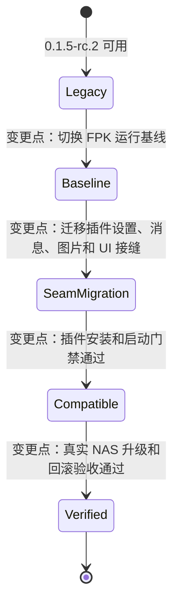
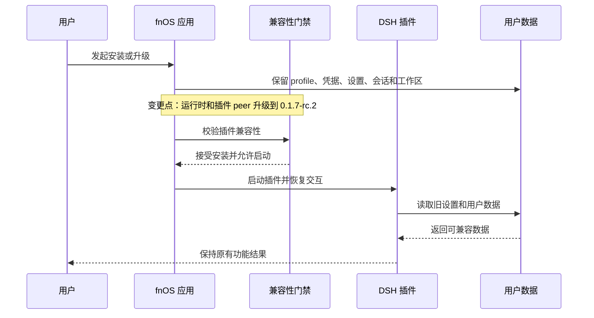
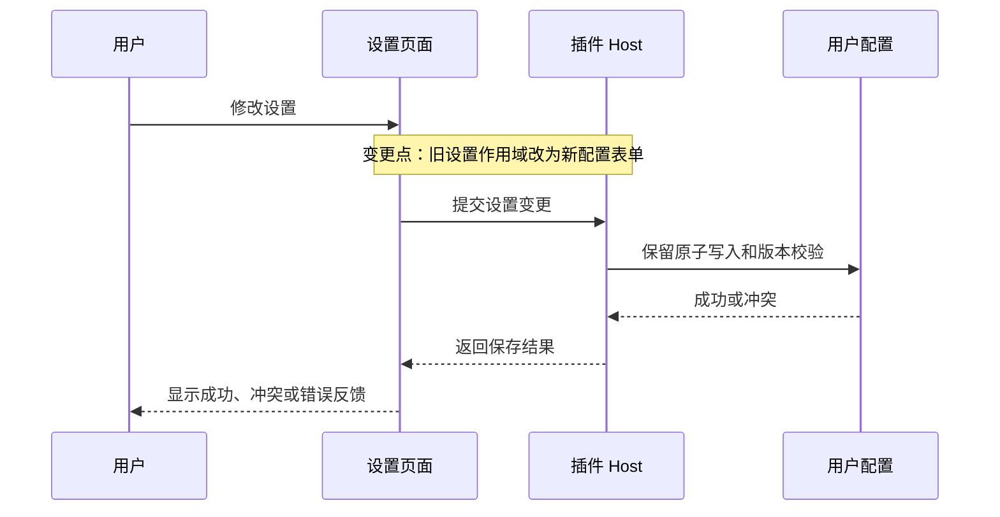

# PLAN-FNOS-007 DSH 0.1.7-rc.2 适配与插件错误修复

| 字段 | 内容 |
| --- | --- |
| 计划编号 | PLAN-FNOS-007 |
| 计划日期 | 2026-09-24 |
| 对应需求 | [FNOS-007 DSH 0.1.7-rc.2 适配与插件错误修复](/requirements/FNOS-007-dsh-017-rc2-adaptation) |
| 本轮功能 | FNOS-007-01 至 FNOS-007-12；FNOS-007-11 已完成，其余进入后续实施阶段 |
| 上游依据 | 本地 Harness checkout 的 `dsh-v0.1.7-rc.2`，以目标 tag 的源码、类型和构建结果为准 |
| 计划状态 | <Badge type="info" text="规划中" /> |

## 计划目标

本计划把应用和四个 DSH 插件从 `0.1.5-rc.2` 兼容基线迁移到 `0.1.7-rc.2`，并保证 FNOS-007 中定义的用户功能、用户数据和真实环境验收条件成立。

计划只负责实现和验证需求中的功能，不重新定义 FNOS-007 的功能范围。用户结果和验收条件以[需求文档](/requirements/FNOS-007-dsh-017-rc2-adaptation)为准。

## 实施分期

| 阶段 | 对应功能 | 内容 | 状态 |
| --- | --- | --- | --- |
| 第一期 | FNOS-007-11 | 文档站 Mermaid 渲染器替换和图表交互验收 | <Badge type="tip" text="已完成" /> |
| 第二期 | FNOS-007-01 至 10、12 | 依赖基线、插件接缝、FPK、会话、升级和 dshmarket 验收 | <Badge type="info" text="规划中" /> |

分期原因：插件源码接缝、FPK 运行时和本地开发宿主存在独立版本通路。先完成差异分析，再在不破坏当前开发宿主的前提下切换 FPK 运行时。

## 当前实现与目标设计

| 领域 | 当前实现 | 目标实现 | 影响 |
| --- | --- | --- | --- |
| DSH 运行时 | `0.1.5-rc.2` | `0.1.7-rc.2` | catalog、lockfile、安装回调、构建常量和 FPK 运行时 |
| 插件门禁 | 旧版本 peer 可被接受 | 新版本 peer 通过安装和启动门禁 | 四个插件的 peer 和兼容性声明 |
| Host 设置 | 旧设置服务读写 | 新设置描述、更新和版本校验 | `dsh-fnos` Host、配置迁移和失败回滚 |
| Client 设置 | 旧设置作用域 | 新配置表单 | 主题、授权目录卡片和输入引用 |
| LLM 消息 | 工具结果作为旧内容块处理 | 按角色处理工具结果 | CodeBuddy 多轮工具调用和图片输入 |
| 图片请求 | 旧图片策略和字段 | 新图片目标和尺寸字段 | CodeBuddy、Codex Auth 图片能力 |
| 会话 | 旧格式假设 | 兼容新格式读取 | 旧会话打开和导出，不实现自有迁移器 |
| 文档图表 | 构建期 Mermaid 插件 | 客户端 `vitepress-mermaid-renderer` | 依赖链、主题、工具栏和可访问性 |

### 既有功能状态变更



状态图中的变更点对应 FNOS-007-01、02、03、04、05、07 和 10；不修改已完成需求的历史状态，所有新结论回写当前 FNOS-007。

### 升级和交互时序



## 影响范围分析

| 需求功能 | 源码和配置 | 用户数据/运行时 | 测试和证据 | 目标环境 |
| --- | --- | --- | --- | --- |
| FNOS-007-01、02 | `pnpm-workspace.yaml`、lockfile、插件 package/compatibility 配置、构建 CLI | DSH 运行时、插件安装门禁 | peer 兼容性断言、干净 profile 安装 | 本地 DSH、真实 NAS |
| FNOS-007-03、09 | `dsh-fnos` Host/Client、设置卡片、图标和输入契约 | 主题、授权目录、代理路径、设置 profile | 设置读写、升级前后 profile 对照 | DSH 客户端、真实 NAS |
| FNOS-007-04、05 | CodeBuddy/Codex Auth serializer、图片请求和凭据模块 | 工具结果、图片内容、凭据、模型目录 | 工具调用、图片、登录、用量和配置回归 | DSH 客户端 |
| FNOS-007-06 | Semi UI 共享包和总览插件 | 组件、主题和卸载状态 | 构建、渲染、主题和卸载测试 | DSH 客户端 |
| FNOS-007-07、08 | FPK manifest、生命周期、网关、native、会话读取边界 | FPK 运行时、旧会话、网关和插件归档 | FPK 构建、安装、旧会话导出 | 真实 NAS |
| FNOS-007-10、12 | 安装/升级流程、发布清单和 dshmarket 校验 | 用户配置、已安装插件版本 | 幂等、回滚、精确版本和 NAS 证据 | 真实 NAS |
| FNOS-007-11 | `docs/package.json`、VitePress config/theme | 文档图表渲染方式 | 全部 Mermaid 图表和文档构建 | 浏览器、文档构建 |

## 源文件与生成产物边界

`apps/fn-deepseek-harness/app/` 下的网关 bundle、native 依赖、插件归档和版本文件属于生成产物，不能直接编辑。它们由以下源码和流程生成：

| 生成产物 | 唯一来源 |
| --- | --- |
| `app/gateway-proxy.mjs`、`app/rolldown-runtime-*.mjs` | `packages/fnos-gateway/src/` 与 `tsdown.app.config.ts` |
| `app/scripts/install-callback-helper.mjs` | `packages/fnos-gateway/src/install-callback-helper/` |
| `app/bundled-dsh-plugins/*.tgz` | 构建 CLI 对 `plugins/*` 执行打包 |
| `app/native/`、`app/dsh-version`、`app/node-pty-version*` | native 准备脚本和 FPK 构建流程 |

手写源文件包括 `manifest`、`cmd/*`、`config/*`、`wizard/*`、`app/ui/config` 和 `app/published-dsh-plugins.json`。

## 技术迁移设计

### T02：fnOS 设置和交互接缝

| 变更点 | 原实现 | 目标实现 | 保持的用户行为 |
| --- | --- | --- | --- |
| Host 设置读写 | 旧设置注册、读取和监听 | 新设置描述、更新和版本校验 | 主题、授权目录、代理路径继续读写 |
| Client 设置 | 旧设置作用域 | 新配置表单 | 设置卡片、主题优先级和保存反馈不变 |
| 设置卡片 | 旧设置插槽 | 新插件设置插槽 | 卡片仍可见，`/fn` 和引用插入不变 |
| 图标 | 数字后缀图标 | `Regular`/`Medium` 图标 | 视觉尺寸和位置不变 |



### T03：LLM、附件和凭据接缝

- CodeBuddy 工具结果从旧内容块处理迁移为按消息角色处理，保留调用 ID、错误标记、推理和文本序列化。
- 图片请求使用新目标字段，模型不支持图片时返回明确的原有错误语义。
- Codex Auth 保留凭据、模型目录、用量窗口和图片能力判定，不覆盖已有配置。

### T05/T08：FPK、网关和会话

- FPK 运行时由安装回调和构建常量对齐到 `0.1.7-rc.2`，开发宿主的顶层 DSH CLI 和本地 profile 不在本计划内升级。
- `attachment-patch` 只修改 `packages/fnos-gateway/src/` 的源码，锚点必须匹配一次，补丁必须幂等，路径必须位于应用私有目录。
- 旧会话只做读取和导出验证，不实现本仓库自己的格式迁移器，不改写用户会话文件。

### T07：文档站 Mermaid 渲染器

- 在客户端主题 `Layout` 中初始化 renderer，保持 SSR 空操作。
- 使用 `securityLevel: 'strict'`，监听明暗主题并重新渲染已挂载图表。
- 桌面、移动和全屏工具栏统一配置中文文案、缩放、重置、复制、下载和 dialog 全屏。
- 所有流程、关系、状态和时序图使用 `mermaid` fenced code block，不使用 ASCII 图。

### T09：dshmarket

- 发布清单、构建校验常量和用户文档当前值统一到 `1.65.1`。
- DSH CLI 使用精确版本安装；已安装用户跳过安装，不覆盖、不降级、不卸载。

## 分阶段任务

### T01：建立版本基线和插件门禁

| 任务 ID | 对应验收 | 实施内容 | 验证 |
| --- | --- | --- | --- |
| PLAN-FNOS-007-T01-01 | FNOS-007-01-AC-01、02 | 以目标 tag、lockfile 和依赖树确认 `0.1.7-rc.2` 基线，区分 FPK 通路和开发宿主通路 | 安装、锁文件和版本来源可审计 |
| PLAN-FNOS-007-T01-02 | FNOS-007-01-AC-03、FNOS-007-07-AC-01 | 清理当前基线的运行时引用，更新构建常量、native 输入、安装回调和文档当前值，保留历史记录 | 当前文件不再引用旧基线作为交付值，历史文档不改 |
| PLAN-FNOS-007-T01-03 | FNOS-007-02-AC-01 | 更新四个插件 peer、兼容性声明和实际依赖包集合 | 兼容性测试覆盖所有 DSH peer |
| PLAN-FNOS-007-T01-04 | FNOS-007-02-AC-02、03 | 在干净 profile 安装并启动四个插件，确认没有禁用日志或版本豁免依赖 | 四个插件安装成功并保持启用 |

### T02：迁移 fnOS 设置、插槽和图标

| 任务 ID | 对应验收 | 实施内容 | 验证 |
| --- | --- | --- | --- |
| PLAN-FNOS-007-T02-01 | FNOS-007-03-AC-01 至 04 | 迁移 Host 设置读写、主题偏好、代理路径原子写入和失败回滚 | 类型检查、设置单测、旧 profile 对照 |
| PLAN-FNOS-007-T02-02 | FNOS-007-03-AC-01、02 | 迁移 Client 配置表单和输入契约，保留主题优先级、授权目录和引用插入行为 | Client 构建、交互测试 |
| PLAN-FNOS-007-T02-03 | FNOS-007-09-AC-01、03 | 将设置卡片迁移到新插槽，复核输入触发器、远程服务和 `/fn` 交互 | 卡片可见、引用插入无回归 |
| PLAN-FNOS-007-T02-04 | FNOS-007-09-AC-02 | 将移除的数字后缀图标替换为目标基线的 Regular/Medium 图标 | 图标导出、渲染和尺寸检查 |

### T03：迁移 LLM、图片和 Codex 接缝

| 任务 ID | 对应验收 | 实施内容 | 验证 |
| --- | --- | --- | --- |
| PLAN-FNOS-007-T03-01 | FNOS-007-04-AC-01、02 | 将 CodeBuddy 工具结果序列化迁移到角色消息，保留调用 ID、错误标记和多轮配对 | 工具调用回归和真实请求 |
| PLAN-FNOS-007-T03-02 | FNOS-007-04-AC-03、04 | 将图片请求策略迁移到新目标字段，保留不支持图片时的明确错误 | 图片支持/拒绝测试 |
| PLAN-FNOS-007-T03-03 | FNOS-007-05-AC-01 至 04 | 核对 Codex Auth 的登录、凭据、模型、用量和图片能力接缝 | 类型检查、单元测试和配置保留测试 |

### T04：迁移共享 UI 和总览插件

| 任务 ID | 对应验收 | 实施内容 | 验证 |
| --- | --- | --- | --- |
| PLAN-FNOS-007-T04-01 | FNOS-007-06-AC-01、03 | 核对共享 UI、插槽、renderer 和主题导出，修正目标基线下的导入 | typecheck、build、test |
| PLAN-FNOS-007-T04-02 | FNOS-007-06-AC-02、03 | 在新客户端验证总览页面、主题切换、卸载和重复注册 | 客户端交互验证 |

### T05/T08：FPK、网关、会话和 native

| 任务 ID | 对应验收 | 实施内容 | 验证 |
| --- | --- | --- | --- |
| PLAN-FNOS-007-T05-01 | FNOS-007-07-AC-01、02 | 更新 FPK 构建常量、native 配置、CI 输入、安装回调和发布清单 | 插件和 FPK 构建 |
| PLAN-FNOS-007-T05-02 | FNOS-007-07-AC-04 | 建立版本、锁文件、native、清单和捆绑包元数据的一致性门禁 | 不一致时构建失败 |
| PLAN-FNOS-007-T05-03 | FNOS-007-07-AC-03 | 在真实 NAS 安装新 FPK，验证运行时版本、网关和 DSH Web | NAS 安装启动证据 |
| PLAN-FNOS-007-T05-04 | FNOS-007-08-AC-01 至 03 | 使用旧会话验证打开和导出，确认插件不实现自有迁移器 | 会话回归和文件不变断言 |
| PLAN-FNOS-007-T08-01 | FNOS-007-07-AC-02 | 修复附件补丁锚点，验证三处锚点单次匹配、幂等和应用私有路径 | 目标包样本、失败锚点和回归测试 |
| PLAN-FNOS-007-T08-02 | FNOS-007-07-AC-02 | 确认新增图片依赖的 FPK 就位方式和 native 处理边界 | 目标架构图片处理可用 |

### T06：升级、回滚和目标环境验收

| 任务 ID | 对应验收 | 实施内容 | 验证 |
| --- | --- | --- | --- |
| PLAN-FNOS-007-T06-01 | FNOS-007-10-AC-01、02 | 逐项验证 profile、凭据、工作区、授权目录、插件设置和会话保留，确认重复执行幂等 | 升级前后数据对照 |
| PLAN-FNOS-007-T06-02 | FNOS-007-10-AC-03 | 注入安装/升级失败，确认旧运行时和配置可恢复 | 回滚后应用可启动 |
| PLAN-FNOS-007-T06-03 | FNOS-007-10-AC-04 | 执行插件、包、FPK、文档和 SDD 门禁 | 全量检查和文档构建 |
| PLAN-FNOS-007-T06-04 | FNOS-007-10-AC-04 | 在真实 NAS 记录安装、升级、启动、网关、四个插件和设置证据 | `docs/validation/` 记录可追溯 |

### T07：文档站 Mermaid 渲染器（已完成）

| 任务 ID | 对应验收 | 实施内容 | 验证 |
| --- | --- | --- | --- |
| PLAN-FNOS-007-T07-01 | FNOS-007-11-AC-01、04 | 用 `vitepress-mermaid-renderer` 替换旧构建期插件，清理旧依赖链 | `pnpm install` 和依赖检查 |
| PLAN-FNOS-007-T07-02 | FNOS-007-11-AC-01 | 在客户端主题挂载 renderer，保持 SSR 空操作和严格安全级别 | VitePress 构建和浏览器渲染 |
| PLAN-FNOS-007-T07-03 | FNOS-007-11-AC-02、03 | 配置桌面、移动、全屏工具栏、中文文案和主题变化重渲染 | 21 个 Mermaid 图表和四种视口验证 |
| PLAN-FNOS-007-T07-04 | FNOS-007-11-AC-01 | 验证图表渲染失败时保留可读错误区域，不影响其它文档内容 | DOM 和可访问性检查 |

### T09：dshmarket 精确版本

| 任务 ID | 对应验收 | 实施内容 | 验证 |
| --- | --- | --- | --- |
| PLAN-FNOS-007-T09-01 | FNOS-007-12-AC-01 至 03 | 同步发布清单、构建常量和文档当前值到 `1.65.1`，确认 peer 兼容和精确版本安装 | 构建校验和版本一致性检查 |
| PLAN-FNOS-007-T09-02 | FNOS-007-12-AC-04 | 在真实 NAS 验证已安装用户跳过安装并保留版本和配置 | 安装/升级证据，确认已完成需求正文未被修改 |

## 数据、权限和错误处理

| 类别 | 处理要求 |
| --- | --- |
| 用户设置 | 由 DSH profile 承载；迁移后旧值可读，写入冲突保留最新有效值 |
| 凭据和授权 | 沿用现有存储位置和权限，不进入表单响应或测试夹具 |
| 会话 | 只读取和导出旧会话，不改写或删除用户文件 |
| FPK 配置 | 配置文件采用临时文件和原子替换，写入失败恢复原值 |
| 插件不兼容 | 安装拒绝或启动禁用；修正 peer，不用用户豁免掩盖问题 |
| 补丁锚点失败 | 以非零退出并指出锚点，不留下半补丁文件 |
| 图表渲染失败 | 显示带 `role="alert"` 的错误区域，不静默留白 |

## 依赖、风险和决策

| 风险/事实 | 影响 | 决策和验证 |
| --- | --- | --- |
| 新版本新增插件兼容性门禁 | 插件被拒绝安装或启动禁用 | 先完成 T01，peer 修正是唯一正式放行方式 |
| Settings 接缝替换 | 用户设置读不到或写不进 | T02 采用旧值对照和真实设置读写验证 |
| LLM 消息角色变化 | 工具调用可能返回 400 | T03 保留调用 ID 配对并做真实请求回归 |
| 会话格式升级 | 旧会话可能打不开 | 由上游负责迁移，本仓库只验证读取和导出 |
| 安装补丁锚点变化 | FPK 安装硬失败 | T08 使用目标编译产物样本和单次匹配断言 |
| 当前开发宿主版本独立 | 迁移会中断本地开发 | FPK 通路先行，开发宿主和本地 profile 另行安排 |
| Mermaid 安全配置 | 不可信图表可能引入风险 | 保持 `securityLevel: 'strict'`，不放宽渲染边界 |

### 既有功能变更记录方式

每当任务改变已完成需求中的状态或交互时，计划必须新增一条变更记录，至少包含原需求/功能/验收编号、当前约定、目标约定、变更原因、影响模块和验证方式。状态图和时序图中的变更节点或 `Note` 必须使用 `变更点：` 前缀。

## 测试、打包、发布和回滚

### 插件和包级

```bash
pnpm run check -- --packages --plugins
pnpm run build -- --plugin fnos
```

覆盖四个插件、共享 UI、网关、peer 兼容性、设置、消息、图片和图表相关测试。

### 文档级

```bash
pnpm run check -- --sdd --docs
pnpm run build -- --docs
git diff --check
```

覆盖需求/计划结构、Mermaid 语法、renderer hydration、主题切换和内部链接。

### FPK 和真实 NAS

- 构建 FPK，确认版本、native、清单和捆绑插件一致。
- 在真实 NAS 执行安装、升级、启动、网关、插件加载、设置读写、旧会话读取和回滚。
- 把证据写入 `docs/validation/`，再回写 FNOS-007 和本计划状态。

### 回滚

- 安装失败不得删除旧运行时、配置、凭据、会话或工作区。
- 设置写入失败恢复写入前版本。
- 补丁锚点不匹配时停止安装，不继续写入半成品。
- dshmarket 已安装用户不被降级或卸载。

## 参考资料

| 外部能力 | 参考 | 用途 |
| --- | --- | --- |
| DSH 上游项目 | `deepseek-ai/deepseek-harness` 的 `dsh-v0.1.7-rc.2` tag | 插件接缝和兼容性契约 |
| 插件兼容性 | 上游 `evaluatePluginCompatibility()` 契约 | peer 兼容性门禁 |
| fnOS 平台 | `fnnas-docs Skill` | FPK、权限、安装和升级约束 |
| Mermaid 渲染器 | `vitepress-mermaid-renderer` Skill | 客户端渲染、工具栏、主题和可访问性 |
| 本仓库规范 | [需求文档规范](/charter/requirements-spec)、[计划文档规范](/charter/plans-spec) | 文档边界和追踪规则 |

## 完成状态

| 阶段 | 状态 | 对应功能 |
| --- | --- | --- |
| T01 版本基线和插件门禁 | 规划中 | FNOS-007-01、02 |
| T02 设置、插槽和图标 | 规划中 | FNOS-007-03、09 |
| T03 LLM、图片和 Codex | 规划中 | FNOS-007-04、05 |
| T04 共享 UI | 规划中 | FNOS-007-06 |
| T05/T08 FPK、网关、会话和 native | 规划中 | FNOS-007-07、08 |
| T06 升级、回滚和 NAS | 规划中 | FNOS-007-10 |
| T07 Mermaid 渲染器 | 已完成 | FNOS-007-11 |
| T09 dshmarket | 待完成 | FNOS-007-12 |

## 变更记录

| 日期 | 变更 | 说明 |
| --- | --- | --- |
| 2026-09-24 | 建立 PLAN-FNOS-007 | 纳入 DSH 0.1.7-rc.2 适配、插件接缝、FPK、会话和验收任务。 |
| 2026-09-27 | 纳入 dshmarket 任务 | 在当前开发计划中同步 dshmarket 精确版本升级，不修改已完成计划正文。 |
| 2026-09-27 | 重整计划边界 | 删除需求正文复制，补充当前/目标设计、影响矩阵、迁移方案、状态图、时序图、任务、验证和变更点规则。 |
