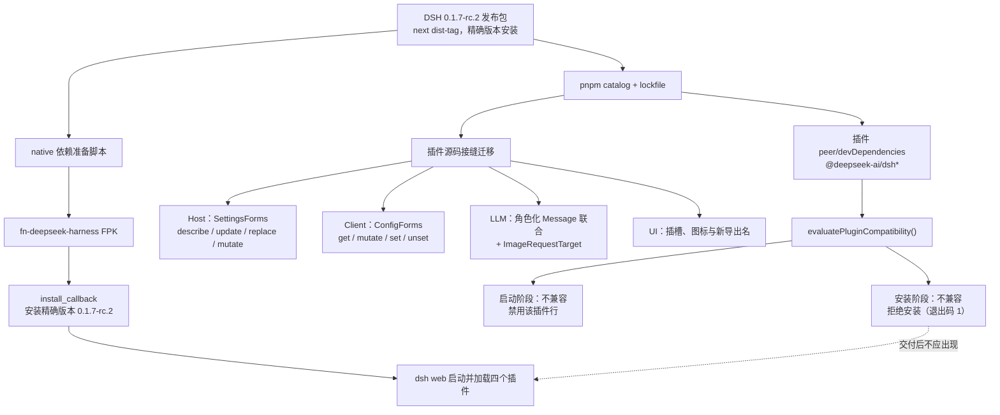
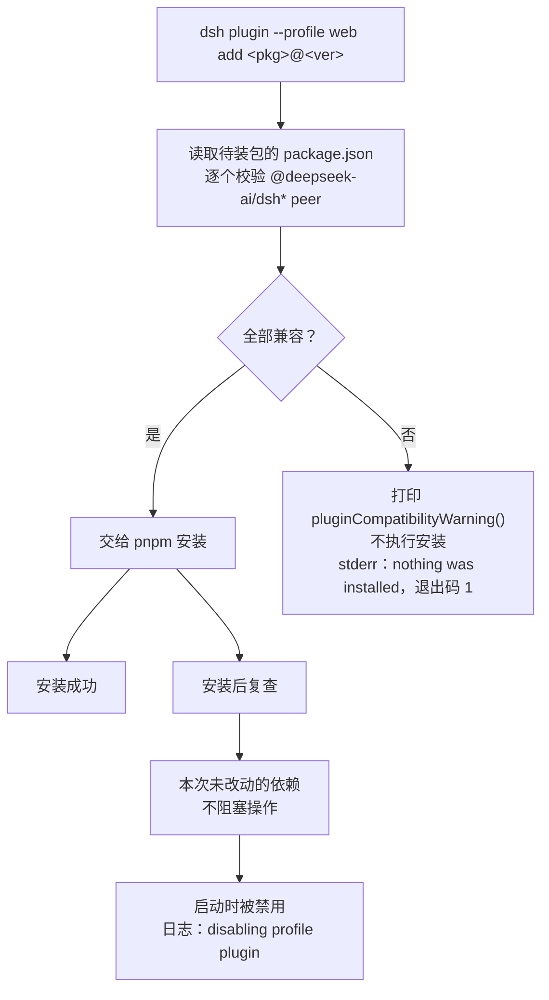
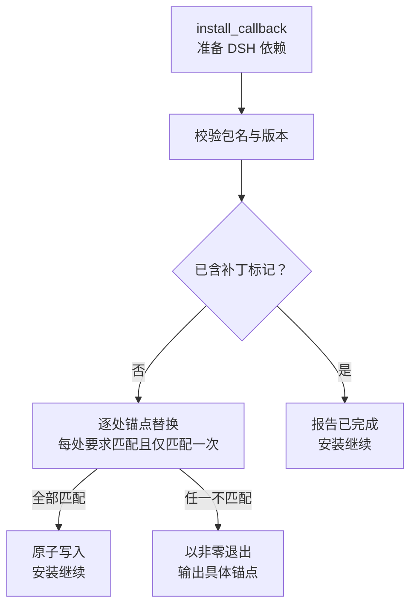

# PLAN-FNOS-007 DSH 0.1.7-rc.2 适配与插件错误修复

| 字段 | 内容 |
| --- | --- |
| 计划编号 | PLAN-FNOS-007 |
| 计划日期 | 2026-09-24 |
| 对应需求 | [FNOS-007 DSH 0.1.7-rc.2 适配与插件错误修复](/requirements/FNOS-007-dsh-017-rc2-adaptation) |
| 本轮功能 | 第一期：`FNOS-007-11`（文档站 Mermaid 渲染器替换）；第一期同时产出 `FNOS-007-01` 至 `FNOS-007-10` 的 `0.1.7-rc.2` 差异分析，实施留待第二期 |
| 上游依据 | 本地 Harness checkout 的 `dsh-v0.1.7-rc.2`（`477b4f420553e8a52c2fbccc464d7561b239c443`） |
| 计划状态 | <Badge type="info" text="规划中" /> |

## 计划目标

把 DSH 应用和仓库内四个插件的兼容性基线从 `0.1.5-rc.2` 升级到本地官方 Harness checkout 的 `dsh-v0.1.7-rc.2`，并修复各插件在该版本上的错误，使插件能够正常安装、加载和运行。

本计划分两期落地，分期原因见需求文档的[实施分期约束](/requirements/FNOS-007-dsh-017-rc2-adaptation#实施分期约束)：三条版本通路彼此耦合，同时推进会让当前开发所依赖的 DSH Web 会话失效。

| 分期 | 阶段 | 状态 |
| --- | --- | --- |
| 第一期 | 阶段七：文档站 Mermaid 渲染器替换 | <Badge type="tip" text="已完成" /> |
| 第二期 | 阶段一至六：依赖基线、插件接缝迁移、FPK 与会话兼容、验收发布 | <Badge type="info" text="规划中" /> |

第一期已完成 `0.1.7-rc.2` 的接缝差异分析（比对 rc.1 与 rc.2 的全部相关源文件），结论可直接用于第二期实施：本计划涉及的破坏性接缝在两个 tag 之间一致，`ui-primitives` 仅新增导出。

第二期处理 `FNOS-007-01` 至 `FNOS-007-10`。三个技术边界决定了实施顺序：

1. **兼容性门禁优先于一切功能验证。** `0.1.7-rc.2` 新增的 `evaluatePluginCompatibility()` 会在安装阶段和 profile 启动阶段用 SemVer 校验插件的 `@deepseek-ai/dsh*` peer 依赖。本仓库插件当前精确锁定 `0.1.5-rc.2`，在 `0.1.7-rc.2` 上判定为不兼容，会被拒绝安装或在启动时被禁用。因此先建立依赖基线并修正 peer 声明，否则后续任何插件验证都无法进行。
2. **接缝迁移按「先 Host 后 Client」推进。** Host 侧 `ctx.settings` 与 Client 侧 `settingsScope` 分属不同接缝，前者决定设置能否读写，后者决定界面能否渲染；两者都迁移完成后，设置页才可验证。
3. **会话格式迁移由上游负责。** 本计划只验证插件不假设 V3 会话结构，不实现迁移器、不改写用户会话文件。

本计划不修改 DeepSeek Harness 上游源码，只在本仓库插件、共享包和 FPK 构建链内完成适配。checkout 固定使用目标 tag，实施期间不切换分支。

## 实现范围和边界

| 模块 | 计划入口 | 实现责任 |
| --- | --- | --- |
| DSH 依赖基线 | `pnpm-workspace.yaml`、`pnpm-lock.yaml` | `@deepseek-ai/dsh`、`catalogs.dsh.*`、`minimumReleaseAgeExclude` 与 `@deepseek-ai/schemastery` 统一到目标 tag 依赖树 |
| fnOS 插件 Host | `plugins/dsh-fnos-plugin/src/index.ts`、`src/host/` | 把 `ctx.settings.register()`/`get()`/`watch()` 迁移到 `SettingsForms` 的 `describe()`/`update()`；保留主题引导、授权目录和网关代理路径行为 |
| fnOS 插件 Client | `plugins/dsh-fnos-plugin/src/client/`、`src/components/` | `settingsScope`→`configForms`；`settings.plugin.item`→新插槽；图标改名；输入触发器与 `InputActions`/`SessionInput` 契约补齐 |
| Codex Auth 插件 | `plugins/dsh-codex-auth-plugin` | `dsh-llm-pi-ai`、`dsh-attachment`、设置写入与图标接缝迁移；保留凭据、模型目录和用量行为 |
| CodeBuddy 插件 | `plugins/dsh-codebuddy-plugin` | `dsh-llm` 角色化消息模型、工具结果与 `ImageRequestTarget` 迁移 |
| Semi UI 共享包 | `packages/dsh-semi-ui`、`plugins/dsh-semi-ui-showcase-plugin` | 共享组件、客户端插槽、renderer 与 theme 契约迁移 |
| FPK 应用（手写源） | `apps/fn-deepseek-harness/{cmd,manifest,config,wizard}`、`app/published-dsh-plugins.json`、`app/ui/` | DSH 版本常量、安装/升级回调、运行身份、发布清单与入口配置 |
| FPK 应用（生成产物） | `apps/fn-deepseek-harness/app/{gateway-proxy.mjs,rolldown-runtime-*.mjs,scripts/install-callback-helper.mjs,bundled-dsh-plugins/,native/,dsh-version,node-pty-version*}` | 不直接编辑；由 `packages/fnos-gateway/tsdown.app.config.ts` 与 `tooling/fn-os-apps-cli` 构建流程生成 |
| 构建与发布 | `tooling/fn-os-apps-cli`、`.github/config`、`.github/scripts`、`.github/workflows` | 构建校验常量、native 构建输入文件与 CI 工作流对齐 |
| 文档与测试 | `docs/`、各插件 `tests/`、`packages/dsh-semi-ui/tests` | 记录迁移差异、peer 兼容性断言与验证证据 |
| 文档站渲染 | `docs/package.json`、`docs/.vitepress/config.mts`、`docs/.vitepress/theme/index.ts` | 用 `vitepress-mermaid-renderer` 替换构建期 Mermaid 插件，移除其 CJS 依赖链，在客户端主题中接入并中文化工具栏 |

### 源文件与生成产物的边界

`apps/fn-deepseek-harness/app/` 下混有两类内容，改动位置必须区分。以下文件是**生成产物**，受 `.gitignore` 排除，不得直接编辑；需要变更时改生成它们的源码，再重新构建：

| 生成产物 | 生成来源 |
| --- | --- |
| `app/gateway-proxy.mjs`、`app/rolldown-runtime-*.mjs` | `packages/fnos-gateway/tsdown.app.config.ts`（入口 `src/cli.ts` 与 `src/install-callback-helper/index.ts`） |
| `app/scripts/install-callback-helper.mjs` | 同上（入口 `src/install-callback-helper/index.ts`） |
| `app/bundled-dsh-plugins/*.tgz` | `tooling/fn-os-apps-cli` 的 `--bundle-dsh-plugins`（对 `plugins/*` 执行 `pnpm pack`） |
| `app/native/node-pty/`、`app/dsh-version`、`app/node-pty-version*` | `.github/scripts/prepare-dsh-native.sh` 与构建流程的 `--bundle-dsh-native` |

其中网关代理与安装辅助逻辑的**唯一源码位置是 `packages/fnos-gateway/src/`**：`attachment-patch.ts`、`node-pty.ts`、`dsh-web-args.ts`、`dsh-runtime-env.ts` 等改动都改这里，`app/` 下的 `.mjs` 会随构建重新生成。

以下是**手写源文件**（受版本管理），可直接编辑：`cmd/*`、`manifest`、`config/*`、`wizard/*`、`app/ui/config`、`app/published-dsh-plugins.json`。`published-dsh-plugins.json` 虽然位于 `app/`，但它是人工维护的发布清单（`fn-apps-cli version -- plugin` 会同步其中的插件版本），不是构建产物。

`FNOS-007-02` 只通过修正插件的 `peerDependencies` 声明来通过门禁，不预置 `compatibility.json` 豁免记录，也不在安装回调里写入 `dsh plugin allow-version`。`FNOS-007-03` 的 Host 迁移与 `FNOS-007-09` 的 Client 迁移分别对应同一功能的两端，不合并为一次改动。`FNOS-007-08` 不实现会话迁移器，只验证插件侧假设和读取路径。`FNOS-007-11` 只改文档站渲染，与 DSH 基线和插件接缝相互独立，不阻塞也不依赖其它阶段，已在第一期完成。

第二期不包含三项会中断当前开发宿主的动作：不升级工程内 DSH CLI（catalog 顶层 `@deepseek-ai/dsh` 保持 `0.1.5-rc.2`）、不重建本地 profile 的 `link:` 插件产物、不在本地 profile 仍解析 `0.1.5-rc.2` peer 时迁移插件源码。第二期开始前必须先确定工程内 CLI 的升级时机与本地 profile 的处理方式；FPK 运行时版本由 `cmd/install_callback` 的 `DSH_VERSION` 独立声明，是切换基线的正式入口。

## 目标架构和数据流

版本解析、插件编译和 FPK 运行验证使用同一个 `0.1.7-rc.2` 基线。插件能否被加载由上游门禁决定，而不是由本仓库的构建结果决定，因此门禁验证必须同时覆盖「安装被接受」和「启动不被禁用」两个阶段。

## 分阶段任务

以下阶段一至六、八属于**第二期**，尚未进入实施。第一期只完成阶段七。

阶段八（网关与安装回调适配）与阶段五同属 FPK 交付链，可以并行推进，但 `PLAN-FNOS-007-T08-01` 是**阻断项**：附件补丁锚点当前已失效，不修复则新 FPK 无法完成安装。

### P0：建立 DSH 0.1.7-rc.2 依赖基线与兼容性门禁

状态：<Badge type="info" text="规划中" />

| 任务 ID | 对应验收 | 实现内容 | 验收 |
| --- | --- | --- | --- |
| PLAN-FNOS-007-T01-01 | FNOS-007-01-AC-01、FNOS-007-01-AC-03 | 先校验 `~/workspace/fork-pj/deepseek-harness` 位于 tag `dsh-v0.1.7-rc.2`（commit `477b4f420553e8a52c2fbccc464d7561b239c443`）且 `pnpm@11.7.0`；盘点本仓库版本引用，把 `@deepseek-ai/dsh`、`catalogs.dsh.*` 与 `minimumReleaseAgeExclude` 统一到该 tag，并按依赖树核对 `@deepseek-ai/schemastery`、`@earendil-works/pi-ai`、`node-pty` 与 Node 引擎要求 | 适配证据固定为 tag + commit；`pnpm install` 成功，锁文件解析出的 DSH 包版本可审计且没有混入 `0.1.5-rc.2` |
| PLAN-FNOS-007-T01-02 | FNOS-007-01-AC-02、FNOS-007-01-AC-04 | 扫描受版本管理文件中的 `0.1.5-rc.2` 引用，区分「当前基线」与「历史记录」；更新构建常量、native 配置文件名、安装回调、插件清单与面向用户文档，保留历史需求、计划和验收记录不改 | 除历史文档外不再存在作为当前基线的 `0.1.5-rc.2`；所有安装路径使用精确版本，无浮动 dist-tag |
| PLAN-FNOS-007-T01-03 | FNOS-007-02-AC-01、FNOS-007-02-AC-05 | 更新四个插件的 `package.json` peer 声明与 `compatibility.json`：`dshPluginApi.version` 置为 `0.1.7-rc.2`，包集合按实际 import 校正；新增单元测试，用与上游 `evaluatePluginCompatibility()` 一致的 SemVer 语义（`includePrerelease: true`）断言每个 `@deepseek-ai/dsh*` peer 在运行版本上兼容 | 断言测试覆盖四个插件的全部 DSH peer；`packages` 列表覆盖实际 import 且不含无关包 |
| PLAN-FNOS-007-T01-04 | FNOS-007-02-AC-02、FNOS-007-02-AC-03、FNOS-007-02-AC-04 | 在干净 profile 中执行 `dsh plugin --profile web add <package>@<exact-version>` 安装四个插件，确认安装被接受；启动 DSH Web 并检查日志无 `disabling profile plugin` 或 `is incompatible with dsh`；确认不依赖任何 `compatibility.json` 豁免记录 | 四个插件安装成功、启动后处于启用状态；profile 的 `compatibility.json` 不存在或为空即可正常工作 |

失败时的降级与边界：若某个 peer 无法在当前插件结构下声明为兼容范围（例如插件直接依赖了已被上游移除的包），不通过豁免绕过，而是先修正依赖或移除该引用，并把结论记入本计划的变更记录。

### P0：dsh-fnos 设置接缝与设置页迁移

状态：<Badge type="info" text="规划中" />

| 任务 ID | 对应验收 | 实现内容 | 验收 |
| --- | --- | --- | --- |
| PLAN-FNOS-007-T02-01 | FNOS-007-03-AC-01 | 把 `src/index.ts` 的 `ctx.settings.register(ns, schema)` 迁移到 `SettingsForms`：设置项按 `Config` schema 的可变字段声明，读取改用 `describe()` 返回的描述符，`inject` 列表按新服务名调整；`FnosSettingsSchema` 与命名空间常量保持对外语义 | 类型检查通过；代码中不再出现被移除的 `register()`/`get()`/`SettingsScope`/`SettingsProvider` |
| PLAN-FNOS-007-T02-02 | FNOS-007-03-AC-04 | 调整 `src/host/gateway-proxy-routes.ts`：`settings.get()`/`watch()` 改为按 `describe()` 读取并经设置变更事件刷新，`settings.update(patch)` 的写入路径保持；代理路径同步到 `${TRIM_PKGVAR}` 配置文件的原子写入与失败回滚保持 | 写入后配置文件内容与设置页一致；写入失败时保留原文件并可重试；`prepareDocument()` 路由行为不变 |
| PLAN-FNOS-007-T02-03 | FNOS-007-03-AC-02、FNOS-007-03-AC-05 | 客户端 `src/client/index.ts` 去掉 `settingsScope` 依赖，`createThemePersistence()` 改为基于 `configForms`/`ConfigForm`；主题偏好读取路径按 `ui-theme` 新接缝修正；`ConfigForm` 的 `mutate`/`set`/`unset` 返回值按 `Promise<boolean>` 处理 | 客户端类型检查通过；fnOS 主题跟随与 DSH 深浅色偏好优先级行为不变 |
| PLAN-FNOS-007-T02-04 | FNOS-007-03-AC-03 | 验证设置值在升级前后的可读性：使用升级前已保存主题偏好、网关代理路径和授权目录相关设置的 profile，确认升级后仍能被读取并生效；确认 `settings.yaml` 迁移到 profile 后旧值不丢失 | 升级后用户不需要重新配置；设置项逐项与升级前一致 |
| PLAN-FNOS-007-T02-05 | FNOS-007-09-AC-01、FNOS-007-09-AC-04 | 把授权目录设置卡片从已退役的 `settings.plugin.item` 迁移到新基线下实际存在的插槽；确认 `/fn` 指令、授权目录选择器与文件引用插入行为不变 | 卡片在设置页可见可用；不再引用 `settings.plugin.item`；`/fn` 交互无回归 |
| PLAN-FNOS-007-T02-06 | FNOS-007-03-AC-05 | 改造 DSH 主题偏好的读取路径。目标 tag 下 `ui-theme` 不再把偏好放在可 `get()` 的设置命名空间里，而是声明为插件的 `Volatile` 配置字段（`config.preference.get()`），`SettingsForms` 也没有 `get()`。改用 `describe()` 取得 `ns === 'ui-theme'` 的描述符并从 `value.preference` 读取（`ui-theme` 的 profile entry id 与 `THEME_SETTINGS_NAMESPACE` 同为 `ui-theme`，取值可对上）；该断言需实测确认，若不一致则以 entry id 为准 | fnOS 主题跟随与 DSH 深浅色偏好优先级不变；`light`/`dark`/`system` 三态都能读到；读不到时回退 `system` 而不抛错 |
| PLAN-FNOS-007-T02-07 | FNOS-007-09-AC-02 | 把 `dsh-fnos` 组件中引用已移除数字后缀图标的位置改为目标 tag 的 `Regular`/`Medium` 命名：`FnosSessionLogHeaderAction.tsx` 的 `IconEllipsisOutline16`、`IconDownloadOutline16`、`IconFolderOpenOutline16`，以及 `FnosOpenInHeaderAction.tsx` 的 `IconChevronDownOutline14`。旧名在新基线下无别名，未改会直接编译失败。按原有语义选择权重（默认描边对应 `Regular`），保持尺寸参数与视觉一致 | 两个组件引用的图标在新基线下均存在；会话日志按钮与文件入口图标正常显示，尺寸与位置和适配前一致；契约测试断言同步更新 |
| PLAN-FNOS-007-T02-08 | FNOS-007-03-AC-02、FNOS-007-09-AC-04 | 补齐客户端输入与触发器契约：`InputActions` 的 `captureInsertion()`/`insertText()`、`SessionInput` 的 `focus()`、`InputTriggerController` 的 `openReference()`；`ReferenceInsert` 与 `TokenSpan` 的来源模块迁到 `contract/draft-editor.ts` 且 `CommandClaim` 新增必填 `name`；`FnosAuthorizedPathPicker` 的 `InputActions`/`InputState` 用法随之校正 | `/fn` 指令与授权目录选择器行为不变；插入引用、追加文本与关闭弹层的路径都按新契约实现；类型检查通过 |
| PLAN-FNOS-007-T02-09 | FNOS-007-03-AC-01 | 复核 `dsh-fnos` 客户端 `inject` 列表与服务可用性：移除已不存在的 `settingsScope`；确认 `theme`、`slots`、`locale`、`sessions`、`inputTriggers`、`commandUi`、`remote`、`remote.session`、`sessionLogDownload` 在目标 tag 下仍被提供（cordis 对永不出现的注入服务会保持 fiber 不激活，插件整体不加载）。同时确认 `ui-session` 新增的 `remote` 硬依赖与 `ui-theme` 的 `configForms` 依赖在目标组合中已满足 | 客户端插件在目标组合下正常激活；不因缺失服务静默不加载；`inject` 列表与目标基线的服务名逐项一致 |

### P0：LLM 与附件接缝迁移

状态：<Badge type="info" text="规划中" />

| 任务 ID | 对应验收 | 实现内容 | 验收 |
| --- | --- | --- | --- |
| PLAN-FNOS-007-T03-01 | FNOS-007-04-AC-01、FNOS-007-04-AC-02 | 重写 `plugins/dsh-codebuddy-plugin/src/host/serialize.ts` 的消息序列化：不再按 `tool-result` 内容块从 user 消息提取工具结果，改为按 `role: 'tool'` 的消息连同 `toolCallId` 与 `isError` 生成线缆消息；保留工具调用 id 截断、重放推理与文本扁平化逻辑 | 类型检查与单元测试通过；多轮工具调用会话能完整序列化，真实请求不返回 400 |
| PLAN-FNOS-007-T03-02 | FNOS-007-04-AC-03、FNOS-007-04-AC-04 | 迁移 `src/host/serialize-image.ts` 的图片请求目标：`ImageRequestPolicy`→`ImageRequestTarget`，字段改为 `{ width, height, maxBytes }`；确认模型不支持图片时仍返回原有 `UNSUPPORTED_CONTENT` 语义错误，不静默丢弃内容 | 类型检查通过；图片按模型能力被接受或明确拒绝 |
| PLAN-FNOS-007-T03-03 | FNOS-007-04-AC-05 | 回归 CodeBuddy 多账号、切换策略、签到、额度与 Token 统计行为，确认文本、图片和错误流仍能被界面正确消费 | 现有测试全部通过；无功能性回归 |
| PLAN-FNOS-007-T03-04 | FNOS-007-05-AC-01、FNOS-007-05-AC-04 | 核对 `dsh-codex-auth` 对 `PiAiAdapter`、`ResolvedPiAiProviderProfile` 与 `@earendil-works/pi-ai` `0.85.1` 的使用在新基线下仍成立；确认设置写入路径与 `compatibility.json` 的 `piAi` 声明和实际安装版本一致 | 类型检查、单元测试和构建通过；版本声明一致 |
| PLAN-FNOS-007-T03-05 | FNOS-007-05-AC-02、FNOS-007-05-AC-03 | 回归 Codex 登录、凭据读写、模型目录刷新与用量查询；把被移除的数字后缀图标改为 `Regular`/`Medium` 命名；确认已有 `auth.json` 与模型配置不被覆盖或删除 | 功能不变；升级后用户凭据与模型配置保持不变；无缺失图标或未定义错误 |

### P1：Semi UI 共享包与总览插件迁移

状态：<Badge type="info" text="规划中" />

| 任务 ID | 对应验收 | 实现内容 | 验收 |
| --- | --- | --- | --- |
| PLAN-FNOS-007-T04-01 | FNOS-007-06-AC-01、FNOS-007-06-AC-03 | 核对 `packages/dsh-semi-ui` 与总览插件引用的 `ui-primitives`、`ui-slots`、`ui-renderer`、`ui-theme` 导出在新基线下是否存在；修正被改名或迁移的导出引用并更新 peer 声明 | 类型检查、单元测试和构建通过 |
| PLAN-FNOS-007-T04-02 | FNOS-007-06-AC-02 | 验证总览页面在新客户端可打开、切换主题、滚动浏览各分组并正常卸载；确认无重复注册与运行时异常 | 页面交互无异常；卸载后无残留注册 |

### P0：FPK、native 构建与会话兼容

状态：<Badge type="info" text="规划中" />

| 任务 ID | 对应验收 | 实现内容 | 验收 |
| --- | --- | --- | --- |
| PLAN-FNOS-007-T05-01 | FNOS-007-07-AC-01、FNOS-007-07-AC-02 | 更新 `tooling/fn-os-apps-cli` 的 DSH 版本常量与 native 配置路径，重命名 `.github/config/dsh-native-*.env` 并按新依赖树核对 node-pty 与 Node.js 版本；同步构建脚本、CI 工作流与开发文档中的引用 | 构建校验常量、native 配置文件名和安装回调三者一致；`pnpm run build -- --plugin <name>` 与 `--fpk` 成功 |
| PLAN-FNOS-007-T05-02 | FNOS-007-07-AC-04、FNOS-007-07-AC-05 | 同步 `published-dsh-plugins.json` 与内置归档的插件精确版本；确认 `dshmarket` 仍不进入内置目录且固定版本不变；确认构建校验在版本、native 配置、锁文件、插件清单或捆绑包元数据任一不一致时拒绝发布 | 清单与归档元数据一致；不一致时构建失败 |
| PLAN-FNOS-007-T05-03 | FNOS-007-07-AC-03 | 在真实 NAS 安装新 FPK，确认应用私有 `${TRIM_PKGHOME}/.npm-global/bin/dsh --version` 输出 `0.1.7-rc.2`，DSH Web 可经 fnOS 网关打开 | 版本正确；Web 可访问；插件正常加载 |
| PLAN-FNOS-007-T05-04 | FNOS-007-08-AC-01 至 FNOS-007-08-AC-04 | 用 `0.1.5-rc.2` 期间产生的旧会话验证升级后仍可正常加载与导出；确认插件不实现会话迁移器、不改写用户会话文件、不假设工具结果位于内容块中 | 旧会话可加载、可导出；插件侧无格式假设 |
| PLAN-FNOS-007-T05-05 | FNOS-007-07-AC-07 | 核对应用目录的源文件与生成产物边界：`app/gateway-proxy.mjs`、`app/rolldown-runtime-*.mjs`、`app/scripts/install-callback-helper.mjs`、`app/bundled-dsh-plugins/`、`app/native/` 与版本文件均不直接编辑；需要变更时改 `packages/fnos-gateway/src/`、`packages/fnos-gateway/tsdown.app.config.ts` 或构建流程源码后重新生成 | 上述产物在 `git status` 中始终为未跟踪；构建后产物内容与源码一致；不存在对 `app/` 下 `.mjs` 产物或 `bundled-dsh-plugins/` 的手工改动 |

### P0：网关与安装回调适配

状态：<Badge type="info" text="规划中" />

网关的重写逻辑（`content-rewrite`、`path-rewrite`、`request-headers`、`response-headers`、`sse-keepalive`）、`builtinPaths`、`dsh-web-args` 与 `dsh-runtime-env` 均为不依赖 DSH 版本细节的通用实现，目标 tag 下无需改动；本阶段只处理安装回调中的源码补丁与 native 依赖确认。所有改动都落在 `packages/fnos-gateway/src/`，`app/` 下的 `.mjs` 产物由构建重新生成。

| 任务 ID | 对应验收 | 实现内容 | 验收 |
| --- | --- | --- | --- |
| PLAN-FNOS-007-T08-01 | FNOS-007-07-AC-06 | 修复 `packages/fnos-gateway/src/install-callback-helper/attachment-patch.ts` 的失效锚点。上游 `d911a7b422`（`attachment-local` 把请求图片移入共享缓存）已把构造器从 `this.root = resolve(join(resolveDshHome(config.dshHome), "attachments", "v1"));` 改为先解构 `const dshHome = resolveDshHome(config.dshHome)` 再 `this.root = join(dshHome, "attachments", "v1")`，并新增 `dshCachePath` 的 `cacheRoot`。该锚点在 `0.1.7-rc.1` 与 `0.1.7-rc.2` 的编译产物中匹配数均为 0，`replaceOnce` 会因「期望匹配一次」而失败，导致安装中止。按目标版本编译产物更新锚点与替换文本，并确认新增的 `cacheRoot`（解析到 `DSH_HOME/cache/attachments`）仍落在应用私有目录内、不需要额外边界处理 | 对目标版本的 `@deepseek-ai/dsh-attachment-local` 编译产物，三处锚点各匹配且仅匹配一次；补丁可重复执行且幂等；`this.root` 与 `cacheRoot` 都指向 `${TRIM_PKGVAR}` 下的应用私有路径；锚点不匹配时安装回调仍以非零退出并给出可定位错误 |
| PLAN-FNOS-007-T08-02 | FNOS-007-07-AC-06 | 为 `attachment-patch` 补充回归测试：用目标版本与上一基线的编译产物样本分别驱动补丁路径，断言锚点匹配数、替换结果与幂等性；把该测试接入 `packages/fnos-gateway` 的测试任务 | 测试在锚点被上游改动时失败并指出具体锚点；`packages/fnos-gateway` 的类型检查与单元测试通过 |
| PLAN-FNOS-007-T08-03 | FNOS-007-07-AC-02 | 确认目标依赖树新增的 `sharp`（`attachment-local` 依赖 `^0.35.3`，并改为经 `@deepseek-ai/dsh-lazy-require` 惰性加载）在 FPK 中的就位方式：sharp 经可选依赖分发预编译二进制（`@img/sharp-linux-x64` 等），不需要 node-gyp 编译；确认 `--bundle-dsh-native` 流程与 native 版本清单是否需要覆盖 sharp，或依赖安装期由 pnpm 取得 | 目标架构下 sharp 可加载且图片处理可用；若不需要 FPK 预置 native 文件，在配置注释与开发文档中写明理由 |
| PLAN-FNOS-007-T08-04 | FNOS-007-07-AC-01 | 复核网关与 DSH 的其余耦合面在目标 tag 下无回归：Web 启动参数（`web --no-open --host --port --trusted-host`）、顶级路由前缀（`/api`、`/plugins`、`/open-in-app`）、认证 Cookie 名称（`dsh-auth-*`）、`/api/session.export`、`/api/present.open|host`、凭据锁文件与 `DSH_HOME` 环境注入 | 逐项核对结论有记录；无需改动的项明确标注「已核对、不变」，不把未验证项写成已确认 |

### P1：验收、回滚与文档

状态：<Badge type="info" text="规划中" />

| 任务 ID | 对应验收 | 实现内容 | 验收 |
| --- | --- | --- | --- |
| PLAN-FNOS-007-T06-01 | FNOS-007-10-AC-01、FNOS-007-10-AC-02 | 验证升级后 `DSH_HOME`、profile、凭据、工作区、授权目录、插件设置和会话数据保留；验证安装与升级可重复执行且幂等，不自动移除用户已安装的旧插件 | 用户数据逐项保留；重复执行结果一致 |
| PLAN-FNOS-007-T06-02 | FNOS-007-10-AC-03 | 验证升级失败时返回非零并保留可恢复的旧运行时与配置状态；按回滚流程处理后应用可启动且用户数据不变 | 失败可诊断；回滚后可用；用户数据不变 |
| PLAN-FNOS-007-T06-03 | FNOS-007-10-AC-04 | 运行 `pnpm run check -- --all`、`pnpm run build -- --docs` 和 `git diff --check`；更新 `docs/` 中的 DSH 版本、适配说明和插件版本引用 | 三项命令通过；文档与实际版本一致 |
| PLAN-FNOS-007-T06-04 | FNOS-007-10-AC-05 | 在真实 NAS 记录 FPK 安装、升级、启动、网关 HTTP/SSE/WebSocket、四个插件加载与设置读写证据，写入 `docs/validation/` 并回写需求与计划状态 | 证据可追溯；本地结果不替代真实 NAS 结论 |

### P1：文档站 Mermaid 渲染器替换

状态：<Badge type="tip" text="已完成" />

| 任务 ID | 对应验收 | 实现内容 | 验收 |
| --- | --- | --- | --- |
| PLAN-FNOS-007-T07-01 | FNOS-007-11-AC-01 | 在 catalog 中以精确版本声明 `vitepress-mermaid-renderer`；从 `docs/package.json` 移除 `dayjs`、`mermaid`、`vitepress-mermaid-plugin` 和为旧插件 CJS 预构建而声明的 `@braintree/sanitize-url`、`cytoscape`、`cytoscape-cose-bilkent`、`debug`、`fastdom` | `pnpm install` 成功；文档包依赖只剩共享 UI 查看器、VitePress 与新渲染器 |
| PLAN-FNOS-007-T07-02 | FNOS-007-11-AC-02 | 从 `docs/.vitepress/config.mts` 移除 `withMermaid` 导入与包裹、为旧插件服务的 `vite.optimizeDeps.include` 条目和 `mermaid` 配置项，使配置回到纯 VitePress 形态 | 配置中不再出现旧插件相关引用；`pnpm run build -- --docs` 成功 |
| PLAN-FNOS-007-T07-03 | FNOS-007-11-AC-03、FNOS-007-11-AC-06 | 按 skill 在 `docs/.vitepress/theme/index.ts` 的客户端 `Layout` 中调用 `createMermaidRenderer()`，用 `setToolbar()` 配置桌面、移动与全屏按钮并以 `i18n.tooltips` 覆盖中文文案；监听 `isDark` 并在变化时用新 theme 重新调用 | 类型检查通过；SSR 构建不访问 `window`；工具栏键集合完整满足 `ToolbarText` |
| PLAN-FNOS-007-T07-04 | FNOS-007-11-AC-04、FNOS-007-11-AC-05 | 用真实 DOM 渲染仓库内全部 Mermaid 代码块，确认在 `securityLevel: 'strict'` 下全部产出 SVG（含 ` ` 换行标签）；检查构建产物只包含 workspace 锁定的 Mermaid 版本 | 21 个代码块全部渲染成功；产物无其他 Mermaid 版本 |
| PLAN-FNOS-007-T07-05 | FNOS-007-11-AC-07、FNOS-007-11-AC-08 | 修正开发文档中指向旧插件的描述，确认仓库内不再有现行文档引用旧插件；运行 SDD 检查、文档构建与空白检查 | 三项命令通过；无旧插件现行引用 |

实施结果：catalog 固定 `vitepress-mermaid-renderer@1.2.2`，文档包依赖由 10 项收敛为 3 项。真实 DOM 渲染验证 6 个文件共 21 个 Mermaid 代码块全部产出 SVG；构建产物只含锁定的 Mermaid `11.17.2`；`ToolbarText` 键集合用 `satisfies` 断言通过；`pnpm run check -- --sdd`、`pnpm run build -- --docs` 和 `git diff --check` 通过。渲染器自带英文 tooltip 已按站点语言覆盖为中文。

本次只替换渲染方式：所有既有图表内容未改写，`securityLevel` 保持 `'strict'`，未新增自定义 Mermaid 主题或 CSS 令牌覆盖。

## 详细交互

### P0：插件兼容性门禁的用户可见行为

门禁在安装和启动两个阶段生效，用户可见结果不同：

1. 用户在 DSH 设置页或命令行安装插件。
2. 若插件的 DSH peer 与运行版本不兼容，安装不执行，命令返回非零，提示指向 `dsh plugin allow-version` 或插件管理界面。
3. 若插件已安装但 peer 不兼容，profile 启动时该插件行被禁用，日志输出 `disabling profile plugin <row>: Plugin <pkg>@<ver> is incompatible with dsh <runtime>`。
4. 本需求交付后的预期：上述两类提示都不应出现，用户安装后插件立即可用，无需授予任何豁免。

失败反馈：豁免提示属于上游诊断信息，本仓库不把它翻译成用户操作指引；若用户已按提示自行授予豁免，本需求不负责撤销，只在文档中说明正确做法是升级插件版本。

### P0：dsh-fnos 设置读写迁移后的用户可见行为

1. 用户打开 DSH 设置页，进入插件设置区域。
2. 授权目录卡片位于迁移后实际存在的插槽中，外观、字段、按钮和保存行为与适配前一致。
3. 用户修改设置并保存：写请求经 `ConfigForm` 提交，返回 `true` 表示 Host 接受，`false` 表示被拒绝或经最新写入恢复后跳过，抛错表示传输失败。界面按这三种结果给出对应反馈，不把 `false` 当成成功。
4. 网关代理路径保存后同步写入 `${TRIM_PKGVAR}` 下的配置文件；若设置写入失败，配置文件回滚到写入前的版本并返回错误。
5. fnOS 主题变化或用户在 DSH 中切换深浅色时，主题按原有优先级刷新：DSH 明确选择优先于 fnOS 系统主题。

空数据与未知状态：设置项未保存过时使用 schema 默认值，界面不显示空白；设置读取失败时保持上一次的有效值并记录日志，不清空用户设置。

### P0：CodeBuddy 工具结果迁移后的用户可见行为

1. 用户使用 CodeBuddy 模型进行多轮工具调用对话。
2. 工具执行完成后，工具结果按 `role: 'tool'` 的消息连同调用 id 与错误标记序列化到 CodeBuddy 线缆协议。
3. 超长工具调用 id 仍按确定性规则截断，assistant 的 `tool_calls[].id` 与工具结果消息的 `tool_call_id` 始终配对。
4. 模型不支持图片而对话包含图片时，返回 `UNSUPPORTED_CONTENT` 错误提示，不静默丢弃图片内容。

### P1：升级与回滚的用户可见行为

1. 用户在 fnOS 应用中心升级 FPK。
2. 升级过程不删除 `DSH_HOME`、profile、凭据、工作区、授权目录、插件设置和会话数据。
3. 升级完成后应用启动，四个插件处于启用状态，旧会话可正常打开。
4. 升级失败时安装返回非零并保留可回滚的旧运行时与配置状态；用户按回滚流程处理后应用可启动，用户数据保持不变。

### P0：安装回调源码补丁的用户可见行为

安装回调在装好 DSH 后对 `@deepseek-ai/dsh-attachment-local` 的编译产物做三处精确字符串替换，把附件根目录与持久化边界改到 `${TRIM_PKGVAR}`。用户可见结果只有两种：

1. 安装或升级 FPK 时，回调先校验包名与版本，再检查是否已打过补丁：已打则直接跳过，保证重复安装幂等。
2. 三处锚点全部匹配时，用临时文件加原子替换写入，安装继续。
3. 任一锚点匹配数不为 1 时立即失败并以非零退出，日志指出具体锚点。**不留下半补丁文件**，也不静默跳过 —— 上游改动锚点时必须显式暴露，否则附件会落到未授权的默认路径。
4. 补丁成功后，附件根目录与共享缓存目录都位于 `${TRIM_PKGVAR}` 之下；若该目录不是附件根目录的祖先，补丁逻辑自身抛错，而不是把附件写到边界之外。

### P1：文档站 Mermaid 图表的阅读行为

1. 读者打开任一含 Mermaid 代码块的文档页，页面先输出静态代码块（SEO 友好），浏览器 hydration 后由渲染器接管为交互式图表。
2. 图表默认按容器宽度自适应并居中；桌面端工具栏提供缩放、缩放比例、重置视图、复制源码、下载 SVG 与全屏，移动端只保留重置、复制与全屏以避免窄视口堆叠。
3. 全屏使用页面内 dialog 模式，读者不需要授予浏览器原生全屏权限。
4. 读者在站点切到深色主题时，已挂载图表用深色 Mermaid 主题重新渲染，不停留在初始主题。
5. 工具栏按钮的 tooltip 与状态文案为中文；图表获得焦点后可用 `+`/`-` 缩放、`0` 重置、方向键平移、`f` 切换全屏；开启减少动画的系统设置后动画被禁用。
6. 图表渲染失败时，页面上显示带「图表渲染失败」提示与「显示详情」按钮的错误区域，而不是空白。

失败与回退：渲染器在 SSR 阶段空操作，因此即使客户端脚本未执行，读者仍能看到原始 Mermaid 代码块，不会出现空白页面；渲染失败不影响文档其它内容与导航。

## 数据、权限和错误处理

### 持久化与数据影响

- 本计划不新增用户数据格式。会话文件由 DSH 自身在新格式下读写，本仓库不实现迁移器、不重写用户会话文件。
- 插件设置继续由 DSH profile 承载。上游已删除 `@deepseek-ai/dsh-settings-file`，原 `settings.yaml` 由 DSH 在启动时迁移进 profile，本仓库不参与该迁移，只验证迁移后旧值可读。
- `${TRIM_PKGVAR}` 下的网关代理路径配置文件格式不变，仍为版本化 JSON 并采用临时文件加原子替换写入。

### 敏感信息

- Codex 凭据、CodeBuddy 账号令牌和 fnOS 授权信息沿用现有存储位置与权限，本计划不改变其读写路径。
- 设置项中标记为 secret 的字段不进入表单响应；本计划新增的测试夹具不得写入真实凭据。

### 权限边界

- 插件与应用继续以 fnOS 应用包用户运行，沿用 `config/privilege` 的 `run-as: package`；本计划不放宽任何文件权限。
- FPK 继续不注册公开 `dsh` 系统命令；真实 CLI 保留在应用私有目录。
- 网关、授权目录和静态资源路由的访问校验逻辑不变。

### 错误分类与重试

| 错误类别 | 处理 |
| --- | --- |
| 插件 peer 不兼容 | 安装被拒或启动禁用；修正 peer 声明，不使用豁免绕过 |
| 设置读取失败 | 保持上一次有效值，记录日志，不清空设置 |
| 设置写入冲突 | 按 `expectedRevision` 语义处理；返回 `false` 时提示用户刷新后重试 |
| 配置文件写入失败 | 回滚到写入前版本并返回可诊断错误 |
| 会话加载失败 | 记录会话 id 与格式版本；不自动改写或删除会话文件 |
| 图表渲染失败 | 页面上显示带「图表渲染失败」提示的错误区域与详情按钮，不静默留白；不影响文档其它内容 |
| 构建校验不一致 | 构建失败并指明不一致的配置文件，禁止发布 |

## 依赖、风险和决策

### 外部依赖与未确认事实

| 依赖 | 事实 | 状态 |
| --- | --- | --- |
| 上游 tag | `dsh-v0.1.7-rc.2` / commit `477b4f420553e8a52c2fbccc464d7561b239c443`；checkout 已在游离 HEAD，实施期间不切换分支 | 已确认 |
| registry 分布 | `0.1.7-rc.2` 在 `next` dist-tag，`latest` 仍为 `0.1.5-rc.3` | 已确认，故全部路径使用精确版本 |
| Node 与 pnpm | `engines.node` 为 `^22.19.0 \|\| >=24.0.0`，`packageManager` 为 `pnpm@11.7.0`，与上一基线相同 | 已确认，FPK 不调整 Node 版本 |
| `@earendil-works/pi-ai` | 仍为 `^0.85.1`，catalog 固定 `0.85.1` | 已确认，无版本变动 |
| `@deepseek-ai/schemastery` | 由 `3.18.2` 升到 `3.18.4` | 已确认，需同步 catalog |
| 客户端 bundle 纯净度门禁 | 客户端构建对 `@deepseek-ai/*` 值导入有白名单校验，跨插件值导入会构建失败 | 已确认存在；若迁移中需要新增客户端值导入，先确认是否命中白名单，否则改走 cordis 服务 |
| `ui-settings-plugins` 导出面收缩 | 该包公开导出被大幅削减，卡片工具迁移到新包 | 已确认；本仓库插件只做类型导入，影响面待验证 |
| `dsh-llm` 消息模型的迁移完整性 | 角色化联合类型与工具结果消息已确认；`dsh-llm-deepseek` 线缆内部实现未逐行核对 | 待验证；本仓库插件不直接实现 DeepSeek 线缆协议，影响有限 |
| `vitepress-mermaid-renderer` | `1.2.2`；无运行时依赖，把 `mermaid` 与 `vue` 声明为 peer，由 pnpm 自动装入；渲染器从包自己的 peer 目录解析 Mermaid | 已确认，文档包无需直接声明 `mermaid` |
| Mermaid 版本 | 渲染器 peer 允许 `^11 \|\| ^12`；workspace 解析并锁定为 `11.17.2` | 已确认，构建产物只含该版本 |
| 旧插件依赖链 | `vitepress-mermaid-plugin` 通过 `vite.optimizeDeps.include` 暴露 `dayjs`、`debug`、`cytoscape`、`fastdom` 等 CJS 传递依赖 | 已确认；新渲染器按 ESM 解析，这些显式声明与文档包直接依赖均已移除 |

### 风险与处理

| 风险 | 影响 | 处理 |
| --- | --- | --- |
| peer 声明修正不完整 | 插件仍被门禁拒绝，后续所有验证无法进行 | 阶段一以单元测试固化 SemVer 判定，覆盖四个插件的全部 DSH peer |
| Settings 接缝迁移改变语义 | 用户已保存设置读不到或写不进 | 迁移后逐项对照升级前后的设置值；写入失败保留原值 |
| 工具结果迁移不完整 | 多轮工具调用对话在真实请求中报 400 | 保留线缆配对不变量，并在真实请求中验证 |
| 上游包改名未及时发现 | 依赖解析失败，属于硬安装中断 | 已核对本仓库依赖的全部上游包名在新 tag 下均存在 |
| 会话格式升级导致旧会话不可读 | 用户历史会话打不开 | 用旧会话实测；不改写用户会话文件，问题定位交上游 |
| 迁移引入新的客户端值导入 | 客户端构建触发纯净度门禁而失败 | 优先复用已声明 `dsh.client.inject` 的包；新增值导入前先确认白名单 |
| 文档包移除 CJS 预构建条目后 dev 模式报错 | 本地文档开发不可用 | 新渲染器按 ESM 解析依赖链，不需要 `optimizeDeps.include`；已用 dev server 验证渲染器模块可正常加载 |
| 图表在深色主题下停留在初始配色 | 深色模式可读性下降 | 在 `isDark` 的 watcher 中用新 theme 重新调用渲染器 |
| 逐块渲染失败只在浏览器中暴露 | 构建通过但页面空白 | 用真实 DOM 渲染仓库内全部 Mermaid 代码块，作为构建之外的独立验证 |
| 安装回调源码补丁锚点被上游改动 | 安装硬失败，用户无法安装或升级 FPK | 上游 `d911a7b422` 已使附件根目录锚点在 `0.1.7-rc.1` 起失效；按目标版本编译产物更新锚点并补回归测试，锚点不匹配时显式非零退出 |
| 直接编辑 `app/` 下的生成产物 | 改动会被下次构建覆盖，且与源码不一致 | 明确源文件与产物边界（见「源文件与生成产物的边界」）；产物改动一律回到 `packages/fnos-gateway/src/` 与构建流程源码 |
| 上游为附件新增共享缓存目录 | 附件缓存可能落到 `TRIM_PKGVAR` 之外 | 核对新增 `cacheRoot` 经 `dshCachePath` 解析到 `DSH_HOME/cache/attachments`，仍在应用私有目录内 |
| 新增 `sharp` 原生依赖未就位 | 图片处理不可用，附件相关功能报错 | 确认 sharp 经可选依赖分发预编译二进制、不需要 node-gyp；如需 FPK 预置则在 native 流程中覆盖并写入配置注释 |
| `dsh-fnos` 读取 `ui-theme` 偏好路径失效 | fnOS 主题跟随失效或退回默认值 | 目标 tag 下偏好改为 `Volatile` 配置字段，改由 `describe()` 读取；保留 `system` 回退且读不到时不抛错 |

### 已决定的方案

- **用修正 peer 声明通过门禁，不用版本豁免。** 豁免按 `包名@精确版本` 绑定运行版本，会让每次基线升级重新失效，并把风险判断推给用户。本轮不预置豁免记录，也不在安装回调写入豁免命令。
- **`dshmarket` 固定版本不变。** 本次只升级 DSH 基线，不连带升级三方市场插件版本。
- **不新增设置项。** 迁移按现有实现等价改写，不借机重新设计设置界面。
- **不实现会话迁移器。** 会话格式迁移属上游职责，本仓库只验证插件侧假设。
- **文档图表渲染改用客户端渲染器，不再使用构建期插件。** 构建期插件把 Mermaid 及其 CJS 依赖链带进文档包；客户端渲染器无运行时依赖、由 peer 提供 Mermaid，图表交互能力更强且依赖面更小。
- **图表安全级别保持 `strict`。** 图表来源是本仓库受版本管理的 Markdown，没有放宽 inline HTML 的理由；不为渲染效果放宽安全边界。

## 测试、打包和发布

### 插件级

- 四个插件分别执行 `typecheck`、单元测试和构建；新增 peer 兼容性断言测试，使用与上游 `evaluatePluginCompatibility()` 一致的 SemVer 语义。
- `dsh-fnos` 补充设置读写迁移的契约测试：不再引用被移除的服务，写入失败保留原值。
- `dsh-codebuddy` 补充消息序列化测试：工具结果按 `role: 'tool'` 生成，调用 id 与结果配对，图片目标按新字段构造。
- 仓库级 `pnpm run check -- --packages --plugins` 通过。

### 应用级

- `pnpm run build -- --plugin <name>` 与 `pnpm run build -- --fpk --app fn-deepseek-harness` 成功。
- 构建校验覆盖 DSH 版本、native 配置、锁文件、插件清单和捆绑包元数据的一致性。
- FPK 安装后在应用包用户环境中确认 `dsh --version` 输出 `0.1.7-rc.2`，`dsh plugin --profile web` 可用。
- `packages/fnos-gateway` 的安装回调测试覆盖源码补丁锚点：以目标版本与上一基线的编译产物样本分别驱动补丁路径，断言匹配数、替换结果与幂等性；锚点被上游改动时测试失败并指出具体锚点。
- 构建后核对产物一致性：`app/gateway-proxy.mjs`、`app/scripts/install-callback-helper.mjs` 与 `packages/fnos-gateway/src/` 的源码语义一致；`git status` 中这些产物保持未跟踪，确认没有手工改动被带入提交。

### 目标 NAS 环境

- 在真实 fnOS NAS 完成新装与升级，验证应用启动、网关 HTTP/SSE/WebSocket、四个插件加载、设置页读写和会话加载。
- 涉及权限、宿主事件和主题的事件必须在真实 NAS 上确认，不能用本地浏览器结果替代。
- 证据写入 `docs/validation/`，按 `<功能 ID>-<环境>-YYYY-MM-DD.md` 命名。

### 文档

- 更新 `docs/` 中的 DSH 基线版本、插件版本引用和适配说明。
- 文档图表验证分为三层：依赖与配置检查（文档包不再引用旧插件及其 CJS 依赖链）、真实 DOM 逐块渲染（全部 Mermaid 代码块产出 SVG）、`pnpm run build -- --docs` 构建产物检查（只含锁定的 Mermaid 版本）。
- 工具栏中文文案用 `satisfies ToolbarText` 断言键集合完整；主题切换、键盘可达性与 `prefers-reduced-motion` 按渲染器默认行为验证，不额外覆盖样式。
- 升级或替换渲染器后如需排查缓存问题，清理 `docs/.vitepress/cache` 与 `docs/.vitepress/dist` 再构建。
- `pnpm run build -- --docs` 与 `pnpm run check -- --sdd` 通过，内部链接有效。

### 升级与回滚

- 升级保留 `DSH_HOME`、profile、凭据、工作区、授权目录、插件设置和会话数据；重复执行幂等。
- 回滚使用上一份完整 FPK 或受支持的回滚流程；禁止在回滚中删除用户数据。
- 允许移除的是本轮新增的构建产物与临时文件；用户数据、profile 和会话文件一律保留。

## 参考资料

| 外部能力 | 参考 | 用途 |
| --- | --- | --- |
| DSH 上游项目 | [deepseek-ai/deepseek-harness](https://github.com/deepseek-ai/deepseek-harness) | 插件接缝、CLI 行为与兼容性契约的权威来源；本轮只参考本地 tag，不修改、不提交补丁 |
| DSH 本地 checkout | 本地 `~/workspace/fork-pj/deepseek-harness`，tag `dsh-v0.1.7-rc.2` | 类型、源码与构建结果的直接依据；实施期间不切换分支 |
| DSH 插件开发规范 | [插件开发](/development/plugin-development) | 本仓库插件的实现边界、构建与测试约定 |
| DSH 插件清单契约 | 上游 `packages/util/package-manifest`、`packages/boot/app-boot/src/plugin-compatibility.ts` | `dsh` 字段结构与 peer 兼容性判定语义 |
| pnpm catalog | [pnpm.io/catalogs](https://pnpm.io/catalogs) | `catalog:` 与 `catalogs.dsh` 的版本统一机制 |
| SemVer 预发布语义 | [npm/node-semver](https://github.com/npm/node-semver) | `includePrerelease` 下预发布版本的范围判定 |
| fnOS 平台能力 | [fnnas-docs Skill](https://github.com/tnnevol/skills/tree/main/skills/fnnas-docs) | FPK 安装、升级与运行身份的平台约束 |
| 本仓库版本管理 | [版本管理](/build/versioning) | 插件版本与项目版本的更新流程 |
| 本仓库真实环境验收 | [SDD 规格驱动维护规范](/charter/sdd-workflow) | 验收证据的记录格式与要求（证据文件保存在 `docs/validation/`） |
| 文档 Mermaid 渲染器 | [vitepress-mermaid-renderer](https://www.npmjs.com/package/vitepress-mermaid-renderer)、[上游仓库](https://github.com/sametcn99/vitepress-mermaid-renderer) | 客户端图表渲染、工具栏配置、主题跟随与安全级别的实现依据 |
| Mermaid 官方配置 schema | [mermaid.js.org/config/configuration.html](https://mermaid.js.org/config/configuration.html) | `theme`、`securityLevel` 等运行时选项的语义 |
| 本地 Skill 参考 | `vitepress-mermaid-renderer` Skill 的安装、配置、工具栏与故障排除页 | 接入方式、`setToolbar()` 作用域、主题更新与排错步骤 |

## 完成状态

| 阶段 | 状态 | 对应功能 | 下一步 |
| --- | --- | --- | --- |
| 第二期 P0 依赖基线与兼容性门禁 | <Badge type="info" text="规划中" /> | FNOS-007-01、FNOS-007-02 | 先确定工程内 CLI 升级时机，再建立基线 |
| 第二期 P0 dsh-fnos 设置接缝迁移 | <Badge type="info" text="规划中" /> | FNOS-007-03、FNOS-007-09 | 先迁移 Host 再迁移 Client |
| 第二期 P0 LLM 与附件接缝迁移 | <Badge type="info" text="规划中" /> | FNOS-007-04、FNOS-007-05 | 按工具结果、图片目标、图标顺序推进 |
| 第二期 P1 Semi UI 迁移 | <Badge type="info" text="规划中" /> | FNOS-007-06 | 核对导出后修正引用 |
| 第二期 P0 FPK 与会话兼容 | <Badge type="info" text="规划中" /> | FNOS-007-07、FNOS-007-08 | 更新构建常量与 native 输入 |
| 第二期 P0 网关与安装回调适配 | <Badge type="info" text="规划中" /> | FNOS-007-07 | 先修 `attachment-patch` 失效锚点（阻断项），再确认 sharp 就位与其余耦合面 |
| 第二期 P1 验收与发布 | <Badge type="info" text="规划中" /> | FNOS-007-10 | 本地回归后进入真实 NAS 验收 |
| 第一期 P1 文档 Mermaid 渲染器替换 | <Badge type="tip" text="已完成" /> | FNOS-007-11 | 无；已完成 |

## 变更记录

| 日期 | 变更 |
| --- | --- |
| 2026-09-24 | 建立 PLAN-FNOS-007，纳入 FNOS-007-01 至 FNOS-007-10；确定以「先基线后接缝、先 Host 后 Client」为实施顺序 |
| 2026-09-24 | 明确兼容性门禁放行方式：修正插件 peer 声明，不预置 `compatibility.json` 豁免，也不在安装回调写入豁免命令 |
| 2026-09-24 | 记录上游包改名核对结果：本仓库依赖的全部上游包名在 `0.1.7-rc.2` 下均存在，不受 `agent-presets`→`agent-preset-registry`、`code-runtime`→`ptc-runtime` 等改名影响 |
| 2026-09-24 | 记录客户端 bundle 纯净度门禁风险：迁移中新增 `@deepseek-ai/*` 客户端值导入前需先确认白名单，否则改走 cordis 服务 |
| 2026-09-24 | 新增阶段七（FNOS-007-11）并完成实施：文档包改用 `vitepress-mermaid-renderer@1.2.2`，移除旧构建期插件及其 CJS 依赖链；按 skill 在客户端主题接入、配置工具栏与中文文案；真实 DOM 渲染验证 21 个代码块全部产出 SVG，构建产物只含锁定的 Mermaid `11.17.2` |
| 2026-09-24 | 将本计划「目标架构和数据流」与「插件兼容性门禁的用户可见行为」两处 ASCII 图改为 Mermaid 图，并对全部图表做语法与渲染验证 |
| 2026-09-24 | 上游依据由 rc.1 更新为 rc.2 并进入实施：checkout 已推进到 `dsh-v0.1.7-rc.2`（`477b4f4`），registry `next` 同步指向 rc.2。逐文件比对确认本计划涉及的全部破坏性接缝在 rc.1 与 rc.2 之间一致，rc.1 的差异分析继续适用；文档编号、适配依据与版本引用一并改为 rc.2 |
| 2026-09-24 | 按用户决定改为分两期实施：第一期只完成阶段七（文档站 Mermaid 渲染器替换）与 `0.1.7-rc.2` 接缝差异分析；阶段一至六标记为第二期，暂不升级工程内 DSH CLI、不重建本地 profile 的 `link:` 插件、不迁移插件源码接缝。分期原因是三条版本通路耦合，同时推进会让当前开发所依赖的 DSH Web 会话失效 |
| 2026-09-24 | 落成第二期任务明细并新增阶段八（网关与安装回调适配）：补齐本次差异核对发现的六项遗漏——`attachment-patch` 附件根目录锚点在上游 `d911a7b422` 后失效（`0.1.7-rc.1` 起匹配数为 0，会导致安装硬失败，列为阻断项）、附件新增共享缓存目录、`sharp` 依赖就位、`ui-theme` 偏好改为 `Volatile` 配置字段后 `dsh-fnos` 的读取路径、`dsh-fnos` 客户端 `inject` 服务核对、客户端输入与触发器契约补齐 |
| 2026-09-24 | 明确源文件与生成产物的边界 | `app/` 下的 `gateway-proxy.mjs`、`rolldown-runtime-*.mjs`、`scripts/install-callback-helper.mjs`、`bundled-dsh-plugins/`、`native/` 与版本文件均为构建产物，不得直接编辑；网关与安装辅助逻辑只改 `packages/fnos-gateway/src/`，产物由 `tsdown.app.config.ts` 与 `fn-apps-cli` 重新生成。`published-dsh-plugins.json`、`cmd/*`、`manifest`、`config/*`、`wizard/*` 为手写源文件 |
