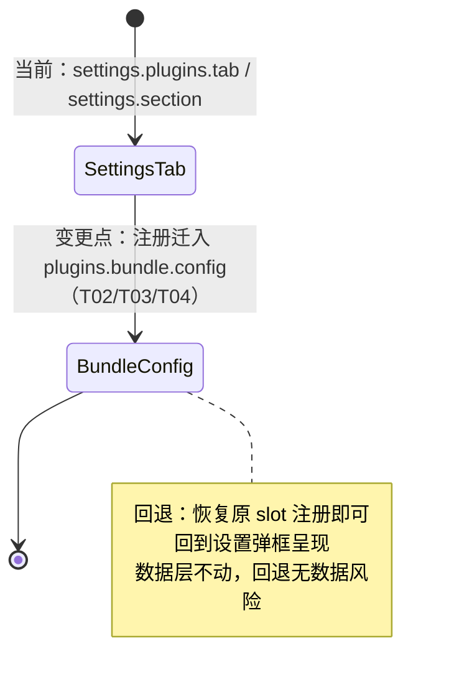
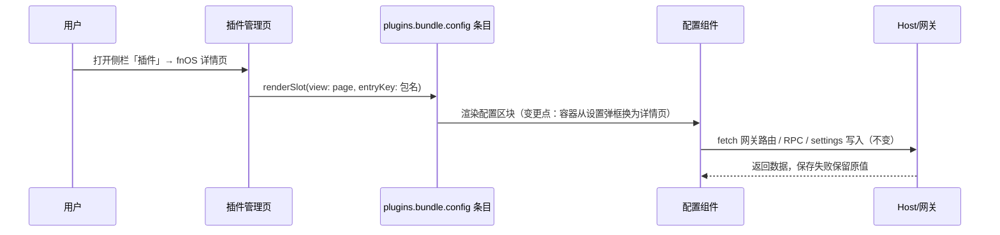
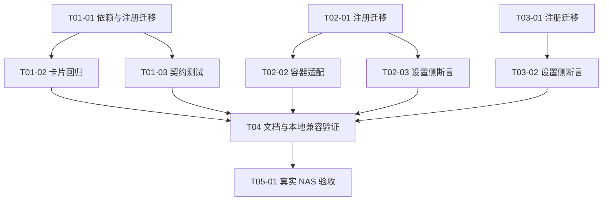

# PLAN-FNOS-008 插件配置统一迁入插件管理页

| 字段 | 内容 |
| --- | --- |
| 计划编号 | PLAN-FNOS-008 |
| 计划日期 | 2026-09-28 |
| 对应需求 | [FNOS-008 插件配置统一迁入插件管理页](/requirements/FNOS-008-plugin-config-in-plugin-manager) |
| 本轮功能 | FNOS-008-01 至 FNOS-008-05 全部进入本轮实施 |
| 上游依据 | 本地 Harness checkout `dsh-v0.1.7-rc.2`（`~/workspace/fork-pj/deepseek-harness`，与依赖版本一致）；官方架构决策「插件页上的插件配置」（2026-09-16）与「设置页作为伴生包」（2026-09-17） |
| 计划状态 | <Badge type="info" text="规划中" /> |

## 计划目标

把三个插件（`dsh-fnos`、`dsh-codebuddy`、`dsh-codex-auth`）的配置界面从设置弹框迁入插件管理页的组合包详情页，实现 FNOS-008-01 至 FNOS-008-05。配置数据的存储、写入路径和用户数据保持不变；迁移完成后设置弹框不再承载任何插件配置。

## 当前实现与目标设计

### 当前 → 目标

| 领域 | 当前实现 | 目标实现 | 迁移影响 |
| --- | --- | --- | --- |
| fnOS 配置入口 | `settings.plugins.tab` 标签页（设置 → 插件 → 授权目录） | `plugins.bundle.config`（key `@tnnevol/dsh-fnos`，插件详情页配置区块） | 组件 props 类型、注册键、契约测试与文档更新；数据读写零改动 |
| CodeBuddy 配置入口 | `settings.section` 导航分区（id `codebuddy`，order 25） | `plugins.bundle.config`（key `@tnnevol/dsh-codebuddy`） | 组件适配详情页容器；`close` 语义改为空操作；数据读写零改动 |
| Codex Auth 配置入口 | `settings.section` 导航分区（id `codex-auth`，order 24） | `plugins.bundle.config`（key `@tnnevol/dsh-codex-auth`） | 同上 |
| 设置弹框插件分区 | 官方只读清单 + fnOS 标签页 + 两个导航分区 | 仅官方只读清单 | 三个注册移除后自动生效，无独立改动 |
| 配置数据 | `dsh-fnos` 命名空间（ConfigForms）、CodeBuddy localStorage/Host RPC、Codex settings 写入 | 不变 | 无数据迁移 |

### 迁移状态图

### 迁移时序（以 fnOS 为例，三个插件同构）

变更点说明：只重新编排配置界面的挂载容器与入口；组件到 Host 的数据交互（网关路由、RPC、settings 写入）全部保持原路径。

## 影响范围分析

| 需求功能 | 代码模块 | 配置/数据 | 测试 | 文档 | 目标环境 |
| --- | --- | --- | --- | --- | --- |
| FNOS-008-01 | `plugins/dsh-fnos-plugin`（client 注册、授权目录卡片） | 无迁移 | 契约测试、卡片行为测试 | `docs/plugins/dsh-fnos.md` | DSH 客户端、真实 NAS |
| FNOS-008-02 | `plugins/dsh-codebuddy-plugin`（client 注册、CodeBuddySection） | 无迁移 | 现有组件测试回归 | `docs/plugins/dsh-codebuddy.md` | DSH 客户端、真实 NAS |
| FNOS-008-03 | `plugins/dsh-codex-auth-plugin`（client 注册、CodexAuthSection） | 无迁移 | 现有组件测试回归 | `docs/plugins/dsh-codex-auth.md` | DSH 客户端、真实 NAS |
| FNOS-008-04 | 由上面三项注册移除自动达成 | 无 | 契约测试断言更新 | 需求/计划/索引 | DSH 客户端 |
| FNOS-008-05 | 无（数据层不动） | 既有配置数据保持 | 升级前后数据对照 | — | 真实 NAS |

不涉及：应用 manifest、wizard、`cmd/` 脚本、网关、FPK 构建门禁、`published-dsh-plugins.json`。

## 源文件与生成产物边界

| 边界 | 内容 |
| --- | --- |
| 允许修改 | 三个插件的 `src/client/index.ts(x)`、对应配置组件、三插件 `package.json`（如需补依赖）、`plugins/*/tests`、`docs/plugins/*.md`、需求/计划/索引文档 |
| 禁止修改 | 上游 checkout；DSH Host/Client 运行时；网关脚本；`pnpm-workspace.yaml` catalog 之外的依赖策略（如需新增 `@deepseek-ai/dsh-client-ui-plugin-manager` 依赖，加入 `catalogs.dsh`，版本 `0.1.7-rc.2`） |
| 构建产物 | 三插件 `lib/`（构建输出，不入库）；FPK 不受影响（插件经 registry 拉取） |

## 技术迁移设计

### 上游接缝事实（已核实）

- 插件管理页（`ui-plugin-manager`）在 `main` 面板下声明 `plugins.bundle.config`（keyed，scope root），owner props 为 `PluginConfigViewProps`：`view: 'summary' | 'page'` 与可选 `form`；bundle 配置仅以 `view: 'page'` 渲染在详情页描述与组件列表之间（`data-plugin-config` 区块），渲染条件是该包名有注册条目（config ledger）。
- 社区 bundle 官方范式：`ctx.slots.inject('plugins.bundle.config', () => ctx.slots.register({ name, key: '<包名>', locale, inject }, 组件))`（上游 voice-input 示例）。
- slot 类型通过 type-only 引入 `@deepseek-ai/dsh-client-ui-plugin-manager/client`（上游 `ui-settings-shell` 同样以 devDependencies 持有该包）；`PropsRuntime` 泛型来自 `@deepseek-ai/dsh-client-ui-slots`。
- `form`（`ConfigPageForm`：`state` + `mutate`）仅在页面接了 settings 命名空间时才有意义；三个插件的配置组件均为自管理状态（fnOS 走网关路由，CodeBuddy 走 RPC + localStorage，Codex Auth 走 settings 写入 RPC），`form` 保持 `undefined`，组件忽略该 prop。
- 浏览器半侧挂载规则：组合包 patch 以裸包名为说明符的根行携带 client 半侧；三个插件均为 `- insert: id/name` 根行，符合条件。插件管理页的已安装分组来自 profile 的用户层插件（`BUILTIN_PROFILE_BUNDLES` 排除的正是 base 等内置行），三个插件会出现并带配置区块。

### 方案选择

**选择：统一迁入 `plugins.bundle.config`。**

- 被否决：CodeBuddy/Codex Auth 迁入 `plugins.item`。该 slot 官方注释标注 OCCUPIED by official settings pages，第三方插件占用与官方归属规则冲突。
- 被否决：保留设置弹框注册形成双入口。官方 ADR 已否决双入口方案，两处状态会漂移；FNOS-008-04 也要求设置侧不再有插件配置入口。
- 被否决：改用 `plugins.row.config`。三个插件的配置对象是组合包整体而非某一行。

### 各插件迁移要点

**dsh-fnos（FNOS-008-01）**

- `src/client/index.ts`：`settings.plugins.tab` 注册（id `dsh-fnos-authorized-directories`，order 100）替换为 `plugins.bundle.config` 注册（key `@tnnevol/dsh-fnos`）。无 `order` 字段需求；label 不再用于导航，卡片标题由组件自带。
- `AuthorizedDirectoriesCard.tsx`：props 类型 `PropsRuntime<'settings.plugins.tab'>` 改为 `PropsRuntime<'plugins.bundle.config'>`（组件忽略 `form`/`view`，只按 page 语义渲染）；卡片结构不变。
- 契约测试 `tests/contracts/package-contract.spec.ts` 与 `tests/client/settings-migration.spec.ts` 的 slot 断言同步更新；`dsh.client.inject` 类型清单补 `@deepseek-ai/dsh-client-ui-plugin-manager`。
- 保留不动：`settings.action`「打开配置文件」、主题桥、输入引用、侧栏动作、iframe 会话头部动作。

**dsh-codebuddy（FNOS-008-02）**

- `src/client/index.tsx`：`settings.section` 注册（id `codebuddy`，order 25）替换为 `plugins.bundle.config`（key `@tnnevol/dsh-codebuddy`）。
- `CodeBuddySection.tsx`：适配详情页容器。要点：
  - `close` 在设置弹框里关闭整个弹框；详情页无弹框语义，改为空操作（保留可选 prop 兼容现有调用点）。
  - 自有滚动：区块在设置弹框中依赖弹框内容区滚动；详情页区块高度不受限，组件根节点需要自身最大高度与滚动（参考现组件在设置页的高度约束写法）。
  - 标题：`settings.section` 的 `label` 不复存在，组件内部已有的「CodeBuddy」标题/区块头保留。
- 全页面账号管理面板（`shell.overlay` hash 路由）与对话输入区用量指示器不动；`panelRoute.open('accounts')` 的入口从详情页区块进入。
- 现有测试以组件行为为主，逐个跑通即可；`close` 语义变化不涉及断言（`close?.()` 调用点保留）。

**dsh-codex-auth（FNOS-008-03）**

- `src/client/index.tsx`：`settings.section` 注册（id `codex-auth`，order 24）替换为 `plugins.bundle.config`（key `@tnnevol/dsh-codex-auth`）。
- `CodexAuthSection.tsx`：适配详情页容器，要点同 CodeBuddy（无 `close` 依赖，标题自带）。
- 对话输入区用量状态（`conversation.input.right`）不动。

**设置弹框最终形态（FNOS-008-04）**

- 三个注册移除后，「设置 → 插件」只剩官方清单标签页；官方内置配置页在侧栏插件页，不受影响。
- fnOS iframe 下的 `settings.action`「打开配置文件」属于设置弹框头部动作，保留。

## 分阶段任务

### 阶段一：dsh-fnos 迁移（T01–T03）

| 任务 ID | 对应需求/验收 | 修改内容 | 前置条件 | 验证方式 |
| --- | --- | --- | --- | --- |
| PLAN-FNOS-008-T01-01 | FNOS-008-01 / AC-01–03 | 补充插件类型依赖：`package.json` 增加 `@deepseek-ai/dsh-client-ui-plugin-manager: catalog:dsh`（并在 `pnpm-workspace.yaml` 的 `catalogs.dsh` 登记 `0.1.7-rc.2`）；client 注册从 `settings.plugins.tab` 换为 `plugins.bundle.config`（key `@tnnevol/dsh-fnos`）；卡片 props 类型同步 | 无 | 插件构建通过；本地 `dsh web` 详情页出现授权目录区块 |
| PLAN-FNOS-008-T01-02 | FNOS-008-01 / AC-01–02 | 卡片行为适配与回归：确认添加/删除/刷新/保存失败保护在详情页容器中不变 | T01-01 | 插件单测 + 本地交互走查 |
| PLAN-FNOS-008-T01-03 | FNOS-008-01-AC-03、FNOS-008-04-AC-01 | 契约测试更新：`package-contract.spec.ts`、`settings-migration.spec.ts` 的 slot 与 inject 断言改为 `plugins.bundle.config` | T01-01 | `pnpm --filter @tnnevol/dsh-fnos test`（或对应 vitest 过滤）通过 |

### 阶段二：CodeBuddy 迁移（T02-01–T02-03）

| 任务 ID | 对应需求/验收 | 修改内容 | 前置条件 | 验证方式 |
| --- | --- | --- | --- | --- |
| PLAN-FNOS-008-T02-01 | FNOS-008-02 / AC-01 | 注册迁移：`settings.section` → `plugins.bundle.config`（key `@tnnevol/dsh-codebuddy`）；类型依赖与 inject 清单同 T01-01 | 无 | 插件构建通过 |
| PLAN-FNOS-008-T02-02 | FNOS-008-02 / AC-01–02 | 容器适配：`close` 空操作、根节点滚动约束、账号管理面板入口回归 | T02-01 | 现有组件测试全绿 + 本地交互走查（登录弹窗、面板打开） |
| PLAN-FNOS-008-T02-03 | FNOS-008-02-AC-03、FNOS-008-04-AC-01 | 设置侧栏无 CodeBuddy 分区的断言与回归 | T02-01 | 测试通过；设置弹框走查 |

### 阶段三：Codex Auth 迁移（T03-01–T03-02）

| 任务 ID | 对应需求/验收 | 修改内容 | 前置条件 | 验证方式 |
| --- | --- | --- | --- | --- |
| PLAN-FNOS-008-T03-01 | FNOS-008-03 / AC-01 | 注册迁移与类型依赖（同 T02-01 模式） | 无 | 插件构建通过 |
| PLAN-FNOS-008-T03-02 | FNOS-008-03-AC-02、FNOS-008-04-AC-01 | 设置侧栏无 Codex Auth 分区的断言与回归 | T03-01 | 测试通过；设置弹框走查 |

### 阶段四：文档与索引（T04-01–T04-03）

| 任务 ID | 对应需求/验收 | 修改内容 | 前置条件 | 验证方式 |
| --- | --- | --- | --- | --- |
| PLAN-FNOS-008-T04-01 | FNOS-008-01–03 | 更新 `docs/plugins/dsh-fnos.md`、`dsh-codebuddy.md`、`dsh-codex-auth.md` 的配置入口说明与截图 | 阶段一–三完成 | 文档构建通过 |
| PLAN-FNOS-008-T04-02 | FNOS-008-04 | 需求/计划索引登记 FNOS-008/PLAN-FNOS-008 | 需求、计划创建时 | `pnpm run doc-sync` / 站内链接检查 |
| PLAN-FNOS-008-T04-03 | FNOS-008-05 | 本地升级兼容验证：升级前后配置数据对照 | 阶段一–三完成 | 本地证据登记 `docs/validation/` |

### 阶段五：真实 NAS 验收（T05-01）

| 任务 ID | 对应需求/验收 | 修改内容 | 前置条件 | 验证方式 |
| --- | --- | --- | --- | --- |
| PLAN-FNOS-008-T05-01 | FNOS-008-05 / AC-01–03 及各功能 AC | 构建 FPK，在真实 NAS 完成安装、升级、配置读写、保存失败保护与禁用/启用循环验收 | 阶段一–四完成 | NAS 证据登记 `docs/validation/` |

### 任务依赖

三个插件的迁移相互独立，可并行实施；文档与 NAS 验收在迁移完成后执行。

## 交互和行为设计

### 插件详情页配置区块（通用）

- 入口：侧栏「插件」→ 已安装分组 → 对应组合包卡片 → 详情页；配置区块位于描述与「组件」列表之间。
- 渲染：`view: 'page'`；三插件组件均为自管理状态，不消费 `form`。
- 启停联动：插件行关闭后浏览器半侧卸载，配置区块消失；重新启用后恢复（上游既定行为，FNOS-008-05-AC-03 验证）。

### fnOS 授权目录卡片

- 操作保持：查看列表、添加（fnOS 目录选择器）、删除、刷新、保存；保存失败提示沿用现有文案。
- 「打开配置文件」仍在设置弹框头部动作，不迁。

### CodeBuddy 区块

- 登录、账号管理、自动切换/签到/旅行开关、额度刷新操作不变；`close` 空操作后，从详情页进入管理面板（`panelRoute.open('accounts')`）不再关闭设置弹框，行为自然成立。
- 区块根节点增加滚动约束（详情页无外层滚动容器时保证可用）。

### Codex Auth 区块

- 登录、全局模型选择与保存、模型目录刷新操作不变；登录窗口生命周期管理不动。

## 数据、权限和错误处理

- 不新增持久化；不改变既有写入路径（`dsh-fnos` settings 命名空间、CodeBuddy localStorage + Host RPC、Codex settings 写入 RPC）。
- 保存失败保护不变：失败时保留原值（对齐 `FNOS-007-03-AC-04`）。
- 权限无变化：不新增 Host 服务、网关路由或 fnOS 权限。

## 依赖、风险和决策

| 项 | 内容 | 应对 |
| --- | --- | --- |
| 上游事实 | 插件管理页、`plugins.bundle.config`、`PluginConfigViewProps`、config ledger 渲染条件均已在本地 checkout `dsh-v0.1.7-rc.2` 源码核实 | 无需待验证；升级上游时关注 slot 契约变化 |
| 风险：CodeBuddy/Codex Auth 区块在详情页容器中的布局差异（原为整屏设置分区，现为嵌入区块） | 组件原样式按设置分区宽度设计 | 保留组件区块宽度自适应；交互走查覆盖窄宽度场景；必要时加容器内边距 |
| 风险：`close` 语义变化遗漏调用点 | 两个调用点已知（面板入口、取消登录） | 保留可选 prop，类型检查兜底 |
| 决策：不动 `settings.action`「打开配置文件」 | 属设置弹框头部动作，与插件配置迁移无关 | — |
| 决策：不为无配置插件新增配置页 | FNOS-008 明确排除 | — |
| 回滚 | 恢复原 slot 注册并重新构建发布插件；数据层不动，回退无数据风险 | 按插件独立回滚 |

## 测试、打包、发布和回滚

- **包级**：三插件 typecheck、单测、构建（`lib/` 产物新鲜）；`client.js` 产物确认包含 `plugins.bundle.config` 注册、不再包含旧注册。
- **应用级（本地）**：`dsh plugin add` 链接三插件构建产物启动本地 `dsh web`：详情页配置区块可见可用；设置弹框无插件配置入口；官方配置页正常。
- **FPK**：本需求不修改 FPK 结构，按现有流程构建冒烟即可；插件经 registry 拉取，无需重发 FPK（版本号随插件版本升级）。
- **真实 NAS**：安装/升级后完成 FNOS-008 全部 AC；升级前后配置数据对照（FNOS-008-05）。
- **文档**：`pnpm run doc-sync` 与站内链接检查。
- **回滚**：单插件可独立回滚到原注册；禁止删除任何用户配置数据。

## 参考资料

- 官方架构决策：`.agents/notes/implemented/architecture/2026-09-16-plugin-configuration-on-the-plugins-page.zh.md`（上游仓库）
- 官方架构决策：`.agents/notes/implemented/architecture/2026-09-17-settings-pages-as-companion-packages.zh.md`（上游仓库）
- 上游插件管理页：`packages/client/ui-plugin-manager/src/client/PluginManagerPage.tsx`、`slot-contract.ts`、`config-ledger.ts`
- 上游社区 bundle 配置范式：`packages/experimental/client-ui-voice-input/src/client/mount.ts`
- 上游 cookbook：`docs/cookbook/adding-a-settings-card.zh.md`
- 本仓库需求：FNOS-007-03/09（迁移不改写入路径的先例与约束）

## 完成状态

| 阶段 | 状态 |
| --- | --- |
| 阶段一：dsh-fnos 迁移 | <Badge type="info" text="规划中" /> |
| 阶段二：CodeBuddy 迁移 | <Badge type="info" text="规划中" /> |
| 阶段三：Codex Auth 迁移 | <Badge type="info" text="规划中" /> |
| 阶段四：文档与索引 | <Badge type="info" text="规划中" /> |
| 阶段五：真实 NAS 验收 | <Badge type="info" text="规划中" /> |

## 变更记录

| 日期 | 变更 | 说明 |
| --- | --- | --- |
| 2026-09-28 | 初始计划 | 建立 PLAN-FNOS-008，覆盖 FNOS-008-01 至 FNOS-008-05；上游接缝事实已在 `dsh-v0.1.7-rc.2` checkout 核实。 |
