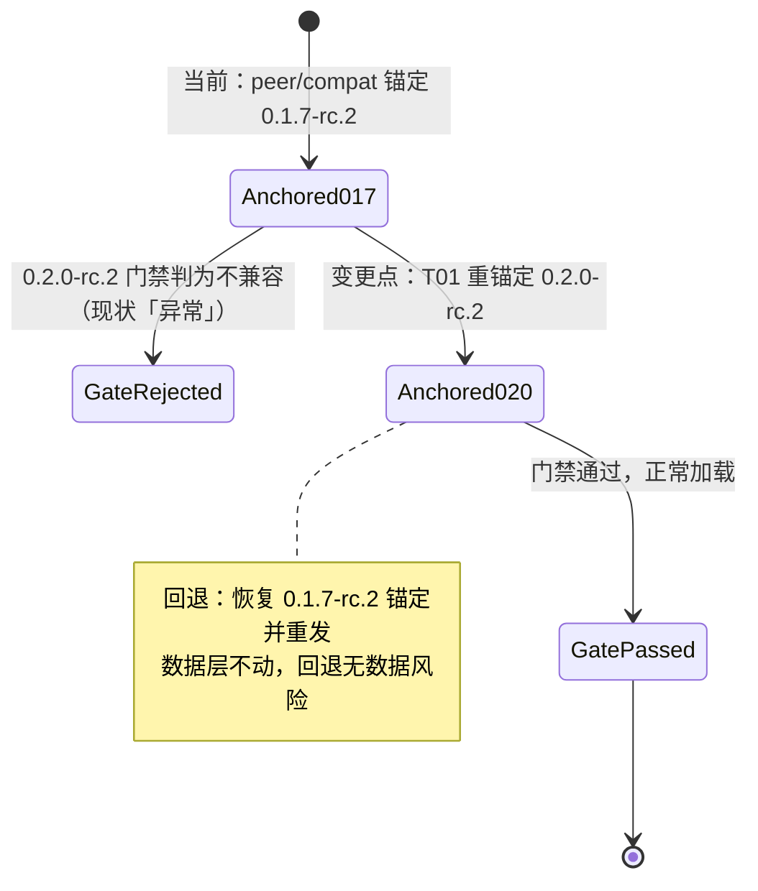
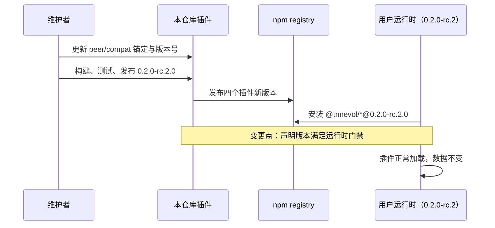
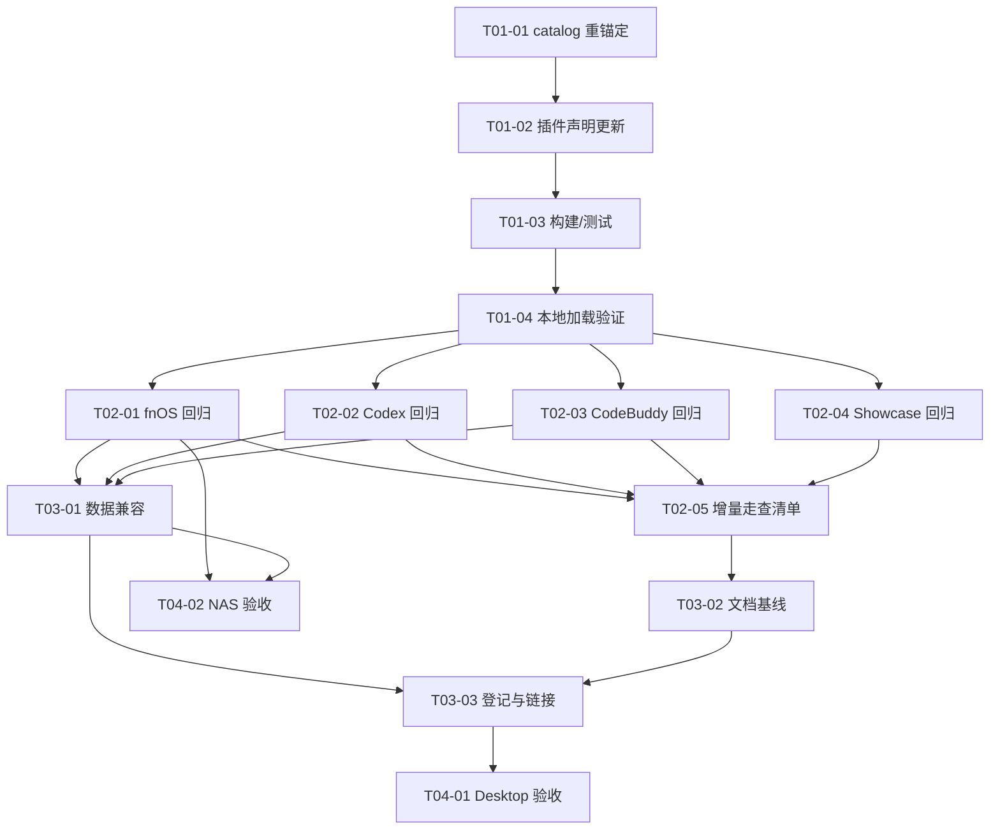

# PLAN-FNOS-009 DSH 0.2.0-rc.2 插件适配

| 字段 | 内容 |
| --- | --- |
| 计划编号 | PLAN-FNOS-009 |
| 计划日期 | 2026-09-30 |
| 对应需求 | [FNOS-009 DSH 0.2.0-rc.2 插件适配](/requirements/FNOS-009-dsh-020-rc2-adaptation) |
| 本轮功能 | FNOS-009-01 至 FNOS-009-08 全部进入本轮实施 |
| 上游依据 | 本地 Harness checkout `dsh-v0.2.0-rc.2`（`~/workspace/fork-pj/deepseek-harness`）；与 `dsh-v0.1.7-rc.2` 的全量源码对比 |
| 计划状态 | <Badge type="info" text="规划中" /> |

## 计划目标

把四个插件（`dsh-fnos`、`dsh-codex-auth`、`dsh-codebuddy`、`dsh-semi-ui-showcase`）的 DSH 依赖锚定与兼容声明从 `0.1.7-rc.2` 迁移到 `0.2.0-rc.2`，使插件通过新运行时的加载门禁并保持既有功能与用户数据不变，实现 FNOS-009-01 至 FNOS-009-08。

## 当前实现与目标设计

### 兼容门禁机制（已在 `dsh-v0.2.0-rc.2` 源码核实）

- `packages/boot/app-boot/src/plugin-compatibility.ts`：对插件 `peerDependencies` 中所有 `@deepseek-ai/dsh` / `@deepseek-ai/dsh-*` 依赖逐项 `semver.satisfies(runtimeVersion, range, { includePrerelease: true })`；任一不满足即判为不兼容插件，在插件管理页显示「异常」。`workspace:^`、`workspace:~`、`workspace:*` 视为指向当前运行时。
- 插件侧的 `compatibility.json` 是本仓库自维护的清单（`dshPluginApi.packages` 列出插件使用的 DSH 包；Codex Auth 额外有 `piAi` 段），需要与 `peerDependencies` 同步重锚定。
- 精确版本豁免走 `dsh plugin allow-version`（profile 级 `compatibility.json`），仅作应急手段，不作为本次适配方式。

### 当前 → 目标

| 领域 | 当前实现 | 目标实现 | 迁移影响 |
| --- | --- | --- | --- |
| 依赖锚定 | 四插件 `peerDependencies` + `catalogs.dsh` 锚定 `0.1.7-rc.2` | 全部锚定 `0.2.0-rc.2` | lockfile 重解析；插件重构建 |
| 兼容声明 | 四插件 `compatibility.json` 声明 `0.1.7-rc.2` | 声明 `0.2.0-rc.2`；Codex Auth `piAi.version` 同步 `0.87.1` | 与 peer 清单一致性测试更新 |
| 插件版本号 | `0.1.7-rc.2.1` | `0.2.0-rc.2.0` | 文档、安装命令同步 |
| pi-ai 基线 | `0.85.1` | `0.87.1`（随 `dsh-llm-pi-ai`） | catalog conflicts 段与 `minimumReleaseAgeExclude` 同步 |
| 插件接缝代码 | 基于 `0.1.7-rc.2` 接缝 | 保持既有接缝用法；增量变化按验证结果处置 | 预期无结构性修改 |

### 上游两版本对比结论（差异核实记录）

以下为 `dsh-v0.1.7-rc.2..dsh-v0.2.0-rc.2` 源码对比中与四插件相关的全部结论：

| 检查项 | 结论 | 对插件的影响 |
| --- | --- | --- |
| 包存续 | 无任何 `package.json` 删除；四插件依赖的全部官方包存在 | 仅版本重锚定 |
| node-pty | 仍为 `node-pty@1.2.0-beta.15`，`patches/node-pty@1.2.0-beta.15.patch` 不变；`allowBuilds.node-pty` 语义一致 | 无补丁适配 |
| `dsh-llm` / `dsh-attachment` / `dsh-settings` / `dsh-credentials` / `dsh-home-paths` / `dsh-atomic-write` / `dsh-host-webserver` / `dsh-session` | 源码零变化（仅版本号） | 无 |
| `dsh-client-ui-slots` / `ui-session` / `ui-input-trigger` / `ui-settings` / `ui-settings-plugins` | 源码零变化（仅版本号） | 无 |
| `dsh-client-connection` / `dsh-client-locale` | 仅 package.json 版本变化 | 无 |
| `dsh-llm-pi-ai` | pi-ai `0.85.1 → 0.87.1`；`catalog.ts` 兼容门禁表增删字段；`PiAiAdapter`、`ResolvedPiAiProviderProfile` 导出不变 | Codex Auth 声明同步；回归验证模型目录 |
| `dsh-client-ui-renderer` | `scoped-slots.tsx` 仅将 `nextAncestors` 提前构造（修复递归检查时机） | 无接口变化；回归验证插槽渲染 |
| `dsh-client-ui-conversation` | `submit()` 新增可选 `source` 参数；新增 `MessageSubmission` 事件载荷与可选回调；输入条点击提交改传 `'click'` | 可选参数，无破坏；回归验证用量指示器与输入触发 |
| `dsh-client-ui-plugin-manager` | 新增刷新 toast（注入 `shell.overlay`）、手动刷新 spinner、`'shipped'` 安装拒绝类型、安装输入脱敏上报 | 插件配置区块挂载的 `plugins.bundle.config` 接缝未变；回归验证详情页 |
| `dsh-client-ui-commands` | `SelectOption` 新增可选 `group`、`PopupSelectSpec` 新增可选 `searchMode`/`searchLabels` | 可选字段，无破坏 |
| `dsh-client-ui-primitives` | 新增 `MenuGroup`、`pointerModality` 导出；若干样式调整 | 增量导出，无破坏 |
| `dsh-client-ui-theme` | 字号范围 `12–17 → 10–22`；新增平台样式文件 | 行为宽松化，无破坏 |
| `dsh-client-ui-workspace` | `SessionRowOwnerProps.displayTitle` 语义改为「无持久化标题时为空串」；`forkSession` 新增可选 `onCreated` 回调 | fnOS 插件不消费这两个接缝；确认无引用即可 |
| `dsh-client-ui-layout` / `ui-sidebar` | 样式与索引导出微调 | 回归验证 |
| `dsh-api-remotes` | 远端清单新增 product-analytics、user-questions 贡献 | 插件既有远端挂载方式不变 |
| `dsh-api-session-controller` | `fork` 新增可选 `onCreated`；服务实现调整 | Codex Auth 未使用该接口；确认无引用 |
| 官方 catalog | `@deepseek-ai/dsh`、koffi 等版本对齐 `0.2.0-rc.2`；pi-ai `0.87.1` | 本仓库 `catalogs.dsh` 全量同步 |

### 迁移状态图

### 迁移时序

## 影响范围分析

| 需求功能 | 代码模块 | 配置/数据 | 测试 | 文档 | 目标环境 |
| --- | --- | --- | --- | --- | --- |
| FNOS-009-01 | 四插件 `package.json`、`compatibility.json`、根 `pnpm-workspace.yaml` | 无迁移 | 各插件契约测试（锚定断言） | `docs/plugins/index.md` | DSH Web、DSH Desktop |
| FNOS-009-02 | `plugins/dsh-fnos-plugin`（如接缝适配需要） | 授权目录数据保持 | 插件现有测试回归 | `docs/plugins/dsh-fnos.md` | DSH Web、真实 NAS |
| FNOS-009-03 | `plugins/dsh-codex-auth-plugin`（pi-ai 声明；如接缝适配需要） | OAuth 凭据、模型配置保持 | 插件现有测试回归 | `docs/plugins/dsh-codex-auth.md` | DSH Web、DSH Desktop |
| FNOS-009-04 | `plugins/dsh-codebuddy-plugin`（如接缝适配需要） | 账号、偏好、统计数据保持 | 插件现有测试回归 | `docs/plugins/dsh-codebuddy.md` | DSH Web、DSH Desktop |
| FNOS-009-05 | `plugins/dsh-semi-ui-showcase-plugin` | 无 | 插件现有测试回归 | — | DSH Web、DSH Desktop |
| FNOS-009-06 | 无（数据层不动） | 升级前后对照 | 升级兼容走查 | — | fnOS 部分：NAS；其他：Web、Desktop |
| FNOS-009-07 | 按验证结论定位（预期无需修改） | 无 | 回归走查 | — | DSH Web、DSH Desktop |
| FNOS-009-08 | `docs/plugins/*.md`、`docs/plugins/index.md`、`docs/apps/fn-deepseek-harness.md` | 无 | 文档构建 | 全部插件文档 | 文档站 |

不涉及：应用 manifest、FPK 构建、网关、安装脚本、node-pty 补丁。

## 源文件与生成产物边界

| 边界 | 内容 |
| --- | --- |
| 允许修改 | 四插件 `package.json`、`compatibility.json`、`pnpm-workspace.yaml`（`catalogs.dsh`、`minimumReleaseAgeExclude`、`conflicts_*` 段）、四插件 `src/`（仅在验证发现接缝破损时最小修改）、`plugins/*/tests`、`docs/plugins/*.md`、`docs/apps/fn-deepseek-harness.md`、需求/计划/索引文档 |
| 禁止修改 | 上游 checkout `~/workspace/fork-pj/deepseek-harness`；DSH Host/Client 运行时；node-pty 补丁；应用与 FPK 结构 |
| 构建产物 | 四插件 `lib/`（构建输出，不入库） |

## 技术迁移设计

### T01 版本重锚定（核心任务）

1. 根 `pnpm-workspace.yaml`：`catalogs.dsh` 全部条目 `0.1.7-rc.2 → 0.2.0-rc.2`；顶层 `@deepseek-ai/dsh` 同步；`minimumReleaseAgeExclude` 中 `0.1.7-rc.2` 条目替换为 `0.2.0-rc.2`（保留结构）；Codex Auth 相关的 `conflicts_@earendil-works/pi-ai_h0_85_1` 段按新 catalog 实际形态更新（pi-ai `0.87.1`）。
2. 四插件 `package.json`：`version → 0.2.0-rc.2.0`；`peerDependencies` 与 `devDependencies` 中所有 `0.1.7-rc.2` 精确锚定与 `catalog:dsh` 引用随 catalog 生效。
3. 四插件 `compatibility.json`：`dshPluginApi.version → 0.2.0-rc.2`；Codex Auth `piAi.version → 0.87.1`。
4. `pnpm install` 重新解析 lockfile；四插件构建。

### 接缝适配预案（仅在验证发现破损时执行）

上游对比未发现破坏性接口变化，但以下点在目标运行时回归时优先检查；出现实际破损再登记任务处置，不做预防性重构：

- `ui-conversation` 输入接缝：fnOS 输入触发器与 CodeBuddy/Codex 用量指示器的挂载。
- `ui-plugin-manager` 详情页：三个插件配置区块渲染（`plugins.bundle.config` / `plugins.detail.section` 接缝未变，但页面新增 toast 注入 `shell.overlay`，确认无座位冲突）。
- `llm-pi-ai`：Codex Auth 适配器在新 pi-ai `0.87.1` 上的模型目录与请求行为。
- `ui-workspace.displayTitle` 空串语义：确认 fnOS 无消费点。

### 方案选择

**选择：版本重锚定 + 验证驱动的小步适配。**

- 被否决：`dsh plugin allow-version` 豁免。豁免是运行时应急手段，不解决发布物的正确性，且要求用户手动操作。
- 被否决：预防性跟随上游全部新增能力（提交分析、弹层分组等）。无需求拉动，徒增验证面；且需求明确不引入。
- 被否决：大版本内逐插件错峰发布。四插件无相互依赖，统一版本号 `0.2.0-rc.2.0` 降低文档与支持成本。

## 分阶段任务

### 阶段一：版本重锚定与构建（T01-01–T01-04）

| 任务 ID | 对应需求/验收 | 修改内容 | 前置条件 | 验证方式 |
| --- | --- | --- | --- | --- |
| PLAN-FNOS-009-T01-01 | FNOS-009-01 / AC-01 | 根 `pnpm-workspace.yaml`：`catalogs.dsh` 全量 `0.2.0-rc.2`、顶层 `@deepseek-ai/dsh`、`minimumReleaseAgeExclude`、pi-ai conflicts 段 | 无 | `pnpm install` 成功，lockfile 中无 `0.1.7-rc.2` 残留锚定 |
| PLAN-FNOS-009-T01-02 | FNOS-009-01 / AC-01 | 四插件 `package.json`：`version 0.2.0-rc.2.0`、peer/dev 依赖锚定更新；`compatibility.json`：`dshPluginApi.version`、Codex `piAi.version` | T01-01 | 各插件契约测试的锚定断言通过 |
| PLAN-FNOS-009-T01-03 | FNOS-009-01 / AC-01 | 四插件全量构建与测试 | T01-02 | `pnpm --filter '@tnnevol/*' run check` 全绿 |
| PLAN-FNOS-009-T01-04 | FNOS-009-01 / AC-01 | 本地 DSH `0.2.0-rc.2` Web profile 安装四插件构建产物 | T01-03 | 插件管理页四插件无「异常」，详情页可打开 |

### 阶段二：功能回归与接缝适配（T02-01–T02-05）

| 任务 ID | 对应需求/验收 | 修改内容 | 前置条件 | 验证方式 |
| --- | --- | --- | --- | --- |
| PLAN-FNOS-009-T02-01 | FNOS-009-02 / AC-01–03 | fnOS 插件回归：主题、授权目录、工作区/文件、日志导出；确认 `displayTitle` 无消费点 | T01-04 | Web 走查；发现破损时最小修复并补测试 |
| PLAN-FNOS-009-T02-02 | FNOS-009-03 / AC-01–03 | Codex Auth 回归：登录、模型目录同步（pi-ai 0.87.1）、用量 | T01-04 | Web 走查 + 真实账号；发现破损时最小修复 |
| PLAN-FNOS-009-T02-03 | FNOS-009-04 / AC-01–02 | CodeBuddy 回归：登录、账号管理、自动切换、额度、Token 统计 | T01-04 | Web 走查 + 真实账号；发现破损时最小修复 |
| PLAN-FNOS-009-T02-04 | FNOS-009-05 / AC-01 | Semi UI Showcase 回归：组件渲染 | T01-04 | Web 走查 |
| PLAN-FNOS-009-T02-05 | FNOS-009-07 / AC-01–02 | 上游增量变化走查清单核对（插件管理页反馈、弹层交互、会话行标题、字号范围）；异常项登记处置结论 | T02-01–04 | 走查记录；无异常即关闭，异常项修复后关闭 |

### 阶段三：数据兼容与文档（T03-01–T03-03）

| 任务 ID | 对应需求/验收 | 修改内容 | 前置条件 | 验证方式 |
| --- | --- | --- | --- | --- |
| PLAN-FNOS-009-T03-01 | FNOS-009-06 / AC-01–02 | 升级兼容走查：`0.1.7-rc.2` profile 数据 → 安装新插件 → 数据保持 | T02-01–03 | 升级前后配置对照记录 |
| PLAN-FNOS-009-T03-02 | FNOS-009-08 / AC-01 | 文档版本基线更新：`docs/plugins/index.md`、各插件文档安装命令、`docs/apps/fn-deepseek-harness.md` 插件表 | T01-03 | 文档构建通过 |
| PLAN-FNOS-009-T03-03 | FNOS-009-01–08 | 需求/计划/索引登记与链接检查 | T03-01、T03-02 | 站内链接有效 |

### 阶段四：目标环境验收（T04-01–T04-02）

| 任务 ID | 对应需求/验收 | 修改内容 | 前置条件 | 验证方式 |
| --- | --- | --- | --- | --- |
| PLAN-FNOS-009-T04-01 | FNOS-009-01、03、04、05、06、07 | DSH Desktop 验收：四插件加载、详情页、登录/账号/模型/用量、数据保持 | 阶段一–三完成 | Desktop 证据登记 `docs/validation/` |
| PLAN-FNOS-009-T04-02 | FNOS-009-02、FNOS-009-06（fnOS 部分） | 真实 NAS 验收：fnOS 主题、授权目录、文件能力与数据保持 | T02-01、T03-01 | NAS 证据登记 `docs/validation/` |

### 任务依赖

## 交互和行为设计

本次不改变任何用户可见交互。验证走查以 FNOS-007/FNOS-008 已验收行为为基线：插件管理页状态、详情页配置区块、登录流程、额度与统计呈现、授权目录操作、日志导出全部按既有行为比对。

## 数据、权限和错误处理

- 不新增持久化；不改写任何既有数据文件。升级只替换插件代码与声明。
- 权限无变化：不新增 fnOS 权限或宿主授权范围。
- 若新运行时上出现插件加载失败，回退方案是恢复 `0.1.7-rc.2` 锚定重发（用户侧已有数据不受影响）；禁止用数据清理作为恢复手段。

## 依赖、风险和决策

| 项 | 内容 | 应对 |
| --- | --- | --- |
| 上游事实 | 门禁机制、两版本差异、包存续、node-pty 不变性均已在 `dsh-v0.2.0-rc.2` checkout 源码核实 | 标注为已核实；无需待验证 |
| 风险：上游增量变化在运行时组合中产生未预期回归（源码对比无法覆盖运行时行为） | 以 T02 走查清单逐项核对 | 发现即最小修复 + 补测试；无法快速修复的项登记处置结论 |
| 风险：pi-ai `0.85.1 → 0.87.1` 行为差异影响 Codex 模型目录 | 上游 `llm-pi-ai` 导出未变 | T02-02 真实账号回归模型目录同步 |
| 风险：lockfile 重解析引入非预期依赖漂移 | catalog 精确版本锚定 | T01-01 校验 lockfile 无 `0.1.7-rc.2` 残留 |
| 决策：插件版本号 `0.2.0-rc.2.0` | 用户指定，延续 `<运行时版本>.<修订>` 规则 | — |
| 决策：不引入上游新增能力 | FNOS-009 明确排除 | — |
| 回滚 | 恢复 `0.1.7-rc.2` 锚定并重发旧版本号分支；数据层不动 | 按插件独立回滚 |

## 测试、打包、发布和回滚

- **包级**：四插件 typecheck、单测、构建（`lib/` 产物新鲜）；锚定断言测试（`compatibility.json` 与 peer 一致性）随 T01-02 更新。
- **DSH Web**：本地 `0.2.0-rc.2` Web profile 安装四插件，T01-04/T02 走查；这是接缝适配的主验证场。
- **DSH Desktop**：T04-01 目标环境验收。
- **真实 NAS**：T04-02 仅覆盖 fnOS 插件与其数据保持；不把其他插件列入 NAS 阻塞。
- **发布**：四插件以 `0.2.0-rc.2.0` 发布 npm；文档同步。FPK 不受影响（插件经 registry 拉取）。
- **回滚**：单插件可独立回滚到旧锚定重发；禁止删除任何用户配置数据。

## 参考资料

- 上游 checkout：`~/workspace/fork-pj/deepseek-harness`（`dsh-v0.2.0-rc.2`，已切到指定版本）
- 兼容门禁：`packages/boot/app-boot/src/plugin-compatibility.ts`、`profile-compatibility.ts`
- 两版本差异核实：`git diff dsh-v0.1.7-rc.2..dsh-v0.2.0-rc.2`（结论已汇总于本计划「上游两版本对比结论」）
- node-pty：`patches/node-pty@1.2.0-beta.15.patch`（两版本一致，无适配）
- 本仓库需求：FNOS-007（上一轮依赖基线建立）、FNOS-008（插件详情页接缝与 Desktop 结论）

## 完成状态

| 阶段 | 状态 |
| --- | --- |
| 阶段一：版本重锚定与构建 | <Badge type="info" text="规划中" /> |
| 阶段二：功能回归与接缝适配 | <Badge type="info" text="规划中" /> |
| 阶段三：数据兼容与文档 | <Badge type="info" text="规划中" /> |
| 阶段四：目标环境验收 | <Badge type="info" text="规划中" /> |

## 变更记录

| 日期 | 变更 | 说明 |
| --- | --- | --- |
| 2026-09-30 | 初始计划 | 建立 PLAN-FNOS-009，覆盖 FNOS-009-01 至 FNOS-009-08；门禁机制与两版本差异已在 `dsh-v0.2.0-rc.2` checkout 源码核实。插件版本号按用户决定取 `0.2.0-rc.2.0`。 |
