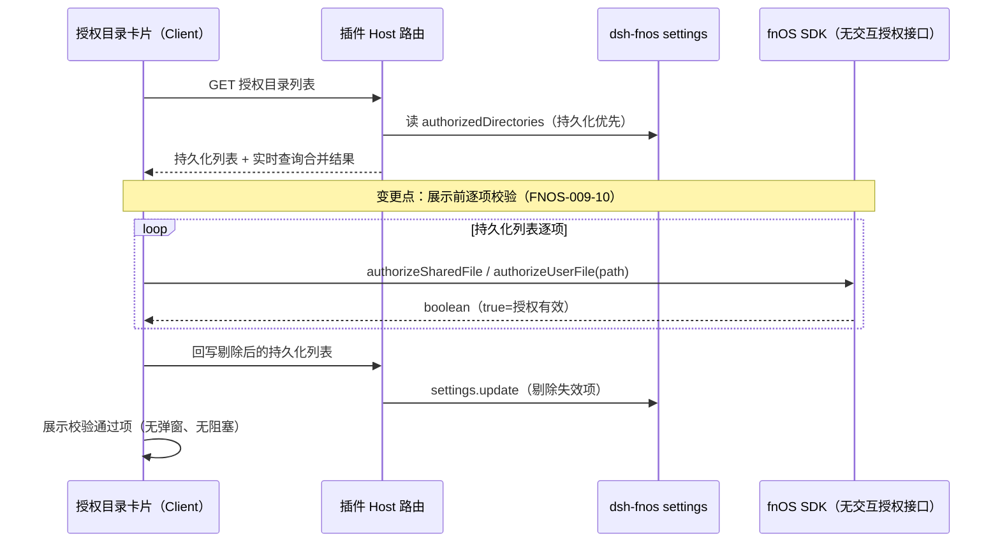
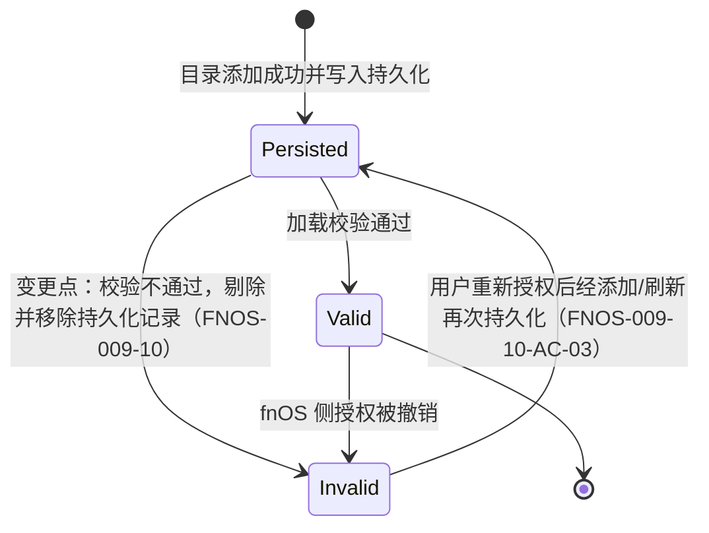
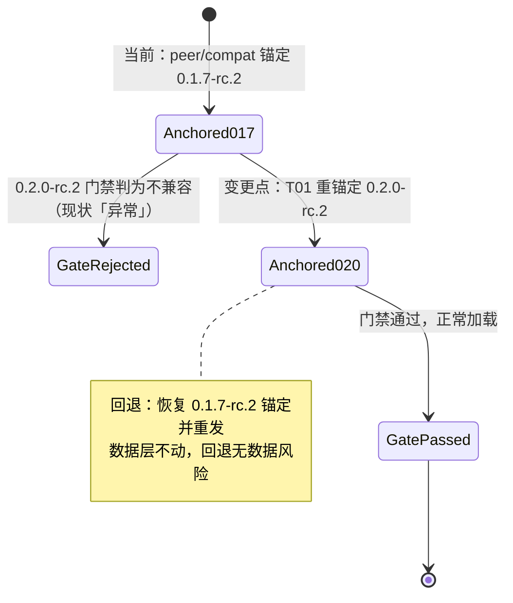
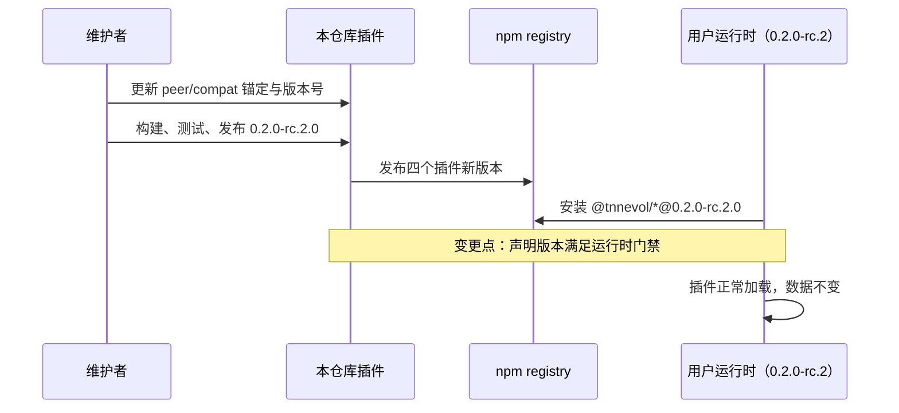
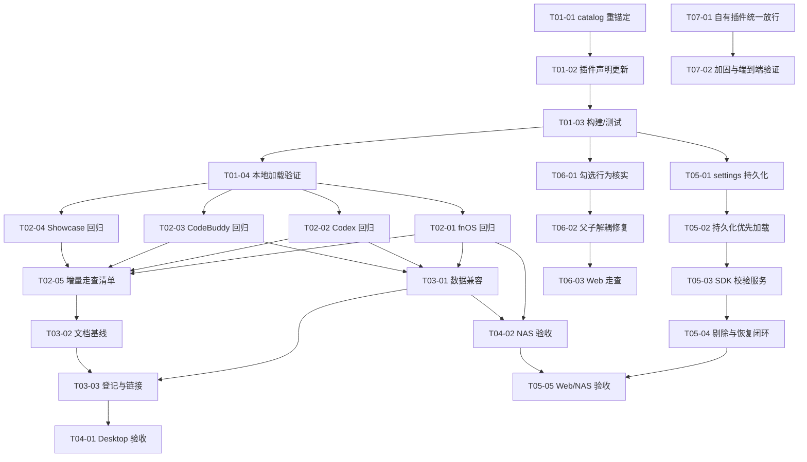

# PLAN-FNOS-009 DSH 0.2.0-rc.2 插件适配

| 字段 | 内容 |
| --- | --- |
| 计划编号 | PLAN-FNOS-009 |
| 计划日期 | 2026-09-30 |
| 对应需求 | [FNOS-009 DSH 0.2.0-rc.2 插件适配](/requirements/FNOS-009-dsh-020-rc2-adaptation) |
| 本轮功能 | FNOS-009-01 至 FNOS-009-12 全部进入本轮实施 |
| 上游依据 | 本地 Harness checkout `dsh-v0.2.0-rc.2`（`~/workspace/fork-pj/deepseek-harness`）；与 `dsh-v0.1.7-rc.2` 的全量源码对比；`@trimjs/web-app` SDK 类型与实现源码（插件 `node_modules` 内 `dist/index.js`、`dist/*.d.ts`） |
| 计划状态 | <Badge type="info" text="规划中" /> |

## 计划目标

把四个插件（`dsh-fnos`、`dsh-codex-auth`、`dsh-codebuddy`、`dsh-semi-ui-showcase`）的 DSH 依赖锚定与兼容声明从 `0.1.7-rc.2` 迁移到 `0.2.0-rc.2`，使插件通过新运行时的加载门禁并保持既有功能与用户数据不变，实现 FNOS-009-01 至 FNOS-009-08；同时实现 FNOS-009-09/10：fnOS 插件授权目录列表持久化（持久化优先展示）、基于 fnOS SDK 无交互授权接口的权限校验与失效剔除。

## 当前实现与目标设计

### 兼容门禁机制（已在 `dsh-v0.2.0-rc.2` 源码核实）

- `packages/boot/app-boot/src/plugin-compatibility.ts`：对插件 `peerDependencies` 中所有 `@deepseek-ai/dsh` / `@deepseek-ai/dsh-*` 依赖逐项 `semver.satisfies(runtimeVersion, range, { includePrerelease: true })`；任一不满足即判为不兼容插件，在插件管理页显示「异常」。`workspace:^`、`workspace:~`、`workspace:*` 视为指向当前运行时。
- 插件侧的 `compatibility.json` 是本仓库自维护的清单（`dshPluginApi.packages` 列出插件使用的 DSH 包；Codex Auth 额外有 `piAi` 段），需要与 `peerDependencies` 同步重锚定。
- 精确版本豁免走 `dsh plugin allow-version`（profile 级 `compatibility.json`），仅作应急手段，不作为本次适配方式。

### 当前 → 目标

| 领域 | 当前实现 | 目标实现 | 迁移影响 |
| --- | --- | --- | --- |
| 依赖锚定 | 四插件 `peerDependencies` + `catalogs.dsh` 锚定 `0.1.7-rc.2` | 全部锚定 `0.2.0-rc.2` | lockfile 重解析；插件重构建 |
| 兼容声明 | 四插件 `compatibility.json` 声明 `0.1.7-rc.2` | 声明 `0.2.0-rc.2`；Codex Auth `piAi.version` 同步 `0.87.1` | 与 peer 清单一致性测试更新 |
| 插件版本号 | `0.1.7-rc.2.1` | `0.2.0-rc.2.0` | 文档、安装命令同步 |
| pi-ai 基线 | `0.85.1` | `0.87.1`（随 `dsh-llm-pi-ai`） | catalog conflicts 段与 `minimumReleaseAgeExclude` 同步 |
| 插件接缝代码 | 基于 `0.1.7-rc.2` 接缝 | 保持既有接缝用法；增量变化按验证结果处置 | 预期无结构性修改 |
| 授权目录列表来源（FNOS-009-09） | 实时合并 fnOS 授权接口与进程环境，无本地持久化；进程内 `removedAccessiblePaths` 防复活，重启即失效 | 新增 `dsh-fnos` settings 字段 `authorizedDirectories` 持久化用户授权目录；读取时持久化列表优先，实时查询用于合并新增与恢复 | settings schema、Host 读写、Client 卡片加载逻辑、契约测试 |
| 授权目录加载流程（FNOS-009-10） | 展示前无权限校验；失效目录依赖 fnOS 接口返回自然消失 | 插件加载与列表读取时用 `@trimjs/web-app` 无交互授权接口逐项校验；校验不通过的目录剔除展示并同步移除持久化记录 | Client 校验服务、Host 剔除回写路由语义、错误降级 |
| 插入选择树勾选语义（FNOS-009-11） | `FnosAuthorizedPathPicker` 的 `TreeSelect` 已声明 `checkRelation="unRelated"`，但用户实测同时选中父子后取消父目录会连带取消子项 | 父子勾选状态完全解耦：取消父目录只移除父目录引用；修复优先通过组件 props（`checkRelation`/受控 `value`）表达，必要时用受控 `onChange` 过滤兜底 | Client 选择器逻辑与单测 |
| 插件安装发布日期限制（FNOS-009-12） | 安装回调按清单第三列 `source` 分派：`source: "thirdparty"` 走带放行的安装，自有插件走普通安装。自有插件刚发布时会被发布日期限制拒绝，`install_published_dsh_plugins` 以非零退出中断整次安装。放行目前只覆盖三方插件与 FPK 归档替换（FNOS-007-29） | 自有插件与三方插件的 registry 安装/升级统一走同一放行处理；`source` 不再决定是否放行，仅保留解析用于兼容既有清单格式 | 分支断言与真实 pnpm 端到端验证 |

### 上游两版本对比结论（差异核实记录）

以下为 `dsh-v0.1.7-rc.2..dsh-v0.2.0-rc.2` 源码对比中与四插件相关的全部结论：

| 检查项 | 结论 | 对插件的影响 |
| --- | --- | --- |
| 包存续 | 无任何 `package.json` 删除；四插件依赖的全部官方包存在 | 仅版本重锚定 |
| node-pty | 仍为 `node-pty@1.2.0-beta.15`，`patches/node-pty@1.2.0-beta.15.patch` 不变；`allowBuilds.node-pty` 语义一致 | 无补丁适配 |
| `dsh-llm` / `dsh-attachment` / `dsh-settings` / `dsh-credentials` / `dsh-home-paths` / `dsh-atomic-write` / `dsh-host-webserver` / `dsh-session` | 源码零变化（仅版本号） | 无 |
| `dsh-client-ui-slots` / `ui-session` / `ui-input-trigger` / `ui-settings` / `ui-settings-plugins` | 源码零变化（仅版本号） | 无 |
| `dsh-client-connection` / `dsh-client-locale` | 仅 package.json 版本变化 | 无 |
| `dsh-llm-pi-ai` | pi-ai `0.85.1 → 0.87.1`；`catalog.ts` 兼容门禁表增删字段；`PiAiAdapter`、`ResolvedPiAiProviderProfile` 导出不变 | Codex Auth 声明同步；回归验证模型目录 |
| `dsh-client-ui-renderer` | `scoped-slots.tsx` 仅将 `nextAncestors` 提前构造（修复递归检查时机） | 无接口变化；回归验证插槽渲染 |
| `dsh-client-ui-conversation` | `submit()` 新增可选 `source` 参数；新增 `MessageSubmission` 事件载荷与可选回调；输入条点击提交改传 `'click'` | 可选参数，无破坏；回归验证用量指示器与输入触发 |
| `dsh-client-ui-plugin-manager` | 新增刷新 toast（注入 `shell.overlay`）、手动刷新 spinner、`'shipped'` 安装拒绝类型、安装输入脱敏上报 | 插件配置区块挂载的 `plugins.bundle.config` 接缝未变；回归验证详情页 |
| `dsh-client-ui-commands` | `SelectOption` 新增可选 `group`、`PopupSelectSpec` 新增可选 `searchMode`/`searchLabels` | 可选字段，无破坏 |
| `dsh-client-ui-primitives` | 新增 `MenuGroup`、`pointerModality` 导出；若干样式调整 | 增量导出，无破坏 |
| `dsh-client-ui-theme` | 字号范围 `12–17 → 10–22`；新增平台样式文件 | 行为宽松化，无破坏 |
| `dsh-client-ui-workspace` | `SessionRowOwnerProps.displayTitle` 语义改为「无持久化标题时为空串」；`forkSession` 新增可选 `onCreated` 回调 | fnOS 插件不消费这两个接缝；确认无引用即可 |
| `dsh-client-ui-layout` / `ui-sidebar` | 样式与索引导出微调 | 回归验证 |
| `dsh-api-remotes` | 远端清单新增 product-analytics、user-questions 贡献 | 插件既有远端挂载方式不变 |
| `dsh-api-session-controller` | `fork` 新增可选 `onCreated`；服务实现调整 | Codex Auth 未使用该接口；确认无引用 |
| 官方 catalog | `@deepseek-ai/dsh`、koffi 等版本对齐 `0.2.0-rc.2`；pi-ai `0.87.1` | 本仓库 `catalogs.dsh` 全量同步 |

### FNOS-009-09/10 专项设计：授权目录持久化与权限校验剔除

#### 已核实的 SDK 事实（`@trimjs/web-app` 源码核实）

- `TrimApp.authorizeSharedFile(path: string): Promise<AppBridgeResponse<AuthorizeFileResult> | undefined>` 与 `TrimApp.authorizeUserFile(path)`：按路径直接发起授权校验，**无选择器、无确认弹窗**，返回 `AuthorizeFileResult = boolean`（`dist/index.d.ts`、`dist/types.d.ts`、`dist/app-auth.d.ts` 路由表 `authorize-shared-file` / `authorize-user-file` 均已核实）。这是 FNOS-009-10 的校验通道：用户授权过的共享目录走 `authorizeSharedFile`，用户目录走 `authorizeUserFile`。
- 现有添加目录用的 `pickSharedFile` 是交互式选择器，不用于校验。
- SDK 在 iframe 内走 web Postmate 桥、在独立浏览器无宿主桥（`isStandaloneWeb`）或桥接失败时，调用会 reject 或返回 `undefined`——校验流程必须把「整体不可用」与「单项目校验不通过」区分开。

#### 持久化位置

在 `dsh-fnos` settings 命名空间新增字段 `authorizedDirectories: string[]`（内部路径列表），复用既有模式：

- `contracts/theme-contract.ts` 的 `FnosSettings` 增加 `authorizedDirectories?: string[]`；`FnosConfig` 增加对应 volatile 字段。
- `contracts/theme-schema.ts` 的 `FnosSettingsSchema` 增加 `z.array(z.string()).default([]).volatile()`。
- Host 侧读写沿用网关代理路径的镜像模式：settings 为权威来源，`TRIM_PKGVAR` 下文件镜像由 `settings/document-updated` 事件同步（已有 `writeDocument` 原子写与队列可复用）；也可以直接以 settings 为唯一存储、不再建镜像文件——T05-01 实施时按「settings 写入已可用」的核实结果二选一并记录决策。

#### 数据流与列表合并规则

1. **写**：Client 通过 fnOS SDK 选择器添加目录成功后（现有 `pickSharedFile` 流程），将新目录合并进 `authorizedDirectories` 持久化；fnOS 实时接口返回的目录不自动入持久化列表（共享应用路径等只读项保持 display-only）。
2. **读**：列表展示 = 持久化列表（经校验）∪ fnOS 实时查询结果 ∪ 环境共享路径（只读），沿用 `mergeAuthorizedPaths` 去重；持久化项优先，实时查询失败不影响持久化项展示。
3. **校验**：读取持久化列表后逐项调用 SDK 授权接口；通过项保留，不通过项从展示剔除并回写持久化（剔除即时生效，下次加载不再出现）。fnOS 实时接口中仍返回的路径不受剔除影响（该路径对 fnOS 仍有效时以实时结果为准）。
4. **降级**：SDK 校验整体不可用（桥接失败/`undefined`/reject）时跳过剔除、按持久化数据展示并提示；不因校验失败清空列表。

#### 校验剔除时序

#### 列表状态

### 迁移状态图

### 迁移时序

## 影响范围分析

| 需求功能 | 代码模块 | 配置/数据 | 测试 | 文档 | 目标环境 |
| --- | --- | --- | --- | --- | --- |
| FNOS-009-01 | 四插件 `package.json`、`compatibility.json`、根 `pnpm-workspace.yaml` | 无迁移 | 各插件契约测试（锚定断言） | `docs/plugins/index.md` | DSH Web、DSH Desktop |
| FNOS-009-02 | `plugins/dsh-fnos-plugin`（如接缝适配需要） | 授权目录数据保持 | 插件现有测试回归 | `docs/plugins/dsh-fnos.md` | DSH Web、真实 NAS |
| FNOS-009-03 | `plugins/dsh-codex-auth-plugin`（pi-ai 声明；如接缝适配需要） | OAuth 凭据、模型配置保持 | 插件现有测试回归 | `docs/plugins/dsh-codex-auth.md` | DSH Web、DSH Desktop |
| FNOS-009-04 | `plugins/dsh-codebuddy-plugin`（如接缝适配需要） | 账号、偏好、统计数据保持 | 插件现有测试回归 | `docs/plugins/dsh-codebuddy.md` | DSH Web、DSH Desktop |
| FNOS-009-05 | `plugins/dsh-semi-ui-showcase-plugin` | 无 | 插件现有测试回归 | — | DSH Web、DSH Desktop |
| FNOS-009-06 | 无（数据层不动） | 升级前后对照 | 升级兼容走查 | — | fnOS 部分：NAS；其他：Web、Desktop |
| FNOS-009-07 | 按验证结论定位（预期无需修改） | 无 | 回归走查 | — | DSH Web、DSH Desktop |
| FNOS-009-08 | `docs/plugins/*.md`、`docs/plugins/index.md`、`docs/apps/fn-deepseek-harness.md` | 无 | 文档构建 | 全部插件文档 | 文档站 |
| FNOS-009-09 | `plugins/dsh-fnos-plugin`：settings schema/契约、Host 列表读取与剔除回写、Client 卡片加载 | 新增 settings 字段 `authorizedDirectories`；升级保留既有数据 | 契约测试、Host 路由测试、Client 合并/降级单测 | `docs/plugins/dsh-fnos.md` | DSH Web、真实 NAS |
| FNOS-009-10 | `plugins/dsh-fnos-plugin`：Client SDK 校验服务（`authorizeSharedFile`/`authorizeUserFile`）、剔除回写 | 持久化记录剔除 | SDK 校验单测（mock 桥接）、剔除与降级路径测试 | `docs/plugins/dsh-fnos.md` | DSH Web、真实 NAS |
| FNOS-009-11 | `plugins/dsh-fnos-plugin/src/components/FnosAuthorizedPathPicker.tsx` | 无 | 选择器勾选独立性单测 | — | DSH Web |
| FNOS-009-12 | `apps/fn-deepseek-harness/cmd/install_callback`（自有插件 registry 安装/升级分支） | 无 | `packages/fnos-gateway/tests/bundled-plugin-install.spec.ts` 分支断言 | `docs/development/app-structure.md`（如安装说明涉及） | 真实 fnOS NAS |

不涉及：应用 manifest、FPK 构建、网关路由语义、node-pty 补丁、插件市场与 DSH 插件管理的默认安装策略。fnOS 侧 ACL 与应用共享目录声明不变；剔除只作用于插件自有持久化记录。

## 源文件与生成产物边界

| 边界 | 内容 |
| --- | --- |
| 允许修改 | 四插件 `package.json`、`compatibility.json`、`pnpm-workspace.yaml`（`catalogs.dsh`、`minimumReleaseAgeExclude`、`conflicts_*` 段）、四插件 `src/`（仅在验证发现接缝破损时最小修改）、`plugins/dsh-fnos-plugin/src`（FNOS-009-09/10 功能实现）、`plugins/*/tests`、`docs/plugins/*.md`、`docs/apps/fn-deepseek-harness.md`、需求/计划/索引文档、`apps/fn-deepseek-harness/cmd/install_callback`（FNOS-009-12）、`packages/fnos-gateway/tests/bundled-plugin-install.spec.ts`（FNOS-009-12） |
| 禁止修改 | 上游 checkout `~/workspace/fork-pj/deepseek-harness`；DSH Host/Client 运行时；node-pty 补丁；应用与 FPK 结构 |
| 构建产物 | 四插件 `lib/`（构建输出，不入库） |

## 技术迁移设计

### T01 版本重锚定（核心任务）

1. 根 `pnpm-workspace.yaml`：`catalogs.dsh` 全部条目 `0.1.7-rc.2 → 0.2.0-rc.2`；顶层 `@deepseek-ai/dsh` 同步；`minimumReleaseAgeExclude` 中 `0.1.7-rc.2` 条目替换为 `0.2.0-rc.2`（保留结构）；Codex Auth 相关的 `conflicts_@earendil-works/pi-ai_h0_85_1` 段按新 catalog 实际形态更新（pi-ai `0.87.1`）。
2. 四插件 `package.json`：`version → 0.2.0-rc.2.0`；`peerDependencies` 与 `devDependencies` 中所有 `0.1.7-rc.2` 精确锚定与 `catalog:dsh` 引用随 catalog 生效。
3. 四插件 `compatibility.json`：`dshPluginApi.version → 0.2.0-rc.2`；Codex Auth `piAi.version → 0.87.1`。
4. `pnpm install` 重新解析 lockfile；四插件构建。

### 接缝适配预案（仅在验证发现破损时执行）

上游对比未发现破坏性接口变化，但以下点在目标运行时回归时优先检查；出现实际破损再登记任务处置，不做预防性重构：

- `ui-conversation` 输入接缝：fnOS 输入触发器与 CodeBuddy/Codex 用量指示器的挂载。
- `ui-plugin-manager` 详情页：三个插件配置区块渲染（`plugins.bundle.config` / `plugins.detail.section` 接缝未变，但页面新增 toast 注入 `shell.overlay`，确认无座位冲突）。
- `llm-pi-ai`：Codex Auth 适配器在新 pi-ai `0.87.1` 上的模型目录与请求行为。
- `ui-workspace.displayTitle` 空串语义：确认 fnOS 无消费点。

### 方案选择

**选择：版本重锚定 + 验证驱动的小步适配。**

- 被否决：`dsh plugin allow-version` 豁免。豁免是运行时应急手段，不解决发布物的正确性，且要求用户手动操作。
- 被否决：预防性跟随上游全部新增能力（提交分析、弹层分组等）。无需求拉动，徒增验证面；且需求明确不引入。
- 被否决：大版本内逐插件错峰发布。四插件无相互依赖，统一版本号 `0.2.0-rc.2.0` 降低文档与支持成本。

## 分阶段任务

### 阶段一：版本重锚定与构建（T01-01–T01-04）

| 任务 ID | 对应需求/验收 | 修改内容 | 前置条件 | 验证方式 |
| --- | --- | --- | --- | --- |
| PLAN-FNOS-009-T01-01 | FNOS-009-01 / AC-01 | 根 `pnpm-workspace.yaml`：`catalogs.dsh` 全量 `0.2.0-rc.2`、顶层 `@deepseek-ai/dsh`、`minimumReleaseAgeExclude`、pi-ai conflicts 段 | 无 | `pnpm install` 成功，lockfile 中无 `0.1.7-rc.2` 残留锚定 |
| PLAN-FNOS-009-T01-02 | FNOS-009-01 / AC-01 | 四插件 `package.json`：`version 0.2.0-rc.2.0`、peer/dev 依赖锚定更新；`compatibility.json`：`dshPluginApi.version`、Codex `piAi.version` | T01-01 | 各插件契约测试的锚定断言通过 |
| PLAN-FNOS-009-T01-03 | FNOS-009-01 / AC-01 | 四插件全量构建与测试 | T01-02 | `pnpm --filter '@tnnevol/*' run check` 全绿 |
| PLAN-FNOS-009-T01-04 | FNOS-009-01 / AC-01 | 本地 DSH `0.2.0-rc.2` Web profile 安装四插件构建产物 | T01-03 | 插件管理页四插件无「异常」，详情页可打开 |

### 阶段二：功能回归与接缝适配（T02-01–T02-05）

| 任务 ID | 对应需求/验收 | 修改内容 | 前置条件 | 验证方式 |
| --- | --- | --- | --- | --- |
| PLAN-FNOS-009-T02-01 | FNOS-009-02 / AC-01–03 | fnOS 插件回归：主题、授权目录、工作区/文件、日志导出；确认 `displayTitle` 无消费点 | T01-04 | Web 走查；发现破损时最小修复并补测试 |
| PLAN-FNOS-009-T02-02 | FNOS-009-03 / AC-01–03 | Codex Auth 回归：登录、模型目录同步（pi-ai 0.87.1）、用量 | T01-04 | Web 走查 + 真实账号；发现破损时最小修复 |
| PLAN-FNOS-009-T02-03 | FNOS-009-04 / AC-01–02 | CodeBuddy 回归：登录、账号管理、自动切换、额度、Token 统计 | T01-04 | Web 走查 + 真实账号；发现破损时最小修复 |
| PLAN-FNOS-009-T02-04 | FNOS-009-05 / AC-01 | Semi UI Showcase 回归：组件渲染 | T01-04 | Web 走查 |
| PLAN-FNOS-009-T02-05 | FNOS-009-07 / AC-01–02 | 上游增量变化走查清单核对（插件管理页反馈、弹层交互、会话行标题、字号范围）；异常项登记处置结论 | T02-01–04 | 走查记录；无异常即关闭，异常项修复后关闭 |

### 阶段三：数据兼容与文档（T03-01–T03-03）

| 任务 ID | 对应需求/验收 | 修改内容 | 前置条件 | 验证方式 |
| --- | --- | --- | --- | --- |
| PLAN-FNOS-009-T03-01 | FNOS-009-06 / AC-01–02 | 升级兼容走查：`0.1.7-rc.2` profile 数据 → 安装新插件 → 数据保持 | T02-01–03 | 升级前后配置对照记录 |
| PLAN-FNOS-009-T03-02 | FNOS-009-08 / AC-01 | 文档版本基线更新：`docs/plugins/index.md`、各插件文档安装命令、`docs/apps/fn-deepseek-harness.md` 插件表 | T01-03 | 文档构建通过 |
| PLAN-FNOS-009-T03-03 | FNOS-009-01–08 | 需求/计划/索引登记与链接检查 | T03-01、T03-02 | 站内链接有效 |

### 阶段四：目标环境验收（T04-01–T04-02）

| 任务 ID | 对应需求/验收 | 修改内容 | 前置条件 | 验证方式 |
| --- | --- | --- | --- | --- |
| PLAN-FNOS-009-T04-01 | FNOS-009-01、03、04、05、06、07 | DSH Desktop 验收：四插件加载、详情页、登录/账号/模型/用量、数据保持 | 阶段一–三完成 | Desktop 证据登记 `docs/validation/` |
| PLAN-FNOS-009-T04-02 | FNOS-009-02、FNOS-009-06（fnOS 部分） | 真实 NAS 验收：fnOS 主题、授权目录、文件能力与数据保持 | T02-01、T03-01 | NAS 证据登记 `docs/validation/` |

### 阶段五：授权目录持久化与权限校验（T05-01–T05-05）

| 任务 ID | 对应需求/验收 | 修改内容 | 前置条件 | 验证方式 |
| --- | --- | --- | --- | --- |
| PLAN-FNOS-009-T05-01 | FNOS-009-09 / AC-01、AC-03 | settings schema/契约新增 `authorizedDirectories`；Host 剔除回写路由（沿用网关代理路径的原子写与镜像模式或纯 settings 存储，实施时记录决策） | T01-03 | typecheck + Host 路由单测：写入、读取、剔除回写、失败不清空 |
| PLAN-FNOS-009-T05-02 | FNOS-009-09 / AC-01、AC-02 | Client 卡片加载逻辑：持久化列表优先展示，与实时查询结果合并去重；实时查询失败不丢持久化列表 | T05-01 | Client 单测：合并、优先级、失败降级 |
| PLAN-FNOS-009-T05-03 | FNOS-009-10 / AC-01 | Client SDK 校验服务：`createTrimApp` 后对持久化列表逐项调用 `authorizeSharedFile`/`authorizeUserFile`（无弹窗），区分单项不通过与整体不可用 | T05-02 | SDK mock 单测：逐项结果、`undefined`/reject 降级路径 |
| PLAN-FNOS-009-T05-04 | FNOS-009-10 / AC-02、AC-03、AC-04 | 剔除与恢复闭环：校验不通过项移除展示并回写持久化；SDK 整体不可用时跳过剔除并提示；重新授权后经添加/刷新恢复持久化 | T05-03 | 单测覆盖剔除回写、降级不剔除、恢复再持久化；插件构建通过 |
| PLAN-FNOS-009-T05-05 | FNOS-009-09/10 全部 AC | 目标环境验收：DSH Web 走查持久化与校验剔除；真实 NAS 验证 SDK 桥接、授权撤销后剔除、升级后数据保持 | T05-04、T04-02 | Web + NAS 证据登记 `docs/validation/` |

### 阶段六：插入选择树父子解耦（T06-01–T06-03）

| 任务 ID | 对应需求/验收 | 修改内容 | 前置条件 | 验证方式 |
| --- | --- | --- | --- | --- |
| PLAN-FNOS-009-T06-01 | FNOS-009-11 / AC-01–03 | 核实 `TreeSelect` 已声明 `checkRelation="unRelated"` 下的实际行为：对照 `@douyinfe/semi-foundation` 源码（`handleMultipleSelect` unRelated 分支只增删自身 key）与用户实测差异，定位是否受控 `value` 流转或半选渲染导致连带取消 | 无 | 差异结论记录在任务完成说明；源码引用见参考资料 |
| PLAN-FNOS-009-T06-02 | FNOS-009-11 / AC-01–03 | 修复 `FnosAuthorizedPathPicker`：优先修正/保留 props 表达（`checkRelation="unRelated"` + 受控 `value`）；若 props 无法表达，在 `onChange` 中用「与上次选中集合求差」阻止父目录取消波及子项，保证 `insertedTreePaths`/`pendingRemovalPaths` 只随自身 key 变化 | T06-01 | 单测：先选父+子、取消父，子项保留；反向与取消子项用例 |
| PLAN-FNOS-009-T06-03 | FNOS-009-11 / AC-01–03 | DSH Web 走查「插入 NAS 文件或目录」树：父子解耦、引用插入与移除行为与既有一致 | T06-02 | Web 走查记录 |

### 阶段七：插件安装发布日期放行统一（T07-01–T07-02）

| 任务 ID | 对应需求/验收 | 修改内容 | 前置条件 | 验证方式 |
| --- | --- | --- | --- | --- |
| PLAN-FNOS-009-T07-01 | FNOS-009-12 / AC-01、AC-03 | `install_callback` 的 `install_published_dsh_plugins`：自有插件的 registry 安装/升级分支改为与 `thirdparty` 相同的放行调用，去掉按 `source` 分派的二选一；`force_install_bundled_plugin` 的归档替换保持现状 | 无 | 分支断言：自有插件与三方插件均走放行调用；FPK 归档路径仍走 `remove`→`add` |
| PLAN-FNOS-009-T07-02 | FNOS-009-12 / AC-01、AC-03 | 加固与验证：确认放行只作用于安装回调自身发起的调用，未改动插件市场/DSH 插件管理的默认策略；真实类 pnpm 端到端复现「新发布版本 + 历史同包名残留」场景 | T07-01 | `bundled-plugin-install.spec.ts` 全绿；端到端记录（安装成功且无发布日期报错） |

### 任务依赖

## 交互和行为设计

FNOS-009-01 至 FNOS-009-08 不改变任何用户可见交互。验证走查以 FNOS-007/FNOS-008 已验收行为为基线：插件管理页状态、详情页配置区块、登录流程、额度与统计呈现、授权目录操作、日志导出全部按既有行为比对。

FNOS-009-09/10 的用户可见变化仅限授权目录管理页：

- 列表加载仍为进入详情页即拉取，无新增操作步骤；校验全程无弹窗。
- 持久化列表可读时，即使 fnOS 实时接口失败，列表仍展示持久化项，不再出现空列表。
- 校验不通过的目录从列表消失且不再复现；用户重新授权后用「添加/刷新」恢复。
- SDK 校验整体不可用时列表照常展示持久化数据，页面提示权限校验暂不可用，不误删数据。

## 数据、权限和错误处理

- FNOS-009-01 至 FNOS-009-08：不新增持久化；不改写任何既有数据文件。升级只替换插件代码与声明。
- FNOS-009-09/10：新增 settings 字段 `authorizedDirectories`（插件自有数据，schema `default([])` 兜底），不触碰既有字段与 fnOS 侧 ACL；写入失败不清空旧值（沿用「先读旧文档、写失败回滚」模式）；剔除操作只删除插件持久化记录中的失效路径，不删除文件、不撤销 fnOS 授权。
- 权限无新增：校验使用 SDK 既有授权接口，不申请新的 fnOS 权限或宿主授权范围。
- 若新运行时上出现插件加载失败，回退方案是恢复 `0.1.7-rc.2` 锚定重发（用户侧已有数据不受影响）；禁止用数据清理作为恢复手段。FNOS-009-09/10 可独立回退：schema 字段保留、加载逻辑退回纯实时查询模式即可，持久化数据无需清理。

## 依赖、风险和决策

| 项 | 内容 | 应对 |
| --- | --- | --- |
| 上游事实 | 门禁机制、两版本差异、包存续、node-pty 不变性均已在 `dsh-v0.2.0-rc.2` checkout 源码核实 | 标注为已核实；无需待验证 |
| 风险：上游增量变化在运行时组合中产生未预期回归（源码对比无法覆盖运行时行为） | 以 T02 走查清单逐项核对 | 发现即最小修复 + 补测试；无法快速修复的项登记处置结论 |
| 风险：pi-ai `0.85.1 → 0.87.1` 行为差异影响 Codex 模型目录 | 上游 `llm-pi-ai` 导出未变 | T02-02 真实账号回归模型目录同步 |
| 风险：lockfile 重解析引入非预期依赖漂移 | catalog 精确版本锚定 | T01-01 校验 lockfile 无 `0.1.7-rc.2` 残留 |
| 风险：`authorizeSharedFile`/`authorizeUserFile` 在部分宿主（Flutter 壳、独立浏览器、扩展桥）上行为不一致或返回 `undefined` | 已核实 web 桥实现存在该方法但扩展桥会抛 `NotSupportedInExtensionHost`；按「整体不可用→跳过剔除」降级 | T05-03 单测覆盖各桥接形态；T05-05 NAS 实测；不可用形态记录处置结论 |
| 风险：校验通过但目录随后被撤销，展示与真实 ACL 短暂不一致 | 持久化优先本就是缓存语义；实时查询合并路径仍以 fnOS 结果为准 | 打开文件等操作仍走 `validatePathForOpen` 实时校验，不受列表缓存影响 |
| 决策：插件版本号 `0.2.0-rc.2.0` | 用户指定，延续 `<运行时版本>.<修订>` 规则 | — |
| 决策：不引入上游新增能力 | FNOS-009 明确排除 | — |
| 决策：校验用 SDK 无交互授权接口，不用 `validatePathForOpen` 替代 | 用户指定「通过 `@trimjs/web-app` 校验」且要求无交互；`authorizeSharedFile`/`authorizeUserFile` 直接返回授权布尔结果，最贴近 fnOS 授权状态 | — |
| 决策：持久化存 `dsh-fnos` settings 新字段 | 用户选定；与网关代理路径同模式，升级随 settings 保留 | — |
| 回滚 | 恢复 `0.1.7-rc.2` 锚定并重发旧版本号分支；数据层不动；FNOS-009-09/10 可独立退回纯实时查询 | 按插件独立回滚 |

## 测试、打包、发布和回滚

- **包级**：四插件 typecheck、单测、构建（`lib/` 产物新鲜）；锚定断言测试（`compatibility.json` 与 peer 一致性）随 T01-02 更新。
- **DSH Web**：本地 `0.2.0-rc.2` Web profile 安装四插件，T01-04/T02 走查；这是接缝适配的主验证场。
- **DSH Desktop**：T04-01 目标环境验收。
- **真实 NAS**：T04-02 仅覆盖 fnOS 插件与其数据保持；不把其他插件列入 NAS 阻塞。T05-05 覆盖 FNOS-009-09/10 的 SDK 桥接、授权撤销剔除与升级数据保持。T07-02 覆盖 FNOS-009-12 的安装回调端到端链路（插件阶段不再因发布日期失败）。
- **发布**：四插件以 `0.2.0-rc.2.0` 发布 npm；文档同步。FPK 不受影响（插件经 registry 拉取）。
- **回滚**：单插件可独立回滚到旧锚定重发；禁止删除任何用户配置数据。FNOS-009-12 的回滚是把自有插件分支恢复为按 `source` 分派：放行退回只覆盖三方插件与归档替换，不影响已安装插件与用户数据。

## 参考资料

- 上游 checkout：`~/workspace/fork-pj/deepseek-harness`（`dsh-v0.2.0-rc.2`，已切到指定版本）
- 兼容门禁：`packages/boot/app-boot/src/plugin-compatibility.ts`、`profile-compatibility.ts`
- 两版本差异核实：`git diff dsh-v0.1.7-rc.2..dsh-v0.2.0-rc.2`（结论已汇总于本计划「上游两版本对比结论」）
- node-pty：`patches/node-pty@1.2.0-beta.15.patch`（两版本一致，无适配）
- `@trimjs/web-app` SDK：插件 `node_modules/@trimjs/web-app/dist`（`index.d.ts`、`types.d.ts`、`app-auth.d.ts`、`index.js`；`authorizeSharedFile`/`authorizeUserFile` 行为已核实）
- Semi Tree/TreeSelect 勾选语义：`@douyinfe/semi-foundation@2.90.2` `lib/es/tree/foundation.js` `handleMultipleSelect`、`lib/es/treeSelect/foundation.js`（`checkRelation='unRelated'` 分支只增删自身 key；`related` 才级联勾选/取消）；官方文档 [Tree](https://semi.design/zh-CN/navigation/tree)、[TreeSelect](https://semi.design/zh-CN/input/treeselect)
- 本仓库需求：FNOS-007（上一轮依赖基线建立）、FNOS-008（插件详情页接缝与 Desktop 结论）、FNOS-001-04（授权目录管理原约定）

## 完成状态

| 阶段 | 状态 |
| --- | --- |
| 阶段一：版本重锚定与构建 | <Badge type="info" text="本地完成，待目标环境验收" /> |
| 阶段二：功能回归与接缝适配 | <Badge type="info" text="本地完成，待目标环境验收" /> |
| 阶段三：数据兼容与文档 | <Badge type="info" text="本地完成，待目标环境验收" /> |
| 阶段四：目标环境验收 | <Badge type="info" text="待执行（DSH Web 部分已验，Desktop 与真实 NAS 待补）" /> |
| 阶段五：授权目录持久化与权限校验 | <Badge type="info" text="本地完成，待目标环境验收" /> |
| 阶段六：插入选择树父子解耦 | <Badge type="info" text="本地完成，待目标环境验收" /> |
| 阶段七：插件安装发布日期放行统一 | <Badge type="info" text="本地完成，待目标环境验收" /> |

## 变更记录

| 日期 | 变更 | 说明 |
| --- | --- | --- |
| 2026-09-30 | 初始计划 | 建立 PLAN-FNOS-009，覆盖 FNOS-009-01 至 FNOS-009-08；门禁机制与两版本差异已在 `dsh-v0.2.0-rc.2` checkout 源码核实。插件版本号按用户决定取 `0.2.0-rc.2.0`。 |
| 2026-09-30 | 新增阶段五 | 覆盖 FNOS-009-09/10：授权目录列表持久化（`dsh-fnos` settings 新字段，持久化优先展示）、`@trimjs/web-app` 无交互授权接口逐项校验与失效剔除（T05-01–T05-05）；SDK 事实已在插件依赖的 `@trimjs/web-app` dist 源码核实，扩展桥不支持形态登记为降级路径。同步更新影响矩阵、数据约束、风险与回滚。 |
| 2026-09-30 | 新增阶段六 | 覆盖 FNOS-009-11：「插入 NAS 文件或目录」选择树父子勾选解耦（T06-01–T06-03）；Semi 源码核实 `checkRelation="unRelated"` 语义为逐 key 独立增删，修复优先走 props 与受控 value，必要时 onChange 求差兜底。同步更新影响矩阵与依赖图。 |
| 2026-09-30 | 新增阶段七 | 覆盖 FNOS-009-12：自有插件与三方插件的 registry 安装/升级统一走发布日期放行（T07-01–T07-02），`source` 不再决定是否放行；覆盖 FNOS-007-29 原约定。放行限定在应用安装回调内，不改动插件市场与 DSH 插件管理的默认策略。同步更新影响矩阵、源文件边界、验证与回滚。 |
