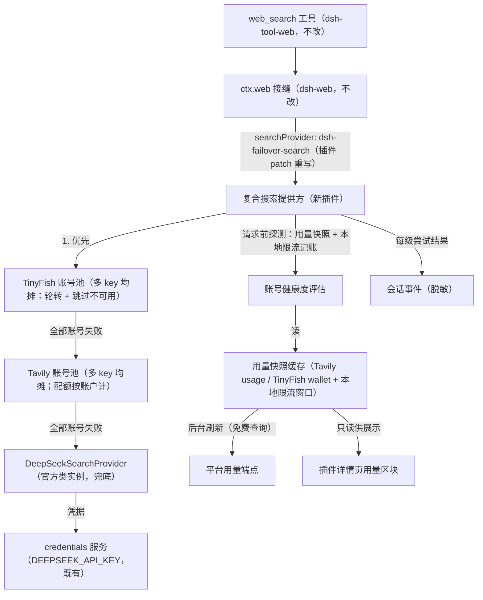
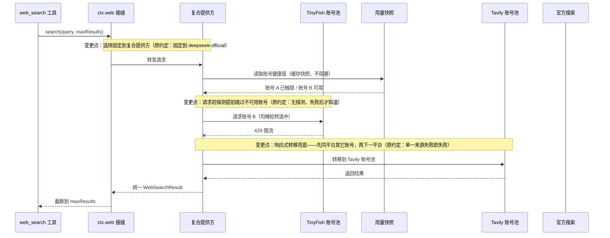
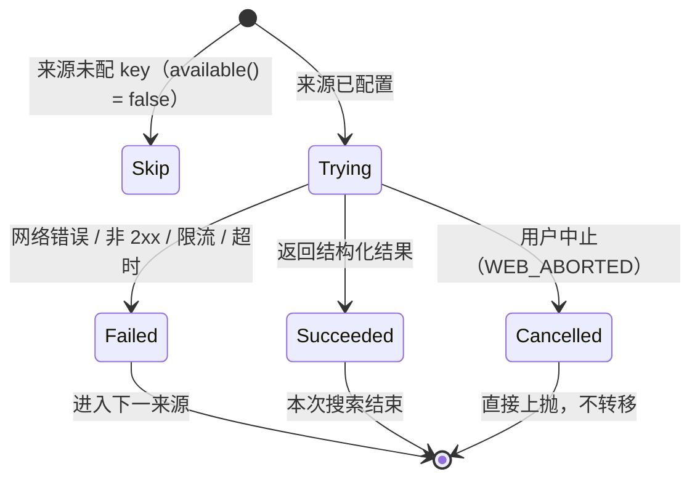

# PLAN-FNOS-010 三方搜索接入与官方兜底

| 字段 | 内容 |
| --- | --- |
| 计划编号 | PLAN-FNOS-010 |
| 计划日期 | 2026-09-30 |
| 对应需求 | [FNOS-010 三方搜索接入与官方兜底](/requirements/FNOS-010-thirdparty-web-search-failover) |
| 本轮功能 | `FNOS-010-01` 至 `FNOS-010-09`：三方搜索优先生效、来源间自动故障转移、官方搜索兜底、搜索来源与多账号配置管理、结果呈现兼容、禁用/卸载后恢复官方搜索、同平台多账号均摊、平台用量展示、用量驱动的请求前探测 |
| 适用应用 | 新增插件 `@tnnevol/dsh-failover-search`（目录 `plugins/dsh-failover-search-plugin`）、插件文档站 |
| 计划状态 | <Badge type="warning" text="待完成" /> |

## 命名定义

本插件的全部命名标识符在此统一定义，实现时按此取值，不再另行命名：

| 标识符 | 取值 | 说明 |
| --- | --- | --- |
| 插件目录 | `plugins/dsh-failover-search-plugin` | 遵循仓库 `dsh-*-plugin` 目录惯例 |
| npm 包名 | `@tnnevol/dsh-failover-search` | 遵循仓库 `@tnnevol/dsh-*` 包名惯例 |
| 显示名（displayName） | `Failover Search` | 插件管理页卡片标题，简短英文，与既有插件一致 |
| 组合行 id（patch insert） | `dsh-failover-search` | Loader 诊断与组合行寻址用 |
| 搜索提供方 id | `dsh-failover-search` | `ctx.web.registerSearchProvider` 注册的稳定 id；与行 id 同名（官方 `deepseek-official`、社区 modsearch 均为行 id/提供方语义分离或同名，取同名降低映射成本）；patch 中 `searchProvider` 指向它 |
| 配置命名空间（settings namespace） | `dsh-failover-search` | 官方配置表单按插件入口导出的 `Config` 自动挂接，namespace 与插件行一致 |

命名语义：`failover`（故障转移）直接表达本插件的核心机制——多账号均摊与 TinyFish → Tavily → 官方转移链；不带 `thirdparty`（相对性词汇，后续接入其它来源后语义漂移）或 `web-search` 前缀冗余（包名 `dsh-` 前缀 + scope 已限定生态）。

## 计划目标

新增一个 DSH harness 插件，在会话内网页搜索接缝上注册一个**复合搜索提供方**：内部按 TinyFish → Tavily → 官方顺序尝试，先成功者胜出；通过插件组合包 patch 把搜索选择指到该复合提供方，官方搜索降级为链尾兜底。网页抓取（fetch）能力不动，仍由官方抓取提供方承担。

本计划只覆盖 FNOS-010 登记的功能范围；聚合、缓存、fetch 替换与高级搜索参数均不在内。

## 已核实的上游事实（调研结论，2026-09-30）

以下事实均来自官方发行包源码、官方文档站实测与真实 API 调用，不是推断；每条都标注了来源。若后续 DSH 升级导致事实失效，按「依赖、风险和决策」章节的备用方案处理。

1. **搜索能力接缝与选择语义**（`@deepseek-ai/dsh-web` 0.1.7-rc.2 类型契约）：
   - 搜索工具层（`dsh-tool-web`）只做参数校验、结果格式化与搜索卡片，执行统一走 `ctx.web.search()`，提供方由 `ctx.web.registerSearchProvider()` 注册。
   - 接缝选择规则：配置了 `searchProvider` 时**固定选择，不自动降级**（不可用直接报 `WEB_PROVIDER_CONFIGURED_UNAVAILABLE`）；未配置时恰好一个可用提供方才自动选中，多个可用报 `WEB_PROVIDER_AMBIGUOUS`。接缝本身没有多级兜底概念。
   - 错误分类（`WebError`）：`WEB_ABORTED`（取消）、`WEB_PROVIDER_CREDENTIAL_MISSING`（凭据缺失）、`WEB_PROVIDER_ERROR`（提供方失败）等；工具执行把错误码放进结构化错误元数据。
   - 结果词表：`WebSearchResult { content?, sources[], truncated }`，`WebSearchSource { url, title?, snippet?, publishedAt? }`；`maxResults` 截断由接缝在返回侧强制执行。
2. **官方搜索提供方**（`@deepseek-ai/dsh-web-search-deepseek` 0.1.7-rc.2 产物）：
   - 每次搜索 = 一次 Anthropic 兼容 Messages 模型调用（`web_search_20250305` server tool），消耗 DeepSeek 官方额度。
   - 包导出 `DeepSeekSearchProvider` 类与提供方 id `deepseek-official`；凭据通过 credentials 服务按 `DEEPSEEK_API_KEY` 引用解析，或走启动环境。**第三方插件可以直接导入该类实例化，作为兜底级**（已核实导出面）。
3. **发行版组合基线**（`@deepseek-ai/dsh-base/cordis.patch.yml`）：
   - `web` 行固定 `searchProvider: deepseek-official`、`fetchProvider: http`；`web-search-deepseek` 行挂官方搜索插件；`tool-web` 行挂搜索工具（`searchTimeoutMs: 60000`）。
   - patch 对 `- id: web` 行的 `config` 是**整行替换**不是深度合并：插件 patch 重写 `searchProvider` 时必须完整重述 `fetchProvider: http`，否则 fetch 配置丢失。
   - 社区先例已验证该路径：modsearch 发布产物即以 `- id: web / config: searchProvider: modsearch` 接管搜索。
4. **TinyFish Search API**（[官方文档](https://docs.tinyfish.ai/search-api/reference)，2026-09-30 实测调通）：
   - `GET https://api.search.tinyfish.ai`，鉴权头 `X-API-Key`。
   - 参数：`query`（必填）、`purpose`（搜索意图，≤2000 字符）、`location`/`language`、`include_domains`/`exclude_domains`、`recency_minutes`、`after_date`/`before_date`、`domain_type`（`web`/`news`/`research_paper`）、`page`（0–10）。
   - 结果：`results[]{position, site_name, title, snippet, url, date}`；news/学术模式另有 publisher/authors/venue/year/cited_by_count/pdf_url。
   - 计费：搜索请求在任意余额（含 0）下免费；限流默认 30 req/min，超限 429。错误码 400/401/402（未开通）/403/404/429/500/503。
   - 注意：`date` 为自然语言或英文日期（如 `1 month ago`、`Aug 16, 2026`），不是 ISO-8601，需要容错解析。
5. **Tavily Search API**（[官方文档](https://docs.tavily.com/documentation/api-reference/endpoint/search)，2026-09-30 实测调通）：
   - `POST https://api.tavily.com/search`，鉴权头 `Authorization: Bearer tvly-...`。
   - 参数：`query`（必填）、`search_depth`（basic/advanced）、`max_results`、`topic`、`chunks_per_source`、`start_date`/`end_date`、`include_answer`、`include_domains`/`exclude_domains`、`country`/`language` 等。
   - 结果：`answer?` + `results[]{title, url, content, score, raw_content, published_date, id}` + `usage.credits`。
   - 计费：basic 深度每次 1 credit；`published_date` 为 RFC2822 格式，需转 ISO。
6. **两把测试 key 均已实测返回结构化结果**；测试 key 仅用于开发验证，不得写入仓库与发布产物。
7. **Tavily 账户用量端点**（[Account Usage](https://docs.tavily.com/documentation/api-reference/endpoint/usage)，2026-09-30 实测调通）：
   - `GET https://api.tavily.com/usage`，鉴权头 `Authorization: Bearer tvly-...`，免费查询。
   - 响应两层结构：`key` 层（`usage`/`limit`（当前 key 档位为 null）/`search_usage`/`extract_usage`/`crawl_usage`/`map_usage`/`research_usage`）与 `account` 层（`current_plan: "Researcher"`、`plan_usage: 167`、`plan_limit: 1000`、`paygo_usage`/`paygo_limit` 及分产品用量）。
   - 用途：key 级与账户级用量展示 + 请求前额度探测（`plan_usage >= plan_limit` 即账户配额耗尽）。
8. **TinyFish 钱包端点**（[Get wallet](https://docs.tinyfish.ai/api-reference/wallet/get-wallet.md)，2026-09-30 实测调通）：
   - `GET https://agent.tinyfish.ai/v1/wallet`，鉴权头 `X-API-Key`，免费查询。
   - 响应：`available_balance`（美元字符串，如 `"11.6"`）、`currency`、`as_of`、`auto_reload`（`unconfigured`/`on`/`off`/`paused_payment_failed`/`needs_payment_method`）、`pending_top_up`、`rates.meters[]`（各产品单价，Search 为 $0.005/query）。
   - 404（`FEATURE_NOT_AVAILABLE`）表示账户未接入钱包计费，展示层需容错。
   - TinyFish 无服务端搜索配额概念（搜索免费、限流按 key 每 30 req/min），请求前探测只能依赖本地限流窗口记账。
9. **TinyFish 搜索用量记录端点**（List search usage，2026-09-30 实测调通）：`GET https://api.search.tinyfish.ai/usage`，分页请求日志（query、status_code、result_count、结果明细）。属日志类端点而非配额表，第一版不接入。
10. **限流与配额计量维度差异**：TinyFish 限流按 API key 计（文档 Rate Limits 章节明示"Limits apply per API key"）——多 key 线性扩大每分钟请求容量；Tavily 套餐配额按账户计（usage 响应中 key 层 limit 为 null、账户层 plan_limit 才是硬上限）——同账户多 key 不扩大配额，跨账户才扩大。此差异决定均摊策略：TinyFish 多 key 均摊有实际扩容收益；Tavily 多 key 均摊主要价值是 key 失效冗余与单 key 限流分散，配额扩容须跨账户。

## 当前实现与目标设计

| 领域 | 当前实现 | 目标实现 | 迁移影响 |
| --- | --- | --- | --- |
| 搜索来源 | 组合固定 `deepseek-official`，每次搜索消耗一次辅助模型调用 | 组合固定到复合提供方 `dsh-failover-search`，内部按 TinyFish → Tavily → 官方转移 | 模型侧工具名、参数与卡片不变；仅结果来源变化 |
| 搜索配置 | 官方搜索无用户级 key 表单（凭据走 Models 页管理的 `DEEPSEEK_API_KEY`） | 新插件配置表单：每平台多 key（多账号）、来源顺序、各来源超时与均摊策略 | 官方凭据管理不动；兜底级继续解析既有凭据引用 |
| 账号选择 | — | 平台内多账号均摊（轮转 + 健康度跳过）：TinyFish 多 key 扩大限流容量；Tavily 多 key 提供失效冗余与限流分散（配额按账户计，扩容须跨账户） | 单账号配置退化为直连，行为与无均摊一致 |
| 失败行为 | 单一来源，失败即失败 | 双层转移：请求前探测（缓存用量快照 + 本地限流记账）提前跳过不可用账号；请求失败后响应式转移兜底 | 取消语义保持：用户主动中止不触发转移 |
| 用量可见性 | 无 | 插件详情页用量区块：Tavily key/账户两级用量、TinyFish 钱包余额与自动充值状态，带获取时间 | 用量端点均为免费查询，不产生平台计费 |
| 卸载/禁用 | — | patch 随插件消失，`web` 行回落 base 层（官方搜索 + http fetch） | 无需用户手工清理 |



接缝只看到一个提供方（复合提供方），因此不会触发 `WEB_PROVIDER_AMBIGUOUS`；官方搜索插件的 `web-search-deepseek` 行保持原样，其提供方仍在注册表但不会被选中（选择固定到复合提供方）。



状态视角（单次搜索内）：



## 影响范围分析

| 需求功能 | 代码模块 | 配置/数据 | 测试 | 文档 | 目标环境 |
| --- | --- | --- | --- | --- | --- |
| FNOS-010-01/02/03 | `plugins/dsh-failover-search-plugin`（新）：src/host 复合提供方与两个来源适配 | 插件 Config（每平台多 key、顺序、超时）<br>组合 `web` 行 patch | 来源适配单元测试（fetch mock）<br>转移顺序用例<br>取消用例<br>patch 契约测试 | `docs/plugins/dsh-failover-search.md`（新） | DSH Web 与 DSH Desktop，真实 key/网络 |
| FNOS-010-04 | 插件 Config schema：每平台 key 列表（secret 角色）+ 顺序 + 超时（DSH 自动生成配置表单） | key 以 secret 角色存储<br>保存即生效（提供方按次快照配置） | 配置读写<br>多 key 增删与生效时机用例 | 同上 | DSH Web 与 DSH Desktop |
| FNOS-010-05 | 两个来源适配的字段映射与日期容错解析 | 无持久化数据 | 映射与日期解析单元测试（含相对时间/英文日期/RFC2822） | 同上 | DSH Web 与 DSH Desktop |
| FNOS-010-06 | 组合包 patch 的生命周期（随插件启停生效/失效） | 无用户数据残留 | 禁用后 `web` 行回落 base 的契约测试 | 同上 | DSH Web 与 DSH Desktop |
| FNOS-010-07 | src/host 账号池（每平台一个）：轮转均摊 + 健康度跳过 + 账号级失败转移 | 本地限流窗口记账（内存态）<br>均摊游标（内存态） | 均摊分布用例<br>账号失败转移用例<br>平台顺序不乱序用例<br>单账号退化用例 | 同上 | DSH Web 与 DSH Desktop，同平台至少两个真实账号 |
| FNOS-010-08 | src/host/usage-store（用量快照缓存与后台刷新）+ 详情页用量区块（client 半侧新增，参照 fnOS 详情页挂载先例） | 用量快照（内存缓存，含获取时间、不落盘） | 快照刷新用例<br>端点失败容错用例<br>展示数据一致性用例 | 同上 | DSH Web 与 DSH Desktop，真实用量查询 |
| FNOS-010-09 | 复合提供方与账号池的探测接入（快照过期退化为响应式） | 同上快照 | 探测跳过用例<br>快照过期退化用例<br>快照恢复后重新参与用例 | 同上 | DSH Web 与 DSH Desktop |
| 文档与发布 | `docs/plugins/index.md`<br>`app/published-dsh-plugins.json`<br>插件 `README.md`/`compatibility.json` | 发布清单版本一致性 | 发布清单与安装命令一致性用例（沿用既有门禁） | 插件文档站页面 | 发布环境 |

不改动：`apps/fn-deepseek-harness` 应用代码与 manifest 行为、官方插件行（`web-search-deepseek`、`web-fetch-http`、`tool-web`）、共享包 `@tnnevol/dsh-semi-ui`（本插件无 client 半侧）。

## 架构与数据流

新插件目录复用 `plugins/dsh-codebuddy-plugin` 工程骨架（tsdown、vitest、tsconfig、cordis.patch.yml、compatibility.json），但**没有 client 半侧**（无 React、无客户端注入），是纯 host 插件：

```text
plugins/dsh-failover-search-plugin/
├── package.json            # @tnnevol/dsh-failover-search；dsh.bundle.patch 声明
├── cordis.patch.yml        # web 行 config 重写 + 本插件 insert
├── compatibility.json      # 声明 @deepseek-ai/dsh-web 等加载面
├── tsdown.config.ts
├── tsconfig.json
├── vitest.config.ts
├── src/
│   ├── index.ts            # 插件 apply：注册复合提供方；Config 导出
│   ├── client/             # client 半侧（新增）：插件详情页用量区块
│   │   └── usage-section.ts
│   ├── contracts/
│   │   ├── constants.ts    # 提供方 id、默认超时、默认顺序、端点常量
│   │   └── types.ts        # Config（多 key）、账号池、用量快照、转移结果
│   └── host/
│       ├── failover-provider.ts   # 复合提供方（实现 WebSearchProvider）
│       ├── account-pool.ts        # 平台账号池：轮转均摊 + 健康度跳过 + 账号级转移
│       ├── usage-store.ts         # 用量快照缓存：后台刷新（免费查询）+ 过期判定
│       ├── tinyfish-provider.ts   # TinyFish 适配
│       ├── tavily-provider.ts     # Tavily 适配
│       ├── date.ts                # 发布日期容错解析（相对时间/英文日期/RFC2822 → ISO）
│       └── events.ts              # 每级尝试的脱敏会话事件
└── tests/                  # 单元 + 契约测试
```

组合包 `cordis.patch.yml`（核心两块）：

```yaml
# web 行 config 整行替换语义：必须完整重述 fetchProvider
- id: web
  config:
    searchProvider: dsh-failover-search
    fetchProvider: http

- insert:
    - id: dsh-failover-search
      name: '@tnnevol/dsh-failover-search'
```

复合提供方关键行为：

- `available()`：任一平台存在可用账号（配置了 key 且未被探测排除）或兜底级可用即返回 true；全部不可用返回 false，由接缝统一报 `WEB_PROVIDER_UNAVAILABLE`。
- `search(request, signal)`：按配置的平台顺序遍历；平台内先做请求前探测（读取用量快照与健康度），从可用账号池中按均摊策略选出账号发起请求；失败（网络错误、非 2xx、429/5xx、超时）先在同平台其它账号间转移，同平台耗尽再落到下一平台；`WEB_ABORTED` 立即上抛；每级尝试写一条脱敏会话事件（平台、账号代号、耗时、结局，**不含 query 全文与 key**——query 是否入事件按最小化原则只记长度，避免把用户查询内容复制进提供方层日志）。
- 结果归一：首个成功账号/来源的结果直接返回（content、sources 原样映射），不跨来源合并；`maxResults` 由接缝截断，来源侧再做请求级裁剪（Tavily 传 `max_results`；TinyFish 无数量参数，结果默认约 10 条，超出部分由接缝截断）。
- 每次调用开始时快照一次配置（与官方提供方相同的 resolveOptions 模式），保证一次搜索内配置一致、保存后下一次搜索即生效。

账号池与均摊（FNOS-010-07）：

- 每平台一个账号池，账号 = 一个 key（含备注名供展示）。
- 均摊策略：轮转（round-robin）为主，游标持久在内存；被探测排除或请求失败的账号跳过，同一查询内按「平台内其它账号 → 下一平台」推进。
- TinyFish 限流按 key 计，多 key 均摊有实际扩容收益，配合本地限流窗口记账（每 key 独立 30 req/min 滑窗）；Tavily 配额按账户计，多 key 均摊提供失效冗余与单 key 限流分散，账户配额耗尽（`plan_usage >= plan_limit`）时该账户全部 key 一并排除。
- 单账号配置退化为直连，行为与无均摊一致。

用量快照与请求前探测（FNOS-010-08/09）：

- usage-store 维护每账号的用量快照（内存缓存，含获取时间），后台定时刷新（默认 5 分钟，免费查询，不产生计费）；配置变更（key 增删）触发立即刷新。
- 探测规则：快照新鲜（未过期）且判定额度不足/已触限 → 该账号请求前跳过；快照过期或缺失 → 不排除、按"无用量信息"执行，失败后走响应式转移（探测永远不阻塞搜索）。
- 排除的账号在快照刷新显示恢复后重新进入轮转。
- 展示与探测共用同一快照；展示层只读。

字段映射：

| 接缝字段 | TinyFish | Tavily |
| --- | --- | --- |
| `sources[].url` | `url` | `url` |
| `sources[].title` | `title` | `title` |
| `sources[].snippet` | `snippet` | `content` |
| `sources[].publishedAt` | `date` 经容错解析，失败省略 | `published_date`（RFC2822 → ISO），失败省略 |
| `result.content` | 不提供 | `answer`；**第一版不开启 `include_answer`**（省 credit 与延迟） |

## 分阶段任务

| 任务 ID | 对应需求/验收 | 修改内容 | 前置条件 | 验证方式 | 失败处理 |
| --- | --- | --- | --- | --- | --- |
| PLAN-FNOS-010-T01-01 | FNOS-010-04 / AC-01、AC-03、AC-04；FNOS-010-10 / AC-01 | 按计划「命名定义」建立插件骨架（package.json、tsdown、tsconfig、vitest、patch、compatibility.json、bundle client 声明，displayName `Failover Search`）；配置结构定义：标量项（顺序、超时、重试、刷新间隔、探测开关）走官方通用配置表单；插件行挂 `plugins.bundle.config` slot（FNOS-008 先例） | 无 | `pnpm run check -- --packages --plugins`；DSH Web 插件详情页出现配置区，设置弹框无本插件入口 | 骨架问题在本任务内修复，不进入下游 |
| PLAN-FNOS-010-T01-02 | FNOS-010-04 / AC-01、AC-04 | key 列表 UI 承载判定与实现：先验证官方通用表单对「key+备注名」对象列表的交互；不满足则在详情页以 Semi UI（`@tnnevol/dsh-semi-ui`）自绘增删列表（secret 输入不回显） | T01-01 | 详情页操作走查：增、删、改备注、保存后重读一致；自绘样式与详情页风格一致 | 判定结论（官方表单可用/需自绘）记入本计划变更记录 |
| PLAN-FNOS-010-T02-01 | FNOS-010-01 / AC-01、AC-02 | TinyFish 适配（GET、`X-API-Key`、字段映射、日期容错） | T01-01 | 单元测试（真实响应样本 + mock），真实 key 手工冒烟 | 适配缺陷不影响 T03 并行开发 |
| PLAN-FNOS-010-T02-02 | FNOS-010-01 / AC-01、AC-02；FNOS-010-05 / AC-01 | Tavily 适配（POST、Bearer、`max_results` 透传、RFC2822 → ISO） | T01-01 | 同上 | 同上 |
| PLAN-FNOS-010-T03-01 | FNOS-010-02 / AC-01–AC-03；FNOS-010-03 / AC-01、AC-02 | 复合提供方：平台顺序遍历、跳过未配置、失败转移（先平台内后跨平台）、`WEB_ABORTED` 直抛、脱敏事件、配置快照 | T02-01、T02-02 | 单元测试：转移顺序、取消、全部失败、官方兜底（官方类实例 mock 凭据） | 转移语义缺陷在本任务收口 |
| PLAN-FNOS-010-T04-01 | FNOS-010-01/06 全部 AC | 组合 patch：`web` 行重写（完整重述 `fetchProvider: http`）+ insert；本地 DSH Web 端到端：三方优先、拔 key 看转移、禁用插件看回落 | T03-01 | `dsh --profile web --dump-config` 核对组合行；本地会话真实搜索走查 | patch 未生效时先查组合行顺序，再查 bundle 声明 |
| PLAN-FNOS-010-T05-01 | FNOS-010-07 / AC-01、AC-02 | 账号池：轮转均摊、健康度跳过、账号级失败转移（先同平台后跨平台）、单账号退化 | T03-01 | 均摊分布用例（连续 N 次请求的账号分布）、账号失败转移用例、平台顺序不乱序用例 | 均摊语义缺陷在本任务收口 |
| PLAN-FNOS-010-T06-01 | FNOS-010-08 / AC-01–AC-03 | usage-store：Tavily usage / TinyFish wallet 适配、快照缓存、后台刷新、配置变更触发刷新 | T02-01、T02-02 | 端点适配单元测试（真实响应样本）、刷新时机用例、失败容错用例 | 端点契约变化时只改适配层 |
| PLAN-FNOS-010-T07-01 | FNOS-010-09 / AC-01–AC-03 | 请求前探测接入：复合提供方与账号池读取健康度、快照过期退化、恢复后重新参与 | T05-01、T06-01 | 探测跳过用例、过期退化用例、恢复参与用例、探测不阻塞用例 | 探测缺陷退化为纯响应式转移（可发布） |
| PLAN-FNOS-010-T08-01 | FNOS-010-08 / AC-01–AC-03 | client 半侧：插件详情页用量区块（Semi UI 自绘，快照只读展示 + 获取时间 + 失败提示） | T06-01 | DSH Web 插件详情页走查、展示值与平台端点一致性核对；样式符合插件 UI 规范并按 UI 测试清单核对亮暗主题对比、间距 BFC、毛玻璃层级 | 展示缺陷不阻塞搜索链路 |
| PLAN-FNOS-010-T09-01 | FNOS-010-01/06 全部 AC | 本地 DSH Web 端到端复核：三方优先、拔 key 看转移、多账号均摊、禁用插件看回落 | T07-01、T08-01 | `dsh --profile web --dump-config` 核对组合行；本地会话真实搜索走查 | patch 未生效时先查组合行顺序，再查 bundle 声明 |
| PLAN-FNOS-010-T10-01 | FNOS-010-05 / AC-01、AC-02 | 会话搜索卡片走查：三方来源结果的标题/链接/摘要/日期呈现与截断提示 | T09-01 | DSH Web 真实会话证据截图；卡片呈现与官方来源对照 | 呈现问题回 T02 映射层修复 |
| PLAN-FNOS-010-T11-01 | FNOS-010-01–10 全部 AC | DSH Desktop 验收（真实 key、真实官方凭据、同平台至少两个真实账号） | T09-01、T10-01 | Desktop 会话搜索与详情页用量走查记录 | Desktop 专属问题按壳转发语义排查 |
| PLAN-FNOS-010-T12-01 | 发布面；FNOS-010-04 / AC-05；FNOS-010-10 / AC-02 | 插件文档站页面（含「配置项说明」逐项同步）、`docs/plugins/index.md`、`app/published-dsh-plugins.json`、安装命令版本一致性 | T09-01 | `pnpm run check -- --docs`、文档配置项与实际表单一致性核对、插件名称三处一致（文档站/发布清单/插件管理页）核对、既有发布清单用例 | 文档与清单漂移由既有门禁拦截 |
| PLAN-FNOS-010-T13-01 | 需求验收汇总 | 回填 `docs/tests/` 测试用例文档（FNOS-010 同编号），更新需求状态 | T11-01、T12-01 | SDD 检查、目标环境验收记录 | — |

依赖关系：T01 →（T02-01 ∥ T02-02）→ T03 → T04 ∥ T05 → T06 →（T07 ∥ T08）→ T09 →（T10 → T11）∥ T12 → T13。T01-01 按「命名定义」章节取值建立骨架，后续任务不再自行命名。基线协调：插件 peer 依赖在实现时锁定仓库当前 DSH 基线；若 FNOS-009（0.2.0-rc.2 适配）先落地，则直接按新基线锁定，避免双重迁移。

## 交互和行为设计

- **配置入口（唯一）**：侧栏「插件」→ 本组合包详情页 → 配置区。不新增独立设置卡片；设置弹框不出现在本插件入口。
- **UI 承载策略（官方优先，遵循[插件 UI 规范「配置项 UI 选择顺序」](/charter/plugin-ui-standards)）**：能由官方 `Config` schema 表达的标量项（超时、刷新间隔、开关、来源顺序等）必须留在官方自动生成的配置表单（含保存控件），「官方能实现但自定义更顺手」不构成搬进自定义 UI 的理由；官方 UI 不满足交互要求的部分（如账号卡片式列表管理、实时状态展示）才用 Semi UI（`@tnnevol/dsh-semi-ui`）自绘配置区块，且须在插件内注释说明官方 UI 不满足的具体交互要求（缺什么控件、什么流程表达不了）并过代码评审；两者可并存——简单字段留在 `Config`，交互复杂的区块承载列表与状态；不引入 Semi UI 与官方组件之外的第三套 UI 依赖。承载方式的判定按需求文档「配置项说明」逐项执行。
- **配置项清单**（完整定义见需求文档「配置项说明」，此处列实现要点）：
  - TinyFish/Tavily key 列表：每项 key（secret）+ 备注名；实现期先验证官方通用表单对该列表形态的交互，不满足则 Semi UI 自绘增删列表。key 经 secret 角色存储。
  - 来源顺序：官方表单枚举/排列项，默认 TinyFish → Tavily → 官方。
  - 每来源超时（默认 15000ms）、同平台重试（默认开）、用量刷新间隔（默认 5 分钟）、请求前探测（默认开）：官方表单标量项。
- **保存即生效**：复合提供方按次快照配置，保存后下一次搜索按新配置执行，无需重启（FNOS-010-04-AC-01/02）；key 增删同时触发用量快照立即刷新。
- **用量展示区**：详情页内常驻区块（参照 FNOS-008-01「移除折叠、内容常驻」先例，Semi UI 自绘），按平台分列各账号：Tavily 展示 key 用量/上限、账户套餐名称与已用/上限；TinyFish 展示钱包余额、自动充值状态与搜索单价。数据带获取时间；端点查询失败时该账号显示可理解的失败提示，不阻塞其它账号与搜索功能（FNOS-010-08-AC-01/02/03）。区块数据来自 usage-store 快照（只读），不自发请求。样式遵循插件 UI 规范：只使用 DSH 语义变量（`--dsw-*`）、毛玻璃加在父元素且子元素不重复叠加、亮暗主题对比均成立（验收时按 UI 测试清单核对）。
- **失败可见性**：全部来源失败时模型收到带错误码的失败信息（沿用 `WebError` 分类）；每级尝试的结局通过会话事件可回放，便于排障。
- **取消**：用户停止会话产生的中止直接上抛为 `WEB_ABORTED`，不转移（FNOS-010-02 约束）。
- **兜底级凭据缺失**：三方全失败且无官方凭据时，错误信息引导用户到官方凭据管理（与现版本官方搜索缺 key 的提示语义一致，FNOS-010-03-AC-02）。
- **均摊与探测的用户可观察性**：均摊效果通过平台侧用量数据验证（FNOS-010-07-AC-01）；探测跳过与快照过期退化均为后台行为，用户可观察结果是"搜索始终正常发起"，不产生额外交互。

## 数据、权限和错误处理

- **凭据**：每平台多个 key 用 Config 的 secret 角色（`role('secret').volatile()`，列表形态），与官方提供方 `apiKey` 字段同模式；不写会话日志、不进事件、不进错误信息。会话事件中的账号以「平台 + 账号代号（如 tinyfish-1）」表达，不携带 key 任何片段。测试 key 只存在于开发机环境变量。
- **持久化**：插件自身无独立存储文档；配置随插件 Config 由宿主统一管理。用量快照与限流记账均为内存态，进程重启后重建（首次快照未就绪期间探测退化为响应式转移）。
- **网络**：搜索访问两个三方端点与官方搜索端点；用量查询访问 Tavily usage 与 TinyFish wallet（均为免费查询，后台低频刷新）；fetch 提供方不动，公网目的地址校验沿用官方实现。
- **错误分类**：账号/来源失败统一折叠为 `WEB_PROVIDER_ERROR`（附来源 id 与原因）；未配置 key 不是错误（跳过）；官方兜底凭据缺失保留 `WEB_PROVIDER_CREDENTIAL_MISSING` 语义；取消保持 `WEB_ABORTED`；用量端点失败不进入搜索错误链路，只影响展示与探测新鲜度。
- **超时与重试**：每账号单次尝试，不内部重试；单来源超时默认 15s；整体预算仍由 `tool-web` 的 60s 兜住。

## 依赖、风险和决策

| 决策/风险 | 选择 | 理由与备用方案 |
| --- | --- | --- |
| 兜底放在哪里 | 接缝外（复合提供方内部） | 已核实接缝无多级转移，配置固定选择失败不降级；备用方案（改接缝）违反「不直接修改官方源码」边界，否决 |
| 兜底级实现 | 导入官方包 `DeepSeekSearchProvider` 类实例化 | 导出面已核实；若未来官方包移除导出，改为在插件内实现同协议 Messages 调用（协议已完整记录在上游事实 2） |
| 默认顺序 | TinyFish → Tavily → 官方 | 免费优先、计费次之、消耗模型额度殿后；用户已确认，可配置 |
| 均摊策略 | 轮转（round-robin）+ 健康度跳过，游标内存态 | 实现简单、分布均匀、可解释；Tavily 配额按账户计的现实下，均摊对 TinyFish（按 key 限流）有扩容收益、对 Tavily 提供冗余；备选最少连接/加权策略在均摊效果可验证前不引入（避免过度设计） |
| 请求前探测方式 | 缓存用量快照（后台刷新，默认 5 分钟）+ 本地限流记账；**否决**每次搜索前同步实时探测（增加延迟且 TinyFish 无服务端配额可查） | 快照与展示共用一份数据；快照过期退化为响应式转移，探测是优化不是正确性依赖 |
| TinyFish 探测数据源 | 本地限流窗口记账（每 key 滑窗）；钱包余额仅用于展示（搜索免费、余额 $0 也可搜索） | 无服务端配额可查（已核实）；429 响应式转移兜底 |
| Tavily 探测数据源 | usage 端点 `plan_usage/plan_limit`（账户层）；账户配额耗尽排除该账户全部 key | key 层 limit 当前档位为 null（已核实），账户层才是硬上限 |
| 用量快照存储 | 内存缓存，不落盘 | 快照可低成本重建（免费查询）；落盘引入过期数据误用风险大于收益 |
| `include_answer` | 第一版不开启 | 省 credit 与延迟；后续有需要再立范围变更 |
| TinyFish `date` 非标准格式 | 容错解析，失败省略 `publishedAt` | 日期缺失不影响可用性；解析器独立成模块便于测试 |
| patch 整行替换语义 | patch 内完整重述 `fetchProvider: http` | 已核实 patch 不做深度合并；契约测试钉住该行，防漂移 |
| 详情页用量区块挂载 | 沿用 FNOS-008 先例（`plugins.bundle.config` 挂详情页、常驻区块不折叠） | 仓库内已验证的接缝；UI 遵循插件 UI 规范 |
| 配置 UI 承载 | 按[插件 UI 规范「配置项 UI 选择顺序」](/charter/plugin-ui-standards)执行：官方通用配置表单优先（能用 `Config` schema 表达的字段必须留在 schema，包括文本、数字、布尔、枚举、列表）；官方 UI 不满足交互要求时才用 Semi UI 自定义配置区块，且须在插件内注释说明官方 UI 不满足的具体交互要求并过代码评审；两者可并存，简单字段不搬进自定义 UI | 新规范（2026-09-30）明示「官方能实现但自定义更顺手」不构成绕过理由；本插件 key 列表是否留在官方 schema 待 T01-02 判定，若官方列表控件可用则优先官方 |
| DSH 升级 | peer 锁实现期仓库基线；FNOS-009 先落地则锁新基线 | 与适配需求协调，避免版本双重迁移 |
| 限流叠加（TinyFish 30 rpm/key） | 本地记账 + 429 响应式转移；多 key 均摊本身即扩容手段 | 不做全局限流器（避免过度设计）；转移链本就是预期行为 |

## 测试、打包、发布和回滚

测试执行遵循[测试用例文档规范](/charter/tests-spec)（2026-09-30 新增的版本记录、数据清理、UI 测试与凭据红线等章节）；本插件无登录态与 auth 配置文件，不涉及账号状态测试顺序规范。

- **版本记录**：执行前记录环境版本三元组（客户端/宿主/插件），写入测试执行结果备注；Desktop 内置运行时须满足插件锚定的兼容范围，不匹配标阻塞而非缺陷。
- **数据清理**：按本地 profile、Desktop、NAS 三个位置登记清理动作（本地与 Desktop 清理 `.dsh` profile 内本插件的配置与凭据；NAS 不涉及）；禁止使用个人生产账号做测试。
- **回归基线**：回归用例标注基线来源；「与官方搜索行为一致」类预期须附可观察特征（如搜索卡片呈现字段、截断提示文案）。
- **凭据红线**：测试 key、官方凭据与 auth 文件一律不入仓库（代码、文档、脚本、用例均不含）；本插件无 auth 备份需求，key 只存在于宿主凭据存储或开发机环境变量。
- **包级**：`typecheck`、单元测试（来源适配、字段映射、日期解析、转移顺序、取消、配置快照、账号池均摊、用量快照）、构建产物检查；patch 契约测试（`web` 行两键齐全、id 正确）；配置结构变更同步契约测试。
- **本地组合**：`dsh --profile web --dump-config` 核对最终组合行；本地 DSH Web 真实会话搜索走查（三方优先、转移、兜底、回落、均摊、探测六条链路）。
- **UI 测试**（详情页配置区与用量区块，按[测试用例文档规范](/charter/tests-spec) UI 测试章节核对）：
  - 亮色与暗色主题各执行一遍，核对文本/阴影/border/背景对比，主题切换无残留单侧样式。
  - 相邻元素间距叠加与 BFC 行为正常；浮层（如备注名编辑的下拉、提示）不被父容器裁剪。
  - 毛玻璃层级：`backdrop-filter` 只加在承载透明背景的父元素，子元素不重复叠加模糊与透明背景；一个视觉块只有一条模糊链路。
  - 自定义样式只使用 DSH 语义变量（`--dsw-*`），不硬编码颜色。
- **目标环境**：DSH Web 与 DSH Desktop（Desktop 测试使用项目根 `.dsh/profiles/desktop`，`DSH_HOME` 指向项目根，禁用 `~/.dsh` profile），全部使用真实三方 key 与真实官方凭据（对应需求验收环境范围；本插件不依赖 fnOS 宿主能力，不要求 NAS）。
- **发布**：插件发布 npm；`app/published-dsh-plugins.json` 与文档安装命令版本一致性沿用既有发布校验门禁。
- **回滚**：禁用或卸载插件即恢复官方搜索（base 层组合原样），无需数据清理；插件无独立持久化数据，禁止删除的用户数据不存在。

## 参考资料

- TinyFish Search API Reference：https://docs.tinyfish.ai/search-api/reference
- TinyFish Get Wallet：https://docs.tinyfish.ai/api-reference/wallet/get-wallet.md
- TinyFish List Search Usage：https://docs.tinyfish.ai/api-reference/list-search-usage.md
- Tavily Search API：https://docs.tavily.com/documentation/api-reference/endpoint/search
- Tavily Account Usage：https://docs.tavily.com/documentation/api-reference/endpoint/usage
- 官方接缝与提供方：`@deepseek-ai/dsh-web`、`@deepseek-ai/dsh-web-search-deepseek`、`@deepseek-ai/dsh-tool-web`（0.1.7-rc.2 发行包）
- 发行版组合基线：`@deepseek-ai/dsh-base/cordis.patch.yml`（`web` / `web-search-deepseek` / `tool-web` 行）
- 社区先例：modsearch 发布产物 `cordis.patch.yml`（`searchProvider` 接管方式）
- 详情页配置区块先例：FNOS-008（`plugins.bundle.config` 挂载、常驻区块规范）
- 仓库工程模板：`plugins/dsh-codebuddy-plugin`

## 完成状态

| 阶段 | 状态 |
| --- | --- |
| 上游事实核实与调研 | 已完成（2026-09-30：两把测试 key 搜索实测、Tavily usage / TinyFish wallet / TinyFish usage 三个查询端点实测） |
| T01 插件骨架 | 已完成 |
| T02 来源适配 | 已完成 |
| T03 复合提供方 | 已完成 |
| T04 组合 patch | 已完成 |
| T05 账号池与均摊 | 已完成 |
| T06 用量快照 | 已完成 |
| T07 请求前探测 | 已完成 |
| T08 详情页用量区块 | 已完成 |
| T09–T11 端到端与目标环境验收 | 部分完成（Web 配置区与用量走查通过；多账号分摊、会话卡片、禁用回落、Desktop 待验收） |
| T12/T13 文档发布与用例回填 | 已完成（发布待用户确认） |

## 变更记录

| 日期 | 变更 | 说明 |
| --- | --- | --- |
| 2026-09-30 | 初始登记 | 建立 PLAN-FNOS-010，承接 FNOS-010 调研结论：接缝选择语义、官方提供方导出面、两个三方 API 契约与实测结果、复合提供方设计、patch 整行替换约束与任务拆分。 |
| 2026-09-30 | 范围扩展：多账号均摊、用量展示与请求前探测 | 对应 FNOS-010 新增 07/08/09 三项功能。上游事实补 4 条（Tavily usage 端点、TinyFish wallet 端点、TinyFish usage 记录端点、限流计量维度差异——TinyFish 按 key、Tavily 按账户，均实测核实）；架构补账号池（轮转均摊 + 健康度跳过）、usage-store 快照（内存态、后台免费刷新、过期退化）与详情页用量区块（沿用 FNOS-008 挂载先例）；任务表扩为 T01–T13；决策表补均摊策略、探测方式（否决每次搜索前同步实时探测）、两平台探测数据源、快照不落盘等 6 项。 |
| 2026-09-30 | 明确配置项与 UI 承载策略 | 对应 FNOS-010「配置项说明」章节与 UI 约束。交互设计重写：配置入口唯一化（仅插件详情页），确立官方通用配置表单优先、Semi UI 自绘兜底、不引入第三套 UI 依赖的承载策略；新增 T01-02 任务（key 列表承载判定：先验证官方表单对象列表交互，不满足则 Semi UI 自绘，结论记入变更记录）；T12 补文档配置项一致性核对；决策表补配置 UI 承载决策。 |
| 2026-09-30 | 对齐新增章程规范 | 六个章程/测试规范提交（2026-09-30）生效后核对并调整：① 「配置项 UI 选择顺序」规范落地——决策表与交互设计改为引用规范原文（含判定规则：官方能实现但自定义更顺手不构成绕过、Semi UI 自定义须注释官方 UI 不满足的具体交互要求并过代码评审、两者可并存），T01-02 判定结论的记录要求不变；② 测试章节按新测试规范重写——补版本三元组记录、三位置数据清理、回归基线标注、凭据红线（本插件无 auth 备份需求）、UI 测试清单（亮暗主题对比、间距 BFC、毛玻璃层级、DSH 语义变量）、Desktop 必须用项目根 `.dsh/profiles/desktop`；T08 验收方式补 UI 测试清单；本地组合链路从四条扩为六条（补均摊、探测）；账号状态测试顺序规范经核对不适用（本插件无登录态与 auth 文件）。 |
| 2026-10-09 | 实现落地与首轮验证 | 按计划 T01–T13 实现全部阶段：插件骨架与配置 schema（7 个 volatile 字段，key 为 secret 角色）、TinyFish/Tavily 搜索与用量适配、复合提供方的转移链、账号池轮转均摊、用量快照缓存与请求前探测、详情页配置区（官方 `SettingsForm` + 自绘布尔开关与账号列表）与用量区块、组合 patch、插件文档与发布清单。包级测试 113 个用例通过；真实网络冒烟 9/9、真实组合端到端 8/8。T09–T11 的剩余项（同平台多账号分摊、会话搜索卡片、禁用后回落、DSH Desktop、暗色主题）登记在 [测试用例文档](/tests/FNOS-010-thirdparty-web-search-failover)。 |
| 2026-09-30 | 定义插件命名 | 对应 FNOS-010-10（插件标识命名）。新增「命名定义」章节：npm 包名 `@tnnevol/dsh-failover-search`、插件目录 `plugins/dsh-failover-search-plugin`、displayName `Failover Search`、组合行 id/搜索提供方 id/配置命名空间统一 `dsh-failover-search`；全文从初稿命名（`dsh-web-search-thirdparty` 系列）统一替换为最终命名。命名理由：`failover` 直接表达多账号均摊与来源转移的核心机制；`thirdparty` 为相对性词汇、扩展来源后语义漂移，弃用。T01-01 关联 FNOS-010-10-AC-01 并按表取值，T11 扩至 10 项功能，T12 补三处名称一致性核对。 |
| 2026-10-09 | 规范更新：Desktop 测试改用 fork 检出 | 按用户要求更新两条仓库规范：① `docs/charter/tests-spec.md` 的 DSH Desktop 测试章节由「系统安装的 `/Applications/DeepSeek Harness.app`」改为「上游源码检出 `fork-pj/deepseek-harness` 的开发态 Desktop」，检出位置经 `DSH_DESKTOP_APP_DIR` 传入（不落绝对路径），启动命令、CDP 端口（`DSH_DESKTOP_RENDERER_DEBUG_PORT=9333`）与 profile 约束（仍用项目 `.dsh/profiles/desktop`）同步写明；② `docs/charter/sdd-workflow.md` 新增「文档措辞规范」，禁止「当前机器」「本机」这类无法确认指代的说法，并明确 `当前与目标设计` 等 SDD 定义术语照常使用。FNOS-010 的 Desktop 验收改用该客户端执行，测试文档中的缺口描述同步更新。 |
