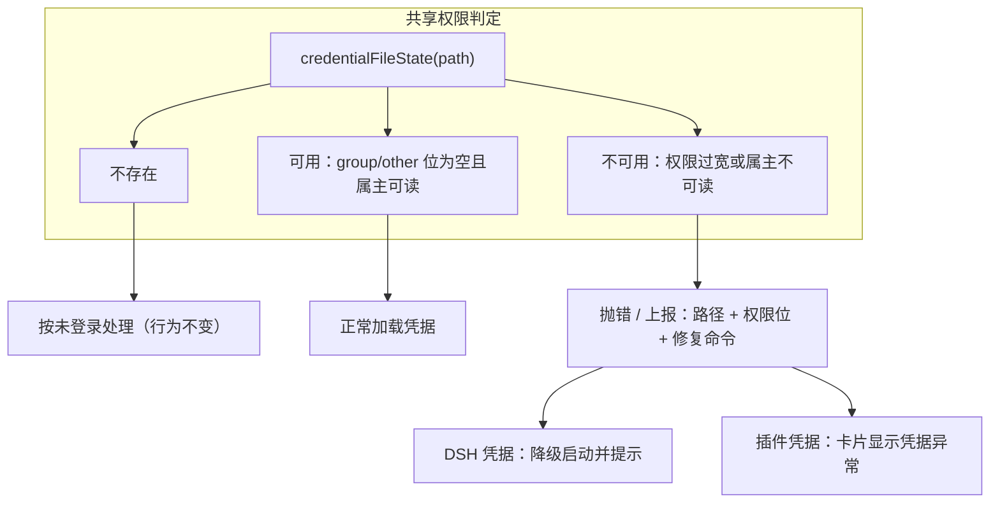

# PLAN-FNOS-011 凭据文件权限异常的可诊断性

| 字段 | 内容 |
| --- | --- |
| 计划编号 | PLAN-FNOS-011 |
| 计划日期 | 2026-10-09 |
| 对应需求 | [FNOS-011 凭据文件权限异常的可诊断性](/requirements/FNOS-011-credential-permission-diagnostics) |
| 本轮功能 | FNOS-011-01 至 FNOS-011-05 全部进入本轮实施 |
| 上游依据 | DSH `0.2.0-rc.2` 发行包中 `@deepseek-ai/dsh-credentials-local` 的 `assertOwnerOnly` 与 `loadInitial`；本仓库 `plugins/dsh-codebuddy-plugin/src/host/storage.ts` |
| 计划状态 | <Badge type="info" text="规划中" /> |

## 计划目标

让凭据文件「存在但读不了」这一情形在 DSH 自身与各插件中被一致地识别为**异常**而非**未登录**或**不可用**，并把可执行的修复方式呈现给用户；同时确保凭据异常不再让 DSH Web 整体退出。技术边界见[需求文档「不在本次范围内」](/requirements/FNOS-011-credential-permission-diagnostics#不在本次范围内)：不自动修复权限、不改变凭据文件格式与位置、不为非凭据文件引入同类判定。

## 当前实现与目标设计

### 当前实现

两处判定使用同一条件 `(mode & 0o077) === 0`，它只覆盖 group/other 位：

| 位置 | 判定 | 命中 `0000` 时 | 用户可见结果 |
| --- | --- | --- | --- |
| `dsh-credentials-local` 的 `assertOwnerOnly` | `(mode & GROUP_OTHER_BITS) === 0` 即放行；`isENOENT` 之外的 `stat` 失败会抛出 | 放行，随后 `readFile` 抛 `EACCES` | `credentials` 插件初始化失败 → 11 个依赖插件挂起 → DSH Web 以 code 1 退出，界面只有恢复页 |
| `dsh-codebuddy` 的 `isOwnerOnly` | 同上条件；`stat` 失败（含不存在）一律返回 `true` | 放行，随后 `readFile` 失败被 `readDocument` 的 `catch` 吞掉 | 返回 `undefined` → 呈现「未登录」，账号列表静默变空 |

`0000` 的特殊性在于它同时满足「不暴露给他人」（group/other 位为空）与「属主也读不出来」——前者是判定想拦的，后者是判定漏掉的，两种相反状态被同一段判断放行。

### 目标设计

1. **判定条件补全**：在既有条件之上补充属主可读位检查，即「group/other 位为空**且**属主可读」。保留既有的拒绝语义（`644` 等放宽权限的文件继续被拒绝）。
2. **判定实现收敛**：仓库内插件共用一个权限判定实现，避免每个插件各自重写、各自漏判。判定同时返回「可用 / 不可用 / 不存在」三态，供调用方区分。
3. **错误可诊断**：不可用时抛出或上报含**文件路径、当前权限位、修复命令**的信息。上游对权限过宽的既有文案（`... is readable beyond its owner (mode 644); run "chmod 600 ..."`）是本次文案的范式。
4. **降级而非中断**：DSH 凭据不可用时让应用仍能进入可用状态并提示，而不是整体退出。

## 影响范围分析

| 需求功能 | 代码模块 | 配置/数据 | 测试 | 文档 | 目标环境 |
| --- | --- | --- | --- | --- | --- |
| FNOS-011-01 | `plugins/dsh-codebuddy-plugin/src/host/storage.ts`；新增共享权限判定实现（落点见「待决事项」） | 无数据迁移 | 判定单测覆盖 `600`/`644`/`0000`/`400`/不存在 | — | DSH Web、DSH Desktop |
| FNOS-011-02 | `dsh-credentials-local` 的判定与错误文案（处置方式见「待决事项」） | 无 | 启动日志断言含路径、权限位与修复命令 | `docs/troubleshooting.md` | 真实 fnOS NAS |
| FNOS-011-03 | 凭据插件失败时的启动降级路径 | 无 | 真机：凭据 `0000` 时应用仍可打开并提示 | `docs/troubleshooting.md` | 真实 fnOS NAS |
| FNOS-011-04 | `dsh-codebuddy` 的 `readDocument` 三态返回与卡片提示 | 无 | 单测：不可读与不存在的呈现可区分；卡片行为测试 | `docs/plugins/dsh-codebuddy.md` | DSH Web、DSH Desktop |
| FNOS-011-05 | 共享权限判定实现的引入与各插件接入 | 无 | 源码扫描：无重复判定实现 | `docs/development/plugin-development.md` | 本地 |

不涉及：应用 manifest、wizard、`cmd/` 脚本、网关、FPK 构建门禁、`published-dsh-plugins.json`、非凭据类文件（会话、工作区、日志）的权限处理。

## 架构与数据流

判定是纯函数（输入 `stat` 结果与 `path`），不涉及 IO 之外的副作用，便于单测覆盖全部权限组合。

## 分阶段任务

| 任务 ID | 对应需求/验收 | 修改内容 | 前置条件 | 验证方式 |
| --- | --- | --- | --- | --- |
| PLAN-FNOS-011-T01-01 | FNOS-011-01 / AC-02 | 实现共享权限判定：返回「不存在 / 可用 / 不可用」三态，条件为「group/other 位为空且属主可读」 | — | 单测覆盖 `600`/`644`/`0000`/`400`/不存在五种输入 |
| PLAN-FNOS-011-T01-02 | FNOS-011-05 / AC-01 | 确定共享实现的落点（待决事项 A）并接入 `dsh-codebuddy` | T01-01 | 源码扫描无重复判定；插件现有测试回归 |
| PLAN-FNOS-011-T02-01 | FNOS-011-04 / AC-01、AC-02 | `dsh-codebuddy` 的 `readDocument` 改为区分三态：不存在按未登录、不可用上报异常 | T01-02 | 单测：两种情形返回不同结果；卡片显示异常提示 |
| PLAN-FNOS-011-T03-01 | FNOS-011-02 / AC-01、AC-02 | DSH 凭据的判定补属主可读位，错误文案含路径、权限位与修复命令；确认不打印凭据内容 | T01-01；处置方式待定（待决事项 B） | 真机：`chmod 000` 后启动，断言日志内容 |
| PLAN-FNOS-011-T03-02 | FNOS-011-03 / AC-01、AC-02 | 凭据不可用时降级启动而非整体退出；界面给出提示与修复指引 | T03-01 | 真机：凭据 `0000` 时应用可打开；按提示修复后能力恢复 |
| PLAN-FNOS-011-T04-01 | 全部 | 文档同步：`troubleshooting` 补充判定与修复；`plugin-development` 登记共享判定用法；`docs/plugins/dsh-codebuddy.md` 说明凭据异常提示 | T02-01、T03-02 | 文档构建与站内链接检查 |

## 交互和行为设计

- **DSH 凭据不可用**：应用启动后仍可打开界面，在凭据相关能力的位置给出提示，内容形如「凭据文件不可读（权限位 `0000`）：`<路径>`；执行 `chmod 600 <路径>` 后重启」。提示不阻塞其他不依赖凭据的功能。
- **插件凭据不可用**：插件卡片显示凭据异常与修复方式，与「暂无已登录账号」区分；修复后刷新即恢复正常展示。
- **权限过宽**（如 `644`）：维持现有行为——拒绝加载并给出修复命令，本次不改变该分支。

## 数据、权限和错误处理

- 判定与错误信息只引用**文件路径与权限位**，不读取、不打印、不上报凭据内容。
- 产品不代替用户修改权限：不自动 `chmod`，只提示确切的修复命令。
- 恢复动作的人工约束沿用[测试用例文档规范](/charter/tests-spec#登录态与凭据文件)：恢复后显式 `chmod 600` 并用 `stat` 核对。

## 依赖、风险和决策

### 待决事项（实施前须确认）

- **A. 共享判定实现的落点**：本仓库当前没有面向插件的公共工具包（`@tnnevol/dsh-semi-ui` 只承载 UI）。可选方案：新建共享包、或放在既有共享包内、或各插件引用同一文件副本。需在实施前按[目录结构规范](/charter/directory-structure)确认，避免为两个插件引入一个包体的过度设计。
- **B. DSH 自身凭据判定的处置方式**：`dsh-credentials-local` 属上游发行包，仓库规范要求「官方上游项目只作为契约和行为参考，不直接修改或提交上游代码」。可选方案：向上游提交修复、或以本仓库可维护的方式覆盖其判定。需先核实该文件能否被本仓库以可维护的方式影响，再决定是否需要将 FNOS-011-02/03 调整为「向上游反馈 + 本地降级兜底」。

### 风险

- **降级启动的边界**：凭据不可用时让应用继续启动，可能导致部分能力在无凭据状态下暴露异常。缓解：只降级「凭据加载失败」这一路径，依赖凭据的能力给出明确提示而非静默失败。
- **判定收紧的兼容性**：补充属主可读位检查后，既有依赖「`0000` 放行」的行为会改变。核实结论显示正常路径下文件始终为 `600`，且 `0000` 本就读不出来，因此该收紧不影响任何可用场景。
- **上游立场一致性**：上游已明确「非 ENOENT 的读取失败必须暴露」，本需求与该立场一致，修复方向不冲突。

## 测试、打包、发布和回滚

- **本地**：共享判定实现的单测（五种权限输入）；`dsh-codebuddy` 的三态行为单测与卡片测试；全仓 `pnpm run check -- --all`。
- **包级**：插件版本随 DSH 基线同步的既有约定不变；本轮不因本需求单独发版，随下一次应用版本发布。
- **真实 NAS**：把 DSH 凭据改为 `0000` 复现启动失败现场，验证错误文案与降级启动；恢复 `600` 后验证能力恢复。测试前后按凭据规范备份、恢复与核对权限。
- **回滚**：判定与提示为局部改动，回滚即还原相应文件；不涉及数据迁移，回滚后既有凭据与配置不受影响。
- 测试用例回填到 `docs/tests/FNOS-011-credential-permission-diagnostics.md`。

## 参考资料

- DSH `0.2.0-rc.2` 发行包：`@deepseek-ai/dsh-credentials-local` 的 `assertOwnerOnly`、`isENOENT`、`loadInitial`。
- 本仓库：`plugins/dsh-codebuddy-plugin/src/host/storage.ts` 的 `isOwnerOnly`、`readDocument`。
- 真实环境证据：[fnos 插件真机验收记录](/validation/FNOS-009-fnos-plugin-nas-2026-10-08) 与 2026-10-09 的启动故障现场。
- 规范：[测试用例文档规范（登录态与凭据文件）](/charter/tests-spec#登录态与凭据文件)、[问题排查](/troubleshooting#dsh-web-显示dsh-web-未运行且启动后立刻退出)。

## 完成状态

| 阶段 | 状态 |
| --- | --- |
| 阶段一：共享权限判定实现 | <Badge type="info" text="未开始" /> |
| 阶段二：插件接入与三态呈现 | <Badge type="info" text="未开始" /> |
| 阶段三：DSH 凭据判定与降级启动 | <Badge type="info" text="未开始" /> |
| 阶段四：文档同步与验收 | <Badge type="info" text="未开始" /> |

## 变更记录

| 日期 | 变更 | 说明 |
| --- | --- | --- |
| 2026-10-09 | 初始登记 | 依据 FNOS-011 建立计划：拆为共享判定、插件接入、DSH 凭据降级、文档同步四个阶段。登记两项实施前须确认的待决事项（共享实现落点、上游包处置方式）。 |
