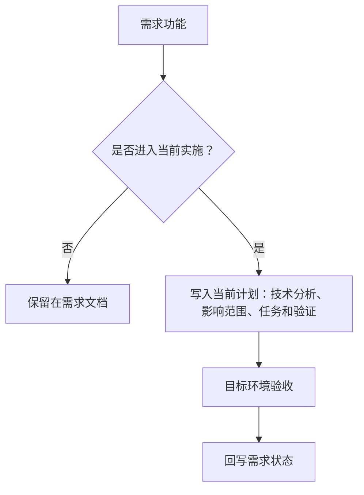

# 详细计划

这里记录已经进入当前实施阶段的技术计划。计划文档负责说明如何实现、影响哪些模块、如何迁移、如何验证和如何回滚；计划规范统一维护在[开发指南 → 章程规范 → 计划文档规范](/charter/plans-spec)。

## 计划与需求的关系

规则摘要：

- 一篇计划对应一篇需求，编号使用 `PLAN-FNOS-###`，并链接到对应 `FNOS-###`。
- 计划只展开已经进入当前实施阶段的功能。
- 每个任务必须关联需求功能和验收条件。
- 计划需要分析当前实现、目标实现、影响范围、迁移方式、风险、验证和回滚。
- 计划状态只表示实施进度，功能是否完成以需求文档中的目标环境验收为准。
- 已完成计划作为历史记录，不回改正文；后续变更写入当前开发中的计划。

完整规则见：[计划文档规范](/charter/plans-spec) 和 [SDD 维护规范](/charter/sdd-workflow)。

## 当前计划文档

| 编号 | 计划文档 | 状态 |
| --- | --- | --- |
| PLAN-FNOS-001 | [DSH 飞牛 NAS 适配](/plans/PLAN-FNOS-001-dsh-fnos-adaptation) | 已完成 |
| PLAN-FNOS-002 | [DSH 应用与插件优化](/plans/PLAN-FNOS-002-dsh-app-plugin-optimization) | 已完成 |
| PLAN-FNOS-003 | [FPK 应用运行设置统一](/plans/PLAN-FNOS-003-fpk-runtime-settings) | 已完成 |
| PLAN-FNOS-004 | [DSH 0.1.5-rc.2 适配与 FPK 运行修复](/plans/PLAN-FNOS-004-dsh-015-rc2-adaptation) | 已完成 |
| PLAN-FNOS-005 | [CodeBuddy 成长任务与本地 DSH](/plans/PLAN-FNOS-005-codebuddy-and-local-dsh) | 已完成 |
| PLAN-FNOS-006 | [安装脚本与安装流程优化](/plans/PLAN-FNOS-006-installation-script-optimization) | 规划中 |
| PLAN-FNOS-007 | [DSH 0.1.7-rc.2 适配与插件错误修复](/plans/PLAN-FNOS-007-dsh-017-rc2-adaptation) | 已完成 |
| PLAN-FNOS-008 | [插件配置统一迁入插件管理页](/plans/PLAN-FNOS-008-plugin-config-in-plugin-manager) | 已完成 |
| PLAN-FNOS-009 | [DSH 0.2.0-rc.2 插件适配](/plans/PLAN-FNOS-009-dsh-020-rc2-adaptation) | 规划中（含授权目录持久化阶段五） |
| PLAN-FNOS-010 | [三方搜索接入与官方兜底](/plans/PLAN-FNOS-010-thirdparty-web-search-failover) | 规划中 |

只有进入当前实施阶段的需求功能才应在本页建立计划。未排期的 P2、后续计划和待确认功能保留在需求清单中。
