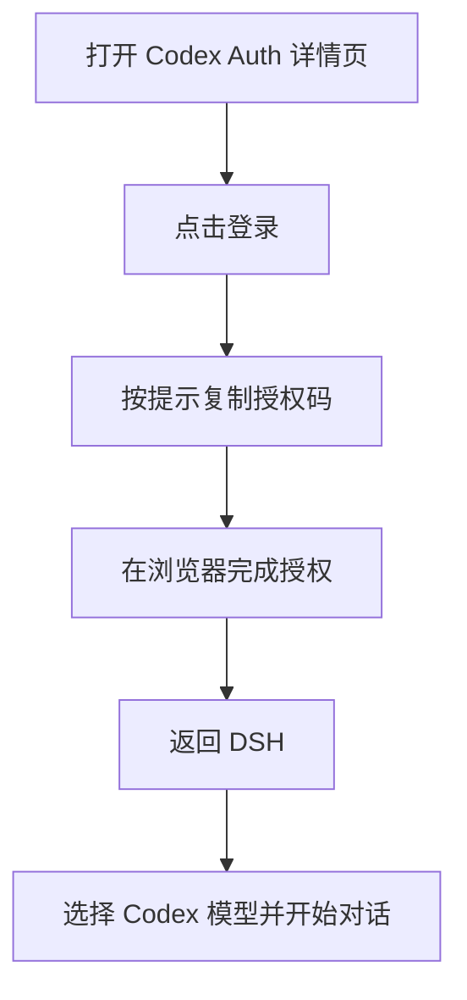

# Codex Auth

`@tnnevol/dsh-codex-auth` 可将 ChatGPT/Codex 账号接入 DSH，用于登录、选择 Codex 模型和查看账号用量。

## 安装

在 fnOS 上使用 DSH 时，插件随应用安装或升级自动安装。其他 DSH 环境可执行：

```sh
dsh plugin --profile web add @tnnevol/dsh-codex-auth@0.2.0-rc.2.0
```

安装后重启 DSH Web profile。插件版本信息见[插件总览](/plugins/)。

## 登录并开始使用

1. 在 DSH 左侧打开「插件」，进入 `Codex Auth` 详情页并点击「登录」。
2. 在打开的浏览器页面完成 Codex 授权；如需输入设备码，点击 DSH 页面中授权码旁的复制按钮，再粘贴到浏览器。
3. 授权完成后返回 DSH，在模型选择器中选择 Codex 模型开始对话。




## 模型与用量

登录后可在模型选择器中选择账号可用的 Codex 模型。可在插件详情页的「全局模型」中设置新会话默认使用的模型和思考强度；对话中仍可临时切换模型。

选择 Codex 模型后，对话输入区附近会显示用量状态。点击可查看剩余额度和重置时间；切换到其他供应商的模型时，该状态不会显示。


## 常见问题

### 授权页面没有打开

允许浏览器打开新标签页后重试。使用 DSH Desktop 时，授权页面会在系统默认浏览器中打开。

### 看不到用量状态

确认当前选择的是 Codex 模型。用量状态只针对当前选中的 Codex 供应商模型显示。

### 登录后没有看到需要的模型

等待模型列表加载；如果页面显示错误提示，可按提示重试登录，或稍后重新打开 Codex Auth 详情页。
