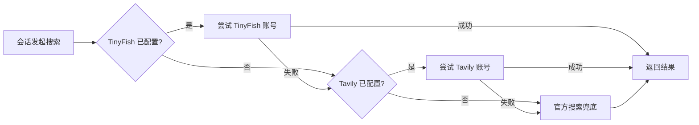

# Failover Search

`@tnnevol/dsh-failover-search` 为 DSH 的会话内网页搜索提供多个搜索来源，并按 **TinyFish → Tavily → 官方搜索** 的顺序自动故障转移。配置三方 key 后，搜索优先由三方服务完成，官方搜索只在前面的来源都不可用时兜底。

同一平台可以配置多个账号：请求在这些账号之间轮转分摊，某个账号额度不足或请求失败时先换同平台其它账号，再落到下一平台。

## 安装

在 fnOS 上使用 DSH 时，插件随应用安装或升级自动安装。其他 DSH 环境可执行：

```sh
dsh plugin --profile web add @tnnevol/dsh-failover-search@0.2.0-rc.2.0
```

安装后重启 DSH Web profile。插件版本信息见[插件总览](/plugins/)。

## 搜索来源与转移顺序

配置 key 后发起搜索时，插件按以下顺序尝试来源，第一个成功的来源返回结果：



- 未配置 key 的来源被直接跳过，不产生等待。
- 一次搜索最多把已配置来源各尝试一遍，不做跨来源重试。
- 用户主动取消的搜索直接中止，不触发转移。
- 全部来源都失败时，模型收到带错误码的失败信息，而不是空结果。

## 配置项说明

全部配置在**插件管理页 → `Failover Search` 详情页的配置区**完成，保存后下一次搜索立即生效，无需重启。设置弹框中没有本插件的配置入口。

下表与插件详情页的表单逐项对应。

### 搜索来源与账号

| 配置项 | 说明 | 取值范围 | 默认值 |
| --- | --- | --- | --- |
| TinyFish 账号 | TinyFish 平台的一个或多个 API key，每项可附备注名（如 `tinyfish-1`）用于展示与日志区分 | 每项为非空字符串；至少 1 项才启用该平台 | 空（平台禁用） |
| Tavily 账号 | Tavily 平台的一个或多个 API key，每项可附备注名 | 同上 | 空（平台禁用） |
| 来源顺序 | 三个来源的尝试顺序；官方搜索固定参与，作为兜底可调整位置但不可移除 | TinyFish、Tavily、官方搜索的任意排列 | TinyFish → Tavily → 官方搜索 |

### 均摊与转移

| 配置项 | 说明 | 取值范围 | 默认值 |
| --- | --- | --- | --- |
| 每来源超时 | 单个账号一次搜索请求的超时时间（毫秒） | 正整数；须小于工具层总预算（60 秒） | 15000 |
| 同平台重试 | 某账号请求失败后，是否继续尝试同平台其它账号 | 开 / 关 | 开 |

### 用量展示与探测

| 配置项 | 说明 | 取值范围 | 默认值 |
| --- | --- | --- | --- |
| 用量刷新间隔 | 平台用量快照的后台刷新周期（分钟） | 正整数（1–60） | 5 |
| 请求前探测 | 是否启用基于用量快照的请求前账号排除 | 开 / 关 | 开 |

## 多账号分摊

同一平台配置多个 key 时，请求按**轮转**方式分摊到各账号，不会集中在单一账号上消耗：

- 某个账号在请求前被探测排除，或请求失败，同一查询内先换同平台其它账号，再落到下一平台；平台顺序不因账号变化而乱序。
- 只配置一个账号时退化为直连，行为与无均摊一致。
- TinyFish 的限流按 API key 计，多 key 会线性扩大每分钟请求容量；Tavily 的套餐配额按账户计，同一账户下的多个 key 不扩大配额，多 key 的价值是失效冗余与单 key 限流分散。

## 用量展示与请求前探测

插件详情页的「平台用量」区块按平台分列各账号：

- **Tavily**：Key 用量、套餐名称与套餐已用/上限。
- **TinyFish**：钱包余额、自动充值状态与搜索单价。

数据带获取时间，来自平台免费查询端点，后台按配置周期自动刷新，不产生平台计费调用。某个账号查询失败时，该账号显示可理解的失败提示，不影响其它账号，也不影响搜索。

探测在**每次搜索前**参考缓存的用量快照：快照显示额度不足或已触限的账号被提前跳过，请求直接落到同平台其它账号或下一平台。快照过期或尚未生成时按「无用量信息」处理，退化为失败后再转移——探测是优化，不会阻塞搜索。

## 结果呈现

三方来源的结果在会话搜索卡片中的呈现与官方来源一致：标题、链接与摘要都会展示；来源返回发布日期时展示日期，未返回时不显示占位内容。结果数量沿用现行搜索上限规则，超出上限时截断。

## 网页抓取兜底

除搜索外，本插件也接管网页抓取（`web_fetch` 工具），采用**本地优先 + 平台兜底**：

| 跳 | 说明 |
| --- | --- |
| 1. 本地 HTTP 抓取 | 官方 provider，行为与未安装插件时完全一致（大小/超时/重定向上限同官方默认） |
| 2. TinyFish Fetch | 本地失败且 TinyFish 已配置账号时启用。服务端真浏览器渲染，对 JS 重度页面可用；**免费**（限 150 URL/分钟） |
| 3. Tavily Extract | 前两跳都失败且 Tavily 已配置账号时启用。计 1 credit / 5 个成功 URL，消耗套餐配额 |

- **为什么需要它**：本地抓取在用户侧网络受限时会被安全策略拒绝（例如代理的 fake-ip DNS 让域名解析到保留段），而平台抓取发生在**平台服务端**，不受本机 DNS/代理/反爬影响。
- **对模型透明**：`web_fetch` 的调用方式与返回结构不变；兜底取回的内容按同样的方式呈现。
- **用户中止**立即中断整条链路，不再尝试后续跳。
- 抓取与搜索互相独立：抓取失败不影响搜索，反之亦然；账号复用同一份配置，无需重复填写。
- 本地抓取成功时不产生任何平台调用（不消耗配额）。

## 凭据与隐私

- 两个平台的 key 以 secret 角色存储，配置表单不回显明文，也不会出现在会话记录或错误信息中。
- 账号列表展示的是 key 的**不可还原掩码**（如 `sk-tin…KFFtn`），用于辨认每一行配的是哪个 key；同平台多个账号时掩码彼此不同。
- 「复制 key」是用户显式触发的单个账号操作：点击时才按「平台 + 代号」取回该账号的明文写入剪贴板，明文不进入页面状态、不落缓存与日志。
- 失败原因只包含平台、状态码与响应片段，不含 key。
- 用量查询只使用平台的免费端点。

## 停用与回滚

禁用或卸载插件后，网页搜索自动恢复为官方来源，不需要手工修改任何配置：插件的组合配置随插件一起失效，搜索来源回落到发行版基线的官方搜索。插件没有独立持久化数据，用量快照与限流记账都在内存中重建。

## 常见问题

### 搜索没有走三方来源

确认已在插件详情页保存了 TinyFish 或 Tavily 的 key。key 为空表示该平台禁用；两个平台都为空时搜索直接使用官方来源。

### 搜索结果变少或缺少日期

TinyFish 的部分查询不返回发布日期，此时卡片不显示日期，这是设计内的降级行为。如果来源返回的是搜索平台自己的相对跳转地址，插件会还原成目标地址；无法还原的条目会被跳过，避免卡片里出现打不开的链接。

### 用量区块显示失败提示

用量查询使用平台免费端点，可能因为网络或平台侧故障失败。失败只影响该账号的展示，搜索仍会正常发起；等待下一次后台刷新即可。

### 提示缺少官方凭据

当三方来源全部失败、且官方搜索也没有可用凭据时会出现该提示。按提示配置 DeepSeek 官方凭据（设置 → 模型中的搜索凭据）后即可恢复兜底能力。

## 相关页面

- [插件总览](/plugins/)
- [插件开发](/development/plugin-development)
- [插件 UI 规范](/charter/plugin-ui-standards)
