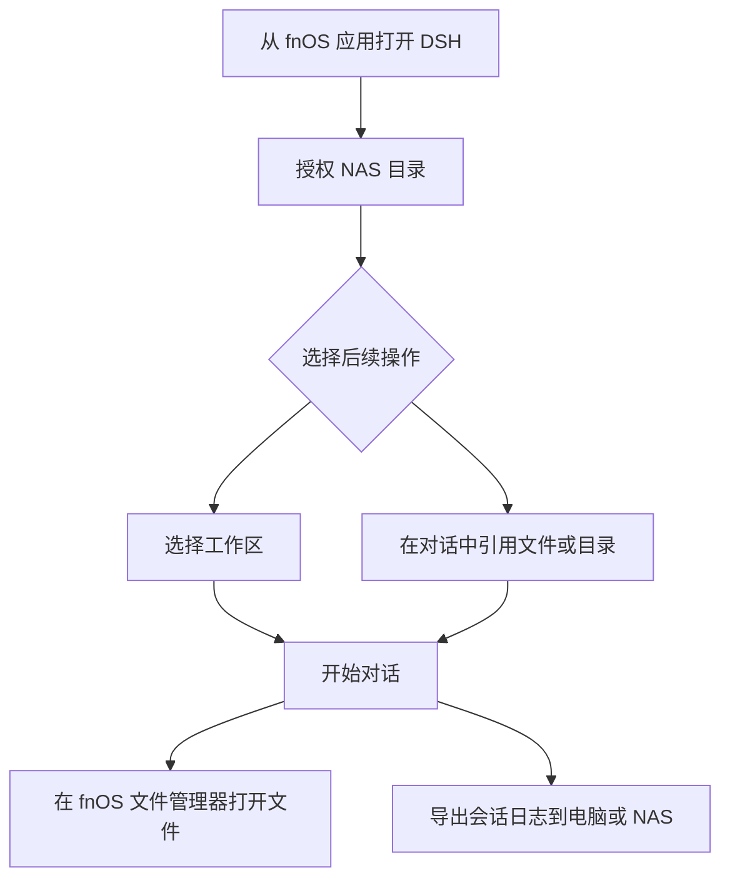

# fnOS

`@tnnevol/dsh-fnos` 为 DSH 提供 fnOS 系统集成，包括访问已授权的 NAS 目录、打开文件和导出会话日志。

## 安装

在 fnOS 上使用 DSH 时，插件随应用安装或升级自动安装。其他 DSH 环境可执行：

```sh
dsh plugin --profile web add @tnnevol/dsh-fnos@0.1.7-rc.2.2
```

安装后重启 DSH Web profile。插件版本信息见[插件总览](/plugins/)。

## 在 fnOS 中使用

文件授权和系统文件操作需要从 fnOS 应用入口打开 DSH。普通浏览器仍可使用 DSH 的基本功能，但无法调用 fnOS 的目录授权和系统文件操作。



## 授权目录与文件

在「插件」中打开 `fnos` 详情页，选择「添加授权目录」并在 fnOS 窗口中确认。授权后可在工作区选择器中使用目录，也可在对话中选择文件或目录作为上下文。

你可以在插件详情页取消自己授予的目录权限；应用提供的共享目录仅供查看，不能从这里取消。

配置区**始终展开**，没有折叠面板（这一页只有这一块内容），也**不自带外层面板**（无边框、无底色）——宿主给详情页座位的容器本来就只负责排布，插件再套一层带边框的卡片会在页面上形成「框里的框」。目录列表固定 **300px** 上限并自行滚动，目录很多时不会把下面的设置项顶出屏幕。

### 三方插件 proxy

详情页底部的「三方插件 proxy」把三方插件的绝对路径 API 统一接入应用网关，由网关按前缀转发到对应服务。标题右侧的 ⓘ 图标可悬浮或键盘聚焦查看完整说明（三行：是什么 / 怎么写 / 举例子）。

- 每行填一个**以 `/` 开头的绝对路径前缀**，保存后刷新页面生效；前缀填到哪一段为止，看插件 API 的第一段即可——API 是 `/plugin-api/get/me`，就填 `/plugin-api`；
- 文本框最多显示 **8 行**，超出后自行滚动；
- 填写后按 `Ctrl+S`（macOS 为 `⌘S`）可直接保存；
- `/api`、`/plugins` 等网关保留路径不可用，保存时会给出提示。


在 fnOS 中点击对话、工具结果或生成文件里的路径，可交由系统文件管理器打开。会话日志菜单支持下载到当前电脑，或导出到已授权的 NAS 目录。


## 主题

DSH 主题设为「跟随系统」时会跟随 fnOS 当前主题；如果在 DSH 中明确选择浅色或深色，则以该选择为准。

## 常见问题

### 授权目录列表为空

确认已从 fnOS 应用入口打开 DSH，并在 fnOS 授权窗口中授予目录访问权限。普通浏览器无法提供完整的 fnOS 文件能力。

### 文件无法打开

确认该路径存在，并且当前 fnOS 用户有权访问。出现在授权目录中不代表目录内的每个文件都存在或可访问。

### 主题没有跟随 fnOS 变化

确认 DSH 主题设置为「跟随系统」；手动选择浅色或深色时，DSH 会优先使用该设置。
