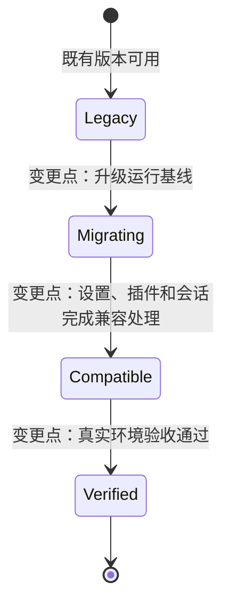
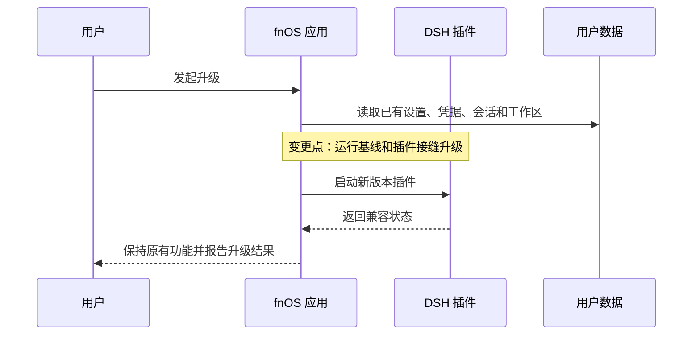
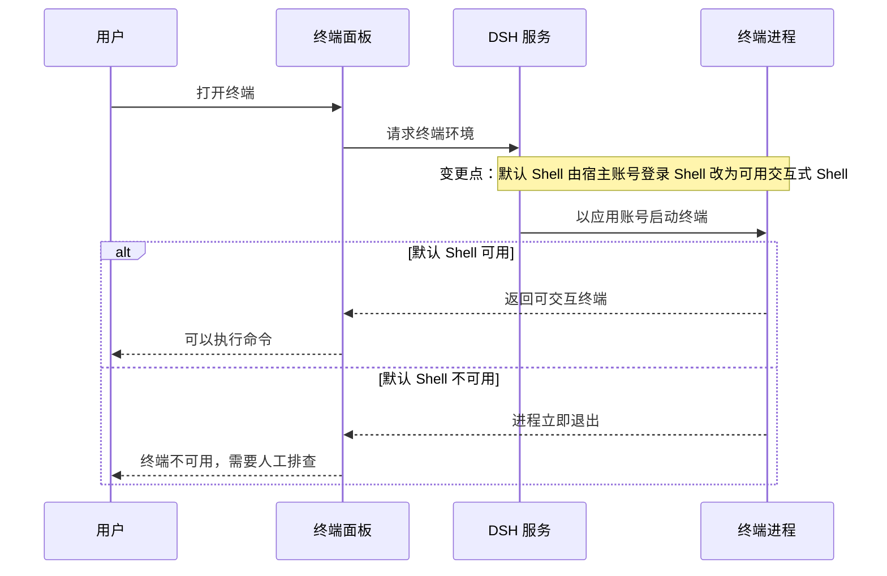

# FNOS-007 DSH 0.1.7-rc.2 适配与插件错误修复

| 项目 | 内容 |
| --- | --- |
| 需求编号 | FNOS-007 |
| 提出日期 | 2026-09-24 |
| 需求状态 | <Badge type="info" text="规划中" /> |
| 关联计划 | [PLAN-FNOS-007 DSH 0.1.7-rc.2 适配与插件错误修复](/plans/PLAN-FNOS-007-dsh-017-rc2-adaptation) |
| 适用范围 | fnOS 应用、四个 DSH 插件、终端、FPK 运行时和文档站 |

## 需求背景

当前应用和插件以 DSH `0.1.5-rc.2` 为运行基线。上游发布 `0.1.7-rc.2` 后，插件安装、设置、工具调用、图片输入、会话读取和 FPK 运行都需要完成兼容处理，否则用户可能遇到插件被拒绝、设置丢失、旧会话打不开或应用升级失败。

本需求的目标是让用户能够安全升级到新基线，并继续使用已有功能和用户数据。具体实现方式、模块影响和迁移步骤由对应计划负责。

## 需求目标

- 应用和四个运行时插件在 DSH `0.1.7-rc.2` 上可以安装、加载和运行。
- 用户升级后，已有设置、凭据、会话、工作区和授权目录保持可用。
- fnOS 应用能够构建、安装、启动、升级和回滚。
- 插件原有的设置、工具调用、图片输入、模型目录和用量能力保持可用。
- 文档站 Mermaid 图表继续可读，并支持既定的交互能力。
- `dshmarket` 首次安装和版本不一致时统一使用 `.npmrc` 配置的 npm 源安装目标精确版本；同版本安装保持幂等。
- fnOS 网关适配 DSH `0.1.7-rc.2` 的文档目录相对路径和认证 Cookie 作用域。
- 用户可以在 fnOS 上正常使用 DSH `0.1.7-rc.2` 提供的侧边栏终端：打开即得到可用 Shell，不需要用户自行排查默认 Shell。
- 终端进程的运行身份和继承环境对用户可预期，不因应用以专用账号运行而出现身份或环境错位。

## 功能列表

| 编号 | 优先级 | 功能 | 用户可观察结果 | 状态 |
| --- | --- | --- | --- | --- |
| FNOS-007-01 | P0 | DSH 运行基线升级 | 应用运行在 `0.1.7-rc.2`，用户可以完成安装和启动 | <Badge type="warning" text="本地完成，待 NAS" /> |
| FNOS-007-02 | P0 | 插件兼容性门禁升级 | 四个插件可以安装，启动后不会被禁用 | <Badge type="warning" text="待 Web/Desktop；仅 fnOS 插件待 NAS" /> |
| FNOS-007-03 | P0 | fnOS 插件设置兼容 | 主题、授权目录和网关路径设置继续可读写 | <Badge type="warning" text="本地完成，待 NAS" /> |
| FNOS-007-04 | P0 | CodeBuddy 工具和图片能力兼容 | 多轮工具对话和图片输入按模型能力正常处理 | <Badge type="warning" text="本地完成，待 Web/Desktop" /> |
| FNOS-007-05 | P0 | Codex Auth 能力兼容 | 登录、凭据、模型目录、用量和图片输入继续可用 | <Badge type="warning" text="本地完成，待 Web/Desktop" /> |
| FNOS-007-06 | P1 | Semi UI 和总览插件兼容 | 共享组件和总览页面可以打开、切换主题和卸载 | <Badge type="warning" text="本地完成，待 Web/Desktop" /> |
| FNOS-007-07 | P0 | FPK 和运行时交付对齐 | FPK 可以构建、安装、启动，内置插件版本一致 | <Badge type="warning" text="本地完成，待 Linux/native 与 NAS" /> |
| FNOS-007-08 | P0 | 旧会话兼容 | 升级后旧会话可以打开和导出 | <Badge type="warning" text="本地完成，待旧会话/NAS" /> |
| FNOS-007-09 | P1 | 设置页和图标资源兼容 | 设置卡片、会话入口和模型图标正常显示 | <Badge type="warning" text="待 Web/Desktop；fnOS 设置卡片待 NAS" /> |
| FNOS-007-10 | P1 | 升级、回滚和真实环境验收 | 升级保留数据，失败可恢复，真实 NAS 有完整证据 | <Badge type="info" text="待 NAS" /> |
| FNOS-007-11 | P1 | 文档站 Mermaid 渲染器替换 | 图表可渲染、缩放、拖拽、复制、下载、全屏并跟随主题 | <Badge type="tip" text="已完成" /> |
| FNOS-007-12 | P1 | dshmarket 精确版本升级 | 新用户获得 `dshmarket@1.65.1`，已安装用户不被覆盖 | <Badge type="warning" text="待完成" /> |
| FNOS-007-13 | P0 | attachment-local 运行时依赖和持久化补丁 | 新用户安装 FPK 时 `@deepseek-ai/dsh-attachment-local` 可被精确定位、校验并完成 `${TRIM_PKGVAR}` 补丁；不再出现“installed DSH dependency does not provide” | <Badge type="warning" text="本地完成，待 NAS" /> |
| FNOS-007-14 | P1 | FPK 构建 workflow 命名统一 | 可复用 FPK 构建 workflow 使用 `.github/workflows/build-app.yml`，发布 workflow 可以正常调用 | <Badge type="tip" text="已完成" /> |
| FNOS-007-15 | P1 | 应用用户下的终端可用性 | 用户在 fnOS 应用内打开侧边栏终端即可得到可用 Shell，并能看到与 DSH 服务一致的运行身份和工作目录 | <Badge type="warning" text="待完成" /> |

### 验收环境范围

- FNOS-007-02 的插件兼容性按插件拆分：`dsh-fnos` 在 DSH Web 与真实 NAS 验收；CodeBuddy、Codex Auth、Semi UI Showcase 在 DSH Web 与 DSH Desktop 验收，不要求 NAS。
- FNOS-007-03 及 FNOS-007-09 中 fnOS 插件设置、授权目录与网关路径在 DSH Web 和真实 NAS 验收；CodeBuddy/Codex Auth、共享 UI 等非 fnOS 插件行为在 DSH Web 与 DSH Desktop 验收。
- FNOS-007-04、05、06、12、30、31、32、34、35 等非 fnOS 插件能力在 DSH Web 与 DSH Desktop 验收；登录和模型目录场景另覆盖真实网络/账号，不把网络条件等同于 NAS 条件。
- FPK、应用安装/升级/卸载、fnOS 生命周期、网关、终端及依赖 `${TRIM_*}` 的行为按各自验收条件在真实 NAS 验收；该要求不扩展到纯插件兼容和 UI 验收。

## 既有功能变更关系

本需求涉及上一运行基线下的既有功能重新处理，变更点集中在“升级后仍保持用户结果”，而不是重新设计用户功能。

上图中的变更点表示本需求相对于既有功能的变化位置；具体技术迁移和影响模块见[对应计划](/plans/PLAN-FNOS-007-dsh-017-rc2-adaptation)。

## 关键交互变更

升级过程必须保持用户数据和已有操作结果。设置和升级的用户交互关系如下：

如果升级或插件启动失败，用户数据不能被自动删除；回滚要求由计划文档定义。

## 终端可用性交互

应用以专用应用账号运行，该账号没有交互式登录能力。终端面板的可用性因此需要在应用侧补齐默认 Shell，用户才可能得到可用结果。终端打开的成功路径和失败路径如下：

上图的变更点表示终端相对于既有版本的变化位置：原约定是默认 Shell 直接取宿主账号的登录 Shell，在专用应用账号下该值不可用；新约定是应用为终端提供可用的交互式 Shell，使用户打开终端即可用。变更不改变终端的运行身份，也不涉及 fnOS 权限模型调整。

## 行为约束

- 升级后的插件安装和启动不能依赖用户预先授予版本豁免。
- 主题、授权目录、网关路径、凭据、模型配置和会话内容的用户可观察行为保持不变。
- 不支持图片的模型必须明确拒绝图片输入，不能静默丢弃。
- 工具调用和工具结果必须保持调用关系，不能因消息模型变化丢失工具结果。
- 文档站图表继续使用 `mermaid` 代码块，由统一的渲染器接管；图表语义不因渲染器替换而改变。
- `dshmarket` 与 `plugins` 使用相同的版本收敛规则：缺失时安装清单版本，版本不一致时升级或降级到清单版本，同版本时保持不变；安装源统一读取由 `wizard_npm_registry` 写入的 `.npmrc`，未配置时使用 npm 官方源。
- FPK 安装回调需要从应用私有 DSH 依赖树解析 `@deepseek-ai/dsh-attachment-local`。目标 DSH 中该包由 `@deepseek-ai/dsh-base` 以生产依赖提供，可能位于嵌套 `node_modules`，因此回调不能假设它一定位于 DSH CLI 包的顶层路径，也不能把 CLI 的 `devDependencies` 当作运行时来源；安装、版本校验和 `TRIM_PKGVAR` 持久化补丁必须使用与 `DSH_VERSION` 对齐的精确版本。
- DSH `0.1.5-rc.2` 升级到 `0.1.7-rc.2` 时，目标依赖树中的 `node-pty` 版本保持 `1.2.0-beta.15`，Node.js 主版本保持 24，`node-gyp` 保持 `11.0.0`；本需求不把 node-pty 版本升级作为独立适配项。
- 虽然 node-pty 版本不变，FPK native 产物仍必须按目标 DSH 基线重新生成并验证：native 配置中的 DSH 版本、锁文件、`node-pty` 版本、`app/node-pty-versions` 和 `app/native/node-pty/<version>/` 必须一致，不能只复用未经目标基线验证的旧 `pty.node`。
- 如果后续 DSH 依赖树或人工配置把 node-pty 升级到其他版本，必须另行完成 node-gyp 编译、native bundle、安装回调版本校验和真实 NAS 的有/无 g++ 两条路径验收；本需求不默认为该变化提供兼容性。
- fnOS 应用以专用应用账号运行，该账号不是可登录账号；终端必须仍然工作，不能因为宿主账号没有交互式登录能力而导致终端不可用。
- 终端进程以应用账号运行，不提升到 root，也不切换到 NAS 普通用户；终端继承的环境变量以 DSH 服务进程为准，环境差异必须在计划中显式声明，不能靠用户猜测。
- 终端的可用性不得依赖用户手动修正默认 Shell 等前置操作；用户在应用内打开终端就应当得到可用结果。

## 不在本次范围内

- 不追踪 `0.1.6-alpha.*`、`0.1.7-alpha.*`、`0.1.5-rc.3` 或后续 DSH 版本。
- 不修改 DSH 官方源码，不维护上游分叉。
- 不把版本豁免作为正式交付方案。
- 不重新设计 fnOS 设置页面，不新增与兼容无关的插件功能。
- 不实现自定义会话迁移器，不手工改写用户会话文件。
- 不改变 fnOS 权限模型、网关路径规则、授权目录 ACL 和应用入口形态。
- 不把本次文档站渲染器替换扩展成 Mermaid 图表内容重写。

## 验收条件与完成状态

### FNOS-007-01

- `FNOS-007-01-AC-01`：应用安装后运行基线为 `0.1.7-rc.2`。
- `FNOS-007-01-AC-02`：应用可以完成启动、停止和升级。
- `FNOS-007-01-AC-03`：安装和升级失败时不删除用户数据。

### FNOS-007-02

- `FNOS-007-02-AC-01`：四个插件都能被接受安装。
- `FNOS-007-02-AC-02`：DSH Web 启动后四个插件均未被禁用。
- `FNOS-007-02-AC-03`：交付不依赖用户侧版本豁免。

### FNOS-007-03

- `FNOS-007-03-AC-01`：升级前的主题偏好升级后仍生效。
- `FNOS-007-03-AC-02`：授权目录可以读取、修改和保存。
- `FNOS-007-03-AC-03`：网关代理路径可以读取、修改和保存。
- `FNOS-007-03-AC-04`：设置写入失败时原值不会被清空或覆盖。

### FNOS-007-04

- `FNOS-007-04-AC-01`：多轮工具调用可以继续完成。
- `FNOS-007-04-AC-02`：工具结果不会丢失，调用关系保持一致。
- `FNOS-007-04-AC-03`：支持图片的模型可以处理图片输入。
- `FNOS-007-04-AC-04`：不支持图片的模型返回明确错误。

### FNOS-007-05

- `FNOS-007-05-AC-01`：Codex 登录和凭据读取正常。
- `FNOS-007-05-AC-02`：模型目录刷新和用量查询正常。
- `FNOS-007-05-AC-03`：已有凭据和模型配置不被覆盖。
- `FNOS-007-05-AC-04`：图片输入能力按模型能力正确处理。

### FNOS-007-06

- `FNOS-007-06-AC-01`：共享 UI 包和总览插件可以构建。
- `FNOS-007-06-AC-02`：总览页面可以打开、切换主题和卸载。
- `FNOS-007-06-AC-03`：卸载后无重复注册和运行时错误。

### FNOS-007-07

- `FNOS-007-07-AC-01`：FPK 构建成功且清单版本一致。
- `FNOS-007-07-AC-02`：native 依赖和安装回调与目标运行时一致。
- `FNOS-007-07-AC-03`：真实 NAS 安装后网关和 DSH Web 可访问。
- `FNOS-007-07-AC-04`：版本、锁文件、清单或产物不一致时构建拒绝发布。
- `FNOS-007-07-AC-05`：FPK 安装前后，应用私有 DSH 运行时依赖树中可解析出与 `DSH_VERSION` 对齐的 `@deepseek-ai/dsh-attachment-local` 生产依赖；该依赖可以是嵌套安装，安装回调不依赖 DSH CLI 包的顶层路径或 `devDependencies`。
- `FNOS-007-07-AC-06`：`attachment-local` 包名和精确版本校验通过后，`${TRIM_PKGVAR}` 持久化补丁可执行且幂等；包缺失、版本不一致或安装失败时以可诊断的非零状态终止，不留下半补丁状态。
- `FNOS-007-07-AC-07`：目标 DSH `0.1.7-rc.2` 依赖树和仓库锁文件中的 `node-pty` 均为 `1.2.0-beta.15`，Node.js 主版本为 24、`node-gyp` 为 `11.0.0`；Linux FPK 构建重新执行 native 准备流程，产出匹配版本目录下的 `pty.node`、可选 `spawn-helper` 和 `node-pty-versions`，安装回调能按版本清单注入并校验 native 文件。
- `FNOS-007-07-AC-08`：node-pty 版本不变不代表跳过 native 验证；FPK 至少完成“内置 native 且 NAS 无 g++”路径验证，并保留“未内置 native 且 NAS 有 g++”路径作为回退验证；若 node-pty 版本发生变化，构建校验必须暴露版本不一致而不是静默复用旧产物。
- `FNOS-007-07-AC-09`：网关代理 DSH `0.1.7-rc.2` 时，入口跳转、文档目录相对资源、API/WebSocket 路径和认证 Cookie 均保持在应用挂载前缀内；上游 `Path=/` Cookie 不得扩散到 NAS 根路径。

### FNOS-007-08

- `FNOS-007-08-AC-01`：升级后旧会话可以打开。
- `FNOS-007-08-AC-02`：旧会话可以导出。
- `FNOS-007-08-AC-03`：插件不改写或删除用户会话文件。

### FNOS-007-09

- `FNOS-007-09-AC-01`：授权目录设置卡片在新设置页中可见可用。
- `FNOS-007-09-AC-02`：会话入口和模型图标正常显示。
- `FNOS-007-09-AC-03`：`/fn` 指令、目录选择和引用插入行为无回归。

### FNOS-007-10

- `FNOS-007-10-AC-01`：升级保留 profile、凭据、工作区、授权目录、插件设置和会话数据。
- `FNOS-007-10-AC-02`：重复安装和升级具有幂等结果。
- `FNOS-007-10-AC-03`：升级失败可诊断并可回滚到可运行状态。
- `FNOS-007-10-AC-04`：本地、FPK 和真实 NAS 验收证据完整可追溯。

### FNOS-007-11

- `FNOS-007-11-AC-01`：文档站全部 Mermaid 图表正常渲染。
- `FNOS-007-11-AC-02`：图表支持缩放、拖拽、重置、复制、下载和全屏。
- `FNOS-007-11-AC-03`：图表跟随明暗主题切换，工具栏文案为中文。
- `FNOS-007-11-AC-04`：旧构建期渲染器及其依赖链不再作为文档包依赖。

### FNOS-007-12

- `FNOS-007-12-AC-01`：发布清单、构建校验常量和当前文档中的 `dshmarket` 版本均为 `1.65.1`。
- `FNOS-007-12-AC-02`：版本不一致时构建拒绝发布。
- `FNOS-007-12-AC-03`：新用户获得精确版本 `dshmarket@1.65.1`。
- `FNOS-007-12-AC-04`：已安装 `dshmarket` 与清单版本一致时跳过安装并保留配置；版本不一致时按清单版本升级或降级，不执行卸载后重装。
- `FNOS-007-12-AC-05`：`plugins` 与 `bundled/dshmarket` 的 registry 安装都使用同一份 `.npmrc`；`wizard_npm_registry` 有值时使用该源，未配置时使用 `https://registry.npmjs.org/`。

### FNOS-007-13

- `FNOS-007-13-AC-01`：对目标 DSH `0.1.7-rc.2` 的生产安装进行检查时，能从应用私有 DSH 依赖树（包括 `dsh-base` 的嵌套依赖目录）解析 `@deepseek-ai/dsh-attachment-local`，不再因只检查顶层路径而误报缺失。
- `FNOS-007-13-AC-02`：安装回调读取到的包名和版本与 `DSH_VERSION` 对齐后才执行补丁；日志不再出现 `The installed DSH dependency does not provide @deepseek-ai/dsh-attachment-local`。
- `FNOS-007-13-AC-03`：`attachment-local` 的生产依赖（包括图片处理所需的可选 native 依赖）在目标架构上可安装或明确失败；安装失败不删除旧运行时和用户数据。
- `FNOS-007-13-AC-04`：附件根目录、共享缓存和耐久边界仍位于 `${TRIM_PKGVAR}` 下；补丁重复执行、包缺失和版本不一致均有自动化覆盖。

### FNOS-007-14

- `FNOS-007-14-AC-01`：可复用 FPK workflow 的受版本管理文件名为 `.github/workflows/build-app.yml`，workflow 的 `workflow_call` 输入、权限、构建步骤和产物上传行为保持不变。
- `FNOS-007-14-AC-02`：`build-release.yml` 使用 `./.github/workflows/build-app.yml` 调用构建 workflow；当前发布文档和 workflow 配置不再引用旧文件名 `build-dsh-fn.yml`。
- `FNOS-007-14-AC-03`：workflow 重命名不改变 DSH native、FPK 构建、版本化产物命名和 Release 上传流程。

### FNOS-007-15

- `FNOS-007-15-AC-01`：应用运行在专用应用账号下时，用户在应用内打开侧边栏终端即可得到可交互 Shell，不再出现账号不可用提示。
- `FNOS-007-15-AC-02`：终端不需要用户在打开前手动切换 Shell 或修改系统级设置；首次打开即得到可用结果。
- `FNOS-007-15-AC-03`：终端进程的运行身份与应用服务身份一致，且不提升为 root、不切换为 NAS 普通用户。
- `FNOS-007-15-AC-04`：终端继承的工作目录与环境变量与 DSH 服务保持一致；确需存在的差异在面向用户的文档中显式说明。
- `FNOS-007-15-AC-05`：终端在真实 NAS 上可以完成打开、执行命令和关闭；应用重启后终端仍然可用。

### FNOS-007-16

- `FNOS-007-16-AC-01`：执行 `pnpm start -- --web` 时，仓库本地 DSH Web profile、根 `node_modules` 和 pnpm 临时项目目录中的历史悬空软链接不会阻断 Turbo watcher 初始化。
- `FNOS-007-16-AC-02`：启动前后只清理目标已不存在的生成软链接，不删除有效依赖、源码、用户 profile、凭据、会话或工作区数据。
- `FNOS-007-16-AC-03`：所有由默认 pnpm catalog 维护的 workspace 依赖在源 manifest 中使用 `catalog:` 或命名 catalog 协议；`@earendil-works/pi-ai` 不得回退为固定范围。已完成的 DSH peer 精确版本兼容契约保持不变。
- `FNOS-007-16-AC-04`：catalog 一致性在构建门禁和自动化测试中覆盖 dependencies、devDependencies、peerDependencies、optionalDependencies，并对 DSH peer 精确兼容例外作显式校验。

### FNOS-007-17

- `FNOS-007-17-AC-01`：CodeBuddy、Codex Auth 和 Semi UI Showcase 的 DSH 依赖清单只声明源码、客户端注入或宿主服务契约实际使用的包。
- `FNOS-007-17-AC-02`：Codex Auth 不再声明未直接使用的 `dsh-invariants`、`dsh-launch-environment`、`dsh-scope`、`dsh-timeout` 和 `schemastery`。
- `FNOS-007-17-AC-03`：宿主共享的 Cordis、DSH 服务、Remote、UI seam 和模型能力继续使用 `peerDependencies`；不因清理传递依赖而搬到 `dependencies` 生成重复 DSH runtime。
- `FNOS-007-17-AC-04`：`package.json`、`compatibility.json`、开发依赖和自动化检查保持一致，插件仍可完成类型检查、测试、构建和 profile 安装。

### FNOS-007-18

- `FNOS-007-18-AC-01`：DSH 浏览器认证 Cookie 保留上游 `Path=/` 属性，不被网关改写为应用挂载路径。
- `FNOS-007-18-AC-02`：通过 `/app/fn-deepseek-harness/` 打开的页面，其 `/api/*`、Remote WebSocket、设置和凭据接口都能复用同一 DSH 浏览器会话，不因 Cookie 路径返回 401。
- `FNOS-007-18-AC-03`：Cookie 路径修复不改变 Location、HTML、静态资源和 WebSocket 的应用前缀重写行为。

### FNOS-007-19

- `FNOS-007-19-AC-01`：终端 Shell 和字符集环境由网关启动 DSH Web 时统一注入，不再由 `apps/fn-deepseek-harness/cmd/main` 重复适配。
- `FNOS-007-19-AC-02`：`SHELL` 使用 PATH 中实际解析到的第一个 `bash` 路径作为默认 Shell，与 DSH 终端候选解析结果一致，不显示重复 bash，也不显示 nologin。
- `FNOS-007-19-AC-03`：网关为 DSH 子进程注入本机可用的 UTF-8 `LANG`/`LC_CTYPE`，并清除冲突的非 UTF-8 `LC_ALL`，中文工作目录和终端输出不乱码。

### FNOS-007-20

- `FNOS-007-20-AC-01`：网关按当前 DSH upstream authority 识别浏览器认证 Cookie，不把其他 authority 或旧版本遗留的 `dsh-auth-*` Cookie 误判为有效会话。
- `FNOS-007-20-AC-02`：检测到旧 Cookie 时，首页请求自动重新使用当前 launch token 完成 Cookie exchange，不再因旧 Cookie 阻止 token 注入。
- `FNOS-007-20-AC-03`：DSH WebSocket、Settings、Credentials、DynamicCordis 和 Model Catalog 请求在重新认证后不再持续返回 401；旧 Cookie 恢复流程保持幂等。

### FNOS-007-21

- `FNOS-007-21-AC-01`：网关与 DSH Web 子进程保持相同的 `HOME`，均指向应用共享运行目录；`DSH_HOME` 单独指向应用包用户的 Harness 数据目录。
- `FNOS-007-21-AC-02`：DSH Web 不再把 `HOME` 错误覆盖为 `DSH_HOME`，pnpm/npm 运行环境、profile 数据和应用共享文件布局保持既有边界。
- `FNOS-007-21-AC-03`：网关环境构造在 `HOME` 缺失时才回退到 `DSH_HOME`，并以自动化测试验证两个变量可同时存在且值不同。

### FNOS-007-22

- `FNOS-007-22-AC-01`：执行 `pnpm run build` 选择 fnOS FPK 且工作区只有一个 FPK 应用时，CLI 自动选中该应用并跳过应用选择提示。
- `FNOS-007-22-AC-02`：工作区存在多个 FPK 应用时，CLI 继续显示可多选的应用选择提示，既有选择行为不变。
- `FNOS-007-22-AC-03`：单应用自动选择由自动化测试覆盖，且不会调用交互式 FPK 应用选择器。

### FNOS-007-23

- `FNOS-007-23-AC-01`：首次安装向导不再展示可选的 DSH 监听地址；应用服务默认仅监听 `127.0.0.1`。
- `FNOS-007-23-AC-02`：安装向导的第一项为 npm 镜像源选择，原有 npm 官方源默认值和镜像选项保持不变。
- `FNOS-007-23-AC-03`：监听端口、可信访问地址和 npm 源的安装配置行为保持不变；现有运行时在未提供监听地址时继续回退到 `127.0.0.1`。

### FNOS-007-24

- `FNOS-007-24-AC-01`：DSH 认证恢复时，网关不仅重新交换当前 launch token，还会删除历史版本按应用挂载路径写入的同名 Cookie。
- `FNOS-007-24-AC-02`：恢复响应同时保留 DSH 新生成的根路径 Cookie，不影响正常 Cookie 登录和其他响应头。
- `FNOS-007-24-AC-03`：浏览器同时携带旧挂载路径 Cookie 和新根路径 Cookie 时，不需要用户手动清理 Cookie 即可完成页面加载并访问设置接口。

### FNOS-007-25

- `FNOS-007-25-AC-01`：FPK 安装回调将 `@trimjs/trim-cli@latest` 作为全局 npm 包安装到应用的 npm 全局前缀，不将其加入 DSH profile 或按插件方式管理。
- `FNOS-007-25-AC-02`：trim-cli 使用安装向导配置的 `.npmrc` registry；安装完成后校验全局包目录存在，再复制包内 Skill。
- `FNOS-007-25-AC-03`：Skill 安装到当前应用运行时 `${HOME}/.agents/skills/trim-cli`；缺失的父目录自动创建，重复安装可安全更新且不残留旧文件。
- `FNOS-007-25-AC-04`：trim-cli 安装或 Skill 复制失败时安装回调以非零退出，不执行 DSH profile 插件替代安装。

### FNOS-007-26

- `FNOS-007-26-AC-01`：FPK 发布清单不再包含 `@tnnevol/dsh-semi-ui-showcase`，安装回调不会将其安装到 DSH profile。
- `FNOS-007-26-AC-02`：FPK 构建门禁只校验并归档 CodeBuddy、Codex Auth 和 fnOS 三个内置运行时插件。
- `FNOS-007-26-AC-03`：移除 FPK 内置归档不删除 Semi UI 共享包、Showcase 插件源码、独立插件构建能力或 CLI 的历史插件目标别名。

### FNOS-007-27

- `FNOS-007-27-AC-01`：`published-dsh-plugins.json` 不再声明或维护 npm `registry` 字段。
- `FNOS-007-27-AC-02`：插件、dshmarket 和全局 trim-cli 的 npm 安装统一读取应用 `$HOME/.npmrc`；安装向导选择的源只写入该配置文件。
- `FNOS-007-27-AC-03`：DSH Web 子进程的 `NPM_CONFIG_USERCONFIG` 与网关 `HOME` 保持一致，同时继续保持 `HOME` 与 `DSH_HOME` 的数据边界独立。

### FNOS-007-28

- `FNOS-007-28-AC-01`：`wizard/config`、`wizard/upgrade` 与 `wizard/install` 使用相同的运行配置字段集合、类型、默认值和校验规则，不再显示已移除的 `wizard_host`。
- `FNOS-007-28-AC-02`：三个向导的 npm 镜像源 item 均位于字段列表最后，且 npm label 均不包含“（可选）”。

### FNOS-007-29

- `FNOS-007-29-AC-01`：FPK 替换自有插件归档时，remove/add 操作可绕过当前 lockfile 的 `minimumReleaseAge` 校验，不因三方插件的新发布时间阻断自有插件安装。
- `FNOS-007-29-AC-02`：remove 操作只传递插件名称，不拼接版本号；add 操作仍使用 FPK 文件归档或清单精确版本。
- `FNOS-007-29-AC-03`：`source: "thirdparty"` 的 registry 插件安装/升级使用同一受控 release-age 例外，普通版本收敛、同版本跳过和 `.npmrc` registry 行为保持不变。

### FNOS-007-30

- `FNOS-007-30-AC-01`：Codex Auth 登录点击后立即打开安全校验过的 OpenAI device-code 授权页，不先展示依赖 Host 网络请求完成的 `about:blank` 空白页。
- `FNOS-007-30-AC-02`：DSH Host 到 OpenAI 的 device-code 请求异步失败或超时时，授权页不被业务逻辑误关，原页面显示可诊断的登录错误；网络恢复后可重新发起登录。该能力在 DSH Web 与 Desktop 验收，不要求仅因使用 NAS 运行 Web 就单独增加 NAS 门槛。
- `FNOS-007-30-AC-03`：授权页 URL 固定为 `https://auth.openai.com/codex/device`，Host 仍校验 provider 返回的授权 URL 为安全 HTTPS URL，授权轮询和取消逻辑保持不变。

### FNOS-007-31

- `FNOS-007-31-AC-01`：Codex Auth 的静态默认模型列表更新到当前 `0.1.7-rc.2` profile 的模型基线，包含 GPT-6 Astra、Sol、Luna 及现有 GPT-5.6/5.5 模型，不再保留已过时的 GPT-5.3/5.4 默认条目。
- `FNOS-007-31-AC-02`：Codex Auth 设置页移除手动“刷新模型目录”按钮；登录成功后以及打开已登录页面时，自动从 ChatGPT 账号同步一次模型目录。
- `FNOS-007-31-AC-03`：自动同步成功后，消息框的可用模型弹框与 Codex Auth 全局模型选择器都从同一份最新 DSH 模型目录读取；同步失败保留上一次有效目录并显示错误。

### FNOS-007-32

- `FNOS-007-32-AC-01`：模型设置页中 Codex provider 的“获取可用模型”弹框与 Codex Auth 全局模型选择器使用同一份 DSH 动态模型目录。
- `FNOS-007-32-AC-02`：Codex provider 的目录桥接只影响 `llm-pi-ai` 下的 `openai-codex`，其他 provider 和普通 endpoint discovery 继续使用 DSH 原生逻辑。
- `FNOS-007-32-AC-03`：登录后模型目录自动同步完成后，两个模型选择界面显示的模型 ID 和名称一致，不再回退到 pi-ai 内置旧列表。

### FNOS-007-33

- `FNOS-007-33-AC-01`：在 fnOS 设置卡片的「三方插件 API URL 反代」文本框中保存路径时，请求成功并回显规范化后的路径列表，不再出现空白 `400 Bad Request`。
- `FNOS-007-33-AC-02`：保存成功后，网关读取的 `${TRIM_PKGVAR}/gateway/path-allowlist.json` 与 DSH 设置中的 `gatewayProxyPaths` 内容一致，网关无需重启即可生效。
- `FNOS-007-33-AC-03`：提交非法路径时返回明确的 `invalid-gateway-proxy-paths` 错误，用户看到「路径不合法」提示而不是空白失败。
- `FNOS-007-33-AC-04`：设置写入失败时原文件与设置值都保持不变，接口返回可诊断的 JSON 错误，不返回无响应体的 400。
- `FNOS-007-33-AC-05`：插件与网关对允许清单文件的 `version` 判定一致；不支持的版本被拒绝而不是被静默改写为 `version: 1`。
- `FNOS-007-33-AC-06`：fnOS 插件的其余浏览器接口在遇到意外异常时返回可诊断的 JSON 错误，不以无响应体的 400 作为用户可见结果。

### FNOS-007-34

- `FNOS-007-34-AC-01`：使用 `--dsw-specific-menu` 的气泡类浮层（Semi Popover）在浅色和深色主题下都呈现磨砂背景，不再能直接看穿其背后的页面内容。
- `FNOS-007-34-AC-02`：磨砂效果使用 DSH 官方配套变量 `--dsw-menu-backdrop-filter`，并在该变量缺失时回退到等价的 `blur(40px) saturate(150%)`，不写死与官方漂移的数值。
- `FNOS-007-34-AC-03`：Safari 18 之前的版本仍能获得磨砂效果；交付的样式表同时包含标准属性与 `-webkit-` 前缀形式，且前缀声明不会被构建流程静默丢弃。
- `FNOS-007-34-AC-04`：依赖 `@tnnevol/dsh-semi-ui` 的四个插件产物都包含更新后的样式，不出现共享包已修复而插件仍内联旧样式的情况。

### FNOS-007-35

- `FNOS-007-35-AC-01`：Codex Auth 声明的每个模型都自带完整能力元数据（输入模态、上下文窗口、最大输出和思考等级），不依赖 DSH 内置 pi-ai 目录恰好描述该模型 ID。
- `FNOS-007-35-AC-02`：`gpt-6-sol` 与 `gpt-6-luna` 在模型选择器中提供思考等级，且 `input` 为 `text, image`；不再因为这两个 ID 不在 pi-ai 目录中而回落到 `reasoning: false`、`input: ["text"]`、`contextWindow: 262144`。
- `FNOS-007-35-AC-03`：「恢复默认模型」清空 DSH 设置覆盖后，回落到的静态条目描述的上下文窗口、图文输入和思考等级与模型真实能力一致。
- `FNOS-007-35-AC-04`：`reasoningEfforts` 按模型独立声明；`off` 的写法与模型真实语义一致（不支持 `off` 的模型不声明，支持的模型用 `off: null` 表示「不发送思考参数」，需要发送具体值时用 `off: none`）。
- `FNOS-007-35-AC-05`：模型能力只有一份事实来源。插件声明的默认条目、设置页「获取可用模型」返回的候选、以及账号同步写回的条目，三者描述的能力必须一致；任何一处漂移都必须让自动化检查失败，而不是静默降级成「只有文本输入」和内置默认窗口。
- `FNOS-007-35-AC-06`：用户层已经保存过一份缺少能力字段的模型列表时，用户不需要手工改配置：模型选择器、上下文窗口和图片输入仍按真实能力呈现，且用户自己增删的模型、顺序和自定义名称不被改动。

## 完成状态

| 功能分组 | 状态 | 说明 |
| --- | --- | --- |
| 运行基线和插件门禁 | 规划中 | FNOS-007-01、02 |
| 插件接缝和 UI 兼容 | 规划中 | FNOS-007-03 至 06、09 |
| FPK、会话、升级和验收 | 规划中 | FNOS-007-07、08、10 |
| 文档站 Mermaid 渲染器 | 已完成 | FNOS-007-11，保留历史验收结果 |
| dshmarket 插件版本兼容 | 待 DSH Web/Desktop 验收 | FNOS-007-12 |
| FPK workflow 命名统一 | 已完成 | FNOS-007-14 |
| 应用用户下的终端可用性 | 待完成 | FNOS-007-15 |
| 本地 DSH Web 启动与 catalog 门禁 | 本地完成，待纳入完整回归 | FNOS-007-16 |
| 插件 DSH 依赖清理 | 本地完成，待纳入完整回归 | FNOS-007-17 |
| 网关 DSH Cookie 认证 | 本地完成，待 NAS 回归 | FNOS-007-18 |
| 网关终端 Shell 与字符集环境 | 本地完成，待 NAS 回归 | FNOS-007-19 |
| 网关旧 Cookie 认证恢复 | 本地完成，待 NAS 回归 | FNOS-007-20 |
| 网关与 DSH Web 环境边界 | 本地完成，待 NAS 回归 | FNOS-007-21 |
| FPK 单应用构建选择 | 本地完成 | FNOS-007-22 |
| 安装向导监听地址与 npm 源顺序 | 本地完成 | FNOS-007-23 |
| 网关旧挂载路径 Cookie 清理 | 本地完成，待 NAS 回归 | FNOS-007-24 |
| 全局 trim-cli 与 Agent Skill | 本地完成，待 NAS 回归 | FNOS-007-25 |
| FPK 移除 Semi UI Showcase 内置插件 | 本地完成 | FNOS-007-26 |
| npm registry 统一由 HOME/.npmrc 管理 | 本地完成，待 NAS 回归 | FNOS-007-27 |
| 安装/配置向导字段统一 | 本地完成，待 NAS 回归 | FNOS-007-28 |
| NAS 安装 release-age 兼容 | 本地完成，待 NAS 回归 | FNOS-007-29 |
| Codex Auth 授权页打开 | 本地完成，待 DSH Web/Desktop 与真实网络回归 | FNOS-007-30 |
| Codex Auth 模型目录自动同步 | 本地完成，待 DSH Web/Desktop 与真实网络回归 | FNOS-007-31 |
| Codex 模型设置弹框与全局模型目录统一 | 本地完成，待 DSH Web/Desktop 回归 | FNOS-007-32 |
| 三方插件 API 反代配置保存 | 本地完成，待 NAS 回归 | FNOS-007-33 |
| 气泡浮层磨砂背景 | 本地完成，待 DSH Web/Desktop 视觉回归 | FNOS-007-34 |
| Codex 模型能力元数据补全 | 本地完成，待 DSH Web/Desktop/账号回归 | FNOS-007-35 |

## 变更记录

| 日期 | 变更 | 说明 |
| --- | --- | --- |
| 2026-09-24 | 新增 FNOS-007 | 建立 DSH `0.1.7-rc.2` 适配需求。 |
| 2026-09-27 | 纳入 dshmarket 版本升级 | 将 `dshmarket` 精确版本升级纳入当前开发中的 FNOS-007，不修改已完成需求。 |
| 2026-09-27 | 重整需求边界 | 删除技术实现、源码路径和迁移步骤，保留功能、用户结果和验收条件；详细实现转入 PLAN-FNOS-007。 |
| 2026-09-27 | 完成本地实现和自动化验证 | 四插件、FPK 版本门禁、设置/消息/UI 接缝、嵌套 attachment-local 解析和幂等补丁已实现；本地证据见 [`FNOS-007-local-automated-2026-09-27`](/validation/FNOS-007-local-automated-2026-09-27)，Linux native 与真实 NAS 验收仍未冒充完成。 |
| 2026-09-27 | 补充 DSH 0.1.7 网关挂载适配 | 对齐官方文档目录相对路径代理契约，增加认证 Cookie 的应用挂载路径隔离，并补充网关回归测试。 |
| 2026-09-27 | 统一 dshmarket registry 与版本收敛规则 | `dshmarket` 与普通 `plugins` 均使用 `.npmrc` 的 npm 源；版本不一致时按清单版本升级或降级，同版本保持幂等。 |
| 2026-09-27 | 纳入终端可用性 | 新增 FNOS-007-15：DSH `0.1.7-rc.2` 提供终端能力，但应用以专用应用账号运行，需保证用户在 fnOS 内打开终端即可得到可用 Shell，且终端身份与环境对用户可预期。 |
| 2026-09-27 | 修复本地 DSH Web 启动与 catalog 漂移 | 新增 FNOS-007-16：启动前清理仓库本地生成树中的悬空软链接，避免 Turbo watcher 因历史 `.dsh`、`node_modules` 或 pnpm 临时项目链接失败；统一校验 catalog 维护依赖，并将 `@earendil-works/pi-ai` 改为 `catalog:`，保留既有 DSH peer 精确版本发布契约。 |
| 2026-09-27 | 清理插件未使用 DSH 依赖 | 新增 FNOS-007-17：审计三个非 fnOS 插件的源码、客户端注入和宿主服务契约；从 Codex Auth 的 peer、devDependencies 与 compatibility 清单移除 5 个未直接使用的传递依赖，保留 peer 作为宿主共享能力契约。 |
| 2026-09-28 | 修复网关 DSH 浏览器认证 Cookie | 新增 FNOS-007-18：移除网关将上游 `Set-Cookie: Path=/` 改写为应用挂载路径的行为，避免 DSH `0.1.7-rc.2` 的 Host 绑定浏览器会话无法被 `/api`、WebSocket 和设置接口复用。 |
| 2026-09-28 | 将终端环境适配迁移到网关 | 新增 FNOS-007-19：移除 `cmd/main` 中的 Shell/locale 适配，改由网关为 DSH Web 子进程选择 PATH 一致的 bash 并注入 UTF-8 环境，避免重复 bash 与中文路径乱码。 |
| 2026-09-28 | 修复旧 Cookie 导致的 DSH 401 | 新增 FNOS-007-20：网关不再用任意 `dsh-auth-*` Cookie 判断当前会话，而是按当前 upstream authority 的签名 Cookie 名称判断；旧 Cookie 自动触发新的 launch token exchange。 |
| 2026-09-28 | 修正网关与 DSH Web 的 HOME 边界 | 新增 FNOS-007-21：`DSH_HOME` 保持 `TRIM_PKGHOME`，`HOME` 继承网关的 `TRIM_APPDEST_VOL/@appshare/fn-deepseek-harness`，避免 DSH Web 将两个数据根错误合并。 |
| 2026-09-28 | 优化单应用 FPK 构建交互 | 新增 FNOS-007-22：工作区只有一个 FPK 应用时自动选择并跳过应用选择提示；多应用场景继续保留原多选流程。 |
| 2026-09-28 | 收敛安装向导监听地址 | 新增 FNOS-007-23：移除首次安装向导中的监听地址选择，默认仅使用 `127.0.0.1`，并将 npm 镜像源选择移到第一项；不修改已完成的应用设置和升级向导契约。 |
| 2026-09-28 | 补充旧挂载路径 Cookie 清理 | 新增 FNOS-007-24：修复历史版本已写入应用路径 Cookie 时，网关仅重新交换 token 但未删除旧 Cookie 的问题；恢复响应同时过期旧路径 Cookie 和保留新的根路径 Cookie。 |
| 2026-09-28 | 新增全局 trim-cli 与 Skill 安装 | 新增 FNOS-007-25：将 `@trimjs/trim-cli@latest` 与 DSH profile 插件分离，安装到应用 npm 全局前缀，并把包内 `skill` 复制到 `${HOME}/.agents/skills/trim-cli`。 |
| 2026-09-28 | 移除 Semi UI Showcase FPK 内置插件 | 新增 FNOS-007-26：发布清单和 FPK 构建门禁只保留 CodeBuddy、Codex Auth、fnOS 三个内置插件；Semi UI Showcase 保留独立开发和构建能力。 |
| 2026-09-28 | 统一 npm registry 配置来源 | 新增 FNOS-007-27：删除发布清单中的 `registry` 字段，统一使用应用 `$HOME/.npmrc`，并让安装回调、升级回调和 DSH Web 继承同一配置位置。 |
| 2026-09-28 | 统一安装/配置/升级向导字段 | 新增 FNOS-007-28：`wizard/config`、`wizard/upgrade` 与 `wizard/install` 统一端口、可信访问地址和 npm 源字段，三个向导均将 npm 源放在最后并移除“（可选）”文案。 |
| 2026-09-28 | 修复 NAS 安装 release-age 阻断 | 新增 FNOS-007-29：FPK 归档替换和 thirdparty registry 收敛使用受控的 `minimum-release-age=0` 参数，避免新发布 dshmarket 阻断 remove/add；remove 保持只传包名。 |
| 2026-09-28 | 修复 Codex Auth 空白授权页 | 新增 FNOS-007-30：点击登录时立即打开固定的 OpenAI device-code 页面，解除授权页导航对 NAS 异步 device-code 请求的依赖；网络错误保留在原页面显示。 |
| 2026-09-28 | 更新 Codex Auth 模型目录同步 | 新增 FNOS-007-31：更新默认模型基线，移除手动刷新按钮，登录后自动同步账号模型，并通过 DSH 设置变更事件刷新可用模型弹框。 |
| 2026-09-28 | 统一 Codex 模型弹框数据源 | 新增 FNOS-007-32：修复官方 Models 页面仍读取 pi-ai 静态 Codex 目录的问题，让 provider 弹框与 Codex Auth 全局模型选择器共用 DSH 动态目录。 |
| 2026-09-28 | 修复三方插件 API 反代配置保存 | 新增 FNOS-007-33：`dsh-fnos` 只导出类型 `Config` 导致 DSH 设置服务找不到该命名空间的运行时 schema，`settings.update('dsh-fnos', …)` 抛错并被 DSH webserver 转成空白 400，反代路径因此无法保存；同时修复允许清单写入并发覆盖、session-log 路由异常逃逸、插件与网关 `version` 判定漂移，并给其余浏览器接口补上兜底错误响应。本地证据见 [`FNOS-007-33-local-automated-2026-09-28`](/validation/FNOS-007-33-local-automated-2026-09-28)。 |
| 2026-09-29 | 补全 Codex 模型能力元数据 | 新增 FNOS-007-35：`cordis.patch.yml` 的 `models` 整体替换内置目录，只写 `id`/`name` 的条目会丢失思考等级、图文输入和上下文窗口——`gpt-6-sol`、`gpt-6-luna` 在 pi-ai `0.87.0` 及更早版本的 Codex 目录中不存在，因此回落成 `reasoning: false`、`input: ["text"]`、`contextWindow: 262144`，表现为「新模型思考等级缺失」。给七个条目补上逐模型的 `input`、`contextWindow`、`maxTokens` 和 `reasoningEfforts`，取值对齐 pi-ai `0.87.1` 目录，使「恢复默认模型」同样回到真实能力。上游 `dsh-llm-pi-ai`（含 `0.2.0-rc.1`）能力解析逻辑未变，该元数据必须在 profile 中声明。本地证据见 [`FNOS-007-35-local-automated-2026-09-29`](/validation/FNOS-007-35-local-automated-2026-09-29)。 |
| 2026-09-29 | 气泡浮层增加磨砂背景 | 新增 FNOS-007-34：DSH `0.1.7-rc.2` 把 `--dsw-specific-menu` 从 `--dsw-alias-bg-layer-3`（不透明）改为 `--dsw-menu-surface-fill`（浅色 `#f8f9fa94`、深色 `#43454a73`），使用该变量的气泡退化成半透明、可看穿背后内容。给 `@tnnevol/dsh-semi-ui` 的气泡浮层补上官方配套的 `--dsw-menu-backdrop-filter` 磨砂，并保留 `-webkit-` 前缀以覆盖 Safari 18 之前的版本。本地证据见 [`FNOS-007-34-local-automated-2026-09-29`](/validation/FNOS-007-34-local-automated-2026-09-29)。 |
| 2026-09-29 | 明确插件目标验证环境 | 将 `dsh-fnos` 与网关相关验收限定在真实 NAS；CodeBuddy、Codex Auth、Semi UI 等非 fnOS 插件改为 DSH Web 与 Desktop 验收，混合验收项按模块分别记录。 |
| 2026-09-29 | 收敛 Codex 模型能力来源并自愈历史覆盖 | 扩展 FNOS-007-35：模型能力此前有两份副本——插件补丁里是全的，设置页「获取可用模型」弹框的候选却只有 `id`/`name`（客户端桥接丢字段），于是「添加所选」生成的模型行缺 `input`/`contextWindow`/`maxTokens`/`reasoningEfforts`；这些行一旦保存，用户层的 `models` 就整体替换掉插件基线，选择器随即显示灰色 `256K`/`32K` 占位、图片不可选、思考等级消失，且「恢复默认模型」只能删掉整段覆盖而不能把能力补回来。改为：能力收敛到单一事实来源并以「补丁 ↔ 契约」一致性检查防止漂移；候选恢复携带完整能力；插件启动时一次性补齐历史覆盖中缺失的能力字段，只填空缺、不改用户已设的值、不增删改模型。本地证据见 [`FNOS-007-36-local-automated-2026-09-29`](/validation/FNOS-007-36-local-automated-2026-09-29)。 |
