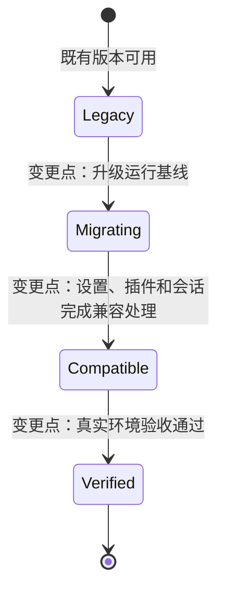
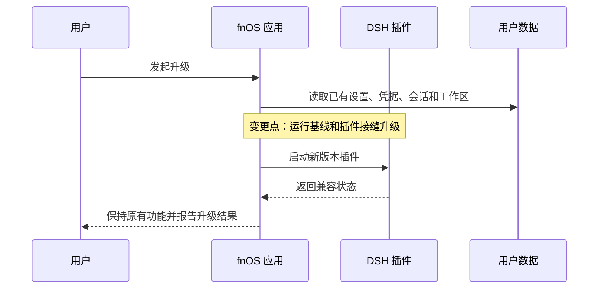

# FNOS-007 DSH 0.1.7-rc.2 适配与插件错误修复

| 项目 | 内容 |
| --- | --- |
| 需求编号 | FNOS-007 |
| 提出日期 | 2026-09-24 |
| 需求状态 | <Badge type="info" text="规划中" /> |
| 关联计划 | [PLAN-FNOS-007 DSH 0.1.7-rc.2 适配与插件错误修复](/plans/PLAN-FNOS-007-dsh-017-rc2-adaptation) |
| 适用范围 | fnOS 应用、四个 DSH 插件、FPK 运行时和文档站 |

## 需求背景

当前应用和插件以 DSH `0.1.5-rc.2` 为运行基线。上游发布 `0.1.7-rc.2` 后，插件安装、设置、工具调用、图片输入、会话读取和 FPK 运行都需要完成兼容处理，否则用户可能遇到插件被拒绝、设置丢失、旧会话打不开或应用升级失败。

本需求的目标是让用户能够安全升级到新基线，并继续使用已有功能和用户数据。具体实现方式、模块影响和迁移步骤由对应计划负责。

## 需求目标

- 应用和四个运行时插件在 DSH `0.1.7-rc.2` 上可以安装、加载和运行。
- 用户升级后，已有设置、凭据、会话、工作区和授权目录保持可用。
- fnOS 应用能够构建、安装、启动、升级和回滚。
- 插件原有的设置、工具调用、图片输入、模型目录和用量能力保持可用。
- 文档站 Mermaid 图表继续可读，并支持既定的交互能力。
- `dshmarket` 以精确版本安装，已安装用户的版本和配置不被覆盖。

## 功能列表

| 编号 | 优先级 | 功能 | 用户可观察结果 | 状态 |
| --- | --- | --- | --- | --- |
| FNOS-007-01 | P0 | DSH 运行基线升级 | 应用运行在 `0.1.7-rc.2`，用户可以完成安装和启动 | <Badge type="info" text="规划中" /> |
| FNOS-007-02 | P0 | 插件兼容性门禁升级 | 四个插件可以安装，启动后不会被禁用 | <Badge type="info" text="规划中" /> |
| FNOS-007-03 | P0 | fnOS 插件设置兼容 | 主题、授权目录和网关路径设置继续可读写 | <Badge type="info" text="规划中" /> |
| FNOS-007-04 | P0 | CodeBuddy 工具和图片能力兼容 | 多轮工具对话和图片输入按模型能力正常处理 | <Badge type="info" text="规划中" /> |
| FNOS-007-05 | P0 | Codex Auth 能力兼容 | 登录、凭据、模型目录、用量和图片输入继续可用 | <Badge type="info" text="规划中" /> |
| FNOS-007-06 | P1 | Semi UI 和总览插件兼容 | 共享组件和总览页面可以打开、切换主题和卸载 | <Badge type="info" text="规划中" /> |
| FNOS-007-07 | P0 | FPK 和运行时交付对齐 | FPK 可以构建、安装、启动，内置插件版本一致 | <Badge type="info" text="规划中" /> |
| FNOS-007-08 | P0 | 旧会话兼容 | 升级后旧会话可以打开和导出 | <Badge type="info" text="规划中" /> |
| FNOS-007-09 | P1 | 设置页和图标资源兼容 | 设置卡片、会话入口和模型图标正常显示 | <Badge type="info" text="规划中" /> |
| FNOS-007-10 | P1 | 升级、回滚和真实环境验收 | 升级保留数据，失败可恢复，真实 NAS 有完整证据 | <Badge type="info" text="规划中" /> |
| FNOS-007-11 | P1 | 文档站 Mermaid 渲染器替换 | 图表可渲染、缩放、拖拽、复制、下载、全屏并跟随主题 | <Badge type="tip" text="已完成" /> |
| FNOS-007-12 | P1 | dshmarket 精确版本升级 | 新用户获得 `dshmarket@1.65.1`，已安装用户不被覆盖 | <Badge type="warning" text="待完成" /> |
| FNOS-007-13 | P0 | attachment-local 运行时依赖和持久化补丁 | 新用户安装 FPK 时 `@deepseek-ai/dsh-attachment-local` 可被精确定位、校验并完成 `${TRIM_PKGVAR}` 补丁；不再出现“installed DSH dependency does not provide” | <Badge type="info" text="规划中" /> |

## 既有功能变更关系

本需求涉及上一运行基线下的既有功能重新处理，变更点集中在“升级后仍保持用户结果”，而不是重新设计用户功能。

上图中的变更点表示本需求相对于既有功能的变化位置；具体技术迁移和影响模块见[对应计划](/plans/PLAN-FNOS-007-dsh-017-rc2-adaptation)。

## 关键交互变更

升级过程必须保持用户数据和已有操作结果。设置和升级的用户交互关系如下：

如果升级或插件启动失败，用户数据不能被自动删除；回滚要求由计划文档定义。

## 行为约束

- 升级后的插件安装和启动不能依赖用户预先授予版本豁免。
- 主题、授权目录、网关路径、凭据、模型配置和会话内容的用户可观察行为保持不变。
- 不支持图片的模型必须明确拒绝图片输入，不能静默丢弃。
- 工具调用和工具结果必须保持调用关系，不能因消息模型变化丢失工具结果。
- 文档站图表继续使用 `mermaid` 代码块，由统一的渲染器接管；图表语义不因渲染器替换而改变。
- `dshmarket` 使用精确版本；已安装用户不被自动覆盖、降级或卸载。
- FPK 安装回调需要从应用私有 DSH 依赖树解析 `@deepseek-ai/dsh-attachment-local`。目标 DSH 中该包由 `@deepseek-ai/dsh-base` 以生产依赖提供，可能位于嵌套 `node_modules`，因此回调不能假设它一定位于 DSH CLI 包的顶层路径，也不能把 CLI 的 `devDependencies` 当作运行时来源；安装、版本校验和 `TRIM_PKGVAR` 持久化补丁必须使用与 `DSH_VERSION` 对齐的精确版本。
- DSH `0.1.5-rc.2` 升级到 `0.1.7-rc.2` 时，目标依赖树中的 `node-pty` 版本保持 `1.2.0-beta.15`，Node.js 主版本保持 24，`node-gyp` 保持 `11.0.0`；本需求不把 node-pty 版本升级作为独立适配项。
- 虽然 node-pty 版本不变，FPK native 产物仍必须按目标 DSH 基线重新生成并验证：native 配置中的 DSH 版本、锁文件、`node-pty` 版本、`app/node-pty-versions` 和 `app/native/node-pty/<version>/` 必须一致，不能只复用未经目标基线验证的旧 `pty.node`。
- 如果后续 DSH 依赖树或人工配置把 node-pty 升级到其他版本，必须另行完成 node-gyp 编译、native bundle、安装回调版本校验和真实 NAS 的有/无 g++ 两条路径验收；本需求不默认为该变化提供兼容性。

## 不在本次范围内

- 不追踪 `0.1.6-alpha.*`、`0.1.7-alpha.*`、`0.1.5-rc.3` 或后续 DSH 版本。
- 不修改 DSH 官方源码，不维护上游分叉。
- 不把版本豁免作为正式交付方案。
- 不重新设计 fnOS 设置页面，不新增与兼容无关的插件功能。
- 不实现自定义会话迁移器，不手工改写用户会话文件。
- 不改变 fnOS 权限模型、网关路径规则、授权目录 ACL 和应用入口形态。
- 不把本次文档站渲染器替换扩展成 Mermaid 图表内容重写。

## 验收条件与完成状态

### FNOS-007-01

- `FNOS-007-01-AC-01`：应用安装后运行基线为 `0.1.7-rc.2`。
- `FNOS-007-01-AC-02`：应用可以完成启动、停止和升级。
- `FNOS-007-01-AC-03`：安装和升级失败时不删除用户数据。

### FNOS-007-02

- `FNOS-007-02-AC-01`：四个插件都能被接受安装。
- `FNOS-007-02-AC-02`：DSH Web 启动后四个插件均未被禁用。
- `FNOS-007-02-AC-03`：交付不依赖用户侧版本豁免。

### FNOS-007-03

- `FNOS-007-03-AC-01`：升级前的主题偏好升级后仍生效。
- `FNOS-007-03-AC-02`：授权目录可以读取、修改和保存。
- `FNOS-007-03-AC-03`：网关代理路径可以读取、修改和保存。
- `FNOS-007-03-AC-04`：设置写入失败时原值不会被清空或覆盖。

### FNOS-007-04

- `FNOS-007-04-AC-01`：多轮工具调用可以继续完成。
- `FNOS-007-04-AC-02`：工具结果不会丢失，调用关系保持一致。
- `FNOS-007-04-AC-03`：支持图片的模型可以处理图片输入。
- `FNOS-007-04-AC-04`：不支持图片的模型返回明确错误。

### FNOS-007-05

- `FNOS-007-05-AC-01`：Codex 登录和凭据读取正常。
- `FNOS-007-05-AC-02`：模型目录刷新和用量查询正常。
- `FNOS-007-05-AC-03`：已有凭据和模型配置不被覆盖。
- `FNOS-007-05-AC-04`：图片输入能力按模型能力正确处理。

### FNOS-007-06

- `FNOS-007-06-AC-01`：共享 UI 包和总览插件可以构建。
- `FNOS-007-06-AC-02`：总览页面可以打开、切换主题和卸载。
- `FNOS-007-06-AC-03`：卸载后无重复注册和运行时错误。

### FNOS-007-07

- `FNOS-007-07-AC-01`：FPK 构建成功且清单版本一致。
- `FNOS-007-07-AC-02`：native 依赖和安装回调与目标运行时一致。
- `FNOS-007-07-AC-03`：真实 NAS 安装后网关和 DSH Web 可访问。
- `FNOS-007-07-AC-04`：版本、锁文件、清单或产物不一致时构建拒绝发布。
- `FNOS-007-07-AC-05`：FPK 安装前后，应用私有 DSH 运行时依赖树中可解析出与 `DSH_VERSION` 对齐的 `@deepseek-ai/dsh-attachment-local` 生产依赖；该依赖可以是嵌套安装，安装回调不依赖 DSH CLI 包的顶层路径或 `devDependencies`。
- `FNOS-007-07-AC-06`：`attachment-local` 包名和精确版本校验通过后，`${TRIM_PKGVAR}` 持久化补丁可执行且幂等；包缺失、版本不一致或安装失败时以可诊断的非零状态终止，不留下半补丁状态。
- `FNOS-007-07-AC-05`：目标 DSH `0.1.7-rc.2` 依赖树和仓库锁文件中的 `node-pty` 均为 `1.2.0-beta.15`，Node.js 主版本为 24、`node-gyp` 为 `11.0.0`；Linux FPK 构建重新执行 native 准备流程，产出匹配版本目录下的 `pty.node`、可选 `spawn-helper` 和 `node-pty-versions`，安装回调能按版本清单注入并校验 native 文件。
- `FNOS-007-07-AC-06`：node-pty 版本不变不代表跳过 native 验证；FPK 至少完成“内置 native 且 NAS 无 g++”路径验证，并保留“未内置 native 且 NAS 有 g++”路径作为回退验证；若 node-pty 版本发生变化，构建校验必须暴露版本不一致而不是静默复用旧产物。

### FNOS-007-08

- `FNOS-007-08-AC-01`：升级后旧会话可以打开。
- `FNOS-007-08-AC-02`：旧会话可以导出。
- `FNOS-007-08-AC-03`：插件不改写或删除用户会话文件。

### FNOS-007-09

- `FNOS-007-09-AC-01`：授权目录设置卡片在新设置页中可见可用。
- `FNOS-007-09-AC-02`：会话入口和模型图标正常显示。
- `FNOS-007-09-AC-03`：`/fn` 指令、目录选择和引用插入行为无回归。

### FNOS-007-10

- `FNOS-007-10-AC-01`：升级保留 profile、凭据、工作区、授权目录、插件设置和会话数据。
- `FNOS-007-10-AC-02`：重复安装和升级具有幂等结果。
- `FNOS-007-10-AC-03`：升级失败可诊断并可回滚到可运行状态。
- `FNOS-007-10-AC-04`：本地、FPK 和真实 NAS 验收证据完整可追溯。

### FNOS-007-11

- `FNOS-007-11-AC-01`：文档站全部 Mermaid 图表正常渲染。
- `FNOS-007-11-AC-02`：图表支持缩放、拖拽、重置、复制、下载和全屏。
- `FNOS-007-11-AC-03`：图表跟随明暗主题切换，工具栏文案为中文。
- `FNOS-007-11-AC-04`：旧构建期渲染器及其依赖链不再作为文档包依赖。

### FNOS-007-12

- `FNOS-007-12-AC-01`：发布清单、构建校验常量和当前文档中的 `dshmarket` 版本均为 `1.65.1`。
- `FNOS-007-12-AC-02`：版本不一致时构建拒绝发布。
- `FNOS-007-12-AC-03`：新用户获得精确版本 `dshmarket@1.65.1`。
- `FNOS-007-12-AC-04`：已安装用户跳过安装并保留原版本和配置。

### FNOS-007-13

- `FNOS-007-13-AC-01`：对目标 DSH `0.1.7-rc.2` 的生产安装进行检查时，能从应用私有 DSH 依赖树（包括 `dsh-base` 的嵌套依赖目录）解析 `@deepseek-ai/dsh-attachment-local`，不再因只检查顶层路径而误报缺失。
- `FNOS-007-13-AC-02`：安装回调读取到的包名和版本与 `DSH_VERSION` 对齐后才执行补丁；日志不再出现 `The installed DSH dependency does not provide @deepseek-ai/dsh-attachment-local`。
- `FNOS-007-13-AC-03`：`attachment-local` 的生产依赖（包括图片处理所需的可选 native 依赖）在目标架构上可安装或明确失败；安装失败不删除旧运行时和用户数据。
- `FNOS-007-13-AC-04`：附件根目录、共享缓存和耐久边界仍位于 `${TRIM_PKGVAR}` 下；补丁重复执行、包缺失和版本不一致均有自动化覆盖。

## 完成状态

| 功能分组 | 状态 | 说明 |
| --- | --- | --- |
| 运行基线和插件门禁 | 规划中 | FNOS-007-01、02 |
| 插件接缝和 UI 兼容 | 规划中 | FNOS-007-03 至 06、09 |
| FPK、会话、升级和验收 | 规划中 | FNOS-007-07、08、10 |
| 文档站 Mermaid 渲染器 | 已完成 | FNOS-007-11，保留历史验收结果 |
| dshmarket 版本升级 | 待完成 | FNOS-007-12 |

## 变更记录

| 日期 | 变更 | 说明 |
| --- | --- | --- |
| 2026-09-24 | 新增 FNOS-007 | 建立 DSH `0.1.7-rc.2` 适配需求。 |
| 2026-09-27 | 纳入 dshmarket 版本升级 | 将 `dshmarket` 精确版本升级纳入当前开发中的 FNOS-007，不修改已完成需求。 |
| 2026-09-27 | 重整需求边界 | 删除技术实现、源码路径和迁移步骤，保留功能、用户结果和验收条件；详细实现转入 PLAN-FNOS-007。 |
