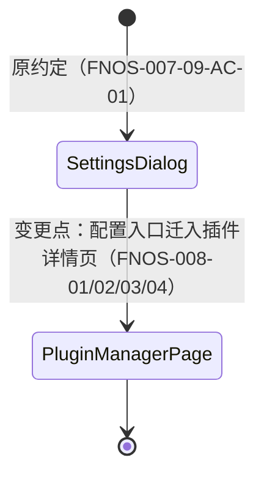
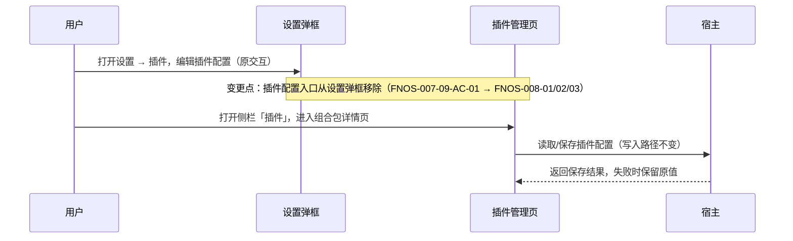
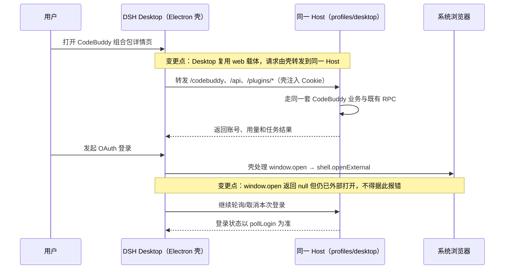
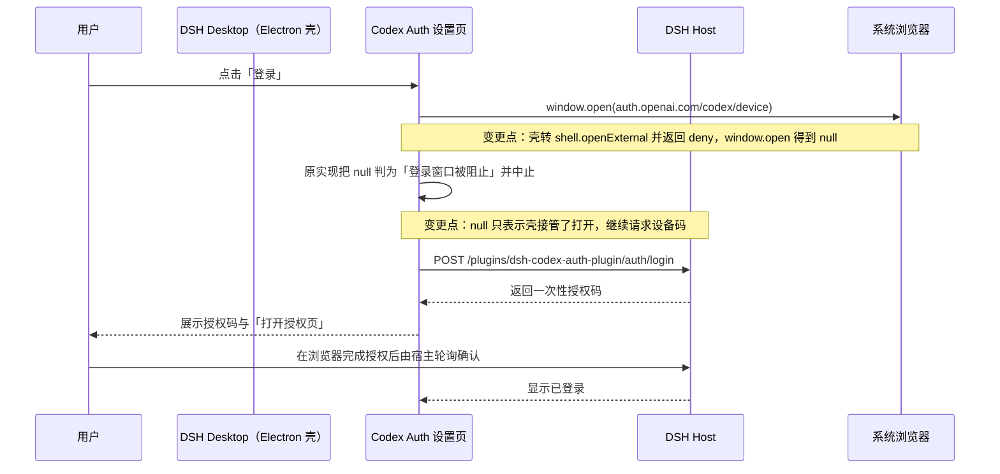

# FNOS-008 插件配置统一迁入插件管理页

| 项目 | 内容 |
| --- | --- |
| 需求编号 | FNOS-008 |
| 提出日期 | 2026-09-28 |
| 需求状态 | <Badge type="info" text="规划中" /> |
| 关联计划 | [PLAN-FNOS-008 插件配置统一迁入插件管理页](/plans/PLAN-FNOS-008-plugin-config-in-plugin-manager) |
| 适用范围 | dsh-fnos、dsh-codebuddy、dsh-codex-auth 三个插件、设置弹框、插件管理页和插件文档站 |

## 需求背景

DSH `0.1.7-rc.2` 新增了侧栏「插件」管理页，并提供官方架构决策：**插件页承载插件配置，设置弹框只保留只读插件清单**。官方已把终端、Agent 循环、Subagent、网页搜索四个内置配置页迁入插件管理页，并为社区组合包提供了把配置页注册到自身组合包详情页的接缝。

本仓库三个带配置界面的插件仍把配置放在设置弹框中：fnOS 插件的授权目录在「设置 → 插件」标签页，CodeBuddy 与 Codex Auth 在设置侧栏各占一个导航分区。这造成同一个插件对象被两个界面各持一半——插件管理页能看到并启停组合包，却打不开它的配置；与上游演进方向不一致，用户也需要在两处入口之间寻找插件设置。

本需求把三个插件的全部配置界面统一迁入插件管理页的组合包详情页，设置弹框不再承载任何插件配置；同时将 CodeBuddy 在 DSH Desktop 中的配置详情页、账号、用量和成长任务兼容纳入同一需求。具体实现方式、模块影响和迁移步骤由对应计划负责。

## 需求目标

- 用户在侧栏「插件」进入对应组合包详情页，即可完成该插件的全部配置操作。
- 设置弹框不再出现三个插件的配置标签页或导航分区，只读插件清单保持官方原样。
- 迁移只改变配置界面位置；配置数据的存储位置、读写行为和已有用户数据不受影响。
- CodeBuddy 配置详情页在 DSH Web、fnOS 和 DSH Desktop 中均能按客户端能力正常工作，客户端差异不改变配置语义。
- 插件文档站的配置入口说明与实际界面一致。

## 功能列表

| 编号 | 优先级 | 功能 | 用户可观察结果 | 状态 |
| --- | --- | --- | --- | --- |
| FNOS-008-01 | P0 | fnOS 配置迁入插件详情页 | 用户在插件管理页的 fnOS 组合包详情页查看、添加、删除授权目录并保存，行为与原设置卡片一致 | <Badge type="tip" text="已完成" /> |
| FNOS-008-02 | P0 | CodeBuddy 配置迁入插件详情页 | 登录、账号管理、自动切换、自动签到、自动旅行等配置操作全部在 CodeBuddy 组合包详情页完成 | <Badge type="tip" text="已完成" /> |
| FNOS-008-03 | P0 | Codex Auth 配置迁入插件详情页 | 登录、全局模型选择与保存、模型目录刷新在 Codex Auth 组合包详情页完成 | <Badge type="tip" text="已完成" /> |
| FNOS-008-04 | P1 | 设置弹框移除插件配置入口 | 「设置 → 插件」分区不再出现 fnOS、CodeBuddy、Codex Auth 的配置标签页或导航项；官方只读插件清单保留 | <Badge type="tip" text="已完成" /> |
| FNOS-008-05 | P1 | 配置功能与数据保持 | 迁移后三个插件的配置读写、保存失败保护与升级前已有的配置数据保持不变 | <Badge type="tip" text="已完成" /> |
| FNOS-008-06 | P0 | CodeBuddy Desktop 兼容 | CodeBuddy 配置详情页及账号、用量和成长任务能力在 DSH Desktop 中可用，同时保持 Web/fnOS 兼容 | <Badge type="tip" text="已完成" /> |
| FNOS-008-07 | P0 | Codex Auth Desktop 兼容 | Codex Auth 的登录在 DSH Desktop 中可用：授权页在系统浏览器打开后设备码流程继续，不再误报「登录窗口被阻止」 | <Badge type="tip" text="已完成" /> |

### 验收环境范围

- FNOS-008-01（fnOS 插件授权目录配置）在 DSH Web 与真实 fnOS NAS 验收，覆盖宿主授权目录选择、权限和保存行为。
- FNOS-008-02、03、04、06、07（CodeBuddy、Codex Auth 及通用插件管理 UI）在 DSH Web 与 DSH Desktop 验收，不要求 NAS。
- FNOS-008-05 的配置持久化按插件拆分：fnOS 授权目录相关数据在真实 NAS 验收；CodeBuddy 与 Codex Auth 的配置、凭据和迁移行为在 DSH Web 与 Desktop 验收。
- 登录等依赖外部服务的功能还须覆盖真实网络/账号条件；这不等于必须在 NAS 上执行。

## 既有功能变更关系

本次变更改变 FNOS-007-09（设置页和图标资源兼容）中授权目录卡片的呈现位置，并终止 CodeBuddy、Codex Auth 在设置侧栏的分区入口。

原约定是三个插件的配置界面呈现在设置弹框中；新约定是配置界面全部呈现在插件管理页对应组合包的详情页，设置弹框只保留官方只读插件清单。

变更原因：DSH Desktop 的 Electron 壳把外部链接交给系统浏览器打开并返回 `deny`，使 `window.open` 返回 `null`；Codex Auth 原先据此判定「弹窗被拦截」并提前返回，导致 Desktop 上授权页虽已打开、设备码却永不请求。用户可观察结果：Desktop 中登录可正常完成，不再出现误导性的拦截提示。

变更原因：与上游「插件页承载配置、设置只保留清单」的架构决策对齐，并让同一 CodeBuddy 配置对象在 DSH Web、fnOS 和 Desktop 中保持一致。用户可观察结果：配置操作位置改变，操作结果与数据不变；Desktop 因复用同一 Web 载体与 Host，无需新的传输层。

**Desktop 运行契约（已在 dsh-0.1.7-rc.2 源码核实）**

- Desktop 是 Electron 壳（`apps/desktop`），加载打包内**同一套 Web 前端**（`dsh-app://app/`），profile 使用 `PROFILE_TEMPLATES.web`（含 `dsh-host-webserver`）。
- 该源下非静态请求由壳 `forwardWebRequest()` 整体转发给同一个 Host，并由壳注入 Host Cookie；插件的 `/codebuddy` RPC、`/api`、Remote WebSocket、`/plugins/*` bundle 因此照常可用。
- `dsh.client.platform` 在 `dsh-client-modules` 中只接受 `web`（`decl.platform !== 'web'` 即跳过），Desktop 复用该载体，**不得改为 desktop/electron**。
- 壳在主窗口安装 `setWindowOpenHandler`：对 http/https 调 `shell.openExternal(url)` 后一律返回 `{ action: 'deny' }`，`window.open` 因此返回 `null`。该 `null` 表示「已在系统浏览器打开」，不是「弹窗被拦截」。
- 结论：Desktop 适配**不需要**新增 Remote facade 或第二套客户端传输；需要固定的是开窗语义与回归覆盖。

## 行为约束

- 迁移只改变配置界面的位置；配置的存储位置、写入路径和凭据管理方式不变。
- 主题跟随系统、会话入口、输入引用、用量指示器、侧栏动作等非配置功能不受影响。
- 设置弹框内保留的功能行为不变：官方配置页（模型、终端等）、fnOS「打开配置文件」头部动作、设置快捷键。
- 无配置界面的插件（`dshmarket`、Semi UI Showcase）不新增配置界面。
- 插件被禁用或卸载后，其配置页随插件一起从插件管理页消失（上游既定行为，不做额外处理）。
- CodeBuddy Desktop 复用现有 Host 业务、凭据、任务状态与既有 RPC；Desktop 由 Electron 壳把请求转发到同一 Host，不新增 Desktop 专属账号池、后端进程或第二套传输层。
- Desktop 的开窗由壳转为系统浏览器打开；`window.open` 返回 `null` 只表示壳接管了这次打开，不得当成「弹窗被拦截」而中断登录。
- `dsh.client.platform` 保持 `web`：Desktop 复用 web 客户端载体，改动该字段会让插件在 Web 与 Desktop 同时消失。
- OAuth 凭据只由 Host 保存；登录取消只取消当前尝试，不删除已有账号。
- 登录结果以宿主 `pollLogin` 为准；开窗失败或返回值异常都不得让客户端产生未处理异常。
- Codex Auth 与 CodeBuddy 共用同一条 Desktop 结论：Desktop 复用 web 载体与同一 Host，登录、模型、用量等请求由壳转发即可用，不需要第二套传输层。
- Desktop 下 `window.open` 返回 `null` 只表示壳把授权页交给系统浏览器打开；Codex Auth 不得据此中止登录或报「登录窗口被阻止」。
- Codex Auth 的授权码复制、取消语义与「关窗不等于放弃」保持不变；窗口句柄不可得时仅失去「取消时一并关窗」的能力，不影响取消本身。

## 不在本次范围内

- 官方内置配置页（终端、Agent 循环、Subagent、网页搜索）的任何改动。
- 为没有浏览器半侧的插件生成通用配置表单。
- 插件管理页安装、卸载、启停能力本身的改进。
- dsh-semi-ui-showcase 插件的界面调整。
- Codex Auth 或其它插件的 DSH Desktop 适配；本次只覆盖 CodeBuddy。

## 验收条件与完成状态

### FNOS-008-01

- `FNOS-008-01-AC-01`：插件管理页的 fnOS 组合包详情页展示授权目录配置区块，位置在「包含的组件」列表**之后**。
- `FNOS-008-01-AC-02`：用户可以在该区块查看、添加、删除授权目录、编辑网关代理路径并保存，行为与原设置卡片一致。
- `FNOS-008-01-AC-03`：设置 → 插件分区不再出现授权目录标签页，设置弹框不再承载 fnOS 配置。
- `FNOS-008-01-AC-04`：该区块只在 fnOS 自己的组合包详情页渲染（座位为 list，不按包名分派，必须按页面主题自筛），不出现在其它插件的详情页上。
- `FNOS-008-01-AC-05`：授权目录列表的固定上限为 300px，超出后由列表自身滚动，保存按钮不被顶出视口。
- `FNOS-008-01-AC-06`：网关代理路径的说明按「是什么 / 怎么写 / 举例子」三行呈现，用途表述为把三方插件的绝对路径 API 统一接入应用网关；举例给出真实形态的插件 API 路径及其前缀（`/plugin-api/get/me` → 填 `/plugin-api`）。

### FNOS-008-02

- `FNOS-008-02-AC-01`：CodeBuddy 组合包详情页展示登录与账号管理界面，添加账号、选择账号、自动切换、自动签到、自动旅行、额度刷新可用。
- `FNOS-008-02-AC-02`：原全页面账号管理面板的「账号管理」与「Token 统计」两块内容全部在详情页内直接可用，不再有独立全页面面板与侧边导航；增长任务整套（任务列表、完成任务、一键完成、执行日志）、三个自动开关、账号卡片签到与旅行状态、积分总览均保留并在详情页内正常工作。
- `FNOS-008-02-AC-03`：设置侧栏不再出现 CodeBuddy 导航分区，设置弹框不再承载 CodeBuddy 任何配置；「切换阈值」与「显示余额余量」两个控件在详情页内可改。
- `FNOS-008-02-AC-04`：CodeBuddy 全部持久化数据合并为单一文档；升级后首次读取自动迁移既有分散文件，旧文件改名保留而非删除；同时提供显式迁移脚本，与读时迁移共用同一实现。
- `FNOS-008-02-AC-05`：多个会话并发使用 CodeBuddy 模型、且额度耗尽触发换号时，换号决策以「本次尝试真正被拒的账号」为准，并以「采用别人已切好的健康账号」继续重试，而不是把健康账号误判为已失败；并发换号不产生级联（健康账号不被跳过）也不产生失败会话。
- `FNOS-008-02-AC-06`：详情页内「账号管理」与「Token 统计」两块内容的呈现层级一致，都以常驻区块标题呈现，不被折叠面板包住；进入详情页即可看到 Token 统计内容，不需要额外一次展开点击。

### FNOS-008-03

- `FNOS-008-03-AC-01`：Codex Auth 组合包详情页展示登录、全局模型和模型目录界面，登录、保存、刷新可用。
- `FNOS-008-03-AC-02`：设置侧栏不再出现 Codex Auth 导航分区。

### FNOS-008-04

- `FNOS-008-04-AC-01`：「设置 → 插件」分区仅保留官方只读插件清单。
- `FNOS-008-04-AC-02`：设置弹框其余功能（模型、终端、头部动作、快捷键）无回归。

### FNOS-008-05

- `FNOS-008-05-AC-01`：升级安装后，授权目录、CodeBuddy 账号偏好、Codex 全局模型等既有配置数据继续生效。
- `FNOS-008-05-AC-02`：迁移后配置保存失败时，原有设置不被清空或覆盖（与 `FNOS-007-03-AC-04` 一致）。
- `FNOS-008-05-AC-03`：插件被禁用后重新启用，配置页与配置数据恢复正常。
- `FNOS-008-05-AC-04`：配置文档合并后，账号凭据、当前账号、自动切换阈值与开关、自动签到、自动旅行、成长任务运行状态与日志全部保留；旧子文件改名保留且新文档损坏时不被覆盖写坏。

### FNOS-008-06

- `FNOS-008-06-AC-01`：目标 DSH Desktop 启动后，CodeBuddy 插件随 web 客户端载体成功加载，配置详情页与对话区用量状态正常显示。
- `FNOS-008-06-AC-02`：Desktop 中的 CodeBuddy 账号、用量、成长任务与配置读写结果，与同一 Host 的 Web 端一致。
- `FNOS-008-06-AC-03`：用户可在 Desktop 发起、完成、取消和退出 CodeBuddy OAuth 登录；授权页在系统浏览器中打开，登录结果可见，已有账号不会因取消当前登录而删除。
- `FNOS-008-06-AC-04`：Desktop 下 `window.open` 返回 `null`（壳转为外部打开）时，登录流程继续而不是报「弹窗被拦截」。
- `FNOS-008-06-AC-05`：Desktop 可读取并同步更新 CodeBuddy 模型、账号、当前账号、用量和偏好。
- `FNOS-008-06-AC-06`：开窗异常或宿主失败时请求结束并可重试，不产生永久 loading、未处理 Promise 或静默成功。
- `FNOS-008-06-AC-07`：Desktop 重启后已有凭据、偏好与当前账号按既有持久化规则恢复；Web/fnOS 行为与 `dsh.client.platform: web` 声明保持兼容。

### FNOS-008-07

- `FNOS-008-07-AC-01`：目标 DSH Desktop 启动后，Codex Auth 随 web 客户端载体成功加载，设置页与对话区用量状态正常显示。
- `FNOS-008-07-AC-02`：用户可在 Desktop 点击登录：授权页在系统浏览器中打开，且设备码请求继续发出，不再显示「浏览器阻止了登录窗口」。
- `FNOS-008-07-AC-03`：Desktop 下 `window.open` 返回 `null` 时登录不中断；设备码与授权码正常展示，登录结果可见。
- `FNOS-008-07-AC-04`：用户可在 Desktop 取消登录并回到可重试状态，已登录账号不被删除；获得窗口句柄时仍支持取消时关闭授权窗口。
- `FNOS-008-07-AC-05`：授权码复制、全局模型选择与保存、模型目录刷新在 Desktop 中可用且结果与会话持久化一致。
- `FNOS-008-07-AC-06`：开窗异常或宿主失败时请求结束并可重试，不产生永久 loading、未处理 Promise 或静默成功。
- `FNOS-008-07-AC-07`：独立浏览器、fnOS iframe 中的 Codex Auth 登录与取消行为不回归；`dsh.client.platform` 保持 `web`。

## 变更记录

| 日期 | 变更 | 说明 |
| --- | --- | --- |
| 2026-09-28 | 初始登记 | 建立 FNOS-008，范围覆盖三个插件的配置界面统一迁入插件管理页；关联 PLAN-FNOS-008。 |
| 2026-09-28 | 合并 FNOS-009 | CodeBuddy DSH Desktop 适配并入 FNOS-008-06；原 FNOS-009 独立需求与计划不再作为追踪入口，Desktop 范围仅覆盖 CodeBuddy。 |
| 2026-09-28 | 更正 Desktop 前提 | 经 `dsh-0.1.7-rc.2` 源码核实：Desktop 为 Electron 壳并复用 web 载体与同一 Host，`/codebuddy` RPC 等由壳转发即可用，因此 FNOS-008-06 删除「新增 Remote facade/第二套传输层」的原约定；`dsh.client.platform` 保持 `web`，Desktop 真正差异是 `window.open` 返回 `null` 仍属已外部打开。 |
| 2026-09-28 | FNOS-008-06 实现完成、桌面验收阻塞 | 开窗语义已收口并补契约测试，本地组合端到端通过；目标 DSH Desktop 运行时验收尚未执行（本机无 Electron 运行时），FNOS-008-06 保持「规划中」直至桌面环境验收完成。 |
| 2026-09-28 | 新增 FNOS-008-07 | Codex Auth Desktop 兼容审计：确认其为**功能性阻断**——`signIn()` 把 `window.open` 返回的 `null` 判为「弹窗被拦截」并提前返回，而 Desktop 壳对 http/https 一律返回 deny，导致授权页虽打开但设备码永不请求，Desktop 无法登录。其余路径（`/plugins/*` 转发、`trustedRequest` 的 loopback 判定、剪贴板权限）核实无缺口。 |
| 2026-09-28 | FNOS-008-07 实现完成、桌面验收阻塞 | 登录阻断已修复：`null` 不再判为失败，设备码照常请求；窗口句柄改为可选（不影响取消与已登录账号），并补 10 条契约测试。本地组合端到端通过；目标 DSH Desktop 运行时验收尚未执行，FNOS-008-07 保持「规划中」。 |
| 2026-09-28 | FNOS-008-03 实现完成、目标环境待验 | Codex Auth 配置从设置侧栏分区迁入插件管理页组合包详情页（`plugins.bundle.config`，key 用包名）；设置弹框不再有 Codex Auth 入口，数据读写路径未变。本地组合级渲染条件与构建产物已验证；真实界面与 NAS/Desktop 走查待补，故 FNOS-008-03 及 FNOS-008-04 中 Codex 相关部分保持「规划中」。 |
| 2026-09-29 | 扩大 FNOS-008-02 范围 | 原 AC-02 约定「全页面账号管理面板从详情页入口打开」，现改为面板整体移除：「账号管理」与「Token 统计」两块内容全部内联进详情页，无独立全页面与侧边导航。增长任务整套（列表/完成任务/一键完成/执行日志）、三个自动开关、账号卡片签到与旅行状态、积分总览确认保留并需适配。新增 AC-04：全部持久化数据合并为单一文档，读时自动迁移 + 显式脚本，旧文件改名保留。 |
| 2026-09-29 | 修复并发换号（FNOS-008-02-AC-05） | 审计发现被动换号（额度耗尽 → 换账号重试）在多会话并发下有两个缺陷：① 换号决策的 `failedId` 取的是「重试前重读的当前账号」而非「本次真正被拒的账号」，并发下会把别的会话刚切好的健康账号误判为已失败而排除——三个账号时级联到更差的账号，两个账号时直接放弃并抛 `QUOTA`（外层不重试该码）导致会话失败；② `switchTo` 的 CAS 失败（=别人已改掉当前账号）被当作放弃，于是 N 个会话同时撞上同一耗尽账号时只有 1 个成功、其余全部失败。修复：`failedId` 在发出请求前冻结并随每轮切换更新；CAS 失败时改为采用当前账号继续重试（`from === to` 表示未发生切换，因而不产出「已自动切换」提示）。原语 `RunGuard`/`AccountLocks` 为实例级，安全性依赖「进程内共用同一 service」这一前提，已补用例钉住。 |
| 2026-09-29 | 客户端版本升级 + auth 契约核对 | CodeBuddy CLI `2.148.0 → 2.159.0`、WorkBuddy `5.5.6 → 5.6.2`（`CODEBUDDY_CLIENT_VERSIONS`、`X-IDE-Version`、桌面 UA、登录页 `version` 参数同步；桌面 UA 改为按常量拼接，避免每次升级都要改字面量）。核对全局 `@tencent-ai/codebuddy-code@2.159.0` 的 cli auth 方式：**四条 auth 端点与 `prefixPath`（`/plugin`）、待登录码（11217）均未变动**；CHANGELOG 的 2.148.0→2.159.0 区间无 auth 方式变更。补齐两处与参考实现的头部差异（此前未观测到故障，属防御性对齐）：`auth/state` 与 `login/account` 补 `X-No-Department-Info`，`auth/token/refresh` 补 `X-Auth-Refresh-Source: plugin`。另记录一处**尚未处置**的风险：官方 CLI 把业务码 `6000–6004` 整体归为 `quota/quota_token_limit`（我们只认 `6004`）、`6005–6008` 归 `quota_request_limit`；若服务端改用同区间的其它码，这些错误的分类会退化。 |
| 2026-09-29 | 补登验证证据、更正 Desktop 前提 | 补登 FNOS-008-01 / FNOS-008-02 / FNOS-008-06 三份 `docs/validation/` 记录。要点：① FNOS-008-01-AC-01 的「区块在组件列表之后」改用**上游源码硬顺序**作证据（`PackageDetail` 的 `detailSections` 子节点数组中 `plugins.detail.section` 恒在 `RowsSection` 之后），比截图更强且可随时复验；② FNOS-008-02 的三处界面调整有运行时实测数值（顺序 top 值、tip 数量/光标/可聚焦、左右布局）与契约测试，且逐条做过反转验证；③ FNOS-008-06 旧记录「本机未安装 Electron、无法启动 Desktop」的前提已不成立——目标运行时已安装（`/Applications/DeepSeek Harness.app` 0.1.7-rc.2），只读探测证实两个插件均已在 Desktop 激活（`/codebuddy` 前缀路由 401 对上同族 404、Codex `auth/status` 返回 `signed-in`），故 AC-01 取得目标运行时证据。三项状态仍为 `blocked`：AC-02/03/04/07 需人眼交互走查，真实 NAS 验收未执行。 |
| 2026-09-29 | 明确插件目标验证环境 | fnOS 插件授权目录能力需在 DSH Web 与真实 NAS 验收；CodeBuddy、Codex Auth 与通用插件管理行为需在 DSH Web 与 Desktop 验收，不把 NAS 作为非 fnOS 插件完成门槛。 |
| 2026-09-29 | fnOS 详情页配置区呈现调整 | 实机截图显示配置被折叠面板包住（进页面只看得到一排折叠标题）。调整：① **移除折叠**，内容常驻（这一页只有这一块内容，折叠只多出一次点击；数据改为挂载即拉取，不再等到点开才请求）；② 授权目录列表固定 **500px** 上限并自行滚动（滚动放在列表本身而非卡片上，否则保存按钮会随列表滚出视口）；③「三方插件 API URL 反代配置」→「**三方插件 proxy**」，平铺说明收进标题右侧 ⓘ tip（tooltip 覆盖「是什么 / 怎么用 / 举例」三要素，图标带 `tabIndex` 与 `aria-label`，键盘与读屏用户同样可获取）；④ placeholder 补保存快捷键与「一行一个」提示；⑤ 文本框最多 **8 行**（行高 20px）超出滚动，并禁用纵向拖拽（拖高会绕过上限、内容仍被裁）。补 13 条契约用例并逐条反转验证。 |
| 2026-09-29 | CodeBuddy Token 统计移除折叠 | 实机截图显示详情页里「Token 统计」被折叠面板包住（标题旁带展开箭头），而它上方的「账号管理」是常驻区块，同一页两个同级区块的呈现层级不一致；折叠默认展开时还要多一层内部容器，读者容易误以为它归属上一块。调整：去掉 `
`/`
` 折叠容器，Token 统计改用与账号管理相同的常驻区块标题，并删除已无引用的折叠样式（含 caret 与 reduced-motion 分支）。与 fnOS 详情页「移除折叠、内容常驻」同一处理原则。
| 2026-09-29 | fnOS 授权目录与 proxy 说明微调 | ① 授权目录列表上限 `500px → 300px`（列表过长时仍由列表自身滚动，保存按钮不被顶出视口）；② 「三方插件 proxy」的 tip 说明改为固定三行——是什么（把三方插件的绝对路径 API **统一接入应用网关**，原先写成「转发给本机其它服务」，没有点出它的定位）、怎么写（一行一个以 `/` 开头的绝对路径前缀）、举例子（插件 API 是 `/plugin-api/get/me`，就填 `/plugin-api`；原例子只给 `/plugin-api/xxx`，读者仍要猜前缀边界）。换行由 `.dsh-fnos-gateway-tip-content` 的 `white-space: pre-line` 渲染：浮层 portal 到 body，必须用专用类命中，直接改共用的 `.semi-tooltip-wrapper` 会波及所有提示。新增 FNOS-008-01-AC-05、AC-06。 |
| 2026-09-30 | FNOS-008 验收完成 | 状态变化。FNOS-008-01 至 FNOS-008-07 全部功能在目标环境验收通过，需求状态由 `planned` 改为 `completed`，`lastVerified` 更新为 2026-09-30。验收按需求 [`验收环境范围`](#验收环境范围) 分组：FNOS-008-01 与 FNOS-008-05 的 fnOS 授权目录部分在真实 NAS 验收，见 [FNOS-008-01 真实 NAS 验收记录](/validation/FNOS-008-01-nas-2026-09-30)；FNOS-008-02、03、04、06、07 在 DSH Web 与 DSH Desktop 验收。此前 `docs/validation/` 下标注 `blocked` 的本地记录是「本地证据不足」的状态，目标环境验收完成后其结论由本记录与上述 NAS 记录承担。 |
| 2026-09-30 | 收口「配置迁入插件管理页」后的两处插件契约漂移 | 验收后审计发现配置迁移在插件侧留下两处未同步的声明，均属本需求范围内的收尾：① `@tnnevol/dsh-codebuddy` 的 `dsh.client.inject`、`peerDependencies` 与 `devDependencies` 仍声明 `@deepseek-ai/dsh-client-ui-settings`——该设置侧栏包已随配置迁入插件管理页而不再需要，属迁移未清的残留依赖；② `@tnnevol/dsh-codebuddy` 与 `@tnnevol/dsh-fnos` 的 `compatibility.json` 都漏了 `@deepseek-ai/dsh-client-ui-plugin-manager`，而两插件已通过 `plugins.bundle.config` 挂载详情页配置，缺这条会让兼容性清单与真实加载面不一致。已按源码 import 补齐两份清单并移除残留声明，`pnpm-lock.yaml` 同步去掉该包记录；`dsh-fnos` 的 `tests/contracts/package-contract.spec.ts` 中硬编码的期望清单一并更新。 |
