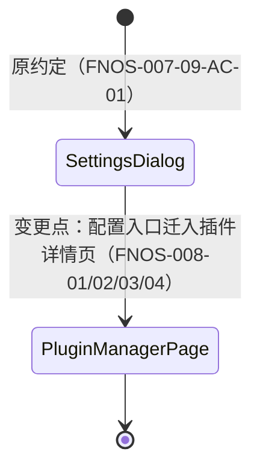
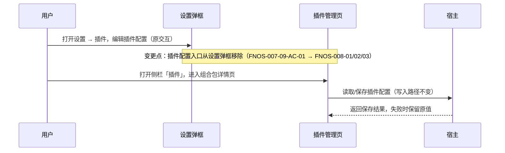

# FNOS-008 插件配置统一迁入插件管理页

| 项目 | 内容 |
| --- | --- |
| 需求编号 | FNOS-008 |
| 提出日期 | 2026-09-28 |
| 需求状态 | <Badge type="info" text="规划中" /> |
| 关联计划 | [PLAN-FNOS-008 插件配置统一迁入插件管理页](/plans/PLAN-FNOS-008-plugin-config-in-plugin-manager) |
| 适用范围 | dsh-fnos、dsh-codebuddy、dsh-codex-auth 三个插件、设置弹框、插件管理页和插件文档站 |

## 需求背景

DSH `0.1.7-rc.2` 新增了侧栏「插件」管理页，并提供官方架构决策：**插件页承载插件配置，设置弹框只保留只读插件清单**。官方已把终端、Agent 循环、Subagent、网页搜索四个内置配置页迁入插件管理页，并为社区组合包提供了把配置页注册到自身组合包详情页的接缝。

本仓库三个带配置界面的插件仍把配置放在设置弹框中：fnOS 插件的授权目录在「设置 → 插件」标签页，CodeBuddy 与 Codex Auth 在设置侧栏各占一个导航分区。这造成同一个插件对象被两个界面各持一半——插件管理页能看到并启停组合包，却打不开它的配置；与上游演进方向不一致，用户也需要在两处入口之间寻找插件设置。

本需求把三个插件的全部配置界面统一迁入插件管理页的组合包详情页，设置弹框不再承载任何插件配置。具体实现方式、模块影响和迁移步骤由对应计划负责。

## 需求目标

- 用户在侧栏「插件」进入对应组合包详情页，即可完成该插件的全部配置操作。
- 设置弹框不再出现三个插件的配置标签页或导航分区，只读插件清单保持官方原样。
- 迁移只改变配置界面位置；配置数据的存储位置、读写行为和已有用户数据不受影响。
- 插件文档站的配置入口说明与实际界面一致。

## 功能列表

| 编号 | 优先级 | 功能 | 用户可观察结果 | 状态 |
| --- | --- | --- | --- | --- |
| FNOS-008-01 | P0 | fnOS 配置迁入插件详情页 | 用户在插件管理页的 fnOS 组合包详情页查看、添加、删除授权目录并保存，行为与原设置卡片一致 | <Badge type="info" text="规划中" /> |
| FNOS-008-02 | P0 | CodeBuddy 配置迁入插件详情页 | 登录、账号管理、自动切换、自动签到、自动旅行等配置操作全部在 CodeBuddy 组合包详情页完成 | <Badge type="info" text="规划中" /> |
| FNOS-008-03 | P0 | Codex Auth 配置迁入插件详情页 | 登录、全局模型选择与保存、模型目录刷新在 Codex Auth 组合包详情页完成 | <Badge type="info" text="规划中" /> |
| FNOS-008-04 | P1 | 设置弹框移除插件配置入口 | 「设置 → 插件」分区不再出现 fnOS、CodeBuddy、Codex Auth 的配置标签页或导航项；官方只读插件清单保留 | <Badge type="info" text="规划中" /> |
| FNOS-008-05 | P1 | 配置功能与数据保持 | 迁移后三个插件的配置读写、保存失败保护与升级前已有的配置数据保持不变 | <Badge type="info" text="规划中" /> |

## 既有功能变更关系

本次变更改变 FNOS-007-09（设置页和图标资源兼容）中授权目录卡片的呈现位置，并终止 CodeBuddy、Codex Auth 在设置侧栏的分区入口。

原约定是三个插件的配置界面呈现在设置弹框中；新约定是配置界面全部呈现在插件管理页对应组合包的详情页，设置弹框只保留官方只读插件清单。

变更原因：与上游「插件页承载配置、设置只保留清单」的架构决策对齐，消除同一插件对象分散在两个界面的问题。用户可观察结果：配置操作位置改变，操作结果与数据不变。

## 行为约束

- 迁移只改变配置界面的位置；配置的存储位置、写入路径和凭据管理方式不变。
- 主题跟随系统、会话入口、输入引用、用量指示器、侧栏动作等非配置功能不受影响。
- 设置弹框内保留的功能行为不变：官方配置页（模型、终端等）、fnOS「打开配置文件」头部动作、设置快捷键。
- 无配置界面的插件（`dshmarket`、Semi UI Showcase）不新增配置界面。
- 插件被禁用或卸载后，其配置页随插件一起从插件管理页消失（上游既定行为，不做额外处理）。

## 不在本次范围内

- 官方内置配置页（终端、Agent 循环、Subagent、网页搜索）的任何改动。
- 为没有浏览器半侧的插件生成通用配置表单。
- 插件管理页安装、卸载、启停能力本身的改进。
- dsh-semi-ui-showcase 插件的界面调整。

## 验收条件与完成状态

### FNOS-008-01

- `FNOS-008-01-AC-01`：插件管理页的 fnOS 组合包详情页展示授权目录配置区块。
- `FNOS-008-01-AC-02`：用户可以在该区块查看、添加、删除授权目录并保存，行为与原设置卡片一致。
- `FNOS-008-01-AC-03`：设置 → 插件分区不再出现授权目录标签页。

### FNOS-008-02

- `FNOS-008-02-AC-01`：CodeBuddy 组合包详情页展示登录与账号管理界面，添加账号、选择账号、自动切换、自动签到、自动旅行、额度刷新可用。
- `FNOS-008-02-AC-02`：全页面账号管理面板从详情页入口可正常打开。
- `FNOS-008-02-AC-03`：设置侧栏不再出现 CodeBuddy 导航分区。

### FNOS-008-03

- `FNOS-008-03-AC-01`：Codex Auth 组合包详情页展示登录、全局模型和模型目录界面，登录、保存、刷新可用。
- `FNOS-008-03-AC-02`：设置侧栏不再出现 Codex Auth 导航分区。

### FNOS-008-04

- `FNOS-008-04-AC-01`：「设置 → 插件」分区仅保留官方只读插件清单。
- `FNOS-008-04-AC-02`：设置弹框其余功能（模型、终端、头部动作、快捷键）无回归。

### FNOS-008-05

- `FNOS-008-05-AC-01`：升级安装后，授权目录、CodeBuddy 账号偏好、Codex 全局模型等既有配置数据继续生效。
- `FNOS-008-05-AC-02`：迁移后配置保存失败时，原有设置不被清空或覆盖（与 `FNOS-007-03-AC-04` 一致）。
- `FNOS-008-05-AC-03`：插件被禁用后重新启用，配置页与配置数据恢复正常。

## 变更记录

| 日期 | 变更 | 说明 |
| --- | --- | --- |
| 2026-09-28 | 初始登记 | 建立 FNOS-008，范围覆盖三个插件的配置界面统一迁入插件管理页；关联 PLAN-FNOS-008。 |
