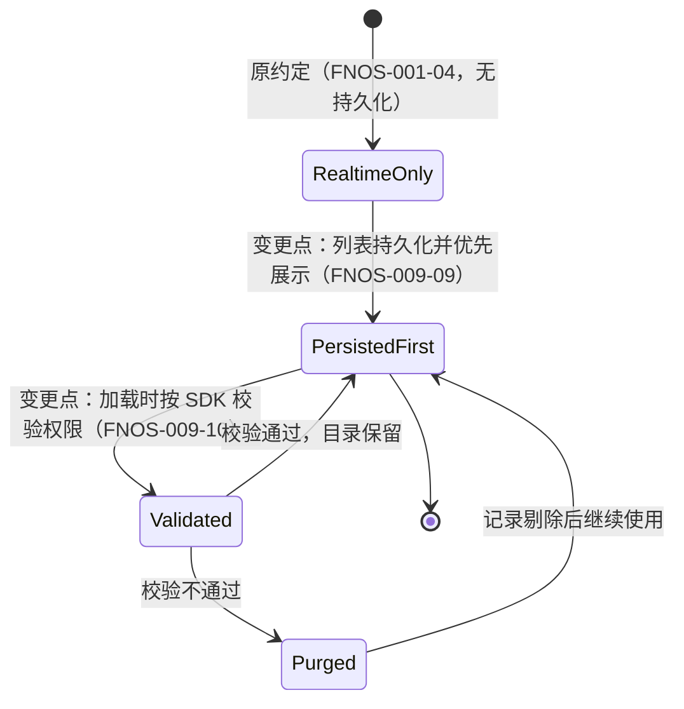
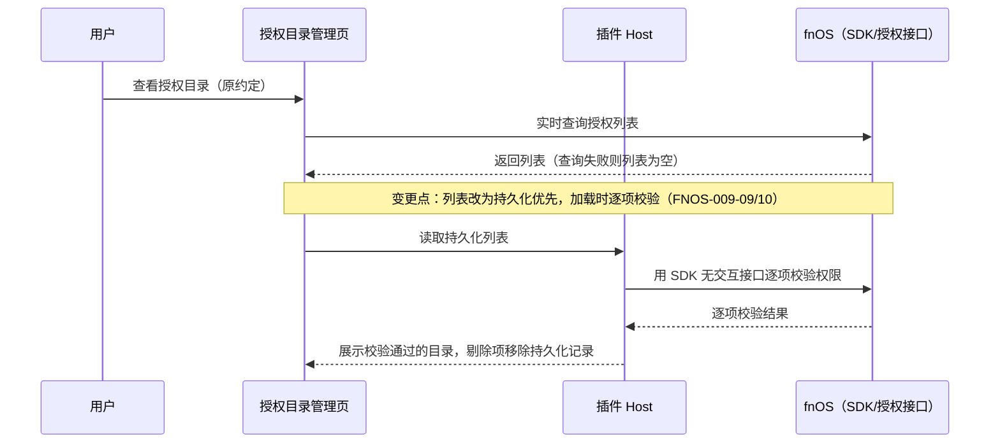
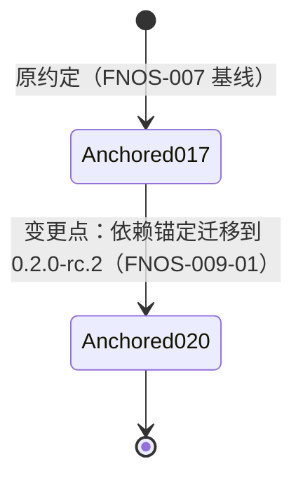
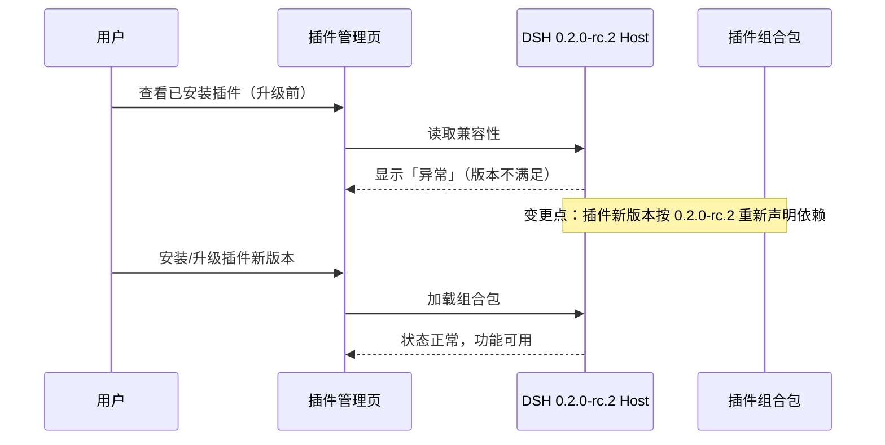
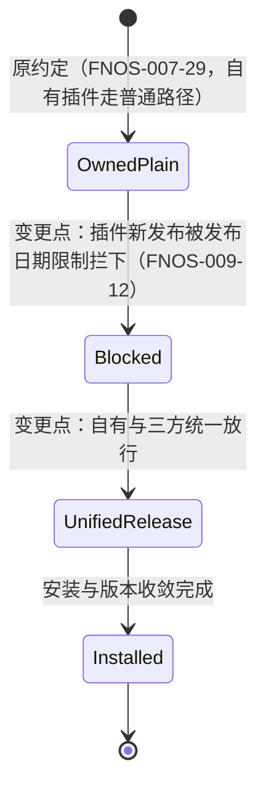
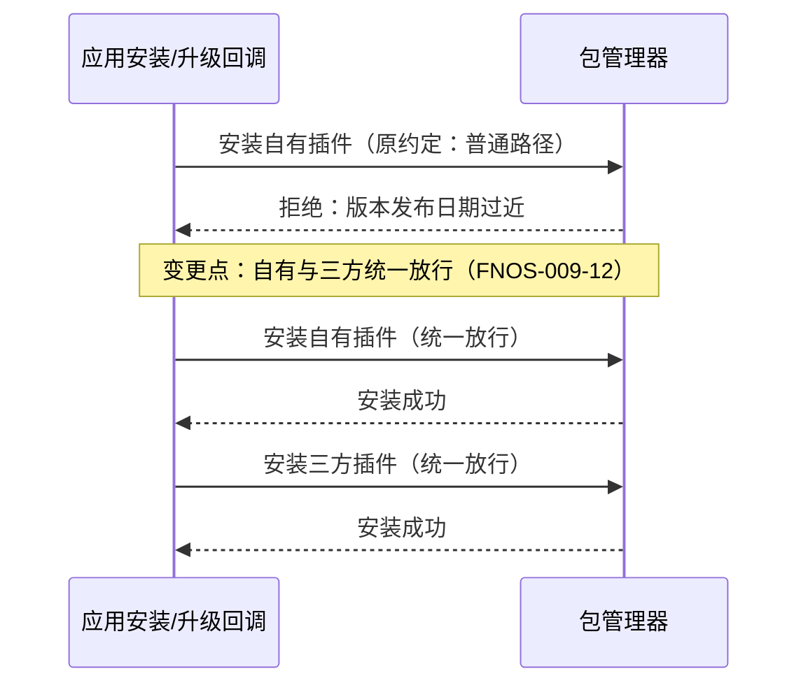

# FNOS-009 DSH 0.2.0-rc.2 插件适配

| 项目 | 内容 |
| --- | --- |
| 需求编号 | FNOS-009 |
| 提出日期 | 2026-09-30 |
| 需求状态 | <Badge type="tip" text="已完成（随 v5.6.0 发布）" /> |
| 关联计划 | [PLAN-FNOS-009 DSH 0.2.0-rc.2 插件适配](/plans/PLAN-FNOS-009-dsh-020-rc2-adaptation) |
| 适用范围 | 四个 DSH 插件（dsh-fnos、dsh-codex-auth、dsh-codebuddy、dsh-semi-ui-showcase）、插件文档站、应用安装回调中的插件安装行为 |

## 需求背景

DSH 官方已发布 `0.2.0-rc.2`，本仓库应用侧已切换到该版本基线。升级后，四个插件在插件管理页全部显示「异常」：插件详情页提示插件当前版本与 DSH `0.2.0-rc.2` 不兼容，要求卸载后重新安装与当前 DSH 兼容的版本。

原因已在官方 `0.2.0-rc.2` 源码核实：DSH 启动时按插件声明的 DSH 包依赖逐项做版本门禁，插件声明的版本不满足运行时版本即判为不兼容。四个插件目前把依赖锚定在 `0.1.7-rc.2`，在新运行时上必然全部命中。

同时对官方 `0.1.7-rc.2` 与 `0.2.0-rc.2` 两个版本的源码对比确认：

- 四个插件依赖的全部官方包在 `0.2.0-rc.2` 中继续存在，没有包被删除或替换；`node-pty` 仍为 `1.2.0-beta.15` 且补丁文件不变，不涉及 node-pty 补丁适配。
- 官方包存在一批增量式接口变化（提交来源标记、插件管理页刷新反馈、弹层选项分组、会话行标题语义、字号范围放宽等），均为可选参数或行为宽松化，插件使用的接缝整体保持。
- `llm-pi-ai` 的底层 pi-ai 依赖从 `0.85.1` 升到 `0.87.1`，插件侧的适配器导出未变，但 Codex Auth 的 pi-ai 兼容声明需要同步。

因此本次是版本重锚定为主、少量行为适配为辅的适配需求：先恢复四个插件在 `0.2.0-rc.2` 运行时的正常加载与功能，再按验证结果处置增量变化带来的回归点。具体技术方案与任务由对应计划负责。

## 需求目标

- 四个插件以新版本安装在 DSH `0.2.0-rc.2` 上后，插件管理页不再显示「异常」，插件随运行时正常加载。
- 各插件的既有功能在新运行时上可用：fnOS 的主题、授权目录与文件能力，Codex Auth 的登录、模型与用量，CodeBuddy 的账号、额度与统计，Semi UI Showcase 的组件展示。
- 升级安装不丢失、不改写用户的既有数据：授权目录、账号凭据、偏好设置、模型配置均保持升级前行为。
- 用户按文档安装新版本插件即可完成升级，不需要手动清理或迁移操作。

## 功能列表

| 编号 | 优先级 | 功能 | 用户可观察结果 | 状态 |
| --- | --- | --- | --- | --- |
| FNOS-009-01 | P0 | 插件在新运行时正常加载 | 四个插件新版本在 DSH `0.2.0-rc.2` 上安装后，插件管理页不再显示「异常」，组合包状态正常 | <Badge type="tip" text="真机已验证（2026-10-08，含 Web 与 Desktop）" /> |
| FNOS-009-02 | P0 | fnOS 插件功能保持 | fnOS 中主题跟随、授权目录管理、文件选择与打开、会话日志导出可用，行为与升级前一致 | <Badge type="tip" text="真机已验证（2026-10-08）" /> |
| FNOS-009-03 | P0 | Codex Auth 功能保持 | 登录、模型选择、全局模型、用量显示可用；模型目录在新 pi-ai 基线上同步正常 | <Badge type="tip" text="验证通过（2026-10-08，DSH Web 与 Desktop）" /> |
| FNOS-009-04 | P0 | CodeBuddy 功能保持 | 登录、账号管理、自动切换、额度显示与 Token 统计可用，行为与升级前一致 | <Badge type="tip" text="真机已验证（2026-10-08，含全新授权回流）" /> |
| FNOS-009-05 | P1 | Semi UI Showcase 功能保持 | 组件展示插件在新运行时正常加载与渲染 | <Badge type="tip" text="已完成（DSH Web 与 Desktop 均通过）" /> |
| FNOS-009-06 | P0 | 用户数据兼容 | 升级安装后授权目录、账号凭据、偏好、模型配置等既有数据继续生效，无需手动迁移 | <Badge type="tip" text="真机已验证（2026-10-08，连续 5 次升级）" /> |
| FNOS-009-07 | P1 | 上游增量变化不产生回归 | 官方两版本间的接口增量（提交来源标记、插件管理页反馈、弹层分组、会话行标题语义等）不改变插件既有用户可见行为 | <Badge type="tip" text="已完成（逐项核对无破坏性变更）" /> |
| FNOS-009-08 | P1 | 文档版本基线更新 | 插件文档与总览的版本号、安装命令与兼容基线说明指向新版本 | <Badge type="tip" text="已完成" /> |
| FNOS-009-09 | P1 | 授权目录列表持久化 | fnOS 插件将用户授权过的目录列表持久保存；插件加载或打开列表时优先展示持久化列表，不因 fnOS 接口瞬时失败而丢列表 | <Badge type="tip" text="真机已验证（2026-10-08）" /> |
| FNOS-009-10 | P1 | 持久化目录权限校验与剔除 | 加载持久化列表时用 fnOS 的**无交互查询接口**比对当前有效授权集合；已失效的目录被剔除出列表并同步移除持久化记录 | <Badge type="tip" text="真机已验证（2026-10-08）" /> |
| FNOS-009-11 | P1 | 插入 NAS 引用的父子选择解耦 | 「插入 NAS 文件或目录」选择树中，取消父目录勾选不再连带取消已选子项；父子勾选状态相互独立 | <Badge type="tip" text="真机已验证（2026-10-08）" /> |
| FNOS-009-12 | P0 | 插件安装不受新发布阻断 | 安装或升级应用时，刚发布的插件版本不再因发布日期过近被拒绝安装；自有插件与三方插件表现一致 | <Badge type="tip" text="真机已验证（2026-10-08，68 次放行 0 失败）" /> |
| FNOS-009-13 | P0 | node-pty 免编译安装与跨平台构建 | node-pty 使用上游 npm 包自带的平台预编译产物：NAS 无 g++ 时可正常安装，FPK 构建不再要求在 Linux 上编译，macOS 也能产出可用包 | <Badge type="tip" text="真机已验证（2026-10-08）" /> |
| FNOS-009-14 | P0 | 三方插件版本随 DSH 基线同步 | 更新 DSH 版本时同步更新三方插件版本，使插件的 peer 声明覆盖新基线；应用安装不再因三方插件被兼容门禁拒绝而失败 | <Badge type="tip" text="真机已验证（2026-10-08）" /> |

### 验收环境范围

- FNOS-009-02（fnOS 插件）在 DSH Web 与真实 fnOS NAS 验收，覆盖宿主桥接、目录授权与文件能力。
- FNOS-009-01、03、04、05、06、07 在 DSH Web 与 DSH Desktop 验收；Codex Auth、CodeBuddy 涉及外部登录的功能另需真实网络/账号条件。
- FNOS-009-08 在文档站构建环境验收。
- FNOS-009-09、FNOS-009-10（Web 部分）在 DSH Web 验收：持久化读写、列表加载与校验剔除逻辑。
- FNOS-009-09、FNOS-009-10（fnOS 部分）在真实 fnOS NAS 验收：fnOS SDK 授权接口桥接、权限校验结果与持久化数据在升级后保持。
- FNOS-009-11 在真实 fnOS NAS 验收：插入选择树的父子勾选独立性。该选择树依赖 fnOS 宿主桥接提供的目录树，属 fnOS 插件功能，按[测试环境执行方式](/charter/tests-spec#测试环境执行方式)只需真实 NAS 结果。
- FNOS-009-12 在真实 fnOS NAS 验收：应用安装/升级回调中的插件安装链路整体走通；参数传递与分支选择另由本地自动化覆盖。
- FNOS-009-13 在真实 fnOS NAS 验收：无 g++ 环境下安装成功且终端可用；FPK 构建流程由本地与 CI 覆盖（macOS 与 Linux 均可构建）。
- FNOS-009-14 在真实 fnOS NAS 验收：应用安装的最后一步（三方插件安装）通过与新基线兼容的插件完成，不再被兼容门禁拒绝。

## 行为约束

- 适配只改变插件对新运行时的声明与必要的接缝调整；不改变插件的功能语义、交互流程和数据格式。
- 用户数据（凭据、账号、偏好、授权目录、模型配置）的存储位置和读写行为不变；升级过程不得删除或改写既有数据。
- FNOS-009-09/10 的持久化只新增插件自有设置数据，不改变 fnOS 侧 ACL 与应用共享目录声明；权限校验只做验证与剔除，不主动新增或撤销 fnOS 授权。
- 权限校验必须使用无需用户交互的 SDK 接口，不得弹出选择器或确认框；校验失败不得阻塞授权目录管理页的其他功能。
- 「插入 NAS 文件或目录」的选择树必须保持父子勾选状态解耦：已同时选中父目录与子项时，取消父目录只移除父目录引用，子项引用保留；修复应优先通过组件 props 表达。
- FNOS-009-12 的放行必须限定在应用安装回调内部，只覆盖回调自身发起的插件安装；不影响插件市场、DSH 插件管理及用户命令行安装的默认行为。
- FNOS-009-13 不改变 node-pty 的来源与版本，只改变「谁来提供原生二进制」：始终使用上游 npm 包自带的平台预编译产物，不再由本仓库编译或内置。
- FNOS-009-13 不新增任何包下载；安装流程沿用向导写入 `.npmrc` 的 registry，不追加 `--registry` 参数，保持用户镜像源设置生效。
- FNOS-009-14 不改变兼容门禁本身：插件是否兼容 DSH 仍由插件 `peerDependencies` 决定，本仓库只负责选择兼容的插件版本，不为三方插件默认放宽门禁。
- FNOS-009-12 放行的是安装动作本身，不改变插件的版本收敛、同版本跳过、注册源选择和失败处理逻辑；安装失败仍须以非零退出并给出可诊断原因。
- `node-pty` 相关构建与补丁机制不在本需求范围内，保持现状。
- 不引入官方两版本间新增的可选能力（如提交来源分析、弹层搜索分组），除非验证发现缺失会导致回归。
- 插件新版本必须与官方版本号规则一致：依赖锚定与运行时版本精确对应，不得使用范围版本。

## 不在本次范围内

- DSH 应用与 FPK 本身的改动；应用侧已切换 `0.2.0-rc.2`，不属于本需求。
- 为插件引入官方两版本间新增的功能能力。
- node-pty 补丁调整、网关路由变更。
- 旧版本插件在 `0.2.0-rc.2` 上的兼容豁免支持。
- 通过持久化列表改写 fnOS 系统授权（ACL）本身；持久化只是插件侧的展示与缓存数据。
- 放宽 DSH 运行时的插件版本兼容门禁，或要求用户手动授予版本豁免。
- 改变插件市场、DSH 插件管理等手动安装入口的默认安全策略（FNOS-009-12 的放行只作用于应用安装回调）。
- 为 node-pty 之外的依赖引入预编译或交叉编译流程；仅解决 node-pty 在无编译器环境下的安装问题。
- 修改三方插件自身的代码或 peer 声明；只选择并锁定兼容版本，必要时在变更记录中申请精确版本豁免。

## 既有功能变更关系

本次变更覆盖 FNOS-007 建立的插件依赖基线：插件依赖锚定从 `0.1.7-rc.2` 迁移到 `0.2.0-rc.2`。FNOS-007 的验收结论在其原验证环境内继续有效，不回改其正文。

授权目录列表的来源同时发生变化，覆盖 [FNOS-001-04 授权目录管理](/requirements/FNOS-001-dsh-fnos-adaptation) 建立的「实时查询 fnOS 授权接口」约定：原约定是列表完全来自 fnOS 授权接口与运行时环境的实时合并，无本地持久化；新约定是列表优先来自插件持久化的授权记录（FNOS-001-04 的验收结论在其原验证环境内继续有效）。

原约定下，fnOS 授权查询失败或插件重启后进程内记录丢失，列表只能重新实时查询；新约定下列表持久保存、加载时先经权限校验再展示，失效目录被剔除并同步移除持久化记录。用户可观察结果：重启或升级后授权目录仍在，已失效目录不再出现。

变更原因：实时查询在接口失败或宿主异常时丢失列表，用户需要在重启和升级后仍看到自己的授权目录；同时目录授权可能在 fnOS 侧被撤销，展示前需要校验剔除。用户可观察结果：列表稳定、失效目录自动消失。

依赖锚定迁移的状态与时序见下：

原约定是四个插件的 DSH 包依赖与兼容声明锚定 `0.1.7-rc.2`；新约定是全部锚定 `0.2.0-rc.2` 并通过新运行时的加载门禁。用户可观察结果：插件管理页从「异常」恢复为正常状态，功能保持。

变更原因：运行时版本门禁按插件声明精确匹配；插件必须在声明层跟随运行时版本。用户可观察结果：升级插件后异常提示消失。

插件安装的发布日期限制范围同时发生变化，覆盖 [FNOS-007-29](/requirements/FNOS-007-dsh-017-rc2-adaptation#fnos-007-29) 建立的「仅自有插件的归档替换与三方插件放行」约定：原约定是自有插件走不带放行的普通安装路径，只有三方插件和 FPK 归档替换才放行；新约定是自有插件与三方插件在应用安装回调内使用同一放行处理（FNOS-007-29 的验收结论在其原验证环境内继续有效）。

原约定下，自有插件与三方插件走不同路径，自有插件在版本发布日期过近时会被拒绝安装；新约定下两者一致放行，安装不再受发布日期影响。用户可观察结果：应用安装或升级可以一次完成，不会卡在插件安装步骤并提示用户手动处理。

变更原因：自有插件与三方插件对用户是同一次安装流程中的同一步骤，区分放行范围只会让自有插件在刚发布时中断整次安装；放行仅限定在应用安装回调内，不影响用户手动安装插件时的默认安全策略。用户可观察结果：安装与升级不再出现插件阶段的阻断失败。

## 验收条件与完成状态

### FNOS-009-01

- `FNOS-009-01-AC-01`：四个插件新版本在 DSH `0.2.0-rc.2` 安装后，插件管理页详情页不再显示「异常」与不兼容原因，组合包显示为已启用。
- `FNOS-009-01-AC-02`：插件详情页的配置区块（授权目录、账号管理、登录界面）正常渲染。

### FNOS-009-02

- `FNOS-009-02-AC-01`：fnOS iframe 内主题跟随行为与升级前一致。
- `FNOS-009-02-AC-02`：授权目录的查看、添加、取消授权可用，列表与升级前一致。
- `FNOS-009-02-AC-03`：工作区选择、NAS 文件引用、文件打开、会话日志导出（本机与 NAS）可用。

### FNOS-009-03

- `FNOS-009-03-AC-01`：Codex Auth 在新运行时上可完成登录，授权页打开与授权码流程正常。
- `FNOS-009-03-AC-02`：登录后模型目录同步、模型选择与全局模型设置可用。
- `FNOS-009-03-AC-03`：对话区用量状态显示剩余额度与重置时间。

### FNOS-009-04

- `FNOS-009-04-AC-01`：CodeBuddy 在新运行时上可完成浏览器授权登录，账号出现在账号列表。
- `FNOS-009-04-AC-02`：账号管理、自动切换、额度显示与 Token 统计可用，行为与升级前一致。

### FNOS-009-05

- `FNOS-009-05-AC-01`：Semi UI Showcase 组件展示插件在新运行时正常加载，组件渲染无异常。

### FNOS-009-06

- `FNOS-009-06-AC-01`：升级安装后，升级前已有的授权目录、账号凭据、偏好、模型配置继续生效。
- `FNOS-009-06-AC-02`：升级过程与升级后均不出现数据丢失或被改写的用户反馈。

### FNOS-009-07

- `FNOS-009-07-AC-01`：官方增量变化涉及的用户可见点（插件管理页反馈、弹层交互、会话行标题、字号范围）在四个插件上无行为回归。
- `FNOS-009-07-AC-02`：如验证发现某增量变化导致插件行为异常，该变化在计划中登记处置结论后才可关闭本功能。

### FNOS-009-08

- `FNOS-009-08-AC-01`：插件总览与各插件文档的版本号、安装命令与兼容基线说明指向新版本。
- `FNOS-009-08-AC-02`：文档构建通过，站内链接有效。

### FNOS-009-09

- `FNOS-009-09-AC-01`：用户添加或确认授权目录后，列表被持久保存；重启插件或升级插件后重新打开授权目录管理页，之前的目录仍在列表中。
- `FNOS-009-09-AC-02`：持久化列表可读取时，管理页优先展示持久化列表，fnOS 授权查询瞬时失败不再导致列表清空。
- `FNOS-009-09-AC-03`：持久化写入失败时，当前会话内的授权目录功能不受影响，既有数据不被清空或改写。

### FNOS-009-10
- `FNOS-009-10-AC-05`：校验不得调用会弹出用户确认框的「申请授权」接口
  （`authorizeSharedFile` / `authorizeUserFile`）；加载与刷新列表时不得出现任何授权确认弹框。
- `FNOS-009-10-AC-06`：校验基于**当前有效授权集合**的比对结果，而不是逐个路径的授权申请返回值
  —— 后者只表达「这次申请的结果」，无法说明路径当前是否仍有权限。

- `FNOS-009-10-AC-01`：插件加载持久化列表时，通过 fnOS SDK 的无交互授权接口逐项校验目录权限，全程无弹窗。
- `FNOS-009-10-AC-02`：校验不通过的目录不出现在列表中，其持久化记录被同步移除；下次加载不再出现已剔除目录。
- `FNOS-009-10-AC-03`：权限恢复（用户在 fnOS 侧重新授权）后，通过「添加/刷新」操作目录可重新进入列表并持久化。
- `FNOS-009-10-AC-04`：SDK 校验接口整体不可用时（如宿主桥接失败），列表按持久化数据展示且不发生剔除，页面给出可理解的错误或提示。

### FNOS-009-11

- `FNOS-009-11-AC-01`：同时勾选一个父目录和它下面的子项后，取消父目录勾选，输入框中父目录引用被移除，子项引用保留，子项仍处于选中状态。
- `FNOS-009-11-AC-02`：反向操作同样成立：先选子项、后选父目录再取消父目录，子项状态不受影响。
- `FNOS-009-11-AC-03`：取消子项勾选不影响父目录的选中状态；父子状态相互独立。

### FNOS-009-12

- `FNOS-009-12-AC-01`：安装或升级应用时，自有插件与三方插件的安装和版本收敛不再因插件版本的发布日期过近而中断。
- `FNOS-009-12-AC-02`：插件安装失败时，用户看到的是具体失败原因，而不是提示用户自行解除发布日期限制或手动清理缓存。
- `FNOS-009-12-AC-03`：该放行只作用于应用安装回调内的插件安装，不改变用户在插件市场或 DSH 插件管理中手动安装插件时的默认安全策略。

### FNOS-009-13

- `FNOS-009-13-AC-01`：NAS 上没有 g++ 时，应用安装不再因缺少编译器而失败；node-pty 统一使用其 npm 包内
  `prebuilds/linux-x64/pty.node` 的预编译产物（固定目标平台，不做运行时平台判断），安装流程不触发本地编译。
- `FNOS-009-13-AC-02`：`@deepseek-ai/dsh-subprocess-local` 仍是 node-pty 的依赖方时执行上述检查；
  上游若移除该依赖，安装流程跳过 node-pty 准备而不是报出过时错误。
- `FNOS-009-13-AC-03`：FPK 构建不再要求在 Linux 构建机上编译 native 依赖，macOS 也能产出可在
  x86_64 NAS 上安装运行的包；FPK 内不再包含 node-pty 原生产物与版本文件。
- `FNOS-009-13-AC-04`：安装流程使用向导写入 `.npmrc` 的 registry，不为 node-pty 追加任何
  `--registry` 参数，也不因此新增额外的包下载。
- `FNOS-009-13-AC-05`：依赖脚本（`npm rebuild`）仍然执行，以便 dsh 其余依赖的 install 脚本正常运行；
  仅 node-pty 自身的安装脚本在执行期间被临时替换，且执行后恢复原清单。

### FNOS-009-14

- `FNOS-009-14-AC-01`：更新 DSH 版本时，清单内三方插件的版本同步更新到 `peerDependencies`
  覆盖新基线的版本，应用安装不因三方插件被兼容门禁拒绝而失败。
- `FNOS-009-14-AC-02`：三方插件的选择以「已声明支持新基线」为准，不默认授予精确版本豁免；
  确需豁免时在变更记录中说明原因与回滚方式。
- `FNOS-009-14-AC-03`：规范中记录该约束与核对方法（查询可用版本与 peer 范围、真机安装验证），
  使后续 DSH 基线更新可按步骤执行而不遗漏。

## 变更记录

| 日期 | 变更 | 说明 |
| --- | --- | --- |
| 2026-09-30 | 初始登记 | 建立 FNOS-009，范围覆盖四个插件适配 DSH `0.2.0-rc.2`；根因（运行时版本门禁）与上游两版本对比结论已在官方源码核实。关联 PLAN-FNOS-009。 |
| 2026-09-30 | 新增 FNOS-009-09/10 | 范围扩展：fnOS 插件新增授权目录列表持久化（持久化优先展示）与基于 fnOS SDK 无交互授权接口的权限校验剔除；覆盖 FNOS-001-04 的实时查询约定。行为约束、验收环境与验收条件同步登记。 |
| 2026-09-30 | 新增 FNOS-009-11 | 范围扩展：「插入 NAS 文件或目录」选择树的父子勾选状态解耦，取消父目录不连带取消子项；行为约束与验收条件同步登记。 |
| 2026-09-30 | 新增 FNOS-009-12 | 范围扩展：自有插件与三方插件在应用安装回调内统一使用发布日期放行，插件刚发布不再阻断应用安装；覆盖 FNOS-007-29 的「仅三方与归档替换放行」约定，变化关系图、行为约束、验收环境与「不在本次范围内」同步登记。 |
| 2026-09-30 | 实施进度与状态登记 | 完成版本重锚定（catalog、四插件 version/peer、compatibility.json、pi-ai 0.87.1）与 FNOS-009-08 文档基线；FNOS-009-12 统一放行落地。本地 DSH Web 实测通过 FNOS-009-01（三插件无「异常」、详情页正常）与 FNOS-009-03-AC-02（新 pi-ai 基线上模型目录正常），证据见 `docs/validation/FNOS-009-local-web-2026-09-30.md`。FNOS-009-01 标记「待完成」（Desktop 与真实 NAS 未验），03/05 标记「待验证」，08/12 标记「待完成」。 |
| 2026-09-30 | Desktop 运行时验证完成 | 用 DSH Desktop 自带运行时（Electron `ELECTRON_RUN_AS_NODE` + app.asar 内 dsh `0.2.0-rc.2`）在隔离探针 profile 上验证：三插件安装后插件管理页与详情页均无「异常」，Semi UI Showcase 展示页正常渲染，控制台无错误；证据见 `docs/validation/FNOS-009-desktop-runtime-2026-09-30.md`。FNOS-009-01/05 状态更新为「DSH Web 与 Desktop 运行时已验，真实 NAS 待补」。 |
| 2026-09-30 | 持久化运行时验证完成 | 用 `pnpm pack` 产出的插件归档装入 DSH Desktop 自带运行时 0.2.0-rc.2 的隔离探针 profile，实测新增持久化路由：写入返回成功、非法入参 400、非 POST 405，写入结果确实落盘到 profile 配置（`authorizedDirectories: [/vol4/demo]`），重复与非法路径被清洗。同时确认源码目录不能直接安装（peer 为 `catalog:dsh`，仅在 pnpm 工作区内有效），真实发布形态必须走打包产物；证据见 `docs/validation/FNOS-009-09-persistence-runtime-2026-09-30.md`。 |
| 2026-09-30 | 阶段五/六落地与专项验证 | 补齐 FNOS-009-09/10（settings 单一权威存储 + 持久化路由 + SDK 无交互逐项校验 + 卡片级剔除编排，抽出 `authorized-directories-validation.ts` / `authorized-directories-eviction.ts` 使其可在无 DOM 环境下测试）与 FNOS-009-11（根因是 `inputActions.setDraft()` 会 `root.clear()` 重建文档、销毁全部引用 chip，改为 `insertText('', span)` 定点删除）。新增 5 个测试文件；fnOS 插件测试 179 → 232 项，全仓 15 个 check 任务全绿。FNOS-009-11 的浏览器走查需人工在运行中的 DSH Web 上执行：本仓库无 jsdom/happy-dom 与 lexical，无法建 DOM 渲染测试，且 fnOS 插件按设计不进入本地 Web profile。 |
| 2026-10-07 | 新增 FNOS-009-13 node-pty 免编译安装与跨平台构建 | 原实现要求 FPK 在 Linux 构建机上用 `node-gyp` 编译 node-pty 并内置产物，NAS 无 g++ 时依赖该产物、有 g++ 时反而现场编译。经核实 node-pty 的 npm 包本身自带各平台预编译产物，其加载器按 `build/Release` → `build/Debug` → `prebuilds/<platform>-<arch>` 回退，因此改为：安装回调只校验预编译目录存在、不编译也不复制；删除 `prepare-dsh-native.sh`、native 配置、`--bundle-dsh-native` 参数与 Linux 平台限制，macOS 可直接构建可用 FPK。安装流程不新增下载、不追加 `--registry`，沿用 `.npmrc` 的镜像源设置。 |
| 2026-10-08 | 新增 FNOS-009-14 三方插件版本同步 | 真机安装暴露：`dshmarket@1.66.3` 的 `peerDependencies` 停留在 `^0.1.x`，在 DSH `0.2.0-rc.2` 上被兼容门禁拒绝，导致 FPK 安装最后一步失败（前面步骤全部成功）。已将清单版本更新为 `1.66.11`（其 peer 新增 `\|\| ^0.2.0-rc.1`），并在 `docs/build/versioning.md` 增加「更新 DSH 基线时必须同步三方插件版本」的核对步骤。 |
| 2026-10-08 | FNOS-009-13/14 真机验收完成 | 在无 g++/gcc/clang/node-gyp 的 fnOS 设备上安装成功：`npm rebuild` 1 秒完成无编译，node-pty 解析到 `prebuilds/linux-x64/pty.node`（md5 与 npm 包一致），侧边栏终端 `tty` 返回 `/dev/pts/2`；`dshmarket@1.66.11` 安装通过，插件页「已安装 4」且异常/不兼容均为 0。证据见[真机验收记录](/validation/FNOS-009-node-pty-prebuilds-2026-10-08)。 |
| 2026-10-08 | fnos 插件真机走查与 BUG-04/05 修复 | 授权目录区连续暴露两个 P0：列表永久加载中（SDK 桥接无超时 + 缺 `trim.file.userAccess` 声明）、合法授权目录被误剔除并清空持久化（校验按 `{ ok }` 读取，实际契约是 `AppBridgeResponse` 的 `code`）。修复后降级路径与目录保留均真机复验通过；FNOS-009-09 转「真机已验证」，FNOS-009-10 保留「校验生效待确认接口应答」。证据见[真机验收记录](/validation/FNOS-009-fnos-plugin-nas-2026-10-08)。 |
| 2026-10-08 | fnos 插件走查补齐 | 完成剩余三项真机走查：会话日志导出（导出到 NAS 实际落盘 ZIP，`session.v4.jsonl` 20 行含本次会话；导出到电脑提示已开始下载）、路径交文件管理器打开（定位到会话工作区目录）、FNOS-009-11 父子勾选解耦（取消父目录后子项保持勾选）。FNOS-009-02 与 11 转「真机已验证」。 |
| 2026-10-08 | FNOS-009-10 校验改用无交互查询接口 | 真机暴露：原实现用 `authorizeSharedFile` / `authorizeUserFile` 做权限校验，而这两个是**申请授权**接口——每次刷新列表都会弹出「申请访问以下文件」确认框，且返回值只表示「这次申请的结果」而非当前权限。改为 Host 侧经 `trim.file.getSharedAccessibleFolders` 与 `trim.file.getUserAccessibleFolders` 查询有效集合、在列表上标注 `valid`，客户端只做筛选。新增 AC-05/AC-06；删除逐项授权探测模块。 |
| 2026-10-08 | FNOS-009-10 真机验证通过 | 修完四层后本设备复验：后端返回 `valid: true`，界面无弹框、无降级提示，目录保留且刷新幂等。修复链：应答契约（5.5.2）→ 改用无交互查询接口（5.5.3）→ 补必填 `uid`（5.5.4）→ 客户端保留 `valid` 字段（5.5.5）。证据见[真机验收记录](/validation/FNOS-009-fnos-plugin-nas-2026-10-08)。 |
| 2026-10-08 | 补齐 01/05/06/12 状态并登记 03 结论 | 修正状态徽标与实际证据脱节：01（Web+Desktop+NAS）、05（Web+Desktop）、06（连续 5 次升级数据保留，含升级前基线快照）、12（真机回调 68 次放行、`ERR_PNPM_MINIMUM_RELEASE_AGE_VIOLATION` 0 次）转「已验证」。03 的登录与用量按用户决定不做验证，标为「部分验证」并登记原因。 |
| 2026-10-08 | FNOS-009-07 上游增量逐项核对完成 | 对四个插件消费的全部接缝在两 tag 间逐项核实：`plugins.detail.section` 调用形参一致、`ui-slots`/`ui-input-trigger` 仅版本号变化、`submit` 的 `source` 为可选参数、`displayTitle` 类型未变、`fork` 回调未使用、`MenuGroup` 为纯新增导出；字号范围 12–17→10–22 属宽松化，插件使用固定 px 不消费该变量。未发现破坏性变更。 |
| 2026-10-08 | FNOS-009 验收收尾 | FNOS-009-04 转「真机已验证」：在真实 NAS 完成从零开始的 CodeBuddy 授权回流（移开凭据 → 界面归 0 → 登录 → 账号 1，生成新 id），同时覆盖 AC-01 与 AC-02。修正测试结论段与实际证据脱节的 5 项过期条目（fnOS 真机功能、09/10 SDK 桥接、04 登录、11 实机走查、07 增量核对均已在本轮完成）。用例数更新为 51 条：通过 50、部分通过 1。 |
| 2026-10-08 | FNOS-009 验收完成 | FNOS-009-03 经用户手动验证三项 AC 全部成立（DSH Web 与 Desktop 各一次），该功能项转「验证通过」；全部 14 项功能已无待办。需求状态由「规划中」转「已完成」，`targetVersion` 由 5.7.0 更正为实际发布版本 5.6.0。 |
