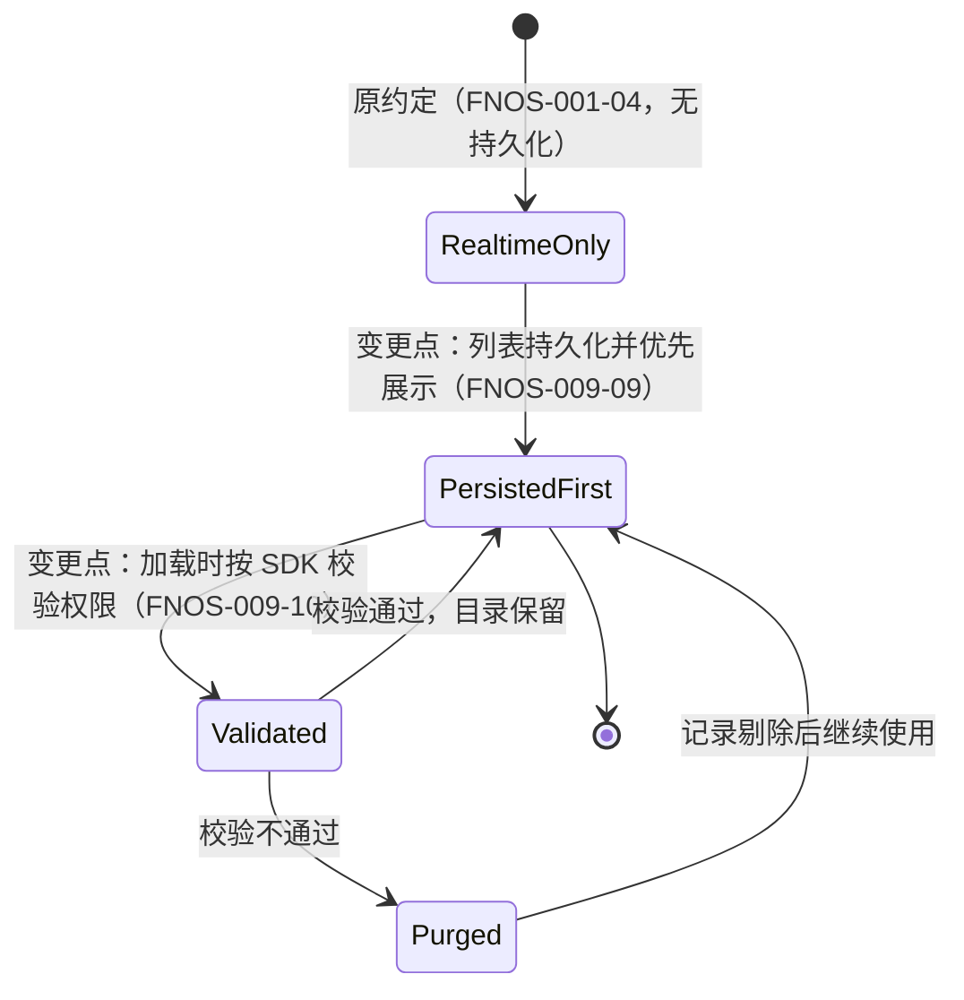
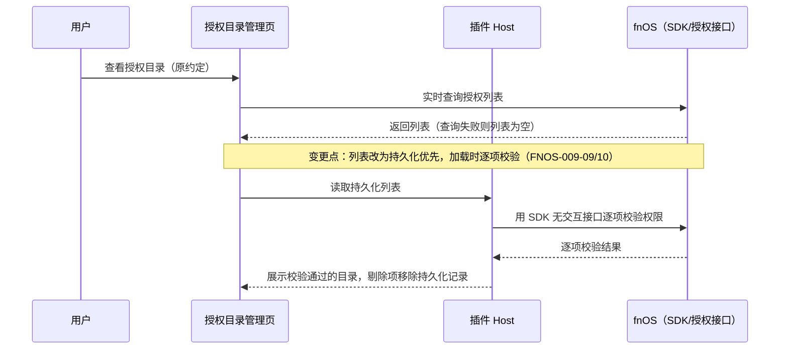
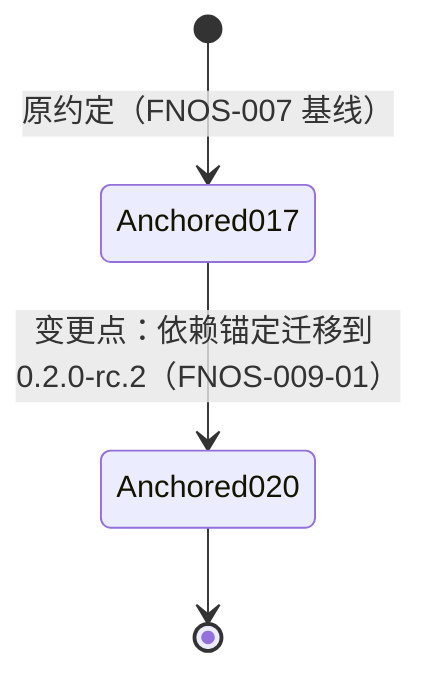
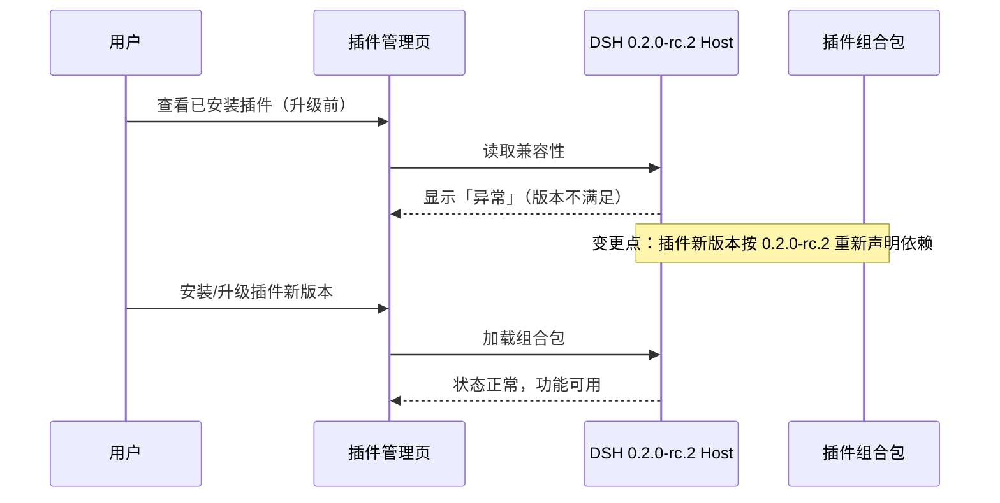

# FNOS-009 DSH 0.2.0-rc.2 插件适配

| 项目 | 内容 |
| --- | --- |
| 需求编号 | FNOS-009 |
| 提出日期 | 2026-09-30 |
| 需求状态 | <Badge type="info" text="规划中" /> |
| 关联计划 | [PLAN-FNOS-009 DSH 0.2.0-rc.2 插件适配](/plans/PLAN-FNOS-009-dsh-020-rc2-adaptation) |
| 适用范围 | 四个 DSH 插件（dsh-fnos、dsh-codex-auth、dsh-codebuddy、dsh-semi-ui-showcase）、插件文档站 |

## 需求背景

DSH 官方已发布 `0.2.0-rc.2`，本仓库应用侧已切换到该版本基线。升级后，四个插件在插件管理页全部显示「异常」：插件详情页提示插件当前版本与 DSH `0.2.0-rc.2` 不兼容，要求卸载后重新安装与当前 DSH 兼容的版本。

原因已在官方 `0.2.0-rc.2` 源码核实：DSH 启动时按插件声明的 DSH 包依赖逐项做版本门禁，插件声明的版本不满足运行时版本即判为不兼容。四个插件目前把依赖锚定在 `0.1.7-rc.2`，在新运行时上必然全部命中。

同时对官方 `0.1.7-rc.2` 与 `0.2.0-rc.2` 两个版本的源码对比确认：

- 四个插件依赖的全部官方包在 `0.2.0-rc.2` 中继续存在，没有包被删除或替换；`node-pty` 仍为 `1.2.0-beta.15` 且补丁文件不变，不涉及 node-pty 补丁适配。
- 官方包存在一批增量式接口变化（提交来源标记、插件管理页刷新反馈、弹层选项分组、会话行标题语义、字号范围放宽等），均为可选参数或行为宽松化，插件使用的接缝整体保持。
- `llm-pi-ai` 的底层 pi-ai 依赖从 `0.85.1` 升到 `0.87.1`，插件侧的适配器导出未变，但 Codex Auth 的 pi-ai 兼容声明需要同步。

因此本次是版本重锚定为主、少量行为适配为辅的适配需求：先恢复四个插件在 `0.2.0-rc.2` 运行时的正常加载与功能，再按验证结果处置增量变化带来的回归点。具体技术方案与任务由对应计划负责。

## 需求目标

- 四个插件以新版本安装在 DSH `0.2.0-rc.2` 上后，插件管理页不再显示「异常」，插件随运行时正常加载。
- 各插件的既有功能在新运行时上可用：fnOS 的主题、授权目录与文件能力，Codex Auth 的登录、模型与用量，CodeBuddy 的账号、额度与统计，Semi UI Showcase 的组件展示。
- 升级安装不丢失、不改写用户的既有数据：授权目录、账号凭据、偏好设置、模型配置均保持升级前行为。
- 用户按文档安装新版本插件即可完成升级，不需要手动清理或迁移操作。

## 功能列表

| 编号 | 优先级 | 功能 | 用户可观察结果 | 状态 |
| --- | --- | --- | --- | --- |
| FNOS-009-01 | P0 | 插件在新运行时正常加载 | 四个插件新版本在 DSH `0.2.0-rc.2` 上安装后，插件管理页不再显示「异常」，组合包状态正常 | <Badge type="info" text="规划中" /> |
| FNOS-009-02 | P0 | fnOS 插件功能保持 | fnOS 中主题跟随、授权目录管理、文件选择与打开、会话日志导出可用，行为与升级前一致 | <Badge type="info" text="规划中" /> |
| FNOS-009-03 | P0 | Codex Auth 功能保持 | 登录、模型选择、全局模型、用量显示可用；模型目录在新 pi-ai 基线上同步正常 | <Badge type="info" text="规划中" /> |
| FNOS-009-04 | P0 | CodeBuddy 功能保持 | 登录、账号管理、自动切换、额度显示与 Token 统计可用，行为与升级前一致 | <Badge type="info" text="规划中" /> |
| FNOS-009-05 | P1 | Semi UI Showcase 功能保持 | 组件展示插件在新运行时正常加载与渲染 | <Badge type="info" text="规划中" /> |
| FNOS-009-06 | P0 | 用户数据兼容 | 升级安装后授权目录、账号凭据、偏好、模型配置等既有数据继续生效，无需手动迁移 | <Badge type="info" text="规划中" /> |
| FNOS-009-07 | P1 | 上游增量变化不产生回归 | 官方两版本间的接口增量（提交来源标记、插件管理页反馈、弹层分组、会话行标题语义等）不改变插件既有用户可见行为 | <Badge type="info" text="规划中" /> |
| FNOS-009-08 | P1 | 文档版本基线更新 | 插件文档与总览的版本号、安装命令与兼容基线说明指向新版本 | <Badge type="info" text="规划中" /> |
| FNOS-009-09 | P1 | 授权目录列表持久化 | fnOS 插件将用户授权过的目录列表持久保存；插件加载或打开列表时优先展示持久化列表，不因 fnOS 接口瞬时失败而丢列表 | <Badge type="info" text="规划中" /> |
| FNOS-009-10 | P1 | 持久化目录权限校验与剔除 | 加载持久化列表时用 fnOS SDK 的无交互授权接口逐项校验权限；校验不通过的目录被剔除出列表并同步移除持久化记录 | <Badge type="info" text="规划中" /> |

### 验收环境范围

- FNOS-009-02（fnOS 插件）在 DSH Web 与真实 fnOS NAS 验收，覆盖宿主桥接、目录授权与文件能力。
- FNOS-009-01、03、04、05、06、07 在 DSH Web 与 DSH Desktop 验收；Codex Auth、CodeBuddy 涉及外部登录的功能另需真实网络/账号条件。
- FNOS-009-08 在文档站构建环境验收。
- FNOS-009-09、FNOS-009-10（Web 部分）在 DSH Web 验收：持久化读写、列表加载与校验剔除逻辑。
- FNOS-009-09、FNOS-009-10（fnOS 部分）在真实 fnOS NAS 验收：fnOS SDK 授权接口桥接、权限校验结果与持久化数据在升级后保持。

## 行为约束

- 适配只改变插件对新运行时的声明与必要的接缝调整；不改变插件的功能语义、交互流程和数据格式。
- 用户数据（凭据、账号、偏好、授权目录、模型配置）的存储位置和读写行为不变；升级过程不得删除或改写既有数据。
- FNOS-009-09/10 的持久化只新增插件自有设置数据，不改变 fnOS 侧 ACL 与应用共享目录声明；权限校验只做验证与剔除，不主动新增或撤销 fnOS 授权。
- 权限校验必须使用无需用户交互的 SDK 接口，不得弹出选择器或确认框；校验失败不得阻塞授权目录管理页的其他功能。
- `node-pty` 相关构建与补丁机制不在本需求范围内，保持现状。
- 不引入官方两版本间新增的可选能力（如提交来源分析、弹层搜索分组），除非验证发现缺失会导致回归。
- 插件新版本必须与官方版本号规则一致：依赖锚定与运行时版本精确对应，不得使用范围版本。

## 不在本次范围内

- DSH 应用与 FPK 本身的改动；应用侧已切换 `0.2.0-rc.2`，不属于本需求。
- 为插件引入官方两版本间新增的功能能力。
- node-pty 补丁调整、网关或安装脚本变更。
- 旧版本插件在 `0.2.0-rc.2` 上的兼容豁免支持。
- 通过持久化列表改写 fnOS 系统授权（ACL）本身；持久化只是插件侧的展示与缓存数据。

## 既有功能变更关系

本次变更覆盖 FNOS-007 建立的插件依赖基线：插件依赖锚定从 `0.1.7-rc.2` 迁移到 `0.2.0-rc.2`。FNOS-007 的验收结论在其原验证环境内继续有效，不回改其正文。

授权目录列表的来源同时发生变化，覆盖 [FNOS-001-04 授权目录管理](/requirements/FNOS-001-dsh-fnos-adaptation) 建立的「实时查询 fnOS 授权接口」约定：原约定是列表完全来自 fnOS 授权接口与运行时环境的实时合并，无本地持久化；新约定是列表优先来自插件持久化的授权记录（FNOS-001-04 的验收结论在其原验证环境内继续有效）。

原约定下，fnOS 授权查询失败或插件重启后进程内记录丢失，列表只能重新实时查询；新约定下列表持久保存、加载时先经权限校验再展示，失效目录被剔除并同步移除持久化记录。用户可观察结果：重启或升级后授权目录仍在，已失效目录不再出现。

变更原因：实时查询在接口失败或宿主异常时丢失列表，用户需要在重启和升级后仍看到自己的授权目录；同时目录授权可能在 fnOS 侧被撤销，展示前需要校验剔除。用户可观察结果：列表稳定、失效目录自动消失。

依赖锚定迁移的状态与时序见下：

原约定是四个插件的 DSH 包依赖与兼容声明锚定 `0.1.7-rc.2`；新约定是全部锚定 `0.2.0-rc.2` 并通过新运行时的加载门禁。用户可观察结果：插件管理页从「异常」恢复为正常状态，功能保持。

变更原因：运行时版本门禁按插件声明精确匹配；插件必须在声明层跟随运行时版本。用户可观察结果：升级插件后异常提示消失。

## 验收条件与完成状态

### FNOS-009-01

- `FNOS-009-01-AC-01`：四个插件新版本在 DSH `0.2.0-rc.2` 安装后，插件管理页详情页不再显示「异常」与不兼容原因，组合包显示为已启用。
- `FNOS-009-01-AC-02`：插件详情页的配置区块（授权目录、账号管理、登录界面）正常渲染。

### FNOS-009-02

- `FNOS-009-02-AC-01`：fnOS iframe 内主题跟随行为与升级前一致。
- `FNOS-009-02-AC-02`：授权目录的查看、添加、取消授权可用，列表与升级前一致。
- `FNOS-009-02-AC-03`：工作区选择、NAS 文件引用、文件打开、会话日志导出（本机与 NAS）可用。

### FNOS-009-03

- `FNOS-009-03-AC-01`：Codex Auth 在新运行时上可完成登录，授权页打开与授权码流程正常。
- `FNOS-009-03-AC-02`：登录后模型目录同步、模型选择与全局模型设置可用。
- `FNOS-009-03-AC-03`：对话区用量状态显示剩余额度与重置时间。

### FNOS-009-04

- `FNOS-009-04-AC-01`：CodeBuddy 在新运行时上可完成浏览器授权登录，账号出现在账号列表。
- `FNOS-009-04-AC-02`：账号管理、自动切换、额度显示与 Token 统计可用，行为与升级前一致。

### FNOS-009-05

- `FNOS-009-05-AC-01`：Semi UI Showcase 组件展示插件在新运行时正常加载，组件渲染无异常。

### FNOS-009-06

- `FNOS-009-06-AC-01`：升级安装后，升级前已有的授权目录、账号凭据、偏好、模型配置继续生效。
- `FNOS-009-06-AC-02`：升级过程与升级后均不出现数据丢失或被改写的用户反馈。

### FNOS-009-07

- `FNOS-009-07-AC-01`：官方增量变化涉及的用户可见点（插件管理页反馈、弹层交互、会话行标题、字号范围）在四个插件上无行为回归。
- `FNOS-009-07-AC-02`：如验证发现某增量变化导致插件行为异常，该变化在计划中登记处置结论后才可关闭本功能。

### FNOS-009-08

- `FNOS-009-08-AC-01`：插件总览与各插件文档的版本号、安装命令与兼容基线说明指向新版本。
- `FNOS-009-08-AC-02`：文档构建通过，站内链接有效。

### FNOS-009-09

- `FNOS-009-09-AC-01`：用户添加或确认授权目录后，列表被持久保存；重启插件或升级插件后重新打开授权目录管理页，之前的目录仍在列表中。
- `FNOS-009-09-AC-02`：持久化列表可读取时，管理页优先展示持久化列表，fnOS 授权查询瞬时失败不再导致列表清空。
- `FNOS-009-09-AC-03`：持久化写入失败时，当前会话内的授权目录功能不受影响，既有数据不被清空或改写。

### FNOS-009-10

- `FNOS-009-10-AC-01`：插件加载持久化列表时，通过 fnOS SDK 的无交互授权接口逐项校验目录权限，全程无弹窗。
- `FNOS-009-10-AC-02`：校验不通过的目录不出现在列表中，其持久化记录被同步移除；下次加载不再出现已剔除目录。
- `FNOS-009-10-AC-03`：权限恢复（用户在 fnOS 侧重新授权）后，通过「添加/刷新」操作目录可重新进入列表并持久化。
- `FNOS-009-10-AC-04`：SDK 校验接口整体不可用时（如宿主桥接失败），列表按持久化数据展示且不发生剔除，页面给出可理解的错误或提示。

## 变更记录

| 日期 | 变更 | 说明 |
| --- | --- | --- |
| 2026-09-30 | 初始登记 | 建立 FNOS-009，范围覆盖四个插件适配 DSH `0.2.0-rc.2`；根因（运行时版本门禁）与上游两版本对比结论已在官方源码核实。关联 PLAN-FNOS-009。 |
| 2026-09-30 | 新增 FNOS-009-09/10 | 范围扩展：fnOS 插件新增授权目录列表持久化（持久化优先展示）与基于 fnOS SDK 无交互授权接口的权限校验剔除；覆盖 FNOS-001-04 的实时查询约定。行为约束、验收环境与验收条件同步登记。 |
