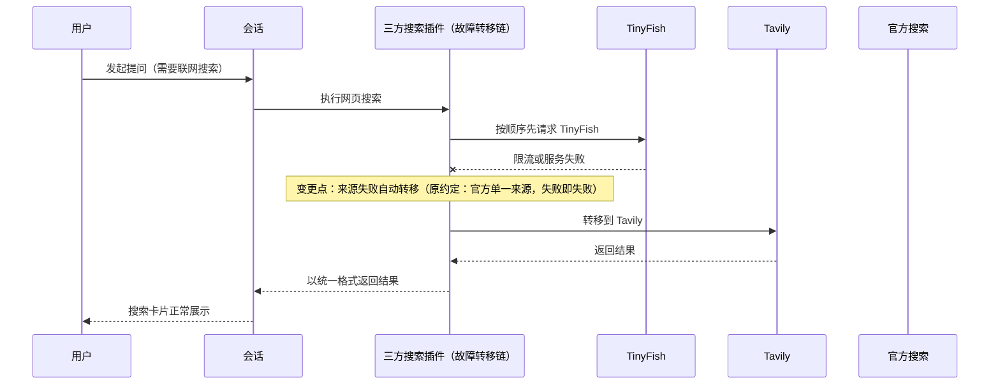
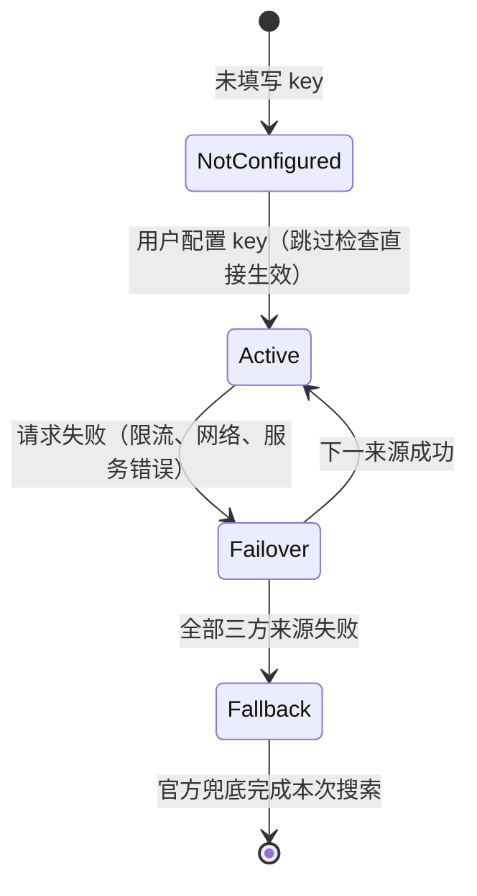

# FNOS-010 三方搜索接入与官方兜底

| 项目 | 内容 |
| --- | --- |
| 需求编号 | FNOS-010 |
| 提出日期 | 2026-09-30 |
| 需求状态 | <Badge type="warning" text="待完成" /> |
| 关联计划 | [PLAN-FNOS-010 三方搜索接入与官方兜底](/plans/PLAN-FNOS-010-thirdparty-web-search-failover) |
| 适用范围 | 新增的三方搜索 DSH 插件、会话内网页搜索能力、插件文档站 |

## 需求背景

DSH 的会话内网页搜索当前由官方搜索服务承担：模型每次发起搜索，官方服务都会代为执行检索并返回结果。该方式存在两个问题：其一，官方搜索以一次辅助模型调用为代价，持续消耗用户的 DeepSeek 官方额度；其二，搜索来源单一，用户无法选择其他搜索服务。

用户希望引入两个三方搜索服务作为主要搜索来源，官方搜索降级为兜底；同时每个平台可能持有多个不同账号的 key，需要在同平台的多个账号间均摊请求（类似集群），而不是集中在一个账号上消耗，并结合平台用量数据在请求前探测账号额度、提前转移，响应式故障转移只作兜底。2026-09-30 已完成前置调研，功能成立所依赖的事实核查、可行性结论与被否决方案见下文[调研结论](#调研结论)；调研的完整技术依据登记在对应[计划文档](/plans/PLAN-FNOS-010-thirdparty-web-search-failover)。

用户已确认的产品决策：默认转移顺序为 **TinyFish → Tavily → 官方**（免费额度优先、按次计费次之、消耗模型额度的官方殿后，顺序可调整）；第一版只使用 DSH 自动生成的插件配置表单，不做独立的 Web 设置卡片（用量展示按仓库既有先例挂在插件详情页）；每个平台支持配置多个账号 key 并在同平台账号间均摊请求，用量数据用于请求前探测与展示，请求失败的响应式故障转移作为兜底保留。

## 调研结论

下表登记本需求功能成立所依赖的事实核查与可行性调研。每条结论按「结论 + 出处 + 影响的功能 + 状态」表达；完整调研过程（接口契约明细、源码核实记录、实测样本）超出产品边界的部分已移入[计划文档](/plans/PLAN-FNOS-010-thirdparty-web-search-failover)的「已核实的上游事实」章节。

| 结论 | 出处 | 影响的功能 | 状态 |
| --- | --- | --- | --- |
| DSH 会话内网页搜索的来源可由第三方插件接管，无需修改官方代码 | DSH 0.1.7-rc.2 官方发行包源码（搜索能力接缝与组合配置）；社区同类插件 modsearch 的发布产物已实际走通该路径 | FNOS-010-01、FNOS-010-06 | 已核实 |
| 搜索接缝在配置固定来源时不自动降级，也不提供多来源自动兜底；「官方只兜底」必须在接管插件内部实现一条来源转移链 | DSH 0.1.7-rc.2 官方发行包源码（来源选择语义与错误分类） | FNOS-010-02、FNOS-010-03 | 已核实 |
| TinyFish 搜索服务可用：搜索请求在任意账户余额（含 0）下免费，默认限流每分钟 30 次，结果含标题、链接、摘要与日期 | TinyFish 官方文档（Search API Reference）；测试 key 真实调用实测（2026-09-30） | FNOS-010-01、FNOS-010-02、FNOS-010-05 | 已核实 |
| TinyFish 结果的日期为相对时间或英文日期等非标准格式，可映射到会话搜索卡片的日期呈现，但其格式全集未穷尽 | 同上（官方文档 + 实测样本） | FNOS-010-05 | 部分核实（映射可行性已核实；全格式解析覆盖在实现期验证，解析失败时按无日期呈现，不影响功能成立） |
| Tavily 搜索服务可用：按次计费（基础搜索深度每次 1 credit），结果含带相关度评分的条目与可选摘要答案 | Tavily 官方文档（Search API Reference）；测试 key 真实调用实测（2026-09-30） | FNOS-010-01、FNOS-010-02、FNOS-010-05 | 已核实 |
| Tavily 未公开当前 key 档位的每分钟限流数值，限流触顶返回 429 的行为已明确 | 同上 | FNOS-010-02 | 部分核实（转移机制不依赖该数值；触顶即向下一来源转移已被上表来源选择语义结论支撑） |
| 官方搜索可作为兜底被第三方插件复用，凭据沿用用户既有官方凭据，行为与现版本一致 | DSH 0.1.7-rc.2 官方发行包导出面核实（官方搜索提供方可被插件导入复用） | FNOS-010-03 | 已核实 |
| Tavily 提供账户用量端点（免费查询）：返回 key 级用量与上限、账户套餐已用/上限及分产品用量，可同时支撑用量展示与请求前额度探测 | Tavily 官方文档（Account Usage）；测试 key 实测（2026-09-30，返回套餐名称、套餐已用/上限等完整数据） | FNOS-010-08、FNOS-010-09 | 已核实 |
| TinyFish 提供钱包端点（免费查询）：返回可用余额（美元）、自动充值状态与费率；搜索本身在任意余额下免费、无服务端搜索配额概念，其请求前探测只能依赖本地限流窗口记账 | TinyFish 官方文档（Get wallet、Search API Reference）；测试 key 实测（2026-09-30，返回余额与费率明细） | FNOS-010-07、FNOS-010-08、FNOS-010-09 | 已核实（钱包展示）；部分核实（探测策略仅限本地限流记账，无服务端额度可查） |
| 两平台限流与配额的计量维度不同：TinyFish 限流按 API key 计（多 key 可扩大每分钟请求容量）；Tavily 套餐配额按账户计（同账户多 key 不扩大配额，跨账户才扩大） | TinyFish 官方文档（Rate Limits 章节明示按 key 计）；Tavily 官方文档（用量响应中 key 与 account 两层结构） | FNOS-010-07 | 已核实 |
| TinyFish 提供搜索用量记录端点（分页请求日志：查询内容、状态、结果数），可作展示数据源但属请求日志而非配额表 | TinyFish 官方文档 + 测试 key 实测 | FNOS-010-08 | 已核实（第一版不接入，留作后续展示扩展） |
| TinyFish 提供独立的 Fetch API：`POST https://api.fetch.tinyfish.ai`（body 为 `urls` 数组），服务端真浏览器渲染后返回干净正文，对 JS 重度页面可取到内容；Search 与 Fetch 在所有计划免费（Fetch 限 150 URL/分钟） | TinyFish 官方文档（Fetch API Reference）+ 测试 key 实测（2026-10-09，取回 12832 字符正文；对 tinyfish 自家 SPA 取到 4438 字符） | FNOS-010-11 | 已核实 |
| Tavily 提供独立的 Extract API：`POST https://api.tavily.com/extract`（批量最多 20 URL），返回页面正文 | Tavily 官方文档（Extract API）+ 测试 key 实测（2026-10-09，取回 12832 字符正文） | FNOS-010-11 | 已核实（计费：basic 抽取 1 credit / 5 个成功 URL，消耗套餐配额） |
| `web_fetch` 在本机代理的 fake-ip DNS 环境（域名解析到 198.18.0.0/15 保留段）会被公网地址安全检查拒绝，而平台抓取发生在服务端、不受用户本机 DNS/代理影响——两平台抓取 API 可作为 `web_fetch` 失败时的真实兜底 | 环境实测（2026-10-09：同一 `docs.tavily.com` URL，`web_fetch` 报「resolves to a non-public IP address」，Tavily Extract 成功取回全文） | FNOS-010-11 | 已核实（动机事实） |
| 消息框左下角是 `conversation.input.left` 座位（`kind: list`，`scope: session`），可由插件注册控件；官方先例 `dsh-client-ui-goal` 用同族座位 `conversation.input.dock` 并以 `inject: (sessionId) => ...` 拿到会话身份 | 读 `dsh-client-ui-conversation` 与 `dsh-client-ui-goal` 发行包源码 | FNOS-010-12 | 已核实 |
| 搜索提供方接缝 `WebSearchRequest` **只含 `query` 与可选 `maxResults`，不含会话标识**；`ctx.web` 是全局单例、同 id 的 search 与 fetch 分属两个独立 Map。因此「按会话开关」无法在 provider 内直接判断，需在工具分发侧按会话门控 | 读 `dsh-web` / `dsh-tool-web` 发行包源码 | FNOS-010-12 | 已核实（决定实现方案） |
| 工具分发提供按会话过滤的钩子 `tools/pre-execute`（`this: Scoped<ToolRuntime>`，可见 `exec.name`、`exec.arguments`、`exec.agent`，其中 `agent.session` 即当前会话）；工具执行上下文 `ToolExecutionInput` 带 `readonly agent?: Agent` | 读 `dsh-tools` 发行包类型声明与 `dsh-agent` 运行时类型 | FNOS-010-12 | 已核实（门控落点） |
| 客户端配置表单 `configForms.get(入口 id)` 提供 `mutate`/`set`，可**不经「保存」按钮**直接写入宿主配置 | 读 `dsh-client-ui-settings` 的 `config-form.d.ts` | FNOS-010-12 | 已核实（如需持久化时的写入口） |
| 仅注册多个搜索来源、依赖搜索接缝自动选择的方案不可行：多个可用来源会被判定为歧义错误，且接缝没有来源间转移语义 | DSH 0.1.7-rc.2 官方发行包源码（选择语义） | FNOS-010-02 | 不可行（方案否决，登记防止重复调研） |
| 插件配置可统一放入插件管理页的组合包详情页：官方为每个组合包声明配置页接缝（含表单与保存控件），仓库内 fnOS、CodeBuddy、Codex Auth 三个插件已在 FNOS-008 实际走通该路径 | DSH 0.1.7-rc.2 官方发行包源码（插件页 slot 契约）；FNOS-008 已完成验收 | FNOS-010-04、FNOS-010-08 | 已核实 |
| 官方通用配置表单由插件声明的配置结构驱动自动生成，支持文本、数字、布尔、枚举与 secret 凭据等标量字段；字段级增删行的对象列表（多账号 key 列表）在该通用表单中的交互呈现未经验证 | DSH 0.1.7-rc.2 官方发行包源码（配置结构 DSL 与通用表单渲染路径）；官方自绘控件的字段原语仅有文本、数字与 secret 凭据三类 | FNOS-010-04 | 部分核实（标量字段自动表单可用已核实；对象列表交互实现期验证，不满足则按 UI 策略改用 Semi UI 自绘，见行为约束） |
| 插件详情页可挂载自定义展示区块（用量展示所属的接缝），由插件用 Semi UI 自绘内容，宿主只负责渲染位置 | DSH 0.1.7-rc.2 官方发行包源码（详情页贡献 slot）；FNOS-008-01 已实际走通并完成验收 | FNOS-010-08 | 已核实 |
| 每次搜索前同步调用平台用量端点做实时探测的方案不采纳：增加每次搜索延迟，且 TinyFish 无服务端配额可查；改为缓存用量快照 + 过期退化为响应式转移 | 设计决策（依据上表两端点能力与免费查询事实） | FNOS-010-09 | 不可行（方案否决，登记防止重复调研） |
| 独立 Web 设置卡片本期不立项：第一版使用 DSH 自动生成的插件配置表单承载 key 与来源顺序配置；用量展示按仓库既有先例挂在插件详情页 | 产品决策（用户确认，2026-09-30；用量展示为 2026-09-30 范围扩展新增） | FNOS-010-04、FNOS-010-08 | 不可行，本期不立项（产品决策） |

上述「部分核实」结论均不是对应 P0/P1 功能成立的唯一依据：转移机制由已核实的接缝选择语义支撑，日期呈现有「解析失败按无日期呈现」的降级行为兜底。

转移只发生在来源之间，一次搜索最多把已配置来源各尝试一遍；用户主动取消不属于失败，不触发转移。

## 需求目标

- 用户在插件配置表单中为每个平台填入一个或多个 key 后，会话内网页搜索优先由三方服务完成，官方搜索不再被消耗。
- 同一平台的多个账号按均摊策略分摊请求，不把消耗集中在单一账号上；单账号额度不足或请求失败时，先在同平台其它账号间消化，再落到下一平台。
- 平台用量数据用于两处：请求前探测（额度不足的账号提前跳过，不浪费注定失败的请求）与插件详情页用量展示；请求失败时的响应式故障转移仍然保留，作为探测失效时的兜底。
- 三方 key 未配置或全部失败时，官方搜索按现版本行为兜底。
- 搜索结果在会话搜索卡片中的呈现与现版本一致；禁用或卸载插件后，搜索自动恢复官方来源。
- 「智能搜索」开关是**会话级**的：同一部署下不同会话可以各自开关（FNOS-010-12）。开关关闭只影响该会话，不改动全局配置、不影响其它会话；关闭时会话内的搜索与抓取都回到官方来源，三方平台的账号与配额不被消耗。

## 功能列表

| 编号 | 优先级 | 功能 | 用户可观察结果 | 状态 |
| --- | --- | --- | --- | --- |
| FNOS-010-01 | P0 | 三方搜索优先生效 | 配置 key 后发起搜索，结果由顺序最高且可用的三方来源返回，官方搜索未被调用 | <Badge type="tip" text="已完成" /> |
| FNOS-010-02 | P0 | 来源间自动故障转移 | 某一来源请求失败时，同一查询自动改用下一可用来源完成，搜索不中断；响应式转移始终保留作为兜底 | <Badge type="tip" text="已完成" /> |
| FNOS-010-03 | P0 | 官方搜索兜底 | 三方来源未配置或全部失败时回落官方搜索；无官方凭据时收到明确的凭据缺失提示 | <Badge type="tip" text="已完成" /> |
| FNOS-010-04 | P1 | 搜索来源与多账号配置管理 | 在插件详情页的配置区完成全部配置：每平台多个账号 key 的增删、编辑（改备注名、换 key）与复制已存 key、来源顺序、各来源超时、均摊与探测开关；保存后下一次搜索立即生效，无需重启。全部配置项及其取值范围在插件文档中逐项说明 | <Badge type="tip" text="已完成" /> |
| FNOS-010-10 | P1 | 插件标识命名 | 插件以统一命名交付：npm 包名 `@tnnevol/dsh-failover-search`、插件目录 `plugins/dsh-failover-search-plugin`、显示名 `Failover Search`、组合行/搜索提供方/配置命名空间 id `dsh-failover-search`；文档与发布清单使用同一套命名 | <Badge type="tip" text="已完成" /> |
| FNOS-010-05 | P1 | 搜索结果呈现兼容 | 三方结果在会话搜索卡片中展示标题、链接、摘要与日期；日期缺失时无错误或乱码 | <Badge type="tip" text="已完成" /> |
| FNOS-010-06 | P1 | 禁用/卸载后恢复官方搜索 | 禁用或卸载插件后，网页搜索恢复为官方来源，无需手工修改任何配置 | <Badge type="tip" text="已完成" /> |
| FNOS-010-07 | P0 | 同平台多账号均摊 | 同平台配置多个 key 时，请求按均摊策略分摊到各账号，不集中在单一账号；某账号额度不足或失败时，同一查询内先尝试同平台其它账号，再落到下一平台 | <Badge type="tip" text="已完成" /> |
| FNOS-010-08 | P1 | 平台用量展示 | 插件详情页展示每个账号的用量信息：Tavily 展示 key 用量/上限与账户套餐已用/上限；TinyFish 展示钱包余额与自动充值状态；数据带获取时间、提供手动刷新入口（含刷新中/失败可重试状态），获取失败不阻塞搜索 | <Badge type="tip" text="已完成" /> |
| FNOS-010-09 | P1 | 用量驱动的请求前探测 | 发起搜索时参考缓存的用量快照：额度不足或已触限的账号被提前跳过，请求直接落到同平台其它账号或下一平台；快照过期或缺失时退化为纯响应式转移，不阻塞搜索 | <Badge type="tip" text="已完成" /> |
| FNOS-010-11 | P1 | 网页抓取的三方兜底 | 模型的网页抓取默认仍走官方本地 HTTP 抓取；本地抓取失败（网络、拦截、DNS 等导致无法取得内容）且对应平台已配置账号时，自动改用该平台的抓取 API 完成取回（TinyFish Fetch 优先——免费且服务端渲染；其次 Tavily Extract），模型拿到与本地抓取相同结构的结果，无需改变使用方式；两平台都未配置或都失败时按现有错误语义报错 | <Badge type="tip" text="已完成" /> |
| FNOS-010-12 | P1 | 会话级「智能搜索」开关 | 消息框左下角提供「智能搜索」开关，**默认开启**。开启时本插件按 010-01～010-11 的既定行为接入（三方搜索优先、官方兜底；三方抓取兜底）；关闭时该会话**完全不接入本插件**，网页搜索与抓取回落到官方来源，已配置的三方账号在该会话内不被调用。开关状态按会话独立保存，切换即时生效、无需重启；插件卸载或未安装时界面不出现该开关 | <Badge type="tip" text="已完成" /> |

### 验收环境范围

- 本插件不依赖 fnOS 宿主能力（授权目录、网关、生命周期），不要求真实 NAS 验收。
- FNOS-010-01 至 FNOS-010-12 在 DSH Web 与 DSH Desktop 验收；Desktop 测试使用项目根 `.dsh/profiles/desktop`，禁用个人 `~/.dsh` profile。
- 依赖外部服务的验收（FNOS-010-01、02、03、05、07、08、09）须覆盖真实网络与真实账号条件：使用真实三方 key 与真实官方凭据发起真实搜索与真实用量查询，不使用模拟数据替代；多账号均摊（FNOS-010-07）使用同平台至少两个真实账号验证。测试用 key 与官方凭据一律不入仓库。
- 涉及插件详情页 UI 的验收（FNOS-010-04、FNOS-010-08）须在亮色与暗色主题下各执行一遍，并按测试用例文档规范的 UI 测试清单核对对比度、间距与毛玻璃层级。
- 测试执行前记录环境版本三元组；测试数据按本地 profile 与 Desktop 两个位置登记清理动作（NAS 不涉及）。

## 配置项说明

插件全部配置项如下，配置入口统一在插件管理页本组合包详情页的配置区。各项的承载方式遵循行为约束中的官方 UI 优先策略；最终实现方式（官方表单字段或 Semi UI 自绘）由计划按此表执行，插件文档站页面在发布前同步本表内容。

### 搜索来源与账号

| 配置项 | 说明 | 取值范围/格式 | 默认值 | 承载方式 |
| --- | --- | --- | --- | --- |
| TinyFish key 列表 | TinyFish 平台的一个或多个 API key，每项可附备注名（如 `tinyfish-1`）用于展示与日志区分 | 每项为非空字符串；至少 1 项才启用该平台 | 空（平台禁用） | 列表形态，见计划 |
| Tavily key 列表 | Tavily 平台的一个或多个 API key，每项可附备注名 | 同上 | 空（平台禁用） | 列表形态，见计划 |
| 来源顺序 | 三个来源的尝试顺序（官方搜索固定参与，作为兜底可调整位置但不可移除） | TinyFish、Tavily、官方搜索的任意排列 | TinyFish → Tavily → 官方 | 枚举/排列选择 |

### 均摊与转移

| 配置项 | 说明 | 取值范围/格式 | 默认值 | 承载方式 |
| --- | --- | --- | --- | --- |
| 每来源超时 | 单个账号一次搜索请求的超时时间（毫秒） | 正整数；须小于工具层总预算 | 15000 | 数字 |
| 同平台重试 | 某账号请求失败后，是否继续尝试同平台其它账号 | 开/关 | 开 | 开关 |

### 用量展示与探测

| 配置项 | 说明 | 取值范围/格式 | 默认值 | 承载方式 |
| --- | --- | --- | --- | --- |
| 用量刷新间隔 | 平台用量快照的后台刷新周期（分钟） | 正整数（1–60） | 5 | 数字 |
| 请求前探测 | 是否启用基于用量快照的请求前账号排除 | 开/关 | 开 | 开关 |

说明：key 列表的"列表形态"指每项包含 key 与备注名的可增删条目；能否由官方通用配置表单承载在实现期验证（见调研结论），不满足时以 Semi UI 自绘列表实现，其余标量项预期均由官方表单生成。

## 行为约束

- 搜索来源由本插件接管；网页抓取（fetch）默认保持官方现状（本地 HTTP 抓取为第一跳），本地抓取失败且任一三方平台已配置账号时，按 TinyFish Fetch → Tavily Extract 的顺序兜底转取（FNOS-010-11）。
- 插件配置统一放入插件管理页本组合包详情页的配置区，不新增独立设置卡片或其它配置入口；配置的呈现遵循插件 UI 规范的「配置项 UI 选择顺序」：能由官方配置结构表达的配置项（文本、数字、布尔、枚举、列表等）必须使用官方自动生成的表单，「官方能实现但自定义更顺手」不构成改用自绘的理由；官方配置 UI 不满足交互要求的配置（如账号卡片式列表管理）使用 Semi UI 组件在详情页自绘实现，自绘部分遵循仓库插件 UI 规范（Semi Design 与共享包主题）；不引入 Semi UI 与官方组件之外的第三套 UI 依赖。
- 转移顺序默认 TinyFish → Tavily → 官方，用户可调整；未配置 key 的来源直接跳过，不产生等待。
- 同平台多账号均摊不改变平台顺序：先按配置的平台顺序选定平台，再在该平台的可用账号间均摊；账号维度不产生跨平台乱序。
- 一次搜索最多把已配置来源各尝试一遍，不做跨来源无限重试；全部来源失败时，模型收到明确的失败信息而非空结果。
- 用户主动取消的搜索直接中止，不触发向下一来源的转移。
- 用量探测与均摊决策不得阻塞或显著拖慢搜索：探测基于缓存的用量快照与本地记账，快照过期或缺失时按"无用量信息"处理并退化为响应式转移。
- 平台用量端点只做免费查询；不因展示或探测产生平台计费调用。
- 两个服务的 key 属敏感凭据（多账号时为多份）：输入、存储与日志全程不以明文出现在会话记录中；调研使用的测试 key 仅用于开发验证，不得写入仓库或发布产物。
- 三方来源返回的结果与官方结果的呈现格式一致（搜索卡片、引用方式），模型侧使用方式无差异。
- 结果数量沿用现行搜索上限规则：超出上限时截断并提示，与现版本一致。
- 插件版本与当前 DSH 基线保持一致；后续 DSH 升级适配由对应适配需求统一处理，不在本需求展开。
- 插件被禁用或卸载后，搜索来源回落为官方配置，不要求用户手工清理。

## 不在本次范围内

- 网页抓取（fetch）的三方替换。
- 独立的全功能 Web 设置卡片（可视化展示当前生效来源与转移过程），后续有需要再立需求；插件详情页的用量展示区块在本期范围内。
- TinyFish 搜索用量记录端点的接入（请求日志类展示，留作后续扩展）。
- TinyFish、Tavily 之外的其它搜索服务。
- 多来源结果聚合、去重、缓存等增强能力（转移是"失败才换"，不是"多源合并"）。
- 搜索参数的高级暴露（时间过滤、域名过滤、新闻/学术模式等），第一版只透出基础查询能力。
- Tavily 跨账户配额合并视图（多账户各自独立展示，不做账户间配额汇总）。

## 验收条件与完成状态

### FNOS-010-01

- `FNOS-010-01-AC-01`：仅配置 TinyFish key 时发起搜索，结果由 TinyFish 返回，官方搜索未被调用（不消耗官方搜索额度）。
- `FNOS-010-01-AC-02`：同时配置两个三方 key 时，结果来自顺序最高且可用的来源。

### FNOS-010-02

- `FNOS-010-02-AC-01`：最高优先来源请求失败（限流、网络错误、服务错误）时，同一查询自动改用下一可用来源完成，模型拿到正常结果。
- `FNOS-010-02-AC-02`：某来源未配置 key 时被直接跳过，不产生可感知的等待。
- `FNOS-010-02-AC-03`：全部来源失败时，模型收到明确的失败信息；不出现空结果、挂起或未处理异常。

### FNOS-010-03

- `FNOS-010-03-AC-01`：不配置任何三方 key 时，搜索行为与现版本官方搜索一致。
- `FNOS-010-03-AC-02`：三方 key 全部失效或全部失败时，回落官方搜索；用户已有官方凭据时兜底成功，无凭据时收到凭据缺失提示。

### FNOS-010-04

- `FNOS-010-04-AC-01`：用户可在插件详情页配置区为每个平台保存与清除一个或多个 key；保存后下一次搜索即按新配置执行，无需重启。
- `FNOS-010-04-AC-02`：用户可调整来源顺序、超时、均摊与探测开关，下一次搜索按新配置执行。
- `FNOS-010-04-AC-03`：设置弹框不出现本插件配置入口；全部配置操作在插件详情页完成。
- `FNOS-010-04-AC-04`：能由官方通用配置表单承载的配置项使用官方表单呈现，样式与官方插件配置一致；官方表单不满足交互要求的配置项以 Semi UI 自绘呈现且风格与详情页一致。
- `FNOS-010-04-AC-05`：已保存的账号可编辑——改备注名即时生效；换 key 时只覆盖该账号的 key，不影响同一账号的备注名与同平台其它账号；编辑框留空表示不修改该 key。
- `FNOS-010-04-AC-06`：已保存的账号可复制其 key 到剪贴板，复制是**用户显式触发的单个账号操作**——key 明文不随配置表单回显、不在列表常驻展示，只在点击复制时按该账号请求一次。
- `FNOS-010-04-AC-07`：插件文档站页面逐项说明全部配置项（名称、说明、取值范围、默认值），与实际表单一致。

### FNOS-010-05

- `FNOS-010-05-AC-01`：三方结果在会话搜索卡片中展示标题、链接与摘要；来源返回日期时展示日期，未返回时不显示错误或占位乱码。
- `FNOS-010-05-AC-02`：结果数量受现行搜索上限约束，被截断时模型可见截断提示，与官方来源行为一致。

### FNOS-010-06

- `FNOS-010-06-AC-01`：禁用或卸载插件后，网页搜索恢复为官方来源，用户无需手工修改任何配置。

### FNOS-010-07

- `FNOS-010-07-AC-01`：同平台配置多个 key 时，连续多次搜索的请求在该平台各可用账号间分摊，无单一账号被持续集中消耗（通过平台侧用量数据或请求日志验证分摊效果）。
- `FNOS-010-07-AC-02`：某账号额度不足、被探测跳过或请求失败时，同一查询内先尝试同平台其它账号，同平台全部不可用后才落到下一平台，平台顺序不因账号变化而乱序。

### FNOS-010-08

- `FNOS-010-08-AC-01`：插件详情页展示 Tavily 各账号的 key 用量/上限与账户套餐已用/上限（含套餐名称），展示值与平台用量端点返回一致。
- `FNOS-010-08-AC-02`：插件详情页展示 TinyFish 各账号的钱包余额与自动充值状态，展示值与平台钱包端点返回一致。
- `FNOS-010-08-AC-03`：用量数据带获取时间；用量端点查询失败时展示区给出可理解的失败提示，搜索功能不受影响。
- `FNOS-010-08-AC-04`：用量区块提供**手动刷新**入口：点击后立即重新查询两个平台的用量端点并刷新展示值与获取时间；刷新期间入口呈加载态且不可重复触发；单次刷新失败只让失败账号显示失败提示，不阻塞其它账号、不影响搜索。
- `FNOS-010-08-AC-05`：用量区块的**交互控件清单**固定为「平台用量标题 + 手动刷新入口（含可访问名称）」，刷新入口在加载、就绪、失败三种状态下都可见（失败态下可重试）。

### FNOS-010-09

- `FNOS-010-09-AC-01`：账号用量快照显示额度不足或已触限（如 Tavily 账户套餐配额耗尽、TinyFish 本地限流窗口记账已满）时，该账号在请求前被跳过，不发出注定失败的请求。
- `FNOS-010-09-AC-02`：用量快照过期或缺失时，搜索仍正常发起，按"无用量信息"执行并在失败时走响应式转移；探测缺失不阻塞、不报错。
- `FNOS-010-09-AC-03`：请求前探测跳过的账号在后续快照刷新恢复可用后，重新参与均摊。

### FNOS-010-10

- `FNOS-010-10-AC-01`：npm 包名、插件目录、显示名、组合行 id、搜索提供方 id 与配置命名空间全部采用命名定义的取值（见计划的「命名定义」章节），实现与文档无第二套命名。
- `FNOS-010-10-AC-02`：插件管理页卡片显示名与文档站页面、发布清单（`app/published-dsh-plugins.json`）中的插件名称一致。

### FNOS-010-11

- `FNOS-010-11-AC-01`：本地抓取成功时行为与现版本完全一致（不走平台、不产生平台调用）；本地抓取失败且 TinyFish 已配置账号时，同一请求自动改用 TinyFish Fetch 完成取回，模型拿到正常结果（取回失败的平台侧错误按可读信息透出）。
- `FNOS-010-11-AC-02`：TinyFish 未配置或失败、Tavily 已配置账号时，兜底落到 Tavily Extract；两平台都不可用时保持现有错误码语义（不静默、不挂起）。
- `FNOS-010-11-AC-03`：兜底转取对模型透明——`web_fetch` 工具的调用方式、返回结构与本地抓取一致；用户中止（abort）立即中断整条链路，不继续平台调用。
- `FNOS-010-11-AC-04`：抓取兜底不破坏搜索链路：搜索提供方与抓取提供方互相独立，抓取失败不影响同会话的搜索功能；两平台账号配置复用 FNOS-010-04 的账号池（同一组 key，无需重复配置）。

### FNOS-010-12

- `FNOS-010-12-AC-01`：消息框左下角展示「智能搜索」开关控件，带可访问名称与开关状态（开/关可辨）；**首次使用的默认状态为开启**。
- `FNOS-010-12-AC-02`：开关**开启**时该会话的网页搜索按 010-01～010-09 的既定行为执行（三方优先、官方兜底），网页抓取按 010-11 执行——与开关引入前逐项一致。
- `FNOS-010-12-AC-03`：开关**关闭**时该会话的网页搜索与抓取**不接入本插件**：三方平台不被调用（账号与配额零消耗），结果回落到官方来源；关闭状态不改变插件配置、不影响其它会话。
- `FNOS-010-12-AC-04`：开关状态按会话独立：A 会话关闭不影响 B 会话；切换后**下一次搜索立即生效**，无需重启或重开会话。
- `FNOS-010-12-AC-05`：开关在 DSH Web 与 DSH Desktop 两个客户端均可用且行为一致；插件被禁用或卸载后该控件不出现（界面无残留）。

## 变更记录

| 日期 | 变更 | 说明 |
| --- | --- | --- |
| 2026-09-30 | 初始登记 | 建立 FNOS-010，登记三方搜索替代官方搜索（官方仅兜底）的调研结论与需求范围：替换路径可行性、TinyFish/Tavily 服务能力与实测结果、默认转移顺序 TinyFish → Tavily → 官方、第一版仅使用插件配置表单。关联计划暂未进入计划。 |
| 2026-09-30 | 按新需求文档规范补充「调研结论」章节 | 需求文档规范（charter 新增调研章节）生效后，将原需求背景中的调研列表改造为四要素（结论/出处/影响的功能/状态）调研结论表：新增两条「部分核实」结论（TinyFish 日期格式解析覆盖、Tavily 限流数值）并说明其不构成 P0/P1 功能唯一依据；登记两条否决结论（依赖接缝自动选择不可行、独立 Web 设置卡片本期不立项）防止重复调研；完整技术依据移入计划文档「已核实的上游事实」章节，需求只保留产品级结论。功能范围与验收条件不变。 |
| 2026-09-30 | 范围扩展：同平台多账号均摊、用量展示与请求前探测 | 新增 FNOS-010-07（P0，同平台多账号均摊）、FNOS-010-08（P1，平台用量展示）、FNOS-010-09（P1，用量驱动的请求前探测）。调研结论表新增四条：Tavily 用量端点（已核实）、TinyFish 钱包端点（已核实/部分核实）、两平台限流计量维度差异（已核实）、TinyFish 用量记录端点（已核实、第一版不接入）；新增一条否决结论（每次搜索前同步实时探测不采纳，改用缓存快照 + 过期退化）。行为约束补充均摊顺序、探测不阻塞、用量端点只做免费查询；验收环境范围补充 07/08/09；「不在本次范围内」调整（详情页用量展示入本期、用量记录端点接入移出）。 |
| 2026-09-30 | 补充配置项说明与 UI 承载策略 | 应用户要求明确全部配置项：新增「配置项说明」章节，按搜索来源与账号、均摊与转移、用量展示与探测三组逐项登记名称、说明、取值范围、默认值与承载方式；FNOS-010-04 功能与验收条件更新（配置统一在插件详情页、文档逐项说明）。行为约束新增官方 UI 优先策略：配置统一放入插件详情页，能由官方通用配置表单承载的项用官方表单，官方表单不满足交互要求的项用 Semi UI 自绘，不引入第三套 UI 依赖。调研结论表新增三条：插件配置统一入详情页接缝（已核实，FNOS-008 先例）、官方通用配置表单字段能力（部分核实，对象列表交互实现期验证）、详情页自定义区块接缝（已核实）。 |
| 2026-09-30 | 对齐新增章程规范 | 章程与测试规范六项更新（配置项 UI 选择顺序、UI 测试与毛玻璃层级、真实 NAS 测试与凭据红线、Desktop profile 约束、账号状态测试顺序、版本记录与数据清理）生效后核对：① 行为约束的 UI 策略改为引用「配置项 UI 选择顺序」规范原文，补充「官方能实现但自定义更顺手不构成绕过」判定规则与 Semi UI 自绘须注明理由的要求；② 验收环境范围补充 Desktop 用项目根 `.dsh/profiles/desktop`、UI 验收亮暗主题各一遍、测试 key 不入仓库、版本三元组记录与数据清理登记；③ 账号状态测试顺序规范经核对不适用（本插件无登录态与 auth 文件）；真实 NAS 测试规范经核对不适用（本插件不依赖 fnOS 宿主能力）。功能范围与验收条件不变，测试层细则由计划承接。 |
| 2026-10-09 | 实现落地与首轮测试 | 插件 `plugins/dsh-failover-search-plugin` 已实现并通过包级与真实网络验证（113 个单元/契约用例、9 项真实 key 冒烟、8 项真实组合端到端），本地 DSH Web 亮色主题下完成配置区与用量区块走查。测试用例文档见 [docs/tests/FNOS-010](/tests/FNOS-010-thirdparty-web-search-failover)。补入第二个真实账号后同平台多账号分摊已实测通过（连续 4 次请求在 2 个账号间均摊）；状态维持「待完成」，剩余缺口为会话搜索卡片走查、禁用后回落走查、DSH Desktop 与暗色主题。实现期核实并修正两处上游事实（Tavily 搜索响应无 `usage` 字段、TinyFish 钱包 `auto_reload` 为对象），另发现 TinyFish `url` 会返回相对重定向包装并按「还原目标、无法还原则跳过」处理。 |
| 2026-10-09 | 功能补充：网页抓取的三方兜底（FNOS-010-11） | 实测发现 `web_fetch` 在本机 fake-ip DNS 环境对部分域名被公网地址检查拒绝，而 TinyFish Fetch 与 Tavily Extract 均能取到同一 URL 的完整正文（服务端渲染，不受用户本机网络影响）。按用户决定不另立需求，在 010 内补充 FNOS-010-11：本地抓取失败时按 TinyFish Fetch → Tavily Extract 兜底转取，账号复用 010-04 账号池。调研结论表补三条已核实事实（两平台抓取端点与 web_fetch 环境局限）；行为约束从「fetch 保持官方现状」改为「默认官方现状 + 失败兜底」。 |
| 2026-10-10 | 功能补充：用量区块手动刷新（FNOS-010-08-AC-04/AC-05） | 用户反馈「刷新按钮功能丢失」。核查结论：该按钮**从未实现**——用量区块原设计只依赖后台定时刷新（`refreshHint` 文案即「后台自动刷新」），FNOS-010-08 原有三条 AC 也只要求展示、获取时间与失败提示，未含手动刷新。这不是改坏而是需求与实现的共同遗漏。现补两条 AC：AC-04 定义手动刷新的行为（立即重查、加载态不可重复触发、单个失败不阻塞其它账号），AC-05 钉住交互控件清单（刷新入口在加载/就绪/失败三态均可见），后者用于防止同类「控件漏实现且漏测」再次发生。 |
| 2026-10-10 | 功能补充：会话级「智能搜索」开关（FNOS-010-12） | 用户要求消息框左下角增加开关控制插件接入（默认开启，关闭时不走三方）。已核实三条接缝事实决定方案：`conversation.input.left` 是可注册控件的会话级座位（官方 `ui-goal` 有同族先例）；搜索接缝 `WebSearchRequest` 不含会话标识、`ctx.web` 是全局单例，故**按会话开关无法在 provider 内判断**；工具分发钩子 `tools/pre-execute` 是按会话过滤的通道且可见 `exec.agent.session`，作为门控落点。补 AC-01～AC-05（控件与默认态、开启时行为一致、关闭时零三方调用、会话独立且即时生效、双客户端）。界面出处说明：用户提供的截图来自另一客户端界面，本需求落在 DSH 插件侧。 |
| 2026-09-30 | 定义插件命名（FNOS-010-10） | 新增 FNOS-010-10（P1，插件标识命名）：npm 包名 `@tnnevol/dsh-failover-search`、插件目录 `plugins/dsh-failover-search-plugin`、显示名 `Failover Search`、组合行 id/搜索提供方 id/配置命名空间统一为 `dsh-failover-search`；完整定义表登记在计划的「命名定义」章节。命名语义：`failover` 直接表达多账号均摊与来源转移的核心机制，弃用初稿的 `web-search-thirdparty`（`thirdparty` 为相对性词汇，扩展来源后语义漂移）。验收条件 2 条；验收环境范围同步扩至 10 项功能。 |
