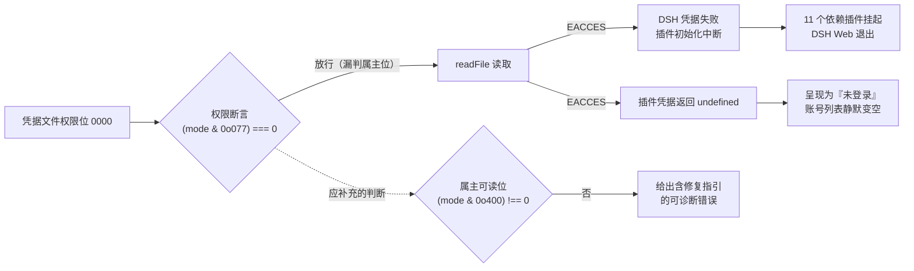

# FNOS-011 凭据文件权限异常的可诊断性

| 项目 | 内容 |
| --- | --- |
| 需求编号 | FNOS-011 |
| 提出日期 | 2026-10-09 |
| 需求状态 | <Badge type="info" text="规划中" /> |
| 关联计划 | [PLAN-FNOS-011 凭据文件权限异常的可诊断性](/plans/PLAN-FNOS-011-credential-permission-diagnostics) |
| 适用范围 | DSH 自身凭据（`dsh-credentials-local`）、仓库内消费凭据的插件（`dsh-codebuddy` 等）、问题排查文档 |

## 需求背景

2026-10-09，真实 NAS 上的应用无法启动：DSH Web 一启动就以 code 1 退出，网关只能显示「DSH Web 未运行」的恢复页。启动日志里的原因是：

```text
Failed plugins (1):
  credentials
    Package: @deepseek-ai/dsh-credentials-local
    Error: EACCES: permission denied, open '$DSH_HOME/.credentials.yaml'
```

`credentials` 是关键单点：它初始化失败后，`connection`、`authorization`、`deepseek-account`、`file-upload`、`dsh-codebuddy`、`dsh-codex-auth` 等 11 个插件全部挂起，DSH Web 因此直接退出。**界面上只看到「未运行」，没有任何指向权限的提示**，需要人工翻启动日志才能定位。

该文件的权限位是 `0000`（属主也不可读）。同一模式在本轮还出现过一次：`dsh-codebuddy` 的凭据文件权限为 `0000` 时，插件把它当成「未登录」——账号列表静默变空，同样没有提示。

两次的表现不同（一个整站退出、一个静默空列表），但根因是同一个：**用权限位判断凭据文件是否可用时，只检查了 group/other 位，没有检查属主可读位**。属主不可读的文件既「不暴露给他人」，也读不出来，于是两种相反的状态被同一段判断放行。

排查过程中确认，这类权限损坏在真实使用中会出现（跨文件系统复制凭据、误 `chmod`、ACL 迁移都可能造成），而当前产品对它的反馈无法让用户自助解决。

## 调研结论

下表登记本需求功能成立所依赖的事实核查。结论均在 DSH 0.2.0-rc.2 的发行包源码与本仓库插件源码中核实，并在真实 NAS 上复现。

| 结论 | 出处 | 影响的功能 | 状态 |
| --- | --- | --- | --- |
| `dsh-credentials-local` 在读取凭据前先做权限断言，但断言条件 `(mode & 0o077) === 0` 只覆盖 group/other 位，属主不可读的 `0000` 会被放行 | DSH 0.2.0-rc.2 发行包 `dsh-credentials-local/lib/index.js` 的 `assertOwnerOnly`（`GROUP_OTHER_BITS = 63`）；逐位实测：`0000` 判定为通过且 `属主可读=false` | FNOS-011-01 | 已核实 |
| 该断言对「文件不存在」之外的读取错误已采取「必须暴露」的立场（`isENOENT` 之外一律抛出），因此本缺陷**不是**错误吞没，而是权限判定条件不完整 | 同上，`isENOENT` helper 及其注释「every non-ENOENT failure must surface」 | FNOS-011-01 | 已核实 |
| 断言通过后由 `readFile` 实际读取，`0000` 在此抛出原始 `EACCES`，错误文本只有 errno 与路径，不含原因或修复指引 | 同上 `loadInitial`；真实 NAS 启动日志复现 | FNOS-011-01、FNOS-011-02 | 已核实 |
| 该失败会让 `credentials` 插件初始化失败，连带 11 个依赖插件挂起并使 DSH Web 以 code 1 退出 | 真实 NAS 启动日志 `Failed plugins (1)` 与 `Plugins waiting for services (11)` 段 | FNOS-011-01、FNOS-011-03 | 已核实 |
| 上游对「权限过宽」已给出可诊断错误，文案含原因与修复命令（`... is readable beyond its owner (mode 644); run "chmod 600 ..."`），可作为本需求错误文案的范式 | 同上 `assertOwnerOnly` 的 throw 分支 | FNOS-011-02 | 已核实 |
| 仓库内 `dsh-codebuddy` 的 `isOwnerOnly` 使用同一判定条件（`(mode & 0o077) === 0`），`0000` 同样被放行 | `plugins/dsh-codebuddy-plugin/src/host/storage.ts` | FNOS-011-01、FNOS-011-04 | 已核实 |
| `dsh-codebuddy` 的 `readDocument` 以 `try/catch` 包裹整段读取，读取失败与「文件不存在」返回同一个 `undefined`，调用方据此呈现「未登录」 | 同上 `readDocument` 与 `loadStorage` | FNOS-011-04 | 已核实 |
| 正常路径下凭据文件权限位为 `600`：产品写入使用显式 `mode: 0o600`；未经手工干预的同类文件在真机上均为 `600`（对照组：旧 apphome 的 `.credentials.yaml` 与 `codebuddy-auth.json`、当前 `workspace.json`、`.pnpm-store-dir`） | 真机 `stat` 实测；DSH 发行包与插件源码中的写入调用 | FNOS-011-01、FNOS-011-04 | 已核实 |
| fnOS 共享文件夹（如 `/vol2/1000/...`）走 ACL，其文件在 `stat` 下传统权限位显示为 `0000`；用 `cp -p` 复制到 `DSH_HOME`（btrfs）会保留该权限位 | 真机 `stat` 与 `getfacl` 实测（备份目录与 `DSH_HOME` 跨 `/vol2`、`/vol1` 两个卷） | FNOS-011-01 | 已核实 |
| 该文件的权限位损坏不会由产品自身产生：安装、升级与重启回调均不修改它，正常读写路径始终以 `600` 写入 | `cmd/install_callback` 与插件源码核实；真机对照文件权限均为 `600` | 全部 | 已核实（用于界定范围：本需求不承诺修复造成 `0000` 的外部操作，只承诺让产品报出可诊断的原因） |



## 需求目标

凭据类文件因权限异常而不可用时，产品应让用户看懂发生了什么、该怎么做，而不是让整个应用退出或让账号静默消失；并且这一类判断在 DSH 自身与各插件之间保持一致，不出现同一个异常在不同位置得到相反结论的情况。

## 功能列表

| 编号 | 优先级 | 功能 | 用户可观察结果 | 状态 |
| --- | --- | --- | --- | --- |
| FNOS-011-01 | P0 | 凭据可用性判定覆盖属主可读位 | 权限位为 `0000`（属主不可读）的凭据文件被判定为不可用，不再被当作「安全且可读」放行 | <Badge type="info" text="规划中" /> |
| FNOS-011-02 | P0 | DSH 凭据不可读时给出可诊断错误 | DSH 启动时若凭据文件存在但读不了，错误信息点明是权限问题、给出当前权限位与可执行的修复命令，而不是只留一行 `EACCES` | <Badge type="info" text="规划中" /> |
| FNOS-011-03 | P0 | 凭据失败不导致整个 DSH Web 退出 | 凭据文件不可读时，用户仍能进入 DSH Web 并看到明确的凭据异常提示与修复指引，而不是只看到「DSH Web 未运行」的恢复页 | <Badge type="info" text="规划中" /> |
| FNOS-011-04 | P1 | 插件区分「未登录」与「凭据不可读」 | 插件凭据文件读不了时，界面提示凭据异常与修复方式，不再静默呈现为「未登录」导致账号列表凭空消失 | <Badge type="info" text="规划中" /> |
| FNOS-011-05 | P1 | 权限判定逻辑单点收敛 | 仓库内各插件对凭据文件权限的判定使用同一实现与同一条件，新插件接入时不需要各自重写 | <Badge type="info" text="规划中" /> |

### 验收环境范围

- FNOS-011-01、04、05 在 DSH Web 与 DSH Desktop 验收（判定逻辑与插件呈现）；`dsh-codebuddy` 归属非 fnOS 插件，按[测试环境执行方式](/charter/tests-spec#测试环境执行方式)覆盖两个客户端。
- FNOS-011-02、03 在真实 fnOS NAS 验收：需要真实的应用启动链路与 fnOS 的 ACL 文件系统，才能构造出「文件存在、权限位异常、启动受影响」的现场。
- 验收须实际构造 `chmod 000` 的凭据文件（在测试 profile 或测试实例内），不使用模拟数据替代；测试结束按[测试用例文档规范](/charter/tests-spec#登录态与凭据文件)恢复为 `600` 并核对。
- 测试用凭据一律不入仓库；测试前完成备份，测试后恢复并按规范逐一核对权限。

## 行为约束

- **正常路径行为不变**：权限位为 `600` 的凭据文件按现有逻辑正常加载；本需求只改变异常情形的判定与提示，不改变凭据的存放位置、格式与读写时机。
- **不自动修复权限**：产品不得代替用户 `chmod` 凭据文件。凭据文件的权限是安全边界，自动放宽权限会把「仅属主可读」变成静默失效，风险高于报错。
- **不放宽既有安全判定**：`(mode & 0o077) === 0` 现有语义（拒绝 group/other 可读、可写、可执行的文件）必须保留；本需求只在其之上**补充**属主可读位的检查，不降低任何既有拒绝条件。
- **错误信息必须可执行**：提示应包含文件路径、当前权限位与确切的修复命令，不出现「权限错误」这类无行动指引的表述。
- **凭据内容不得出现在日志与界面**：诊断信息只引用文件路径与权限位，不打印凭据内容；延续仓库既有的凭据红线。
- **降级而非中断**：凭据不可用时，尽可能让应用进入可用状态（能打开界面、能给出提示），而不是整体退出；若某些能力确实依赖凭据，应只影响该能力并明确说明。

## 不在本次范围内

- **不修复造成权限位异常的来源**：跨文件系统 `cp -p`、误 `chmod`、ACL 迁移等外部操作由使用方负责。本需求只要求产品报出可诊断的原因，不承诺阻止或自动纠正这些操作。
- **不改变凭据文件的格式、位置与加密方式**：沿用现有 `.credentials.yaml`、`codebuddy-auth.json` 等文件的位置与结构。
- **不为其他类型的文件（会话、工作区、日志）引入同类判定**：本次只覆盖凭据类文件；其他文件的权限问题按各自既有行为处理。
- **不引入新的设置项**：判定行为与错误呈现不需要用户配置开关。
- **不修改上游 DSH 源码**：对 `dsh-credentials-local` 的判定是否属于上游修复范围，在计划阶段核实并决定处置方式（上游已明确「非 ENOENT 的读取失败必须暴露」的立场，本需求与该立场一致）。

## 验收条件与完成状态

- `FNOS-011-01-AC-01`：对权限位为 `0000` 的凭据文件，可用性判定结果为「不可用」；对 `600` 的文件为「可用」；对 `644` 等放宽权限的文件仍为「不可用」（既有拒绝语义不回退）。
- `FNOS-011-01-AC-02`：判定条件同时覆盖 group/other 位与属主可读位，两种条件都有对应测试用例。
- `FNOS-011-02-AC-01`：在真实 NAS 上把 DSH 凭据文件改为 `0000` 后启动应用，日志中的错误点明权限问题，含文件路径、当前权限位与修复命令。
- `FNOS-011-02-AC-02`：该错误信息中不包含凭据内容。
- `FNOS-011-03-AC-01`：真实 NAS 上凭据文件为 `0000` 时，DSH Web 不再以启动失败告终；用户能打开界面并看到凭据异常的提示。
- `FNOS-011-03-AC-02`：按提示执行修复命令并在界面恢复后，凭据正常加载、依赖凭据的能力恢复可用。
- `FNOS-011-04-AC-01`：插件凭据文件为 `0000` 时，界面提示凭据不可用及修复方式，不再呈现为「未登录」。
- `FNOS-011-04-AC-02`：凭据文件不存在时，行为与现在一致（呈现为「未登录」，不报错），两种情形可区分。
- `FNOS-011-05-AC-01`：仓库内使用权限判定的插件均引用同一实现；源码扫描不到重复的判定实现。
- `FNOS-011-05-AC-02`：新增该判定的单元测试覆盖 `600`、`644`、`0000`、`400` 与文件不存在五种输入。

## 变更记录

| 日期 | 变更 | 说明 |
| --- | --- | --- |
| 2026-10-09 | 初始登记 | 由真实 NAS 的 DSH Web 无法启动事件登记：`credentials` 插件因凭据文件权限位 `0000` 读取失败，连带 11 个依赖插件挂起并使 DSH Web 退出。同一模式在 `dsh-codebuddy` 表现为账号列表静默变空。范围限定为「让产品报出可诊断的原因」，不承诺修复造成权限异常的外部操作。 |
