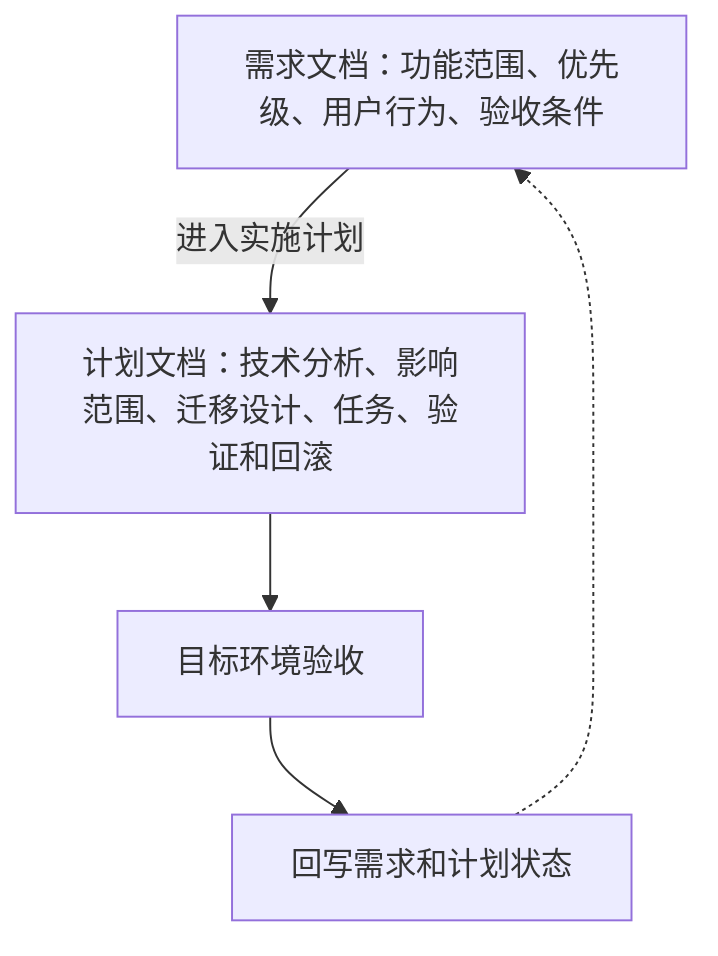

# 需求清单

这里记录本项目的正式需求。需求文档只描述用户问题、功能范围、可观察结果和验收条件；需求文档规范统一维护在[开发指南 → 章程规范 → 需求文档规范](/charter/requirements-spec)。

## 需求与计划的关系

规则摘要：

- 需求记录完整范围，包括已完成、正在规划、待验证和暂未排期的功能。
- 计划只展开已经进入当前实施阶段的功能。
- 未进入计划的 P2、后续计划或待确认功能，不得出现在计划任务和测试清单中。
- 需求范围变化时，先更新当前开发中的需求，再同步调整计划。
- 目标环境未完成验收时，需求不能标记为“已完成”。

完整规则见：[需求文档规范](/charter/requirements-spec) 和 [SDD 维护规范](/charter/sdd-workflow)。

## 当前需求整合结果

历史上明确标记为规划、后续或待评估的 fnOS/DSH 适配内容已统一纳入 `FNOS-001`：

| 历史内容 | 当前归属 | 状态 |
| --- | --- | --- |
| fnOS 主题桥接 | FNOS-001-02 | 已完成验证 |
| fnOS 应用入口、统一网关和访问权限 | FNOS-001-01 | 已完成验证 |
| FPK 安装阶段集成 DSH 插件 | FNOS-001-09 | 已完成验证 |
| 授权目录展示、添加、删除和刷新 | FNOS-001-04 | 已完成验证 |
| 工作区快捷跳转已授权 fnOS 目录 | FNOS-001-10 | 已完成验证 |
| 内容输入框选择 NAS 目录和文件 | FNOS-001-11 | 已完成验证 |
| 上下文文件访问适配 | FNOS-001-12 | 已完成验证 |
| 后续 fnOS JS SDK 能力 | FNOS-001-08 | 后续计划 |

已完成需求作为历史验收记录，不回改正文；后续变更登记到当前开发中的需求，并通过变更记录说明关系。

## 当前需求文档

| 编号 | 需求文档 | 状态 |
| --- | --- | --- |
| FNOS-001 | [DSH 飞牛 NAS 适配](/requirements/FNOS-001-dsh-fnos-adaptation) | P0/P1 已完成验证 |
| FNOS-002 | [DSH 应用与插件优化](/requirements/FNOS-002-dsh-app-plugin-optimization) | 已完成 |
| FNOS-003 | [FPK 应用运行设置统一](/requirements/FNOS-003-fpk-runtime-settings) | 已完成 |
| FNOS-004 | [DSH 0.1.5-rc.2 适配与 FPK 运行修复](/requirements/FNOS-004-dsh-015-rc2-adaptation) | 已完成 |
| FNOS-005 | [CodeBuddy 成长任务移植与仓库内 DSH 开发环境](/requirements/FNOS-005-codebuddy-and-local-dsh) | 已完成 |
| FNOS-006 | [安装脚本与安装流程优化](/requirements/FNOS-006-installation-script-optimization) | 规划中 |
| FNOS-007 | [DSH 0.1.7-rc.2 适配与插件错误修复](/requirements/FNOS-007-dsh-017-rc2-adaptation) | 已完成 |
| FNOS-008 | [插件配置统一迁入插件管理页](/requirements/FNOS-008-plugin-config-in-plugin-manager) | 已完成 |
| FNOS-009 | [DSH 0.2.0-rc.2 插件适配](/requirements/FNOS-009-dsh-020-rc2-adaptation) | 规划中（含授权目录持久化 FNOS-009-09/10） |

新增需求先登记在本页和对应需求文档，确认进入实施后再创建或调整对应计划。
